# Apache SkyWalking 源码架构深度分析

> 本文基于 Apache SkyWalking 仓库源码与官方设计文档整理，面向需要理解 OAP 内核、数据流与扩展机制的开发者。分析版本以当前仓库 `oap-server` 结构为准。

---

## 目录

1. [项目定位与总体架构](#1-项目定位与总体架构)
2. [仓库结构与模块地图](#2-仓库结构与模块地图)
3. [OAP 启动与模块系统](#3-oap-启动与模块系统)
4. [端到端数据工作流](#4-端到端数据工作流)
5. [可观测性分析语言体系（OAL / MAL / LAL / MQE）](#5-可观测性分析语言体系oal--mal--lal--mqe)
6. [流式处理内核（Worker Pipeline）](#6-流式处理内核worker-pipeline)
7. [Trace 分析链路源码剖析](#7-trace-分析链路源码剖析)
8. [集群、远程路由与角色分离](#8-集群远程路由与角色分离)
9. [存储插件与数据模型](#9-存储插件与数据模型)
10. [查询层与 UI](#10-查询层与-ui)
11. [告警、导出与其它横切能力](#11-告警导出与其它横切能力)
12. [设计亮点与技术亮点](#12-设计亮点与技术亮点)
13. [扩展开发指南（源码视角）](#13-扩展开发指南源码视角)
14. [关键源码索引](#14-关键源码索引)
15. [采集协议与 Agent 数据模型](#15-采集协议与-agent-数据模型)
16. [Trace 分析监听器体系](#16-trace-分析监听器体系)
17. [ID 编码与元数据缓存](#17-id-编码与元数据缓存)
18. [日志分析（LAL）与 log-mal 管道](#18-日志分析lal与-log-mal-管道)
19. [MeterSystem 与 MAL 动态指标生成](#19-metersystem-与-mal-动态指标生成)
20. [Runtime Rule 热更新（集群一致性）](#20-runtime-rule-热更新集群一致性)
21. [BanyanDB 存储实现要点](#21-banyandb-存储实现要点)
22. [服务层级（Service Hierarchy）](#22-服务层级service-hierarchy)
23. [TopN、Kafka Fetcher 与其它数据通路](#23-topnkafka-fetcher-与其它数据通路)
24. [Profiling 与 AI Pipeline](#24-profiling-与-ai-pipeline)
25. [动态配置、Admin 服务与背压](#25-动态配置admin-服务与背压)
26. [Zipkin、OTel Trace 与 SpanListener 扩展](#26-zipkinotel-trace-与-spanlistener-扩展)
27. [GraphQL 与 MQE 查询运行时](#27-graphql-与-mqe-查询运行时)
28. [Elasticsearch 存储深度剖析](#28-elasticsearch-存储深度剖析)
29. [Scope 体系与 OAL 脚本地图](#29-scope-体系与-oal-脚本地图)
30. [Service Mesh 遥测内核](#30-service-mesh-遥测内核)
31. [集群协调、TTL 与历史删除](#31-集群协调ttl-与历史删除)
32. [Exporter、TraceQL 与辅助查询插件](#32-exportertraceql-与辅助查询插件)
33. [UI、发行版与跨进程链路机制](#33-ui发行版与跨进程链路机制)
34. [Metrics Session Cache 与 JDBC 存储](#34-metrics-session-cache-与-jdbc-存储)
35. [OALEngineV2 编译与代码生成详解](#35-oalenginev2-编译与代码生成详解)
36. [告警系统全链路源码剖析](#36-告警系统全链路源码剖析)
37. [ModelRegistry、StorageModels 与 AnnotationScan](#37-modelregistrystoragemodels-与-annotationscan)
38. [Event、Browser、Management 等 Receiver 纵览](#38-eventbrowsermanagement-等-receiver-纵览)
39. [eBPF 与 Cilium Fetcher](#39-ebpf-与-cilium-fetcher)
40. [Agent 配置发现与下行 Commands](#40-agent-配置发现与下行-commands)
41. [OAL 指标类型族与 merge 语义](#41-oal-指标类型族与-merge-语义)
42. [灵活 Trace 查询、SpanAttachedEvent 与 Booster UI](#42-灵活-trace-查询spanattachedevent-与-booster-ui)
43. [server-tools、发行版与性能调优要点](#43-server-tools发行版与性能调优要点)
44. [TimeBucket、DownSampling 与多精度指标](#44-timebucketdownsampling-与多精度指标)
45. [MAL 编译运行时与 MetricConvert](#45-mal-编译运行时与-metricconvert)
46. [MQE 算子体系与查询调试](#46-mqe-算子体系与查询调试)
47. [拓扑查询、Metadata 与 Aggregation](#47-拓扑查询metadata-与-aggregation)
48. [JDBC 表建模与分表策略](#48-jdbc-表建模与分表策略)
49. [BatchQueue 队列基础设施](#49-batchqueue-队列基础设施)
50. [gRPC/HTTP Server 与多端口模型](#50-grpchttp-server-与多端口模型)
51. [测试体系（server-testing / dsl-scripts-test）](#51-测试体系server-testing--dsl-scripts-test)

---

## 1. 项目定位与总体架构

### 1.1 是什么

Apache SkyWalking 是面向**微服务、云原生、Service Mesh、容器**场景的 APM 与可观测性平台，覆盖：

| 能力 | 说明 |
|------|------|
| **Tracing** | 原生 Segment 协议、Zipkin v1/v2 |
| **Metrics** | OAL 派生指标、Meter/MAL、OTel、Prometheus、Telegraf、Zabbix 等 |
| **Logging** | 磁盘/网络日志，与 Trace 上下文关联 |
| **Profiling** | Java Agent 行级剖析、eBPF、Async Profiler、Pprof 等 |
| **Event** | 版本升级、配置变更等系统事件，与指标/链路关联分析 |

逻辑上分为四层（见 `docs/en/concepts-and-designs/overview.md`）：

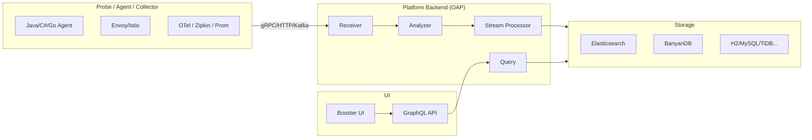

### 1.2 核心实体模型

SkyWalking 用统一层次描述监控对象（`overview.md`）：

- **Layer**：抽象框架层（如 `OS_LINUX`、`K8S`、`MESH`）
- **Service**：一组提供相同行为的工作负载
- **Service Instance**：Service 中的单个实例（K8s Pod、或 Agent 视角的一个 OS 进程）
- **Endpoint**：服务对外入口路径（HTTP URI、gRPC 方法签名等）
- **Process**：操作系统进程（Pod 内可有多个 Process）

拓扑、服务层级（Service Hierarchy）、API 依赖等都在此模型上构建。

### 1.3 设计哲学（Project Goals 延伸）

- **默认不引入 MQ**：数据在 OAP 集群内通过 gRPC 流式转发完成二级聚合，降低运维复杂度（FAQ 有专门说明）。
- **分析逻辑可配置**：OAL/MAL/LAL 脚本 + 运行时热更新（runtime-rule 模块）。
- **存储可插拔**：同一套 `Model`/`StorageDAO` 抽象对接多种后端。
- **多协议统一入口**：Receiver 插件化，分析层尽量归一到 `Source` + `Dispatcher`。

---

## 2. 仓库结构与模块地图

```
skywalking/
├── apm-protocol/          # gRPC/Protobuf 采集协议（子模块 skywalking-data-collect-protocol）
├── oap-server/            # OAP 后端（本文重点）
│   ├── server-starter/    # 入口、application.yml
│   ├── server-core/       # 内核：流处理、Source、Remote、Query Service
│   ├── server-library/    # 模块系统、BatchQueue、gRPC/HTTP Server
│   ├── server-receiver-plugin/  # 各类数据接入
│   ├── server-storage-plugin/   # ES、BanyanDB、JDBC...
│   ├── server-cluster-plugin/   # ZK、K8s、etcd、Nacos、Consul
│   ├── server-query-plugin/     # GraphQL、PromQL
│   ├── server-alarm-plugin/     # 告警
│   ├── analyzer/            # Trace/Log/Zipkin 等分析器
│   ├── oal-grammar/ + oal-rt/   # OAL 语法与字节码生成
│   ├── mqe-grammar/ + mqe-rt/   # 指标查询与告警表达式
│   └── server-configuration/    # 动态配置（Apollo、ZK、etcd...）
├── skywalking-ui/         # Web UI（子模块 booster-ui）
├── apm-webapp/            # UI 打包
├── apm-dist/              # 发行版
├── docs/                  # 文档
└── test/                  # E2E
```

**OAP 内部模块数量**：通过 Java SPI 注册的 `ModuleDefine` 约 40+ 个（receiver、storage、cluster、analyzer、alarm 等），在 `application.yml` 中按 `moduleName.selector: providerName` 启用。

---

## 3. OAP 启动与模块系统

### 3.1 启动入口

主类：`OAPServerStartUp.main` → `OAPServerBootstrap.start()`。

```java
// OAPServerBootstrap.java（简化流程）
RunningMode.setMode(System.getProperty("mode"));  // init / normal
ApplicationConfiguration config = configLoader.load();  // application.yml + default + env
manager.init(applicationConfiguration);
ServerStatusService.bootedNow(...);
if (RunningMode.isInitMode()) System.exit(0);
```

配置加载策略（`ApplicationConfigLoader`）：

1. 读取 `application.yml`
2. 与 `application-default.yml` 合并缺省项
3. 用 `moduleName.providerName.settingKey` 形式的系统属性/环境变量覆盖

### 3.2 ModuleManager 三阶段

`ModuleManager` 是 OAP 的**微内核**，类似 OSGi 的精简版：

| 阶段 | 行为 |
|------|------|
| **prepare** | `ServiceLoader` 加载所有 `ModuleDefine` / `ModuleProvider`；按 yml 选择 provider；注入配置 |
| **start** | `BootstrapFlow` 按 `requiredModules()` 拓扑排序后依次 `provider.start()` |
| **notifyAfterCompleted** | 全部模块启动后的回调 |

拓扑排序实现见 `BootstrapFlow.makeSequence()`：反复将“依赖已满足”的 provider 加入 `startupSequence`，若一轮无进展则抛出 `CycleDependencyException`。

### 3.3 ModuleDefine / ModuleProvider / Service

- **ModuleDefine**：声明模块名、`services()` 接口列表
- **ModuleProvider**：具体实现（如 `storage` 模块下 `elasticsearch` / `banyandb`）
- **Service**：模块对外能力，其它模块通过 `moduleManager.find(X.NAME).provider().getService(Y.class)` 获取

注册方式：`META-INF/services/org.apache.skywalking.oap.server.library.module.ModuleDefine`（及 `ModuleProvider`）。

**设计意义**：Receiver、Storage、Cluster 可独立演进；同一 Service 接口可有多种 Provider；启动顺序由显式依赖保证，避免隐式静态初始化顺序问题。

### 3.4 CoreModuleProvider 职责概览

`CoreModuleProvider` 是默认核心实现，集中初始化：

- gRPC / HTTP Server 与 Handler 注册表
- `SourceReceiverImpl`、`DispatcherManager`
- OAL 引擎加载、`AnnotationScan`（`@Stream` 模型注册）
- `MetricsStreamProcessor` / `RecordStreamProcessor` 等流处理器
- `PersistenceTimer`、`DataTTLKeeperTimer`
- `RemoteClientManager`、`RemoteSenderService`
- 大量 `*QueryService`（供 GraphQL 层调用）
- 缓存（`NetworkAddressAliasCache`、`ProfileTaskCache` 等）

---

## 4. 端到端数据工作流

### 4.1 Trace（SkyWalking 原生 Segment）

```
Agent --gRPC--> TraceSegmentReportServiceHandler
              --> ISegmentParserService.send(segment)
              --> TraceAnalyzer.doAnalysis()
                    --> 多种 AnalysisListener（Entry/Exit/Local/First/Segment）
                    --> listener.build() 产生 ISource
              --> SourceReceiver.receive(source)
              --> DispatcherManager.forward(source)
                    --> OAL 生成的 SourceDispatcher（按 scope 分发）
                    --> 手动 Dispatcher（如 SegmentDispatcher -> Record）
              --> StreamProcessor.in(Metrics|Record|TopN...)
              --> L1 聚合 -> L2 持久化缓冲 -> PersistenceTimer 批量写存储
```

### 4.2 Metrics（OAL 路径）

OAL 脚本编译 → 生成 `Metrics` 子类 + `SourceDispatcher` + `StorageBuilder`  
分析器产出 `Service`/`Endpoint` 等 **Source** → Dispatcher 调用 `MetricsStreamProcessor.in()` → Worker 链 → 存储。

### 4.3 Metrics（MAL / Meter 路径）

外部指标（Prometheus、OTel、SkyWalking Meter API）→ Receiver/Fetcher → `MeterSystem` 执行 MAL → 同样进入 `MetricsStreamProcessor`（`MetricStreamKind.MAL`，缓冲区配置与 OAL 不同）。

### 4.4 Log（LAL 路径）

日志进入 Log Analyzer → LAL 脚本格式化/打标 → 可产出 Meter 或 Record → MAL/OAL 后续链路。

### 4.5 查询路径

UI / API → GraphQL Resolver → `core.query.*QueryService` → `StorageDAO` / `IMetricsDAO` → 后端存储。

---

## 5. 可观测性分析语言体系（OAL / MAL / LAL / MQE）

### 5.1 OAL（Observability Analysis Language）

**用途**：对流式 **Trace** 与 **Service Mesh Access Log** 做指标聚合（Service / Instance / Endpoint 维度）。拓扑/依赖由内核 Listener 自动构建，不必写 OAL。

**语法要点**（`docs/en/concepts-and-designs/oal.md`）：

```
METRICS_NAME = from(SCOPE.field[, field...])
  [.filter(...)]
  .FUNCTION([params...])
```

**编译流水线**（`oap-rt`，`OALEngineV2`）：

```
.oal 文件
  → ANTLR 解析 → MetricDefinition（不可变模型）
  → MetricDefinitionEnricher（反射补全 Source 列、持久化字段）
  → OALClassGeneratorV2（Javassist + FreeMarker）
  → 运行时加载 Metrics / Dispatcher / StorageBuilder 类
```

**运行时集成**（`OALEngineLoaderService`）：

```java
engine.setStreamListener(new StreamAnnotationListener(moduleManager));
engine.setDispatcherListener(sourceReceiver.getDispatcherDetectorListener());
engine.start(classLoader);
engine.notifyAllListeners();  // 注册 @Stream 与 Dispatcher
```

生成类实现 `SourceDispatcher`：在 `dispatch(source)` 内完成过滤、聚合函数调用，最终 `MetricsStreamProcessor.getInstance().in(metrics)`。

**底层技术点**：

- 使用 **Javassist** 动态生成字节码，避免为每条 OAL 规则手写 Java
- `remoteHashCode()` 与集群 **HashCodeSelector** 配合，保证同一实体指标落到同一 OAP 节点做 L2 聚合
- 支持 `disable(METRICS_NAME)`、DSL 调试注入（`GateHolder` / `OALDebug`）

### 5.2 MAL（Meter Analysis Language）

**用途**：处理**已是统计量**的 Meter 数据（Prometheus、OTel、原生 Meter 等）。

核心概念：

- **Sample family**：同名指标的一组带标签样本
- **Scalar**：标量运算中间结果
- 算子：`tagEqual`、`valueGreater`、`avg`、`histogram` 等（见 `mal.md`）

实现入口：`MeterSystem`（`server-core`），与 `MetricsStreamProcessor.create(..., MetricStreamKind.MAL)` 绑定；支持 runtime-rule 热更新与 schema 操作选项（`StorageManipulationOpt`）。

### 5.3 LAL（Log Analysis Language）

**用途**：日志解析、字段提取、标签化，并可向 MAL 输送指标。由 `LogAnalyzerModule` 与 receiver 协同，规则位于 `server-starter/src/main/resources/lal/`。

### 5.4 MQE（Metrics Query Engine）

**用途**：

1. UI / API **指标查询**（替代部分 GraphQL 直连存储的复杂查询）
2. **告警规则表达式**（`AlarmRule.setExpression` 用 MQE 解析校验）

告警执行时 `AlarmMQEVisitor` 访问存储中的指标时间序列，结合 `RunningRule` 状态机（NORMAL / FIRING / SILENCED / RECOVERED）。

---

## 6. 流式处理内核（Worker Pipeline）

### 6.1 Stream 注解与 Processor 类型

带 `@Stream` 的类在启动时由 `StreamAnnotationListener` 注册：

| Processor | 数据类型 | 典型用途 |
|-----------|----------|----------|
| `MetricsStreamProcessor` | `Metrics` | OAL/MAL 指标 |
| `RecordStreamProcessor` | `Record` | Segment、Log、Zipkin Span 等明细 |
| `TopNStreamProcessor` | TopN | 慢 SQL、热点端点等 |
| `ManagementStreamProcessor` | 管理类数据 | UI 模板等 |
| `NoneStreamProcessor` | 无流式计算 | 仅注册模型 |

`DisableRegister` 可按名称禁用某些流，用于裁剪功能或解决冲突。

### 6.2 Metrics 三级流水线（源码核心）

`MetricsStreamProcessor.create()` 为每个 Metrics 类建立：

```
MetricsAggregateWorker (L1)
    ↓ 内存合并相同 entity + timeBucket + 指标类型
MetricsRemoteWorker
    ↓ 集群模式下 gRPC 发往 hash 选中的节点
远程节点: {streamName}_rec → MetricsPersistentMinWorker (L2)
    ↓ 定时 flush 到 IBatchDAO
PersistenceTimer (全局)
    ↓ prepare + execute 批量写入
Storage (ES / BanyanDB / JDBC...)
```

并行存在 **DownSampling** 分支：

- `MetricsTransWorker` 将分钟级聚合到 Hour / Day（受 `DownSamplingConfigService` 控制）
- 各级对应独立的 `MetricsPersistentWorker` 与 TTL

**L1 聚合细节**（`MetricsAggregateWorker`）：

- 共享名为 `METRICS_L1_AGGREGATION` 的 `BatchQueue`
- `PartitionPolicy.adaptive()` + `typeHash()` 分区，保证同类 Metrics 单线程 merge
- `MergableBufferedData` 合并 payload，降低内存与网络开销
- OAL 与 MAL 使用不同的 `l1FlushPeriod` 与队列参数（MAL 流量模型不同）

**持久化定时器**（`PersistenceTimer`）：

- 单线程调度，默认每 `persistentPeriod` 秒触发
- 收集所有 `MetricsPersistentWorker` + `TopNStreamProcessor` 的 worker
- 多线程 `prepare` + `IBatchDAO.flush` 批量写
- 自带 Telemetry  histogram（prepare/execute/all latency）

### 6.3 Record 流

`RecordStreamProcessor.in()`：

- TTL 检查：过期 Record 直接丢弃（测试环境可通过 `TESTING_TTL` 绕过）
- 一对一 `RecordPersistentWorker`
- 可挂 `ExportRecordWorker` 导出 Segment/Log 到外部系统

### 6.4 运行时规则热更新

`server-admin/runtime-rule` 模块支持 MAL/OAL 规则的增删改：

- `MetricsStreamProcessor.removeMetric()` 有严格顺序：先摘 L1 entry → drain L1 → flush L2 → 移除 persistent workers
- `ConcurrentHashMap` entryWorkers + `CopyOnWriteArrayList` persistentWorkers 兼顾热路径读与规则变更安全
- Schema 变更通过 `StorageManipulationOpt` 区分 boot / peer / main-node 行为
- Shape mismatch 时**拒绝注册 worker**，避免写入与查询 schema 不一致（见 `create()` 中 `opt.hasShapeMismatch()` 分支）

---

## 7. Trace 分析链路源码剖析

### 7.1 接收入口

`TraceSegmentReportServiceHandler`（gRPC）：

- `collect`：流式 `StreamObserver<SegmentObject>`
- `collectInSync`：批量 SegmentCollection
- 均委托 `ISegmentParserService.send(segment)`
- 记录 `trace_in_latency`、`trace_analysis_error_count` 指标

### 7.2 SegmentParserService

```java
// SegmentParserServiceImpl.send()
TraceAnalyzer traceAnalyzer = new TraceAnalyzer(moduleManager, listenerManager, config);
traceAnalyzer.doAnalysis(segment);
```

每次 `send` 新建 `TraceAnalyzer`（轻量对象），监听器由 `SegmentParserListenerManager` 管理工厂列表。

### 7.3 TraceAnalyzer 监听器模型

`doAnalysis()` 顺序：

1. `createSpanListeners()` — 从 SPI/配置加载的 `SpanListenerFactory` 创建监听器链
2. `notifySegmentListener` — Segment 级处理
3. 遍历 Span，按 `SpanType` 分发：
   - **Exit**：客户端出站调用
   - **Entry**：服务端入站
   - **Local**：进程内调用
   - **First**（spanId==0）：根 Span
4. `notifyListenerToBuild()` — 所有 `AnalysisListener.build()` 产出数据

该模型将 **拓扑分析、Endpoint 统计、慢追踪、采样** 等解耦为独立 Listener，符合开闭原则；新增分析能力只需新增 Listener 模块而非修改 `TraceAnalyzer` 核心循环。

### 7.4 到 Source 与 OAL

Listener `build()` 后调用 `SourceReceiver.receive(ISource)`：

```java
// SourceReceiverImpl
public void receive(ISource source) {
    dispatcherManager.forward(source);
}
```

`DispatcherManager`：

- 启动时 `scan()`  classpath 扫描 `SourceDispatcher` 实现
- OAL 生成的 Dispatcher 按 `source.scope()` 注册到 `dispatcherMap`
- `forward()` 前调用 `source.prepare()`，再依次 `dispatcher.dispatch(source)`

**Segment 持久化**（不经过 OAL 时）：`SegmentDispatcher` 构造 `SegmentRecord` → `RecordStreamProcessor.in()`。

### 7.5 Zipkin / Mesh 等并行路径

- **Zipkin**：独立 Dispatcher（`ZipkinServiceDispatcher` 等）写入 Record/Metrics
- **Mesh (Envoy ALS)**：转换为与 Trace 类似的 Source，走 OAL Service/Relation 作用域

---

## 8. 集群、远程路由与角色分离

### 8.1 OAP 角色（application.yml `core.default.role`）

| 角色 | 能力 |
|------|------|
| **Mixed** | 接收 + L1 + L2（默认） |
| **Receiver** | 接收 + L1，远程转发 L2 |
| **Aggregator** | 主要做 L2 聚合 |

### 8.2 RemoteSenderService

跨节点发送 `StreamData`（序列化的 Metrics）：

- 从 `RemoteClientManager.getRemoteClient()` 获取客户端列表（每 10s 从 Cluster 模块刷新）
- **Selector**：
  - `HashCode`：按 `streamData.remoteHashCode()` 选节点（保证实体级聚合一致性）
  - `Rolling`：轮询
  - `ForeverFirst`：固定首节点

`GRPCRemoteClient.push()` 将数据放入 BatchQueue，批量经 gRPC `RemoteService` 发送；对端 `RemoteServiceHandler` 反序列化后根据 `nextWorkerName` 找到 `RemoteHandleWorker`，调用 `worker.in(streamData)`。

**对齐要求**：集群内 OAL/MAL 脚本必须一致，否则对端找不到 worker 会丢弃数据（日志明确提示）。

### 8.3 Cluster 插件

支持 standalone、ZooKeeper、Kubernetes、etcd、Consul、Nacos 等。`RemoteClientManager` **不**建议业务代码直接 `find(ClusterModule)`，应通过 `CoreModule` 的 `RemoteClientManager` 服务访问集群视图（项目规范 CLAUDE.md #14）。

---

## 9. 存储插件与数据模型

### 9.1 抽象层次

- **Model**：逻辑表/流定义（scopeId、downsampling、columns）
- **ModelRegistry**：启动或 runtime-rule 时 `add()` 注册模型，触发存储插件建表/建 Measure
- **StorageBuilder**：Metrics/Record 与存储行格式转换
- **StorageDAO / IMetricsDAO / IRecordDAO**：读写 API
- **IBatchDAO**：批量 prepare/execute（PersistenceTimer 使用）

### 9.2 多存储实现

`server-storage-plugin` 下常见实现：

- **Elasticsearch**
- **BanyanDB**（SkyWalking 自研时序/观测数据库，gRPC + schema watcher）
- **JDBC**（H2、MySQL、TiDB 等）

注解驱动列映射：`@Column`、`@ElasticSearch`、`@BanyanDB` 等，OAL 代码生成时会复制到生成的 Metrics 类。

### 9.3 BanyanDB Schema 屏障（重要实现细节）

对 BanyanDB，DDL 后需通过 `SchemaWatcher.awaitRevisionApplied(modRevision, timeout)` 等待数据节点同步，**不应**再使用旧的“轮询直到能读到”方式（见项目规范 #16）。删除时 `mod_revision == 0` 则 `awaitSchemaDeleted`。

### 9.4 TTL

`DataTTLKeeperTimer` 与各 `*PersistentWorker` 的 TTL 配置协同，按模型粒度清理过期数据；Record 在入口即有 TTL 过滤。

---

## 10. 查询层与 UI

### 10.1 GraphQL

`server-query-plugin/query-graphql-plugin`：

- Resolver 注入 `CoreModule` 的 `TraceQueryService`、`MetricsQueryService`、`TopologyQueryService` 等
- 协议定义在 query-protocol 子模块
- `TraceQueryService` 从 `SegmentRecord` 反序列化 `SegmentObject`，组装 Span 树，并关联 `SpanAttachedEvent`

### 10.2 MQE 查询

复杂指标表达式在查询侧由 MQE Runtime 解析执行，与告警共用语法体系，减少 GraphQL 层硬编码。

### 10.3 UI

`skywalking-ui` 为独立子模块（booster-ui），通过 `apm-webapp` 打包进发行版；模板、Dashboard 可由 `UITemplateManagementService` 管理。

### 10.4 PromQL

`promql-plugin` 提供 PromQL 兼容查询，便于与 Prometheus 生态集成。

---

## 11. 告警、导出与其它横切能力

### 11.1 告警内核

- 规则：`alarm-settings.yml` + 动态配置监听（`AlarmRulesWatcher`）
- 表达式：MQE，必须布尔且 SINGLE_VALUE
- 调度：`AlarmCore` 单线程定时，每分钟第 15 秒后执行，避免整分边界误报
- 状态机：FIRING / SILENCED / RECOVERED 等，支持 silence period、recovery observation
- 通知：Webhook、Slack 等通过 `AlarmCallback` 插件

指标数据由 `AlarmNotifyWorker` 挂在 Metrics 持久化链路上游触发检查上下文。

### 11.2 Exporter

`ExportMetricsWorker` / `ExportRecordWorker` 在流处理链末端将数据推到外部（Kafka、gRPC 等），需显式启用 Exporter 模块。

### 11.3 其它 Receiver 一览（SPI 模块）

| 模块 | 数据类型 |
|------|----------|
| skywalking-trace-receiver | Segment |
| skywalking-log-receiver | Log |
| skywalking-meter-receiver | Meter |
| envoy-metrics-receiver | Mesh metrics |
| otel-receiver | OTel metrics |
| zipkin-receiver | Zipkin |
| skywalking-ebpf-receiver | eBPF profiling |
| kafka-fetcher | 从 Kafka 拉取 |
| ... | Event、Browser、CLR、Telegraf、Zabbix 等 |

### 11.4 动态配置

`server-configuration` 支持 Apollo、Nacos、Zookeeper、etcd、Consul 等，通过 `DynamicConfigurationService` 推送变更到 Watchers（日志级别、Endpoint 分组、告警规则等）。

### 11.5 Watermark

`WatermarkGRPCInterceptor` / `WatermarkWatcher` 在过载时背压，保护 OAP 内存与处理线程。

---

## 12. 设计亮点与技术亮点

### 12.1 架构与设计亮点

1. **插件化模块系统 + 显式依赖排序**  
   启动顺序可预测，适合 40+ 模块的大型单体进程，比 Spring 全家桶更轻、边界更清晰。

2. **Source → Dispatcher → Stream 统一抽象**  
   Trace、Mesh、JVM、Browser 等不同数据最终都变为 `ISource`，由 OAL 或手写 Dispatcher 消费，扩展点稳定。

3. **编译型 DSL（OAL）而非解释执行**  
   运行时性能接近手写 Java；规则变更需编译加载，与 “配置即代码” 的安全模型一致。

4. **L1/L2 分层聚合 + 可选角色分离**  
   在无 Kafka 的前提下实现水平扩展；Hash 路由保证聚合正确性。

5. **一套 Metrics 管道兼容 OAL 高吞吐与 MAL 外部指标**  
   `MetricStreamKind` 区分资源配额与 flush 策略。

6. **存储模型与查询解耦**  
   `Model` + 注解列映射使同一套 Metrics 类可对接 ES/BanyanDB/JDBC。

7. **多语言可观测性统一实体模型**  
   Layer / Service Hierarchy 支撑 K8s + Mesh + 进程多层关联。

8. **运行时规则与 Schema 治理**  
   `StorageManipulationOpt`、shape mismatch 熔断、BanyanDB revision fence，避免“写进去了但查不出来”。

### 12.2 底层技术亮点

1. **Javassist 字节码生成 OAL**  
   避免生成大量源文件进仓库；支持 debug 导出 `.class` + `.java` sidecar（`SW_DYNAMIC_CLASS_ENGINE_DEBUG`）。

2. **BatchQueue 自适应分区 + 吞吐加权 Drain**  
   L1 聚合队列在多核下扩展，且按 Metrics 类型 hash 保证 merge 线程安全。

3. **CopyOnWrite + ConcurrentHashMap 支撑热更新**  
   读多写少的 worker 表在规则变更时仍安全。

4. **PersistenceTimer 两阶段批量 IO**  
   prepare 线程池与 execute 分离，Telemetry 可观测存储瓶颈。

5. **gRPC 双向流 + 批量 RemoteMessage**  
   集群间高效转发序列化 Metrics。

6. **ANTLR 多 DSL**  
   OAL、MAL、LAL、MQE 各自 grammar 模块，利于语法演进与测试。

7. **Listener 链式 Trace 分析**  
   类似 Servlet Filter，易扩展且核心循环稳定。

8. **MQE 统一查询与告警**  
   减少两套表达式语义漂移。

---

## 13. 扩展开发指南（源码视角）

### 13.1 新增 Receiver

1. 新建 `server-receiver-plugin/xxx` 模块  
2. 实现 `XxxModule` + `XxxModuleProvider`  
3. 在 `prepare()` 注册 gRPC/HTTP Handler 到 `GRPCHandlerRegister` / `HTTPHandlerRegister`  
4. SPI 注册 ModuleDefine/Provider  
5. `application.yml` 增加模块配置  
6. `requiredModules()` 声明依赖（通常 `core`、`analyzer`、`telemetry` 等）

### 13.2 新增 OAL 指标

1. 在 `server-starter/src/main/resources/oal/*.oal` 增加规则  
2. `mvn compile` 触发 OAL 编译（或完整 install）  
3. 确认 `Scope` 与 Source 字段存在（`scope-definitions.md`）  
4. 集群需同步脚本

### 13.3 新增 MAL 规则

1. 编辑 `otel-rules/` 或 `meter-analyzer-config/`  
2. 通过 `MeterSystem` 注册；注意 `MetricStreamKind.MAL` 的 schema opt

### 13.4 新增 Storage 插件

1. 实现 `StorageModuleProvider` 与各 DAO  
2. 实现 `StorageBuilderFactory`  
3. 处理 `ModelManipulator`、TTL、批量写入  
4. BanyanDB 需实现 schema 屏障逻辑

### 13.5 修改 CoreModule 服务契约

必须同步所有 `CoreModuleProvider` 实现，包括 `server-tools/profile-exporter` 的 `MockCoreModuleProvider`（规范 #11）。

### 13.6 常见陷阱（来自 CLAUDE.md）

- `moduleManager.find(X)` 必须在 provider 的 `requiredModules()` 声明 X  
- 不要用 ThreadLocal 传递路由意图，应扩展接口参数  
- 跨模块改动后建议全量 `mvnw clean install`，避免 stale jar  
- JDK 11 兼容：禁止 switch 表达式、`Stream.toList()`、文本块等

---

## 14. 关键源码索引

| 主题 | 路径 |
|------|------|
| 启动 | `oap-server/server-starter/.../OAPServerBootstrap.java` |
| 模块管理 | `oap-server/server-library/library-module/.../ModuleManager.java` |
| 核心启动 | `oap-server/server-core/.../CoreModuleProvider.java` |
| Trace 接收 | `oap-server/server-receiver-plugin/skywalking-trace-receiver-plugin/.../TraceSegmentReportServiceHandler.java` |
| Trace 分析 | `oap-server/analyzer/agent-analyzer/.../TraceAnalyzer.java` |
| Source 分发 | `oap-server/server-core/.../SourceReceiverImpl.java`, `DispatcherManager.java` |
| OAL 加载 | `oap-server/server-core/.../OALEngineLoaderService.java` |
| OAL 代码生成 | `oap-server/oal-rt/.../OALClassGeneratorV2.java` |
| Metrics 流 | `oap-server/server-core/.../MetricsStreamProcessor.java` |
| L1 聚合 | `oap-server/server-core/.../MetricsAggregateWorker.java` |
| 持久化定时 | `oap-server/server-core/.../PersistenceTimer.java` |
| 远程发送 | `oap-server/server-core/.../RemoteSenderService.java` |
| 远程接收 | `oap-server/server-core/.../RemoteServiceHandler.java` |
| 集群客户端 | `oap-server/server-core/.../RemoteClientManager.java` |
| 告警 | `oap-server/server-alarm-plugin/.../AlarmCore.java`, `RunningRule.java` |
| 配置 | `oap-server/server-starter/src/main/resources/application.yml` |
| 官方概念 | `docs/en/concepts-and-designs/*.md` |
| Runtime Rule | `oap-server/server-admin/runtime-rule/.../RuntimeRuleModuleProvider.java` |
| Log 分析 | `oap-server/analyzer/log-analyzer/.../LogAnalyzer.java` |
| MeterSystem | `oap-server/server-core/.../MeterSystem.java` |
| ID 管理 | `oap-server/server-core/.../IDManager.java` |
| 层级服务 | `oap-server/server-core/.../HierarchyService.java` |
| Kafka | `oap-server/server-fetcher-plugin/kafka-fetcher-plugin/...` |
| BanyanDB | `oap-server/server-storage-plugin/storage-banyandb-plugin/...` |
| 协议 Proto | `apm-protocol/apm-network/src/main/proto/` |
| Zipkin | `zipkin-receiver-plugin/.../SpanForward.java` |
| GraphQL | `query-graphql-plugin/.../GraphQLQueryProvider.java` |
| MQE 查询 | `query-graphql-plugin/.../MetricsExpressionQuery.java` |
| ES 批量写 | `storage-elasticsearch-plugin/.../BatchProcessEsDAO.java` |
| Mesh | `skywalking-mesh-receiver-plugin/.../TelemetryDataDispatcher.java` |
| TTL | `server-core/.../DataTTLKeeperTimer.java` |
| Exporter | `exporter/.../ExporterProvider.java` |
| SessionCache | `server-core/.../MetricsSessionCache.java` |
| JDBC | `storage-jdbc-hikaricp-plugin/.../JDBCStorageProvider.java` |
| OAL V2 | `oal-rt/.../OALEngineV2.java` |
| 告警 | `server-alarm-plugin/.../NotifyHandler.java`, `RunningRule.java` |
| 模型注册 | `server-core/.../StorageModels.java` |
| Event | `analyzer/event-analyzer/.../EventAnalyzer.java` |
| Cilium | `server-fetcher-plugin/cilium-fetcher-plugin/...` |
| 配置发现 | `configuration-discovery-receiver-plugin/.../AgentConfigurationsWatcher.java` |
| TimeBucket | `server-core/.../TimeBucket.java` |
| MAL 编译 | `analyzer/meter-analyzer/.../MetricConvert.java` |
| MQE | `mqe-rt/.../MQEVisitorBase.java` |
| 拓扑 | `server-core/.../TopologyQueryService.java` |
| BatchQueue | `server-library/library-batch-queue/.../BatchQueue.java` |
| JDBC 表 | `storage-jdbc-hikaricp-plugin/.../JDBCTableInstaller.java` |

---

## 15. 采集协议与 Agent 数据模型

### 15.1 协议仓库

`apm-protocol/apm-network` 为子模块 **skywalking-data-collect-protocol**，定义 Agent ↔ OAP 的 gRPC 契约。主要 Proto 文件：

| Proto | 用途 |
|-------|------|
| `language-agent/Tracing.proto` | Segment / Span 上报（`TraceSegmentReportService`） |
| `language-agent/Meter.proto` | 原生 Meter 指标 |
| `language-agent/JVMMetric.proto` | JVM 指标 |
| `logging/Logging.proto` | 日志上报 |
| `service-mesh-probe/service-mesh.proto` | Mesh ALS |
| `management/Management.proto` | 实例注册、心跳、属性 |
| `profile/Profile.proto` | 链路剖析任务 |
| `ebpf/*` | eBPF 剖析、访问日志 |
| `event/Event.proto` | 事件 |
| `browser/BrowserPerf.proto` | 前端性能 |
| `common/Command.proto` | OAP 下发给 Agent 的指令（配置、剖析任务等） |

OAP 侧由 `skywalking-trace-receiver-plugin` 等模块实现对应 gRPC Service；Handler 注册到 `CoreModule` 的 `GRPCHandlerRegisterImpl`。

### 15.2 Segment 结构（分析输入）

`SegmentObject`（Protobuf）核心字段：

- `traceSegmentId` / `traceId`：链路标识
- `service` / `serviceInstance`：逻辑服务与实例名（字符串，OAP 侧再编码为 ID）
- `spansList`：Span 列表，每个 Span 含 `spanId`、`parentSpanId`、`spanType`（Entry/Exit/Local）、`spanLayer`（HTTP/gRPC/MQ 等）、时间、Tag、Reference（跨进程/跨线程）

`TraceAnalyzer` 按 Span 类型驱动监听器，**不**在 Receiver 层做业务分析，保证 gRPC 层轻薄、分析逻辑集中在 `agent-analyzer`。

### 15.3 Commands 下行

Agent 上报完成后，OAP 可在响应中附带 `Commands`（如动态配置、Profiling 任务）。`ConfigurationDiscoveryService` 与 `CommandService` 在 Core 模块协调，实现 Agent 与平台的双向交互。

### 15.4 与 Zipkin / OTel 的关系

- **Zipkin**：独立 Receiver，Span 转为内部 Record/Source，不经过 `SegmentObject` 监听器链
- **OTel Metrics**：`otel-receiver-plugin` + `otel-rules/*.yaml`（MAL），与原生 Meter 共用 `MeterSystem` 路径
- **Prometheus**：通常经 OTel Collector 或 Telegraf 进入 MAL/Telegraf catalog

---

## 16. Trace 分析监听器体系

### 16.1 监听器注册

`SegmentParserListenerManager` 持有 `AnalysisListenerFactory` 列表（模块启动时注册）。每个 Segment 分析时：

```java
listenerManager.getSpanListenerFactories().forEach(factory -> analysisListeners.add(factory.create(...)));
```

### 16.2 主要监听器（agent-analyzer）

| 监听器 | 监听点 | 职责 |
|--------|--------|------|
| `SegmentAnalysisListener` | First, Entry, Segment | 构建 `Segment` Source（含采样、可搜索 Tag），供持久化与查询 |
| `RPCAnalysisListener` | Entry, Exit, Local | **核心拓扑**：Service/Instance/Endpoint 流量、服务间关系、逻辑端点 |
| `NetworkAddressAliasMappingListener` | Exit 等 | 未埋点地址 → 逻辑服务别名（MQ、Gateway） |
| `VirtualServiceAnalysisListener` | — | 虚拟服务（如用户自定义映射） |
| `EndpointDepFromCrossThreadAnalysisListener` | — | 跨线程端点依赖 |
| 其它 OAL 相关 | — | 与 Scope 对应的 Source 产出 |

`RPCAnalysisListener` 注释明确：Entry 代表**被观测服务自身**的入站流量；Exit 代表出站；对 MQ / 未埋点 Gateway 用不同关系构建逻辑，因对端往往无 Agent。

### 16.3 采样与 Segment 状态

`SegmentAnalysisListener` 使用 `TraceSegmentSampler` 与 `SegmentStatusAnalyzer`（策略模式）决定是否写入完整 Segment；错误 Segment 可配置强制采样（`forceSampleErrorSegment`）。采样后的 `Segment` Source 经 `SegmentDispatcher` → `RecordStreamProcessor`。

### 16.4 与 OAL 的衔接

Listener `build()` 阶段调用 `SourceReceiver.receive()`，例如 `Service`、`Endpoint`、`ServiceRelation` 等 Source。`DispatcherManager` 按 `scope()` 查找 OAL 生成的 `SourceDispatcher`；若某 Scope 无 OAL 规则，Dispatcher 列表为空则**静默跳过**（Receiver 开、OAL 未声明该 Scope 时属正常情况）。

```java
// DispatcherManager.forward — 无 dispatcher 时不报错
if (dispatchers != null) {
    source.prepare();
    for (SourceDispatcher<ISource> dispatcher : dispatchers) {
        dispatcher.dispatch(source);
    }
}
```

---

## 17. ID 编码与元数据缓存

### 17.1 IDManager

`IDManager` 将可读名称编码为紧凑 **int ID**（存储与关联用），例如：

- `IDManager.ServiceID.buildId(serviceName, isReal)`
- `IDManager.EndpointID.buildId(serviceId, endpointName)`
- `IDManager.ServiceInstanceID.buildId(serviceId, instanceName)`

`prepare()` 阶段在 Source 上调用，保证 Dispatcher 与 Metrics 使用一致的 entityId。查询侧 `analysisId()` 反解名称供 UI 展示。

### 17.2 NetworkAddressAlias

未安装 Agent 的中间件地址（Kafka、Redis、HTTP 网关）通过 `NetworkAddressAlias` 映射到逻辑服务名。`RPCAnalysisListener` 查询 `NetworkAddressAliasCache`；`CacheUpdateTimer` 每 10 秒从存储刷新别名表到内存。

### 17.3 CacheUpdateTimer

除网络别名外，还周期性加载（若对应 OAL/功能未 disable）：

- Profile 任务缓存
- Pprof / AsyncProfiler 任务缓存

使用 Java 21+ `VirtualThreads.createScheduledExecutor` 调度，降低平台线程占用。

### 17.4 NamingControl

`NamingControl` 统一服务名、端点名长度与非法字符处理，与 `EndpointNameGrouping`（OpenAPI/正则分组规则）配合，避免高基数端点打爆存储。

---

## 18. 日志分析（LAL）与 log-mal 管道

### 18.1 模块职责（LogAnalyzerModule）

`LogAnalyzerModule` 暴露两个与 DSL 相关的核心服务：

1. **`LogFilterListener.Factory`** — 拥有 **`lal` catalog**  
   存储按 `Layer` + 规则名编译的 `DSL` 对象，负责**解析日志、提取字段、sink 到 Record/Metric**。

2. **`MalConverterRegistry`** — 拥有 **`log-mal-rules` catalog**  
   存储 `MetricConvert`（由 log-mal YAML 编译），将 LAL `metrics {}` 块产生的样本**聚合为 OAP Metrics**。

OTel 模块另有实现同一 `MalConverterRegistry` SPI 的 registry，对应 **`otel-rules`** catalog——**两套实现、同一 API、不同 catalog**。

### 18.2 单条日志处理流程（LogAnalyzer）

```java
// LogAnalyzer.doAnalysis — 三步
createAnalysisListeners(layer);   // 按 Layer 取 LAL DSL
notifyAnalysisListener(metadata, input);  // parse：绑定元数据与原始日志
notifyAnalysisListenerToBuild();  // build：执行 extractor / sink
```

**Layer 为空时**：先尝试 auto-layer 规则；若无人 claim 则回退 `Layer.GENERAL`。

### 18.3 LAL 编译

- 语法：`log-analyzer` 内 ANTLR `LALParser.g4`
- `LALScriptParser` + 代码生成 → `DSL` / `LalExpression`
- 静态规则：`LogFilterListener.Factory.loadStaticRules()` 在 **`start()`** 而非 `prepare()` 加载（因需 `moduleManager.find()` 构建 `RecordSinkListener`）

Sink 类型包括：写 `LogRecord`、发 Meter 样本、丢弃等（见 `RecordSinkListener`）。

### 18.4 log-mal 与 MAL 的关系

LAL 规则中的 `metrics { ... }` 产出 sample family → `MalConverterRegistry` 中注册的 `MetricConvert` 执行 MAL 表达式 → `MeterSystem` / `MetricsStreamProcessor`。

因此：**日志指标 = LAL 提取 + log-mal MAL 聚合**，与 OTel 指标（otel-rules + OTel receiver）路径对称。

---

## 19. MeterSystem 与 MAL 动态指标生成

### 19.1 为何需要 MeterSystem

OAL 面向 Trace/Mesh **固定 Source 目录**；外部指标名称与标签组合无限，无法在编译期写死所有 Metrics 类。`MeterSystem` 在运行时根据 MAL 规则 **动态生成** `Metrics` 子类并注册到 `MetricsStreamProcessor`。

### 19.2 创建流程（概要）

```java
// MeterSystem.create(metricsName, functionName, scopeType) — synchronized
// 1. 从 @MeterFunction 注解扫描 AcceptableValue 实现（avg、sum、histogram...）
// 2. Javassist 生成 Metrics 子类 + StorageBuilder
// 3. ModelRegistry.add + MetricsStreamProcessor.create(..., MetricStreamKind.MAL, opt)
```

`MeterDefinition` 保存原型类，运行期通过 clone 产生实例，避免重复字节码生成。

### 19.3 MAL 规则加载路径

| 来源 | 路径/机制 |
|------|-----------|
| 静态文件 | `server-starter/.../otel-rules/`、`meter-analyzer-config/`、`log-mal-rules/` |
| Telegraf | `telegraf-rules/` + Telegraf receiver |
| 热更新 | `MalRuleEngine` + `MalFileApplier`（runtime-rule） |

`MetricConvert` 将 Prometheus/OTel 标签映射为 SkyWalking 的 `MeterEntity`（Service/Instance/Endpoint scope）。

### 19.4 与 OAL Metrics 的资源差异

`MetricStreamKind.OAL` 使用更大 L1 buffer、更短 flush 周期（Trace 流量远大于外部 scrape）；`MAL` 相对温和。二者共用 `MetricsAggregateWorker` 基础设施，但 `MetricsStreamProcessor.create()` 内根据 `kind` 分支配置。

---

## 20. Runtime Rule 热更新（集群一致性）

> 官方设计：`docs/en/concepts-and-designs/runtime-rule-hot-update.md`  
> 实现：`oap-server/server-admin/runtime-rule/`

### 20.1 范围：仅 MAL + LAL，不含 OAL

原因（设计文档摘要）：

1. OAL 绑定平台内置 Source，变更频率低，适合随版本发布重启
2. MAL/LAL 面向第三方数据，生产上频繁改规则、加 target、调 filter
3. MAL/LAL 已在扩展边界，热更新为局部能力；OAL 深入分析内核，成本高

### 20.2 一致性契约（一句话）

**持久化即提交；各节点在周期扫描（默认 30s）内收敛到存储中的规则；无选举、无 quorum。**

| 事件 | 收敛上界 |
|------|----------|
| 健康 structural commit | ≤ 30s（全员 scan） |
| Main 中途失败 / 崩溃 | ≤ 60s（peer self-heal） |
| 存储暂时不可用 | 内存保持旧状态，恢复后 ≤ 30s |

### 20.3 三层架构

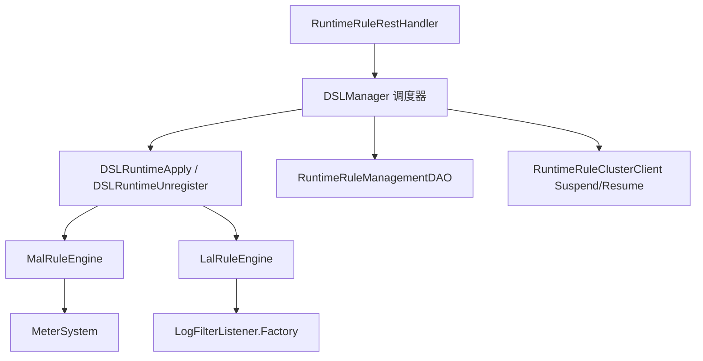

- **Scheduler**（`DSLManager`）：锁、Main 路由、Suspend 广播、持久化、tick 对账
- **Orchestrator**：compile → fireSchemaChanges → verify → commit | rollback
- **Engine**：DSL 专用；`RuleEngineRegistry` 按 catalog 路由

### 20.4 变更分类（DeltaClassifier）

| 分类 | 行为 |
|------|------|
| **NO_CHANGE** | 跳过 |
| **FILTER_ONLY** | 仅改 filter/body，无 Suspend、无 DDL，本地 apply 后 persist |
| **STRUCTURAL** | 增删指标、改 scope/downsampling → Suspend 集群 → DDL → verify → commit |
| **NEW** | 新规则文件 |
| **INACTIVE** | 软暂停：`/inactivate`，保留后端 schema |
| **DELETE** | 硬删除：`/delete`，`withSchemaChange` 删表 |

**存储变更护栏**：MAL 的 scope/ downsampling 变化、LAL 的 outputType 变化需 `allowStorageChange` 显式批准，否则 HTTP 409。

### 20.5 Main / Peer 分工

- **Main**：集群排序后确定的单节点，执行 `POST /addOrUpdate` 的 DDL 与持久化（`StorageManipulationOpt.withSchemaChange()`）
- **Peer**：转发写请求到 Main；本地 tick 用 `withoutSchemaChange()` 只注册 handler，不重复 DDL
- **Suspend/Resume RPC**：structural 变更前暂停各节点对应 metric 的 dispatch，避免半迁移状态写脏数据

### 20.6 MalRuleEngine 关键点

- `MalFileApplier.apply()` 编译 YAML → 注册 `MetricConvert` + `MeterSystem.create`
- Shape-break 指标必须先 `remove` 再 register，否则 `MeterSystem` 抛 `IllegalArgumentException`
- `DSLClassLoaderManager` 管理规则 ClassLoader 的 commit/retire，避免 Metaspace 泄漏
- BanyanDB：`verify` 阶段 `ModelInstaller.isExists()` + describe diff（因 client 对 ALREADY_EXISTS 可能静默）

### 20.7 LalRuleEngine 关键点

- 热更新直接 `LogFilterListener.Factory.addOrReplace` / `remove`
- LAL 一般不触发后端 schema（无 Measure 变更），`fireSchemaChanges` 多为 no-op
- 与 log-mal 联动：同一 catalog 下的 MAL 由 `MalRuleEngine` 处理

---

## 21. BanyanDB 存储实现要点

### 21.1 模块结构

`storage-banyandb-plugin`：

- `BanyanDBStorageClient`：gRPC 客户端
- `MetadataRegistry`：Measure/Stream/Trace 的 schema 缓存
- `BanyanDBIndexInstaller`：实现 `ModelInstaller`，创建/更新 schema
- `BanyanDBBatchDAO`：批量 flush（`maxBulkSize`、`flushInterval`、`concurrentWriteThreads`）
- 分 DAO：`BanyanDBMetricsDAO`、`BanyanDBRecordDAO`、`BanyanDBTraceDAO` 等

### 21.2 数据模型映射

| SkyWalking 概念 | BanyanDB |
|-----------------|----------|
| Metrics（分钟/小时/天） | Measure（带 group、downsampling 时间戳） |
| Record / Segment | Stream 或 Trace（`TraceGroup` 扩展决定） |
| 索引模式 | `BanyanDBModelExtension.indexMode` 控制 ID 列 |

写入路径：`prepareBatchInsert` → `BanyanDBConverter.MeasureToStorage` → `MeasureWrite` → 进入 bulk processor。

### 21.3 批量与异步写

`BanyanDBBatchDAO` 委托 `AbstractBulkWriteProcessor`：

- 累积 `InsertRequest`/`UpdateRequest` 至阈值或 flush 间隔
- 并发写线程池（配置项 `concurrentWriteThreads`）
- 与 `PersistenceTimer` 的 prepare/execute 两阶段对齐

### 21.4 Schema 生命周期

1. `ModelRegistry.add()` → `ModelInstaller.define()` → 返回 etcd `mod_revision`
2. **必须** `SchemaWatcher.awaitRevisionApplied(rev)` 后再放行写入（全集群 DDL 可见）
3. 热更新 verify 依赖 `ModelInstaller` 暴露给 runtime-rule

TTL 配置：`metricsMin/Hour/Day` 均须 ≤ `metadata.ttl`（`BanyanDBStorageProvider.prepare()` 校验）。

### 21.5 与 ES/JDBC 的差异

- ES：索引模板 + Bulk API，协调节点同步 DDL
- JDBC：同步建表，无 revision fence
- BanyanDB：**分布式 schema + 明确 barrier**，是 SkyWalking 存储层最复杂但也为原生观测优化的后端

---

## 22. 服务层级（Service Hierarchy）

### 22.1 问题

同一逻辑服务可能同时出现在 **K8S**、**MESH**、**GENERAL** 等 Layer（例如 Pod 上的应用 + Istio 侧车看到的 mesh 服务）。UI 需要跨层关联，而非孤立拓扑图。

### 22.2 配置与编译

`hierarchy-definition.yml` 定义层间匹配规则；`HierarchyDefinitionService` 将规则编译为 `BiFunction`（`MatchingRule`）。

### 22.3 HierarchyService 两条路径

1. **显式**：Agent/Receiver 上报层级关系 → `toServiceHierarchyRelation` / `toInstanceHierarchyRelation`
2. **自动**：后台任务每 20s 遍历 `MetadataQueryService` 中服务对，按规则 `match()`，命中则生成 `ServiceHierarchyRelation` Source

### 22.4 查询

`HierarchyQueryService.getServiceHierarchy()`：

- 从缓存/DAO 读 `ServiceHierarchyRelationTraffic`
- 递归构建上下层（`maxDepth=10`）
- `filterConjecturableRelations` 去除可推断的冗余边（如已有 A-B-C-D 则去掉直连 A-D）

---

## 23. TopN、Kafka Fetcher 与其它数据通路

### 23.1 TopNStreamProcessor

用于 **慢追踪、慢 SQL** 等“只要 Top K”场景：

- 内存维护固定大小窗口（`topSize`，默认 50）
- `TopNWorker` 按 `topNWorkerReportCycle`（默认 10）才向存储 flush，**远低于** 普通 Metrics 频率
- 同样由 `PersistenceTimer` 收集 persistent workers

设计权衡：避免全量 Record 写存储，仅保留最有价值的 N 条。

### 23.2 Kafka Fetcher

`kafka-fetcher-plugin` 提供与 gRPC **等价的二级入口**：

| Topic（默认名） | Handler | 下游 |
|----------------|---------|------|
| `skywalking-segments` | `TraceSegmentHandler` | `ISegmentParserService` |
| `skywalking-logs` | `LogHandler` | Log Analyzer |
| `skywalking-meters` | `MeterServiceHandler` | `MeterProcessor` |
| `skywalking-metrics` | — | MAL 相关 |
| `skywalking-managements` | — | 注册信息 |

架构：`KafkaFetcherHandlerRegister` 多 consumer 订阅 → 线程池 `handle(record)` → 解析 Protobuf 后与 gRPC 路径汇合。

**seekToEnd 启动**：新 Consumer 从末尾消费，避免重启淹没历史（可配置化行为需结合运维策略）。

### 23.3 Service Mesh（Envoy）

`envoy-metrics-receiver-plugin` 接收 ALS / Metrics，转换为 Mesh 相关 Source，走 OAL 中 Service/ServiceRelation 等 Scope（与 Trace 的 RPC 分析互补）。

### 23.4 Fetcher vs Receiver

- **Receiver**：Agent/Collector **推** 到 OAP（gRPC/HTTP）
- **Fetcher**：OAP **拉** Kafka 等中间缓冲

二者在 Analyzer 层汇合，体现“采集与处理解耦”。

---

## 24. Profiling 与 AI Pipeline

### 24.1 Profiling 子系统（server-core 内）

| 类型 | 模块/包 | 说明 |
|------|---------|------|
| Trace Profiling | `core.profiling.trace` | Java 行级快照，`ProfileAnalyzer` 合并多段 Snapshot |
| eBPF Profiling | `core.profiling.ebpf` | 内核态剖析数据 |
| Async Profiler | `core.profiling.asyncprofiler` | 连续 CPU 采样 |
| Pprof | `core.profiling.pprof` | Go pprof 格式 |

共性：任务由 OAP 下发（Commands）→ Agent 上报 → Record 存储 → `*QueryService` 供 UI 火焰图/调用树分析。

### 24.2 AI Pipeline（`oap-server/ai-pipeline`）

可选模块，提供：

- **`BaselineQueryService`**：基线查询（`baseline.proto`）
- **`HttpUriRecognitionService`**：HTTP URI 聚类/识别（`ai_http_uri_recognition.proto`）
- **`PredictServiceMetrics` / `ServiceMetrics`**：与 AI 后端交互的指标接口

通过 `AIPipelineModule` SPI 挂载；未启用时不影响核心 APM 路径。用于智能 URI 聚合、异常检测基线等增强能力，而非替代 OAL/MAL 主分析链。

---

## 25. 动态配置、Admin 服务与背压

### 25.1 动态配置（Configuration Module）

`server-configuration` 提供统一 `DynamicConfigurationService`，对接 Apollo、Nacos、Zookeeper、etcd、Consul 等。典型 Watcher：

| Watcher | 作用 |
|---------|------|
| `LoggingConfigWatcher` | 动态调整 OAP 日志级别 |
| `EndpointNameGroupingRuleWatcher` | 端点聚合规则热加载 |
| `AlarmRulesWatcher` | 告警规则变更 |
| `SearchableTracesTagsWatcher` | 可搜索 Trace Tag 键 |
| `ApdexThresholdConfig` | Apdex 阈值 |

模式：远程配置变更 → Watcher 回调 → 内存规则表原子替换，**无需重启**（与 runtime-rule 的 MAL/LAL 文件级热更新互补）。

### 25.2 Admin Server

`server-admin` 聚合运维 HTTP 接口（独立 host/port，见 `AdminServerModule`）：

- **runtime-rule**：`/runtime/rule/*`（需显式启用 `SW_RECEIVER_RUNTIME_RULE=default`）
- **status / inspect**：健康与诊断
- **dsl-debugging**：OAL/LAL 调试会话（`GateHolder`、采样输出）
- **ui-management**：Dashboard 模板

与 Core 的 `12800` GraphQL/REST 分离，降低分析面与运维面的耦合。

### 25.3 Watermark（背压）

`WatermarkWatcher` 监控系统资源/队列深度；`WatermarkGRPCInterceptor` 在 gRPC 入口根据水位**拒绝或延迟**新请求，避免 OAP 在流量尖峰时 OOM。属于“最后一道防线”，与 BatchQueue 的 drop 计数、L1 abandon 指标配合可观测。

### 25.4 TelemetryModule（自监控）

OAP 自身通过 `MetricsCreator` 暴露大量内部指标（`trace_in_latency`、`persistence_timer_*`、`remote_*` 等），可接到 Prometheus/OpenTelemetry 监控 OAP 健康，形成**可观测平台的可观测性**。

---

## 26. Zipkin、OTel Trace 与 SpanListener 扩展

### 26.1 Zipkin 接入路径

Zipkin Receiver 支持 HTTP API v1/v2（JSON / Thrift / Protobuf），入口如 `ZipkinSpanHTTPHandler`：

```
HTTP POST /api/v2/spans
  → SpanBytesDecoder 解码 List<zipkin2.Span>
  → SpanForward.send(spanList)
```

**SpanForward**（与原生 Trace 并列的第二分析入口）：

1. **采样**：`sampleRate`（万分比）+ 可选 `RateLimiter`（`maxSpansPerSecond`）
2. 将 `zipkin2.Span` 转为内部 `ZipkinSpan` Source（格式化 service/endpoint 名）
3. 构建 `query` 字段（可搜索的 tag/annotation 子集，超长截断）
4. **`SpanListenerManager.notifyZipkinPhase`** — SPI 监听器可追加 tag、决定是否持久化
5. `SourceReceiver.receive(zipkinSpan)` → Zipkin 专用 OAL Dispatcher
6. 同步产出 `ZipkinService`、`ZipkinServiceSpan`、`ZipkinServiceRelation` Source（拓扑基础数据）
7. `ZipkinSpanRecordDispatcher` 将完整 Span 写入 **Record** 存储（`ZipkinSpanRecord`）

查询时 `ZipkinSpanRecord.buildSpanFromRecord()` 可还原为 `zipkin2.Span` 供 UI 展示。

### 26.2 OTel Trace（可选）

`otel-receiver-plugin` 的 `OpenTelemetryTraceHandler` 将 OTLP Span **先**转为 Zipkin `Span` 格式，再进入 `SpanForward` 或 Forward 服务——实现**复用 Zipkin 存储与查询模型**，降低双栈维护成本。

流程：`OTLP Span` → `convertSpan()`（traceId/spanId 字节序、endpoint 从 attribute 推断）→ `ForwardService.send` → 与 Zipkin 相同下游。

### 26.3 SpanListenerManager（SPI 扩展点）

`SpanListener` 通过 Java `ServiceLoader` 发现，在**首次** `notifyOTLPPhase` / `notifyZipkinPhase` 时懒加载（保证 Module 已 start）。

| 方法 | 调用方 | 时机 |
|------|--------|------|
| `notifyOTLPPhase` | OpenTelemetryTraceHandler | 转 Zipkin **之前** |
| `notifyZipkinPhase` | SpanForward | Zipkin 模型构建**之后** |

返回 `SpanListenerResult`：合并 `additionalTags`、控制是否写入 Zipkin Record 等。**Listener 自行**通过缓存的 `ModuleManager` 发 Source，Manager 只做聚合决策。

扩展新 Trace 后处理（如自定义脱敏、额外指标）：实现 `SpanListener` + `META-INF/services/...SpanListener`，声明 `requiredModules()`。

### 26.4 Zipkin 与原生 Segment 对比

| 维度 | SkyWalking Segment | Zipkin Span |
|------|-------------------|-------------|
| 分析器 | TraceAnalyzer + Listener 链 | SpanForward |
| 拓扑 Source | Service/Endpoint/Relation（RPC Listener） | ZipkinService* Source |
| 明细存储 | SegmentRecord（二进制 SegmentObject） | ZipkinSpanRecord |
| OAL Scope | Service、Endpoint 等 | ZipkinService、ZipkinSpan 等 |
| 查询 API | TraceQueryService（原生树） | 兼容 Zipkin + TraceQL |

---

## 27. GraphQL 与 MQE 查询运行时

### 27.1 模块分层

```
QueryModule (GraphQL / PromQL / TraceQL 等 provider)
    ↓ 依赖
CoreModule (*QueryService — 存储无关的业务查询)
    ↓ 依赖
StorageModule (*QueryDAO — ES/BanyanDB/JDBC 实现)
```

GraphQL **不直接访问存储**，而是注入 `TraceQueryService`、`MetricsQueryService` 等 Core 服务，保持查询逻辑可测、可复用（PromQL 插件同样复用 Core）。

### 27.2 GraphQLQueryProvider

使用 **graphql-java-tools**（`SchemaParser` + `GraphQLQueryResolver`）：

- Schema 来自 query-protocol 子模块（`.graphqls` 文件）
- `prepare()` 注册大量 Resolver 到 `schemaBuilder`
- `start()` 将 GraphQL HTTP 端点挂到 `HTTPHandlerRegister`（与 REST 共存于 `core.default.restPort`，默认 12800）

### 27.3 Resolver 与 Core 服务映射（主要）

| GraphQL Resolver | Core 服务 / 能力 |
|------------------|------------------|
| `TraceQuery` / `TraceQueryV2` | `TraceQueryService` — 链路树、Span 附事件 |
| `TopologyQuery` | `TopologyQueryService` — 服务拓扑图 |
| `MetricsQuery` / `MetricQuery` | `MetricsQueryService` / `MetricsMetadataQueryService` |
| `MetricsExpressionQuery` | **MQE** — `execExpression` |
| `AggregationQuery` | `AggregationQueryService` |
| `LogQuery` / `OndemandLogQuery` | `LogQueryService` |
| `AlarmQuery` | `AlarmQueryService` |
| `HierarchyQuery` | `HierarchyQueryService` |
| `MetadataQuery` / `MetadataQueryV2` | `MetadataQueryService` |
| `ProfileQuery` / `PprofQuery` / `EBPF*` | 各类 Profiling QueryService |
| `EventQuery` | `EventQueryService` |
| `BrowserLogQuery` | `BrowserLogQueryService` |
| `TopNRecordsQuery` | `TopNRecordsQueryService` |
| `Mutation` / `*Mutation` | 剖析任务变更等 |

`AsyncQueryUtils.queryAsync` 将阻塞 IO 包装为 `CompletableFuture`，避免阻塞 Armeria 事件循环。

### 27.4 MQE 查询执行路径

UI 自定义仪表盘常用 **MetricsExpressionQuery.execExpression**：

```java
// 简化流程
MQELexer + MQEParser → ParseTree
TRACE_CONTEXT.set(DebuggingTraceContext(...))
MQEVisitor.visit(tree) → ExpressionResult
```

- `MQEVisitor`（`mqe-rt`）按 AST 拉取存储中的指标序列、做算术/聚合/比较
- 支持 `debug` 与 `dumpStorageRsp`：输出 `DebuggingTrace` 供排障
- 告警侧使用 `AlarmMQEVisitor` / `AlarmMQEVerifyVisitor`，语法树相同、数据源与结果类型约束不同（必须布尔 SINGLE_VALUE）

### 27.5 与 OAL 指标名的关系

OAL/MAL 注册的 `metricsName` 即 MQE 与 GraphQL `readMetricsValues` 中的逻辑名；`MetricsMetadataQueryService` 暴露元数据（类型、labels）供 UI 构建查询表单。

---

## 28. Elasticsearch 存储深度剖析

### 28.1 模块组件

`StorageModuleElasticsearchProvider` 注册：

- `ElasticSearchClient` — REST 客户端、连接池
- `StorageEsInstaller` — 索引模板 / mapping 创建（`ModelInstaller`）
- `BatchProcessEsDAO` — 实现 `IBatchDAO`
- `StorageEsDAO` — 工厂方法创建各 `*EsDAO`
- 专用 Query DAO：`TraceQueryEsDAO`、`MetricsQueryEsDAO`、`TopologyQueryEsDAO` 等

### 28.2 索引与文档 ID

`IndexController` + `TimeSeriesUtils`：

- 时序 Metrics/Record 按 **timeBucket** 路由到物理索引名（如 `sw_metric-2026010112`）
- `generateDocId(model, id.build())` 确定性文档 ID，支持 **update** 语义（分钟级指标合并写）
- Metadata 级指标可用 **alias**，不随时间分片

`MetricsEsDAO.prepareBatchInsert`：

```java
storageBuilder.entity2Storage(metrics, toStorage);
String indexName = TimeSeriesUtils.writeIndexName(model, metrics.getTimeBucket());
String id = IndexController.INSTANCE.generateDocId(model, metrics.id().build());
return new MetricIndexRequestWrapper(client.prepareInsert(indexName, id, builder), callback);
```

### 28.3 BulkProcessor 与 PersistenceTimer 协作

`BatchProcessEsDAO`：

- 懒创建 `BulkProcessor`（`bulkActions`、`flushInterval`、`concurrentRequests`、`batchOfBytes`）
- `insert()` 单条加入 bulk 缓冲
- `flush(prepareRequests)` 将 `PersistenceTimer` 收集的 `InsertRequest`/`UpdateRequest` 批量提交，Insert 完成触发 `SessionCacheCallback.onInsertCompleted()`
- `endOfFlush()` 强制 `bulkProcessor.flush()`

失败时 Update 路径调用 `onUpdateFailure()`，与 Metrics 的 session 缓存重试策略配合。

### 28.4 历史删除与 TTL

`HistoryDeleteEsDAO` 实现 `IHistoryDeleteDAO`：按模型 TTL 删除过期索引或文档。`DataTTLKeeperTimer` 仅在集群**排序后首个节点**执行删除（与 `RemoteClientManager` 排序一致），避免多节点重复删。

### 28.5 Runtime Rule 与 ES

热更新后 `ModelInstaller` 对 ES 做 mapping/settings diff；与 BanyanDB 的 `isExists` 类似，用于 verify 阶段发现“静默 ALREADY_EXISTS 但 mapping 不一致”的问题。

---

## 29. Scope 体系与 OAL 脚本地图

### 29.1 Scope 是什么

每个 **Source** 类带 `@ScopeDeclaration(id = ..., name = ...)`，在启动时由 `DefaultScopeDefine` 扫描注册：

- `NAME_2_ID` / `ID_2_NAME`：OAL `from(Service.latency)` 中的 `Service` 解析为整数 scopeId
- `SCOPE_COLUMNS`：`@ScopeDefaultColumn` 字段 → OAL 生成 Metrics 实体列

**保留区间**：官方 Scope ID ∈ [0, 10000)；自定义扩展建议从 10000 起。

### 29.2 常见 Scope（节选）

| ID | 名称 | 用途 |
|----|------|------|
| 1 | SERVICE | 服务级 RPC 指标 |
| 2 | SERVICE_INSTANCE | 实例级 |
| 3 | ENDPOINT | 端点级 |
| 4–6 | *_RELATION | 拓扑边 |
| 12 | SEGMENT | 链路明细 |
| 22 | ENVOY_INSTANCE_METRIC | Mesh/envoy |
| 23 | ZIPKIN_SPAN | Zipkin 指标 |
| 31 | NETWORK_ADDRESS_ALIAS | 地址别名 |

完整列表见 `docs/en/concepts-and-designs/scope-definitions.md` 与 `DefaultScopeDefine` 源码。

### 29.3 OAL 脚本文件（server-starter/resources/oal/）

| 文件 | 典型内容 |
|------|----------|
| `core.oal` | 核心服务/端点/关系指标（cpm、latency、percentile、apdex） |
| `java-agent.oal` | JVM、Spring 等 Java 探针相关 |
| `dotnet-agent.oal` | .NET 探针 |
| `mesh.oal` | Service Mesh ALS 指标 |
| `browser.oal` | 浏览器监控 |
| `tcp.oal` | TCP 层流量 |
| `ebpf.oal` | eBPF 相关 |
| `cilium.oal` | Cilium 流量 |
| `virtual-gen-ai.oal` | Gen AI 虚拟服务 |
| `disable.oal` | `disable(...)` 关闭不需要的指标/Record |

各 `*ModuleProvider` 在 `start()` 调用 `OALEngineLoaderService.load(new XxxOALDefine())`，`OALDefine` 指定脚本路径集合。

### 29.4 disable.oal 与 DisableRegister

`disable(METRICS_NAME)` 编译进 `DisableRegister`，影响：

- 是否注册 Stream Worker
- `CacheUpdateTimer` 是否加载 Profile 等可选缓存
- UI 是否展示对应功能

用于精简部署（如只要 Trace 不要 JVM 指标）。

### 29.5 Layer 与 layer-extensions.yml

`Layer` 枚举描述技术栈（GENERAL、MESH、K8S、DATABASE 等）；`layer-extensions.yml` 扩展 UI 与层级元数据。Source 上 `@Layer` 影响 Hierarchy 匹配与 UI 筛选。

---

## 30. Service Mesh 遥测内核

### 30.1 接入

`MeshGRPCHandler` 实现 `ServiceMeshMetricService.collect` 流式接收 `ServiceMeshMetrics`（v3 协议），每条调用：

```java
TelemetryDataDispatcher.process(metrics);
```

### 30.2 TelemetryDataDispatcher

静态初始化 `SourceReceiver`、`NamingControl`、自监控指标。按协议分支：

- **HTTP**：解析 `HTTPServiceMeshMetric` → `Service`、`ServiceInstance`、`Endpoint`、`ServiceRelation`、`ServiceInstanceRelation` 等 Source（Layer 多为 **MESH**）
- **TCP**：映射到 `TCPService*` Source 系列（`TCP_COMPONENT = 110`，见 `component-libraries.yml`）

字段含：延迟、响应码、TLS、内部/外部 URI、K8s 元数据（labels 写入 `ServiceInstanceUpdate` 的 JSON properties）等。

### 30.3 与 OAL

`MeshOALDefine` 加载 `mesh.oal`，对 Mesh Source 做 cpm、percentile 等聚合。Mesh **不经过** `TraceAnalyzer`，与 Agent Trace **平行**进入同一 `DispatcherManager`。

### 30.4 Envoy Metrics Receiver

除 SkyWalking 原生 Mesh 协议外，`envoy-metrics-receiver-plugin` 可接收 Envoy 原生指标流，经 MAL/OTel 路径入 MeterSystem（适合 control plane / gateway 指标，与 ALS 互补）。

---

## 31. 集群协调、TTL 与历史删除

### 31.1 ClusterModule 服务 triad

| 服务 | 职责 |
|------|------|
| `ClusterRegister` | 本节点注册、续约 |
| `ClusterNodesQuery` | 返回集群内 OAP 列表（含 gRPC 地址） |
| `ClusterCoordinator` | 协调语义（依实现而定） |

Provider 实现：standalone（单节点）、**kubernetes**、zookeeper、etcd、consul、nacos。

### 31.2 Kubernetes 模式（代表）

`KubernetesCoordinator`：

- 通过 K8s API 列出带 labelSelector 的 Pod
- 读取 `internalComHost` / `internalComPort` 或容器端口组成 gRPC 地址
- `RemoteClientManager.refresh()` 每 10s 拉取列表，**排序**后建立 `GRPCRemoteClient`

**Main 节点判定**（runtime-rule）：与 `ClusterNodesQuery` 排序后的首个地址比较，无独立选举。

### 31.3 DataTTLKeeperTimer

- 周期：`dataKeeperExecutePeriod`（分钟级，配置于 CoreModuleConfig）
- **仅集群首节点**执行 `IHistoryDeleteDAO.deleteHistory`（排序与 Remote 一致）
- 遍历 `IModelManager.allModels()`，按 `model.isRecord()` 选 `recordDataTTL` 或 `metricsDataTTL`

存储实现可覆盖 TTL（如 ES ILM）；Timer 是 OAP 侧统一驱动入口。

### 31.4 与 Persistence 的区别

| 机制 | 作用 |
|------|------|
| `PersistenceTimer` | 将内存中**未过期**的聚合结果批量写入存储 |
| `RecordStreamProcessor` 入口 TTL | 拒绝已过期的**新到** Record |
| `DataTTLKeeperTimer` | 删除存储中**已过期**的历史数据 |

---

## 32. Exporter、TraceQL 与辅助查询插件

### 32.1 Exporter 模块

`ExporterModule` + `ExporterProvider` 实现 Core 定义的导出接口：

| 接口 | 默认实现 | 挂载点 |
|------|----------|--------|
| `TraceExportService` | `KafkaTraceExporter` | `ExportRecordWorker`（Segment/Log Record） |
| `LogExportService` | `KafkaLogExporter` | 同上 |
| `MetricValuesExportService` | `GRPCMetricsExporter` | `ExportMetricsWorker` |

需在 `application.yml` 启用 exporter 模块；Worker 链在持久化前检查 `isEnabled()`，避免无意义的序列化开销。

用途：将 SkyWalking 处理后的数据推到**外部 Kafka/下游 APM**，与 Receiver 的“输入 Kafka”对称。

### 32.2 TraceQL 插件

`traceql-plugin` 提供与 Grafana Tempo 等兼容的 TraceQL 查询 HTTP API：

- 解析 TraceQL 表达式 → 转换为内部 Zipkin/OTLP 查询条件
- `ZipkinOTLPConverter` 等将结果转为 TraceQL 响应格式
- 依赖 Zipkin 存储的 Span 数据模型

适合已投资 TraceQL 生态的用户，无需改 UI 即可对接 Grafana。

### 32.3 PromQL 插件

`promql-plugin` 将 SkyWalking 指标暴露为 PromQL 查询接口，便于 Prometheus/Grafana 侧统一查询（与原生 GraphQL 指标查询并行）。

### 32.4 DSL Debugging（Admin）

`dsl-debugging` 模块配合 OAL 生成的 `GateHolder`：

- 运行时对单条 OAL 规则 **采样** 输入/输出（需编译期 `SW_DSL_DEBUGGING_INJECTION_ENABLED`）
- REST 会话 API 供 UI 或运维工具查看“某指标在某分钟收到了什么 Source”

与 **MQE `debug` 标志**（查询侧）形成“写入路径 / 读出路径”双向排障。

---

## 33. UI、发行版与跨进程链路机制

### 33.1 skywalking-ui 子模块

`skywalking-ui` 为 **booster-ui** 子模块（Vue3 技术栈），独立仓库版本通过 git submodule 锁定。功能：

- Dashboard、拓扑、Trace、Log、Alarm、Profiling 等页面
- 通过 GraphQL 与 OAP 通信（开发时代理到 12800）

OAP 不嵌入 UI 源码；`apm-webapp` 将静态资源打包为可部署 WAR/JAR，与 OAP 进程分离部署或同机反代。

### 33.2 典型部署拓扑

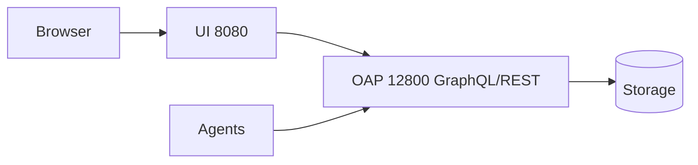

生产常见 Nginx 将 `/graphql` 转发至 OAP，`/` 转发至 UI。

### 33.3 跨进程 Trace（SegmentReference）

Agent 在 Segment 的 Span 上携带 **Reference**（CrossProcess / CrossThread）：

- Entry Span 的 ref 指向上游 Segment
- OAP `RPCAnalysisListener` 根据 ref 与 NetworkAddressAlias 构建 **ServiceInstanceRelation**
- 查询侧 `TraceQueryService` 按 `traceId` 拉取所有 SegmentRecord，组装 Span 树；v2 API 支持更复杂排序与过滤

**SpanAttachedEvent**：附加事件（如 MQ 消息体摘要）独立存储，查询时 `appendAttachedEventsToSpan` 挂回 Span。

### 33.4 Component Library Catalog

`component-libraries.yml` 定义组件 ID → 名称、Layer、是否为 MQ/数据库/缓存等。Agent 上报 `componentId`，OAP 用于：

- UI 拓扑图标与分类
- 分析逻辑分支（如 MQ 消费端无 Agent 时的虚拟服务映射）

Mesh 的 `TCP_COMPONENT = 110` 即在此定义。

### 33.5 构建与代码生成提示

修改 OAL 后需 Maven 编译生成类；跨模块改动建议 `mvnw clean install` 全量构建（见 `CLAUDE.md`）。GraphQL 协议变更需同步 `skywalking-query-protocol` 子模块与 UI。

---

## 34. Metrics Session Cache 与 JDBC 存储

### 34.1 L2 持久化 Worker 的双层缓冲

`MetricsPersistentWorker`（及分钟级的 `MetricsPersistentMinWorker`）在 L1 之后承担 **L2 聚合 + 写前合并**：

```
in(Metrics) → ReadWriteSafeCache (MergableBufferedData)  // 同 worker 内再合并
buildBatchRequests() → loadFromStorage(已有行) → MetricsSessionCache 决策 insert/update
→ prepareBatchInsert/Update → PersistenceTimer → IBatchDAO.flush
```

- `persistentMod`：可跳帧 build（降低读存储频率），热删除时 `drainPendingRequests()` 走无条件 flush
- `supportUpdate`（`@MetricsExtension`）：false 时只做 insert，不 merge（如一次性 ServiceTraffic）

### 34.2 MetricsSessionCache 语义

每个 `MetricsPersistentWorker` 一个 SessionCache（`ConcurrentHashMap`）：

| 事件 | 行为 |
|------|------|
| `loadFromStorage` / multiGet 命中 | 预热缓存 |
| Insert 回调 `onInsertCompleted` | `cacheAfterFlush`（supportUpdate 时 put） |
| Update 回调失败 | `remove` 缓存，下次重新 multiGet |
| 超时 `storageSessionTimeout` | `removeExpired()` 逐出 |

**设计动机**（见 `MetricsSessionCache` Javadoc）：分钟级指标在同一 timeBucket 内多次到达，需与 DB 中已有值 **combine** 再写回；避免每次 `in()` 都 read-modify-write 存储。

`SessionCacheCallback` 在 Bulk flush 完成后触发，与 ES/BanyanDB/JDBC 的异步写结果对齐。

### 34.3 告警与导出触发点

`buildBatchRequests` 在 insert/update 决策后调用 `nextWorker(metrics)`：

- `AlarmNotifyWorker` — 将指标上下文交给告警规则（与 `AlarmCore` 定时 MQE 评估配合）
- `ExportMetricsWorker` — 可选导出到 Kafka/gRPC

### 34.4 JDBC 存储插件（HikariCP）

`storage-jdbc-hikaricp-plugin` 提供 **MySQL / PostgreSQL / H2 / TiDB** 等 Provider，共用 `JDBCStorageProvider` 骨架：

- 同步 DDL（`JDBCTableInstaller`），无 BanyanDB 式 revision fence
- `JDBCBatchDAO` 批量 INSERT/UPDATE，Update 返回行数为 0 时触发 SessionCache 失效（注释中明确 JDBC 场景）
- 适合开发演示、小规模部署；大规模生产更常见 ES 或 BanyanDB

### 34.5 三种存储的 Session 一致性对比

| 后端 | 写后缓存策略 | 典型风险 |
|------|--------------|----------|
| ES | Insert 完成即缓存（supportUpdate 时） | 分片未刷新前读不到 |
| BanyanDB | supportUpdate=false 的指标**不**缓存，依赖 multiGet | 服务端异步写，需 multiGet 保证存在 |
| JDBC | Update 行数 0 → remove cache | 连接池/锁竞争 |

理解 SessionCache 是排查“指标比预期少”“告警不触发”的关键——常与 TTL 过期、`supportUpdate`、flush 失败相关。

---

## 35. OALEngineV2 编译与代码生成详解

### 35.1 引擎入口与加载时机

`OALEngineLoaderService.load(OALDefine)` 通过反射实例化 `org.apache.skywalking.oal.v2.OALEngineV2`（因 Maven 反应堆中 `server-core` 先于 `oal-rt` 编译，避免硬依赖）。

每个 `OALDefine`（如 `CoreOALDefine`、`MeshOALDefine`）对应一组 `.oal` 文件路径，**每个 define 只 load 一次**。

### 35.2 四步流水线（源码级）

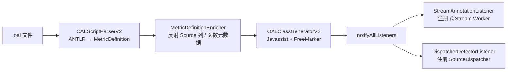

**Step 1 — 解析**：`OALScriptParserV2.parse()` 产出不可变 `MetricDefinition` 列表；`disable(...)` 进入 `disabledSources`；每条 metric 保留源码区间供 DSL 调试。

**Step 2 —  enrich**：`MetricDefinitionEnricher` 根据 `from(Service.latency)` 解析 Source 类字段、聚合函数父类（如 `LongAvgMetrics`）、持久化列映射。

**Step 3 — 生成**（`generateClassAtRuntime`）：

| 生成物 | 作用 |
|--------|------|
| `XxxMetrics` 子类 | 带 `@Stream`、继承 `LongAvgMetrics` 等，实现 `combine`/`calculate` |
| `XxxMetricsBuilder` | `StorageBuilder`，entity ↔ 存储行 |
| `ServiceXxxDispatcher` 等 | 实现 `SourceDispatcher`，`dispatch(ISource)` 内 filter + 调 `MetricsStreamProcessor.in()` |

生成类加载到运行时 ClassLoader；`SW_DYNAMIC_CLASS_ENGINE_DEBUG=Y` 可落盘 `.class` + `.java` sidecar。

**Step 4 — 注册监听器**：

```java
// OALEngineV2.notifyAllListeners()
for (Class metricsClass : metricsClasses) {
    streamAnnotationListener.notify(metricsClass);  // → MetricsStreamProcessor.create
}
for (Class dispatcherClass : dispatcherClasses) {
    dispatcherDetectorListener.addIfAsSourceDispatcher(dispatcherClass);
}
```

### 35.3 生成 Dispatcher 的逻辑形态（概念）

对 `service_resp_time = from(Service.latency).longAvg()`，生成的 `dispatch` 大致等价于：

1. 若 `source` 非 `Service` 类型 → return  
2. 执行 OAL filter 链（`latency > 0` 等）  
3. `new ServiceRespTimeMetrics()`，从 Source 拷贝 entity 字段  
4. 调用 `combine(...)` / `calculate()`  
5. `MetricsStreamProcessor.getInstance().in(metrics)`  

拓扑类 Relation 由**独立 Listener** 产出 Source，OAL 只负责指标；不必每条边写脚本。

### 35.4 与 disable / DSL Debug 的交互

- `disable.oal` 在解析阶段标记 metric 名 → `DisableRegister`，生成类可能仍存在但 Stream 注册被跳过  
- `SW_DSL_DEBUGGING_INJECTION_ENABLED` 时模板注入 `GateHolder` + `OALDebug.capture*`，供 Admin `dsl-debugging` 模块采样

---

## 36. 告警系统全链路源码剖析

### 36.1 两条触发路径

| 路径 | 时机 | 作用 |
|------|------|------|
| **实时 notify** | 每次 L2 `buildBatchRequests` 后 `AlarmNotifyWorker.in()` | 把刚参与持久化的 `Metrics` 推入告警上下文 |
| **定时 check** | `AlarmCore` 每分钟第 15 秒后 | 对所有 `RunningRule` 执行 MQE 表达式求值 |

二者结合：notify 累积时间窗口内的指标值，check 用 MQE 判断是否触发。

### 36.2 写入路径

```
MetricsPersistentWorker.nextWorker(metrics)
  → AlarmNotifyWorker.in(metrics)
  → AlarmEntrance.forward (需 AlarmModule 已加载)
  → NotifyHandler.notify(metrics)
```

`NotifyHandler` 仅处理带 `WithMetadata` 且 scope 属于 **服务目录** 的指标（Service / Instance / Endpoint / 三类 Relation）。其它 scope 直接 return。

根据 scope 构造 `MetaInAlarm`（含可读 name、layers），调用 `RunningRule.in(metaInAlarm, metrics)` 将值填入规则的时间窗口队列。

### 36.3 定时评估（AlarmCore）

```java
// 每分钟 tick，且 second > 15 避免整分边界误报
runningRule.moveTo(checkTime);
alarmMessageList.addAll(runningRule.check());
```

`RunningRule.check()` 遍历每个 `MetaInAlarm` 实体，调用内部 `RunningRuleContext.checkAlarm()`：

1. `AlarmMQEVisitor` 对 MQE 表达式求值（布尔 SINGLE_VALUE）  
2. `isMatch()` → 状态机 `onMatch()` / `onMismatch()`  
3. 若状态为 **FIRING** → 生成 `AlarmMessage`  
4. 若状态为 **RECOVERED** → 生成 `AlarmRecoveryMessage`  

### 36.4 告警状态机（AlarmStateMachine）

状态枚举：`NORMAL` → `FIRING` → `SILENCED_FIRING` / `OBSERVING_RECOVERY` → `RECOVERED` → `NORMAL`

| 事件 | 典型转移 |
|------|----------|
| **onMatch**（表达式为真） | NORMAL→FIRING；恢复期匹配→SILENCED_FIRING 或重新 FIRING |
| **onMismatch** | FIRING→OBSERVING_RECOVERY；观察期满→RECOVERED→NORMAL |
| **silencePeriod** | 触发后计数器抑制重复通知，仍可能处于 SILENCED_FIRING |

参数来自 `alarm-settings.yml`：`period`、`silence-period`、`recovery-observation-period` 等。

### 36.5 规则加载与热更新

- 启动：解析 `alarm-settings.yml` → `AlarmRule.setExpression()` 用 `AlarmMQEVerifyVisitor` **编译期校验**  
- 运行：`AlarmRulesWatcher` 监听动态配置变更，重建 `RunningRule` 集合  
- Runtime-rule 在 MAL 结构变更后可 `alarmResetter` 重置相关 RunningRule 窗口（避免旧窗口脏数据）

### 36.6 通知回调（Hooks）

`AlarmCore` 收集 `AlarmMessage` 后调用已注册 `AlarmCallback`：

- Webhook、Slack、钉钉、企业微信、Feishu、Discord、PagerDuty、gRPC 等（`NotifyHandler` 构造时注册）

告警记录本身通过 Alarm 模块持久化服务写入存储，供 UI `AlarmQuery` 展示。

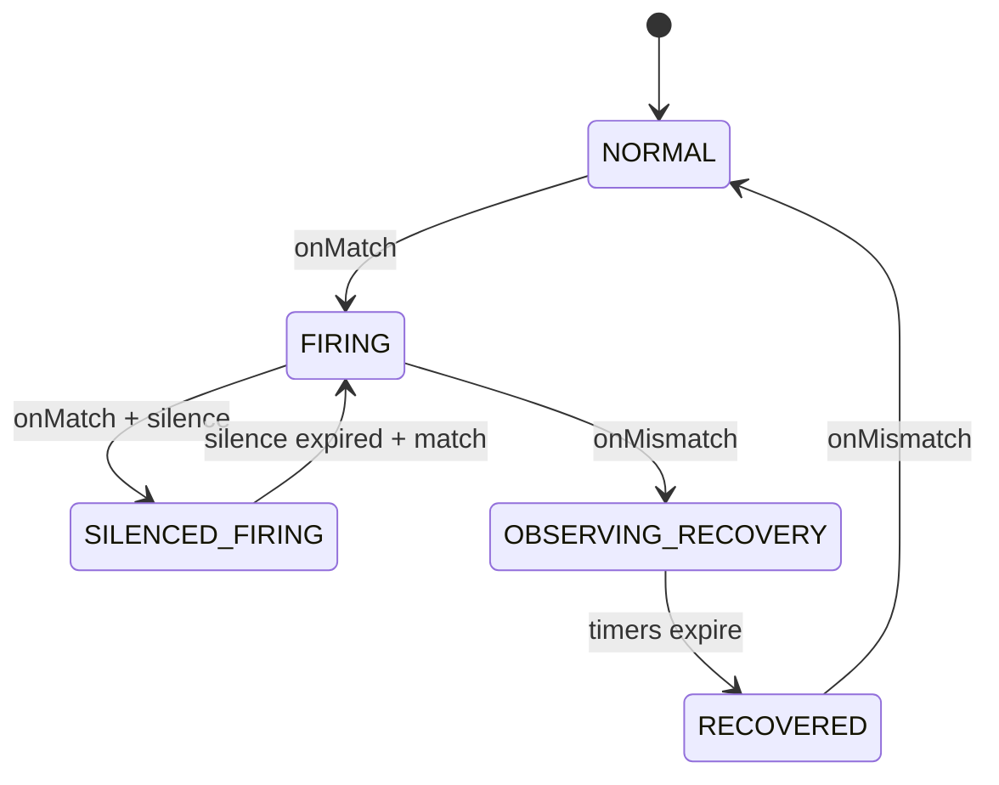

---

## 37. ModelRegistry、StorageModels 与 AnnotationScan

### 37.1 StorageModels 职责

`StorageModels` 同时实现 `IModelManager`、`ModelRegistry`、`ModelManipulator`：

- **add(class, scopeId, storage, opt)**：反射扫描 Metrics/Record 类的 `@Column`、`@ElasticSearch`、`@BanyanDB`、`@SQLDatabase` 等，组装 `Model` + `ModelColumn` 列表  
- 触发 `CreatingListener.whenCreating` → 存储插件建索引/Measure  
- **remove(streamClass, opt)**：热更新删指标时反向 DDL（peer 可 `withoutSchemaChange`）  
- `ReentrantLock` 保护 models 列表；listener 回调在锁外执行避免 DDL 阻塞其它 add

`SeriesIDChecker` / `ShardingKeyChecker` 校验 ID 列合法性，防止存储层无法路由。

### 37.2 与 MetricsStreamProcessor 的衔接

`MetricsStreamProcessor.create()` 内：

```java
Model model = modelSetter.add(metricsClass, stream.getScopeId(), new Storage(...), opt);
if (opt.hasShapeMismatch()) { /* 拒绝注册 worker */ return; }
MetricsPersistentWorker worker = minutePersistentWorker(..., model, ...);
```

Shape mismatch：后端已有不兼容 schema 时 **不注册 worker**，避免写脏数据（需运维通过 runtime-rule 或手工对齐）。

### 37.3 AnnotationScan

启动期 `CoreModuleProvider` 注册 listener 后执行 `annotationScan.scan()`：

- 扫描 classpath 下 `org.apache.skywalking` 包  
- 匹配 `@Stream` → `StreamAnnotationListener` → 创建 Worker 链  
- 其它注解监听器可扩展（历史设计预留）

OAL **动态生成**的类在 `notifyAllListeners` 时单独注册，不走全量 classpath 扫描（避免重复）。

### 37.4 手工 Source / Dispatcher

`SourceReceiverImpl.scan()` 扫描手写 `SourceDispatcher`（如 `SegmentDispatcher`）。与 OAL 生成 Dispatcher 共用 `DispatcherManager.dispatcherMap`（key = `source.scope()`）。

---

## 38. Event、Browser、Management 等 Receiver 纵览

### 38.1 Event（事件）

**模块**：`event-analyzer` + `skywalking-event-receiver-plugin`

```
gRPC/REST Event → EventAnalyzerService → EventAnalyzer
  → EventRecordAnalyzerListener.parse/build
  → RecordStreamProcessor.in(Event)
```

事件字段：`uuid`、`layer`（必填）、`source`（service/instance/endpoint）、`name`、`type`、`message`、`parameters`、时间范围。用于版本发布、扩缩容等**与指标时间线对齐**的标注。

### 38.2 Browser（前端）

`skywalking-browser-receiver-plugin` 接收 `BrowserPerf`（页面性能、资源 timing、首屏等），产出 Browser 相关 Source，OAL 见 `browser.oal`。

### 38.3 Management（注册）

`skywalking-management-receiver-plugin` 处理实例注册、心跳、属性上报（`ManagementService`），维护服务实例存活与属性，供拓扑与 UI 实例列表使用。数据进入 `ServiceInstanceUpdate` 等 Source/Record。

### 38.4 Meter（原生指标）

`skywalking-meter-receiver-plugin`：`MeterService` gRPC 批量上报 → `MeterProcessor` → `MeterSystem`（与 OTel/Prometheus 路径汇合）。

### 38.5 JVM / CLR

- `skywalking-jvm-receiver-plugin`（或 agent 内嵌 JVM metric 走 trace 模块）：JVM 指标 Source → `java-agent.oal`  
- `skywalking-clr-receiver-plugin`：.NET CLR 指标 → `dotnet-agent.oal`

### 38.6 Receiver 模块对照表

| 模块 | 协议/格式 | 分析器 |
|------|-----------|--------|
| trace | Segment gRPC/REST | agent-analyzer |
| zipkin | Zipkin v1/v2 HTTP | SpanForward |
| log | Log gRPC | log-analyzer |
| event | Event gRPC/REST | event-analyzer |
| mesh | ServiceMeshMetrics | TelemetryDataDispatcher |
| otel | OTLP | OTel handler + MAL |
| meter | Meter gRPC | MeterProcessor |
| browser | Browser perf | browser analyzer |
| ebpf | eBPF proto | ebpf analyzer |
| profile/pprof/async-profiler | 各类 profiling | 直写 Record |

---

## 39. eBPF 与 Cilium Fetcher

### 39.1 eBPF Receiver

`skywalking-ebpf-receiver-plugin` 接收 eBPF 探针上报（进程、连续剖析、访问日志等），与 `ebpf.oal`、Profiling 查询服务配合。数据类型包括进程元数据、剖析任务、网络/access log 等（见 `apm-protocol` 下 `ebpf/` proto）。

### 39.2 Cilium Fetcher

`cilium-fetcher-plugin` **主动拉取** Cilium Hubble 流日志（非 push Receiver）：

- `CiliumFetcherProvider.start()` 连接 Cilium 节点 gRPC，`CiliumFlowListener` 消费 flow  
- `FieldsHelper` + `cilium-rules/metadata-service-mapping.yaml` 将 flow 字段映射为 SkyWalking Source  
- 加载 `cilium.oal`（含 `labelCount(dropReason)` 等）  
- 依赖 `ClusterModule` 做节点发现（多 Cilium 节点时）

适合 Kubernetes 集群内**无 Sidecar Agent** 的网络可观测性补充。

---

## 40. Agent 配置发现与下行 Commands

### 40.1 Configuration Discovery

`configuration-discovery-receiver-plugin`：

- `AgentConfigurationsWatcher` 继承 `ConfigChangeWatcher`，监听配置中心 key `agentConfigurations`  
- 解析 YAML 为 `AgentConfigurationsTable`（服务/instance 粒度的 agent 配置）  
- Agent 通过 `ConfigurationDiscoveryService` gRPC **拉取**匹配自身的配置（含 SHA512 校验和）

实现 Agent 采样率、插件开关等**无需重启 Agent** 的动态调整（与 OAP 本地 `application.yml` 无关）。

### 40.2 Commands 下行

`common/Command.proto` 定义 OAP → Agent 指令，常见于：

- Trace/Log 上报响应中的 `Commands`  
- Profile 任务下发  
- 动态配置片段  

`CommandService`（Core）协调序列化；`CommandDeserializer` 在 agent 侧解析。

### 40.3 与动态配置模块关系

| 机制 | 配置来源 | 消费方 |
|------|----------|--------|
| ConfigurationDiscovery | 配置中心 → OAP Watcher → 表 | Agent 拉取 |
| LoggingConfigWatcher 等 | 配置中心 | OAP 自身 |
| runtime-rule | Management 存储 | OAP 集群 |

---

## 41. OAL 指标类型族与 merge 语义

### 41.1 函数 → 基类映射

OAL 聚合函数映射到 `server-core/.../analysis/metrics/` 下抽象类，由生成类继承：

| OAL 函数 | 基类 | 存储特征 |
|----------|------|----------|
| `longAvg` / `doubleAvg` | `LongAvgMetrics` / `DoubleAvgMetrics` | summation + count → value |
| `sum` | `SumMetrics` | 累加 |
| `count` / `cpm` | `CountMetrics` / `CPMMetrics` | 计数 / 每分钟调用 |
| `percent` / `rate` | `PercentMetrics` / `RateMetrics` | 分子分母条件 |
| `histogram` | `HeatmapMetrics` | 桶分布 |
| `apdex` | `ApdexMetrics` | 满意度阈值 |
| `p50`…`p99` / `percentile2` | `PercentileMetrics` / `Percentile2Metrics` | 多分位 |
| `labelCount` | `LabelCountMetrics` | 带标签计数 |

`@MetricsFunction` 注解在基类上声明 `functionName`，OAL enricher 据此选择父类。

### 41.2 combine 与 calculate

- **combine**：L1/L2 合并同 ID 样本时调用（如 `LongAvgMetrics.combine` 累加 summation/count）  
- **calculate**：flush 前推导最终 value（如 `value = summation / count`）  
- **@Entrance / @SourceFrom**：标记生成代码如何从 Source 字段传入 combine 参数

### 41.3 remoteHashCode

`Metrics.remoteHashCode()` 参与集群路由，使同一服务/实例的分钟指标稳定落到同一 OAP 节点做 L2 合并。生成类基于 entityId 字段组合 hash。

### 41.4 Meter 侧对称概念

MAL → `MeterSystem` 使用 `@MeterFunction` + `AcceptableValue` 实现类，语义与 OAL 函数平行，但输入是 **Sample family** 而非 Source。

---

## 42. 灵活 Trace 查询、SpanAttachedEvent 与 Booster UI

### 42.1 标准 Trace 查询

`TraceQueryService.invokeQueryTrace(traceId)`：

1. `ITraceQueryDAO.queryByTraceId` 拉取所有 `SegmentRecord`  
2. `SegmentObject.parseFrom(dataBinary)` 还原 Span  
3. 排序、组装父子关系  
4. 拉取 `SpanAttachedEvent` 附加上下文  

### 42.2 Flexible Trace Query

当 **无 SegmentRecord**（仅 Zipkin/部分 OTLP 场景）时：

```java
if (segmentRecords.isEmpty()) {
    trace.getSpans().addAll(getTraceQueryDAO().doFlexibleTraceQuery(traceId));
}
```

存储插件从 Zipkin Span 记录推导 Span 树（`TraceQueryEsDAO` / `BanyanDBTraceQueryDAO` / `JDBCTraceQueryDAO` 各自实现）。保证 UI **单一 traceId 入口** 可兼容多协议写入。

### 42.3 SpanAttachedEvent

`SpanAttachedEventReportServiceHandler` 接收与 Segment **并行** 的上报：

- `SKYWALKING` 类型 → `SWSpanAttachedEventRecord` → `RecordStreamProcessor`  
- `ZIPKIN` 类型 → Zipkin 附事件存储  

查询阶段合并到对应 Span，用于 MQ 消息体、额外诊断信息等。

### 42.4 Booster UI（子模块）

`skywalking-ui` 为 **git submodule**（Apache SkyWalking Booster UI）：

- 技术栈：Vue 3 + TypeScript，Vite 构建  
- 数据层：GraphQL 查询 OAP（`query-protocol` 子模块定义 schema）  
- 功能模块：Dashboard 模板、拓扑、Trace、Log、Alert、EBPF Profile 等  

`apm-webapp` 将 UI 静态资源 + 可选 OAP 地址配置打为 Web 包；生产环境常与 OAP 分离，由网关统一路由。

开发注意：需 `git submodule update --init` 拉取 UI 源码；GraphQL schema 变更需同步生成前端类型。

---

## 43. server-tools、发行版与性能调优要点

### 43.1 apm-dist 发行版

`apm-dist` Maven 模块组装：

- `oap-libs/` — OAP 运行所需 jar  
- `config/` — `application.yml`、oal、lal、alarm 等  
- `bin/` — 启动脚本  
- 可选 UI webapp 包  

Docker 镜像在 `docker/` 中基于 dist 构建；**修改源码后需重新 package** 才能使镜像内 jar 更新（见项目 `package` skill）。

### 43.2 server-tools

| 工具 | 用途 |
|------|------|
| `profile-exporter` | 剖析快照导出，使用 `MockCoreModuleProvider` 启动精简 OAP |
| `data-generator` | 测试数据生成 |

工具类启动需注意 `CoreModule` 契约变更时同步 Mock Provider（规范 #11）。

### 43.3 CoreModuleConfig 高频调优项

| 配置项 | 影响 |
|--------|------|
| `role` | Mixed / Receiver / Aggregator |
| `persistentPeriod` | 写入存储周期 |
| `prepareThreads` | PersistenceTimer prepare 并行度 |
| `metricsDataTTL` / `recordDataTTL` | 数据保留 |
| `l1FlushPeriod` | L1 聚合刷新间隔 |
| `maxHeapSizeOfAlarm` 等 | 告警内存保护 |

存储侧：`bulkActions`、`flushInterval`（ES）、`maxBulkSize`（BanyanDB）决定批量写吞吐。

### 43.4 背压与丢弃可观测

关注 Telemetry 指标：

- `trace_in_latency`、`mesh_analysis_latency`  
- `metrics_aggregation`、`metrics_persistent_cache`（new vs cached）  
- BatchQueue drop / `unroutableSampleCount`（热更新窗口）  
- `watermark` 相关拒绝计数  

### 43.5 init 模式

`RunningMode.setMode("init")`：OAP 启动完成 schema 初始化后 **exit 0**，用于 K8s Job 预建存储结构，不长期运行分析。

---

## 44. TimeBucket、DownSampling 与多精度指标

### 44.1 TimeBucket 编码

`TimeBucket` 将毫秒时间戳编码为 **long 型桶 ID**，位数区间决定精度（`TimeBucket.java`）：

| 精度 | 格式示例 | 判断条件（约） |
|------|----------|----------------|
| **Second** | `yyyyMMddHHmmss` | 14 位 |
| **Minute** | `yyyyMMddHHmm` | 12 位 |
| **Hour** | `yyyyMMddHH` | 10 位 |
| **Day** | `yyyyMMdd` | 8 位 |

API 示例：

- `getMinuteTimeBucket(ts)` — OAL 分钟指标主键  
- `getRecordTimeBucket(ts)` — Segment/Log/Event 等 Record  
- `getTimestamp(timeBucket, DownSampling.Minute)` — 查询反解为毫秒  

所有 Metrics/Record 的 `timeBucket` 字段是存储分片、TTL 删除、查询时间范围的**统一键**。

### 44.2 DownSampling 配置

`application.yml` 中 `core.default.downsampling` 列表（如 `- hour`、`- day`）由 `DownSamplingConfigService` 解析：

- `shouldToHour()` / `shouldToDay()` 控制是否为每个 Metrics 类额外注册 Hour/Day 级 `MetricsPersistentWorker`
- 分钟级 worker 始终存在；小时/天 worker 通过 `MetricsTransWorker` 从分钟向下采样传递

关闭 hour/day 可减少存储体积与写入 CPU，但 UI 长周期查询依赖降采样表。

### 44.3 三级 Metrics Worker 关系

```
分钟 MetricsPersistentMinWorker  ← 主写入路径（Alarm/Export 挂在此）
        ↓ MetricsTransWorker（可选）
小时 MetricsPersistentWorker
        ↓
天 MetricsPersistentWorker
```

`MetricsTransWorker` 在分钟 flush 时将聚合结果推送到上级精度 worker 的 `in()`，实现**服务端降采样**，无需 Agent 重复上报。

### 44.4 Record 与 Metrics 的时间精度差异

- **Metrics**：通常 Minute（部分 Metadata 类用其它策略）  
- **Record**（Segment、Log、Event）：`getRecordTimeBucket` 常为 **秒** 级，支撑更细粒度查询  
- **TopN**：使用独立 report cycle，与 Metrics 持久化周期解耦  

---

## 45. MAL 编译运行时与 MetricConvert

### 45.1 编译流水线（meter-analyzer）

与 OAL 对称，MAL 使用 **ANTLR + Javassist**，产出 `MalExpression`：

```
MAL 表达式字符串
  → MALScriptParser → MALExpressionModel（AST）
  → MALClassGenerator.compileFromModel
  → MalExpression.run(Map<String, SampleFamily>)  // 纯计算
  → Analyzer.register → MeterSystem.create
```

**扩展函数** `namespace::method()` 通过 `MalFunctionExtension` SPI 注册，编译期为**静态方法调用**（无反射），见 `meter-analyzer/CLAUDE.md`。

### 45.2 MetricConvert 两阶段 apply

`MetricConvert` 对每个 YAML 规则文件：

1. **Phase 1 prepare**：为每条 `metricsRules` 编译 `Analyzer`（含 DSL parse），**不**调用 `MeterSystem.create`  
2. **Phase 2 register**：全部 prepare 成功后统一 `register()`，触发 DDL  

任一条规则编译失败则**整文件 abort**，避免部分 DDL 已创建（与 runtime-rule 的 MalFileApplier 一致）。

表达式拼接：

```java
// formatExp: injectExpPrefix + exp + expSuffix
// 例: (node_cpu_seconds_total * 100).sum(['host']).rate('PT1M').service(['host'], Layer.OS_LINUX)
```

### 45.3 运行时 toMeter

一次 Prometheus/OTel scrape 产生 `ImmutableMap<String, SampleFamily>`（key = 原始 metric 名）：

```java
metricConvert.toMeter(sampleFamilies);
// 广播到文件内每个 Analyzer；各 Analyzer 按 metadata 只取自己需要的 key
```

`PrometheusMetricConverter` 将 `Metric` 流合并为 SampleFamily（同名 metric 多样本合并数组）。

### 45.4 与 OTel / Telegraf / Zabbix 的 catalog

| catalog 目录 | 典型来源 |
|--------------|----------|
| `otel-rules/` | OTel receiver Prometheus 格式 |
| `meter-analyzer-config/` | 原生 Meter、gRPC meter |
| `telegraf-rules/` | Telegraf receiver |
| `log-mal-rules/` | LAL metrics 块 |
| `zabbix-rules/` | Zabbix receiver（YAML 键可能为 `metrics` 而非 `metricsRules`） |

---

## 46. MQE 算子体系与查询调试

### 46.1 架构

```
GraphQL execExpression / AlarmMQEVisitor
  → MQELexer + MQEParser（mqe-grammar）
  → MQEVisitorBase（mqe-rt）extends MQEParserBaseVisitor
  → ExpressionResult（SINGLE_VALUE / TIME_SERIES / SORTED_LIST / RECORD_LIST）
```

`MQEVisitor`（查询）与 `AlarmMQEVisitor`（告警）继承同一基类，共享算子实现，**数据源与结果校验不同**。

### 46.2 主要算子包（mqe-rt/operation）

| 算子类 | 能力 |
|--------|------|
| `AggregationOp` | sum、avg、max、min 等对时间序列聚合 |
| `BinaryOp` | 四则运算 |
| `CompareOp` / `BoolOp` | 比较与布尔逻辑（告警核心） |
| `TrendOp` | 趋势比较（同比/环比类） |
| `TopNOfOp` | TopN 选取 |
| `AggregateLabelsOp` | 按 label 聚合 |
| `SortValuesOp` / `SortLabelValuesOp` | 排序 |
| `MathematicalFunctionOp` | 数学函数 |
| `LogicalFunctionOp` | and/or 等 |

基类还集成 **AI Pipeline**：`visitBaselineOP` 调用 `BaselineQueryService`；预测类算子使用 `PredictServiceMetrics`（需启用 `ai-pipeline` 模块）。

### 46.3 指标读取

Visitor 通过 `ModuleManager` 获取 `IMetricsQueryDAO`，按 `Entity`（scope + service/instance/endpoint id）与 `Duration` 拉取存储中的 Metrics 行，再参与表达式计算。

`ValueColumnMetadata` 将逻辑指标名映射到存储列名（支持 labeled 指标）。

### 46.4 调试

- GraphQL：`debug=true` 设置 `DebuggingTraceContext`，返回 `DebuggingTrace`（span 树 + 每步 MQE 结果）  
- `dumpStorageRsp`：附带存储原始响应  
- 告警：`AlarmMQEVerifyVisitor` 在规则保存时校验表达式合法性  

---

## 47. 拓扑查询、Metadata 与 Aggregation

### 47.1 拓扑数据来源

拓扑**不是**单独存储的一张“拓扑表”，而是由 **ServiceRelation** 指标/Record 在查询期组装：

- `ITopologyQueryDAO.loadServiceRelationDetectedAtClientSide` — 客户端探测的调用边  
- `ITopologyQueryDAO.loadServiceRelationsDetectedAtServerSide` — 服务端探测的调用边  

`ServiceTopologyBuilder` 合并 client/server 两路 `Call.CallDetail`：

- 构建 `Node`（服务 ID、名称、Layer、组件类型）  
- 构建 `Call`（source、target、detectPoint、component）  
- 同一 relation ID 可能同时有 CLIENT 与 SERVER 探测点，合并为一条边  

`TopologyQueryService.getServiceTopology` / `getGlobalTopology` 对 UI 暴露；支持按 `layer` 过滤服务列表。

### 47.2 实例级与进程级拓扑

- **ServiceInstanceTopologyBuilder** — 实例间调用图  
- **ProcessTopologyBuilder** — 结合 `ProcessTraffic` metrics 多取，补充进程节点属性  

### 47.3 MetadataQueryService

UI 服务/实例/端点下拉框的数据源：

- 委托 `IMetadataQueryDAO` 读 `ServiceTraffic`、`InstanceTraffic` 等 Record/Metrics  
- **Guava LoadingCache** 缓存 `mapAllServices()`（刷新间隔 `serviceCacheRefreshInterval`）  
- 支持按 Layer、Duration 过滤  

告警 `NotifyHandler.layersOf()` 也调用此服务解析服务所属 Layer。

### 47.4 AggregationQueryService（TopN 排序）

`sortMetrics(TopNCondition, duration)`：

- 根据 `TopNCondition` 的 scope（Service/Instance/Endpoint）与指标名  
- `ValueColumnMetadata` 解析排序列  
- `IAggregationQueryDAO.sortMetrics` 在存储侧做 TopN 查询（ES/BanyanDB/JDBC 各自实现）  

用于 UI “慢端点排行”“慢服务排行”等，与 `TopNStreamProcessor` 写入的 TopN Record 是不同路径（查询型 TopN vs 流式 TopN 缓存）。

---

## 48. JDBC 表建模与分表策略

### 48.1 表名生成（TableHelper）

```java
// 逻辑表名：优先用 Stream 上 FunctionCategory 唯一名，否则 model.getName()
getTableName(model) → e.g. service_cpm

// 时序表：按天分表
getLatestTableForWrite(model) → service_cpm_20260531
getTable(model, timeBucket)   → 按查询时间桶定位历史分表
```

非时序模型（如部分 metadata）使用**单表**无日期后缀。

### 48.2 JDBCTableInstaller

继承 `ModelInstaller`：

1. `isExists` — 检查表是否存在、列是否齐全（热更新 verify）  
2. `createTable` — 根据 `ModelColumn` 生成标准 SQL（类型映射 MySQL/PostgreSQL/H2）  
3. 主键列 `id`（`StorageData.ID`）  
4. 支持 `additionalTables`、索引、TTL 相关视图（依数据库方言）  

与 ES 的 index template、BanyanDB 的 Measure 不同，JDBC **同步 DDL**，无 revision fence。

### 48.3 JDBCBatchDAO

独立 `BatchQueue`（`JDBC_BATCH_PERSISTENCE`）：

- 线程数 = `asyncBatchPersistentPoolSize`（默认 4）  
- 每线程一分区，BLOCKING 策略  
- Consumer 内批量执行 JDBC insert/update  

与 `PersistenceTimer` 的 prepare/execute 协同：OAP 侧先 prepare SQL，再交给 JDBC 队列异步刷盘。

### 48.4 适用场景

- 本地开发、CI、小规模演示  
- 需注意分表数量与 `DataTTLKeeperTimer` 清理策略（按表 drop 或 delete）  

---

## 49. BatchQueue 队列基础设施

### 49.1 定位

`library-batch-queue` 取代旧版 `DataCarrier`，为 L1/L2 聚合、gRPC Remote、Exporter、JDBC 等提供**统一分区自排水队列**。

核心抽象：

- **多分区** `ArrayBlockingQueue`，`typeHash` 选择器保证同类 Metrics 进同一分区（避免 merge 竞态）  
- **Drain 线程** 自适应空闲退避（1ms～maxIdleMs 指数增加）  
- **Handler 模式**：`addHandler(Class, HandlerConsumer)` 按类型分发  
- **Consumer 模式**：单类型队列使用单一 `consumer` 回调  

### 49.2 OAP 中的队列实例（摘自 CLAUDE.md）

| 队列名 | 用途 | 线程 | 缓冲策略 |
|--------|------|------|----------|
| `METRICS_L1_AGGREGATION` | OAL/MAL 分钟合并 | cpuCores(1.0) | IF_POSSIBLE |
| `METRICS_L2_PERSISTENCE` | 分钟持久化缓冲 | cpuCoresWithBase(1,0.25) | BLOCKING |
| `TOPN_PERSISTENCE` | TopN flush | fixed(1) | BLOCKING |
| gRPC Remote 每客户端 | 跨节点发送 | fixed(1) | BLOCKING |
| `JDBC_BATCH_PERSISTENCE` | JDBC 刷盘 | fixed(N) | BLOCKING |

L1 对 MAL handler 使用 **weight 0.05** 降低分区膨胀（MAL 每 scrape 样本量大）；L2 默认 weight 1.0。

### 49.3 DrainBalancer

可选 `throughputWeighted()` 重平衡：每 5～10 分钟按分区吞吐将分区重新分配给 drain 线程，缓解热点 metric 类型导致线程负载不均（benchmark 约 +21% 吞吐）。

### 49.4 生命周期

`BatchQueueManager.getOrCreate` / `create` → `produce` → shutdown on OAP stop；`IF_POSSIBLE` 满时丢弃并计数，与 `unroutableSampleCount`、Watermark 共同构成背压层次。

---

## 50. gRPC/HTTP Server 与多端口模型

### 50.1 GRPCServer 线程模型（library-server）

基于 Netty 的三层模型（见 `GRPCServer.java` Javadoc）：

1. **Boss event loop** — accept 连接  
2. **Worker event loop** — HTTP/2 帧读写（不可阻塞）  
3. **Application executor** — 实际执行 `onNext` 等回调（SkyWalking 可配置有界线程池 + VirtualThreads 选项）  

流式 RPC（如 `collect(SegmentObject)`）每次 `onNext` 占用应用线程片刻，**不**长期占满线程。

### 50.2 多 gRPC Server 实例

OAP 可为不同用途绑定不同端口（`application.yml`）：

- **core/gRPC** — Agent 主上报（Trace、Log、JVM、Management…）  
- **receiver-sharing** — 部分 receiver 共享  
- **remote** — 集群节点互连 `RemoteService`  
- **ebpf** / **als** — 专用协议  

`GRPCHandlerRegister` 在各 ModuleProvider `start()` 向对应 Server 注册 `BindableService`。

### 50.3 HTTP（Armeria）

`HTTPHandlerRegister` 注册 GraphQL、REST API（Trace、Log、Zipkin、Event、Runtime Rule Admin 等）。GraphQL 查询使用 `AsyncQueryUtils` 避免阻塞事件循环。

### 50.4 拦截器

- `WatermarkGRPCInterceptor` — 过载保护  
- TLS：`DynamicSslContext` 支持证书热更新  

---

## 51. 测试体系（server-testing / dsl-scripts-test）

### 51.1 server-testing

`oap-server/server-testing` 提供 DSL 测试工具类：

- `DslClassOutput` — 控制生成类输出目录（单测 / checker）  
- `MalRuleLoader` — 加载 MAL YAML + 伴生 `.data.yaml` mock 数据  
- `MalMockDataBuilder` — 构造 SampleFamily 输入  

用于 **MAL v1/v2 对比测试**、规则编译回归。

### 51.2 dsl-scripts-test 模块

`oap-server/analyzer/dsl-scripts-test`（及 `scripts/mal/` 资源）：

- 每个 MAL 规则可有 `.data.yaml`：`input`（mock 样本）+ `expected`（期望实体/样本）  
- `MalComparisonTest` — v2 引擎输出与 expected 对比  
- 原则：**v1 Groovy 引擎输出为 ground truth**（迁移期），输入必须覆盖 filter 所需 label 变体  

### 51.3 OAL 测试

`oal-rt` 的 `ProductionOALScriptsTest`、`server-starter` 的 `DSLClassGeneratorTest` 验证生产 `.oal` 可编译。

### 51.4 E2E

仓库 `test/` 目录为 **infra-e2e** 驱动的一键环境测试（需 package Docker 镜像），与单元测试互补。

---

## 附录 K：MAL 从 Scrape 到存储

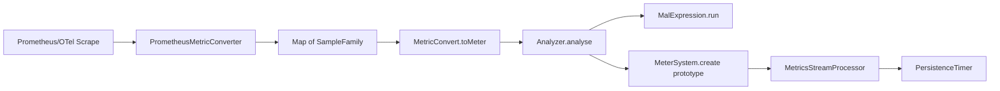

---

## 附录 L：TimeBucket 与查询时间窗

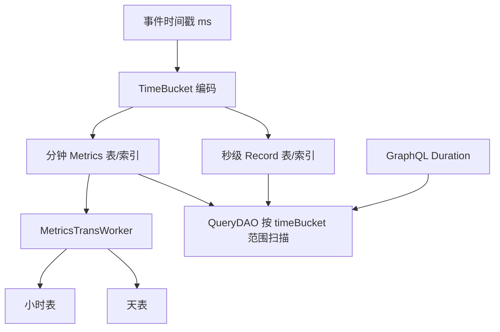

---

## 附录 I：OAL 编译与运行时注册时序

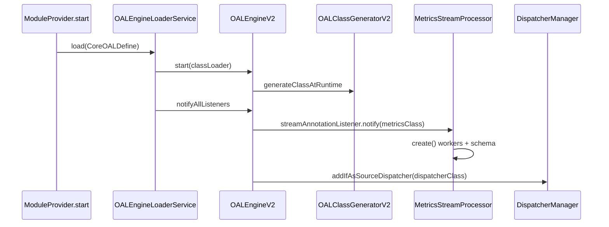

---

## 附录 J：告警双路径协作

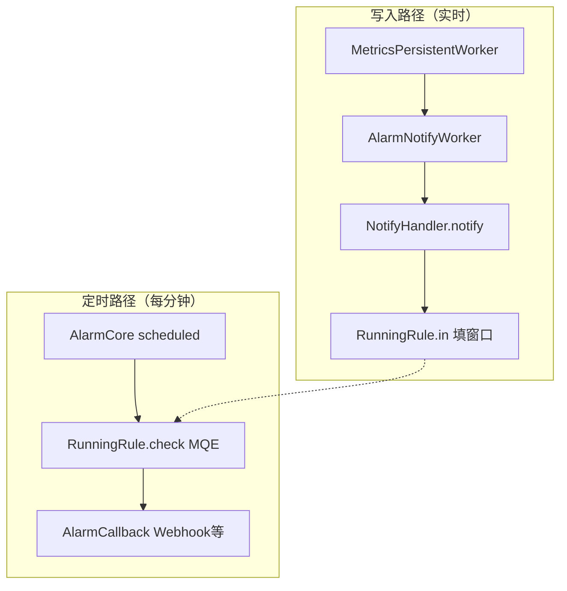

---

## 附录 G：多协议 Trace 汇入总览

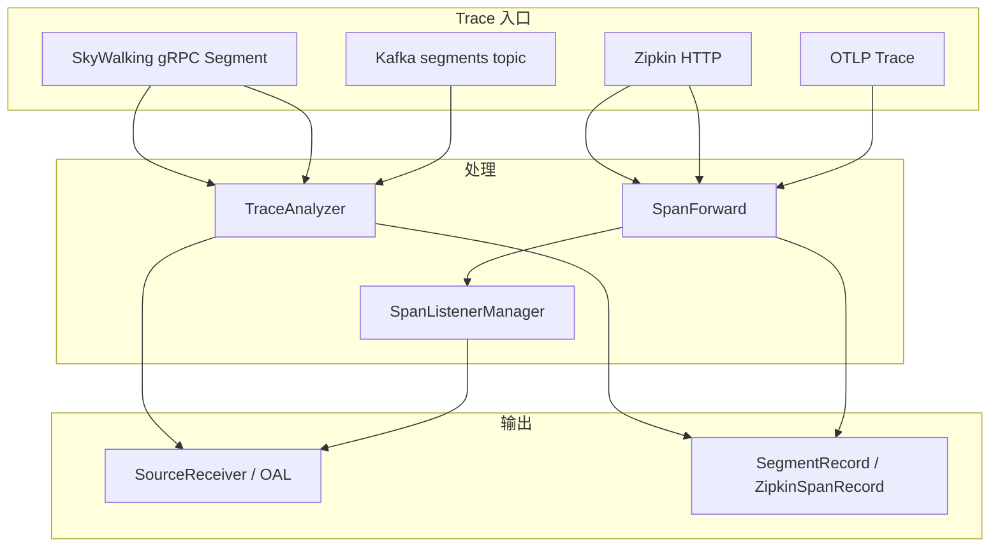

---

## 附录 H：GraphQL 读路径分层

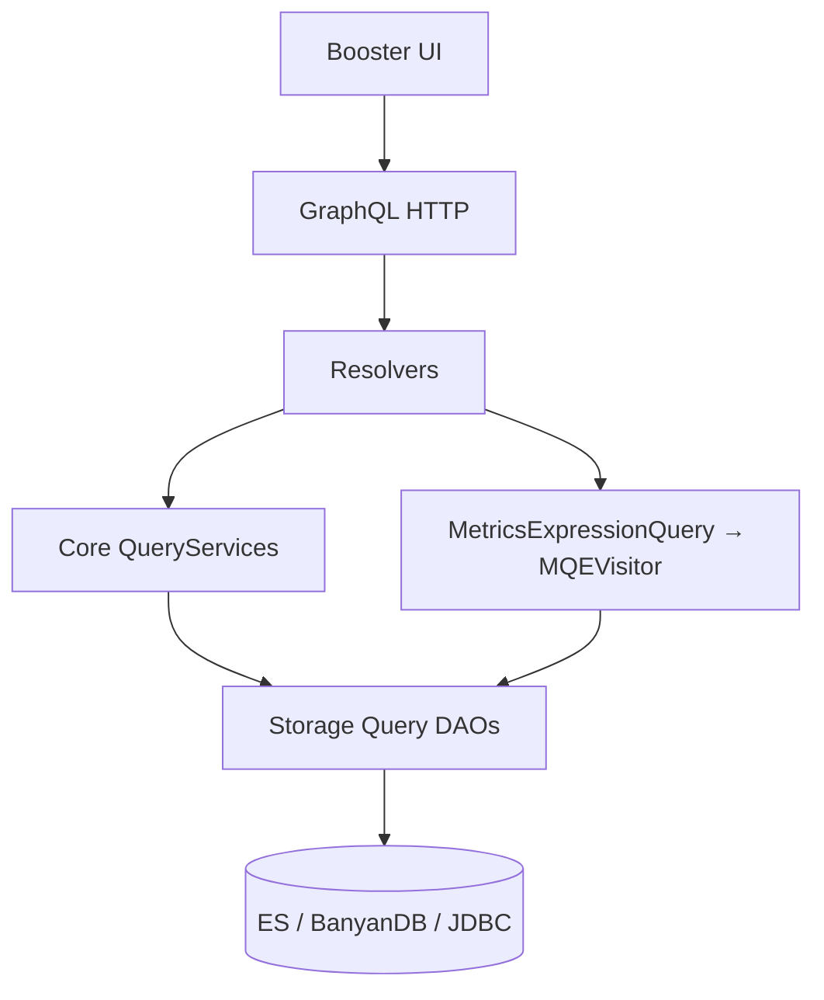

---

## 附录 D：Runtime Rule Structural 变更时序

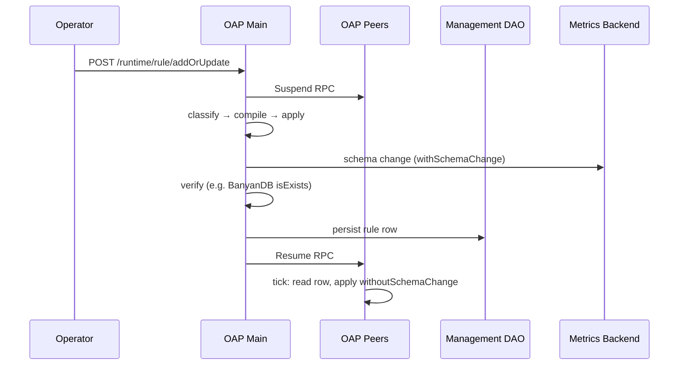

---

## 附录 E：日志 + 指标双 DSL 数据流

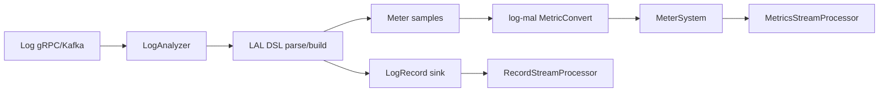

---

## 附录 F：存储插件对比简表

| 维度 | Elasticsearch | BanyanDB | JDBC |
|------|---------------|----------|------|
| 典型场景 | 成熟、生态广 | SkyWalking 原生、观测优化 | 小规模/演示 |
| Schema | Index template | Measure/Stream + revision fence | 同步 DDL |
| 批量写 | Bulk API | BanyanDBBatchDAO | Batch INSERT |
| Trace 优化 | 索引分离 | TraceGroup 原生 | 通用表 |
| 热更新 verify | 索引存在性检查 | describe + diff | 表存在性 |

---

## 附录 A：Trace 全链路时序图

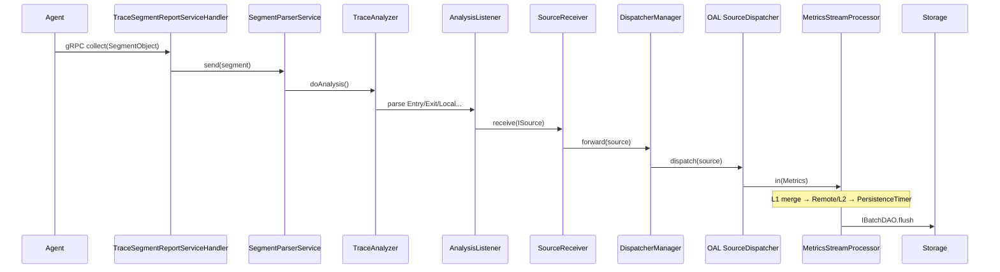

---

## 附录 B：Metrics Worker 链（单节点 Mixed 模式）

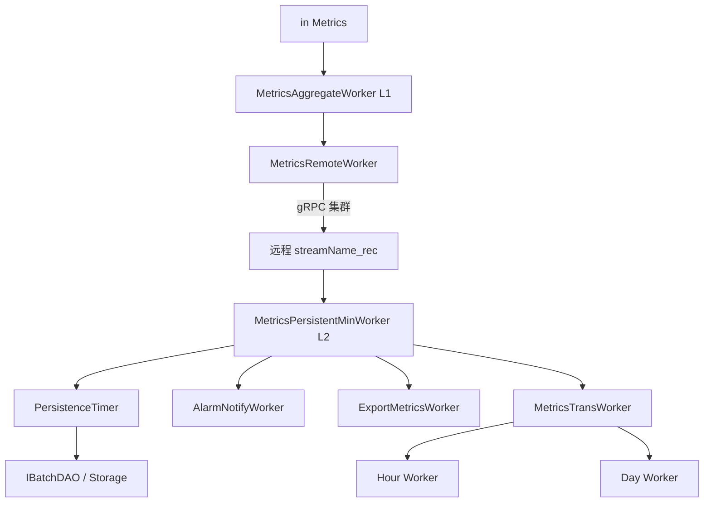

---

## 附录 C：与官方文档的关系

- 概念与设计：`docs/en/concepts-and-designs/`
- 安装配置：`docs/en/setup/`
- 贡献与构建：`docs/en/guides/`
- AI 辅助开发说明：仓库根目录 `CLAUDE.md`

本文档侧重 **OAP 源码实现路径**；Agent、UI、BanyanDB 独立仓库的细节可结合各子项目文档继续深入。

---

*文档生成说明：内容来源于仓库 Java 源码、oal-rt/CLAUDE.md、log-analyzer/CLAUDE.md 及 docs/en 设计文档的交叉阅读，力求与实现一致；若版本升级导致类路径变更，请以实际源码为准。*

*修订：第二版扩展第 15–25 章及附录 D–F；第三版扩展第 26–34 章及附录 G–H；第四版扩展第 35–43 章及附录 I–J；第五版扩展第 44–51 章及附录 K–L（TimeBucket、MAL/MQE、拓扑、JDBC、BatchQueue、gRPC、测试体系）。*
