# Apache SkyWalking 源码架构深度分析

> 本文基于 Apache SkyWalking 仓库源码与官方设计文档整理，面向需要理解 OAP 内核、数据流与扩展机制的开发者。分析版本以当前仓库 `oap-server` 结构为准。

---

## 目录

1. [项目定位与总体架构](#1-项目定位与总体架构)
2. [仓库结构与模块地图](#2-仓库结构与模块地图)
3. [OAP 启动与模块系统](#3-oap-启动与模块系统)
4. [端到端数据工作流](#4-端到端数据工作流)
5. [可观测性分析语言体系（OAL / MAL / LAL / MQE）](#5-可观测性分析语言体系oal--mal--lal--mqe)
6. [流式处理内核（Worker Pipeline）](#6-流式处理内核worker-pipeline)
7. [Trace 分析链路源码剖析](#7-trace-分析链路源码剖析)
8. [集群、远程路由与角色分离](#8-集群远程路由与角色分离)
9. [存储插件与数据模型](#9-存储插件与数据模型)
10. [查询层与 UI](#10-查询层与-ui)
11. [告警、导出与其它横切能力](#11-告警导出与其它横切能力)
12. [设计亮点与技术亮点](#12-设计亮点与技术亮点)
13. [扩展开发指南（源码视角）](#13-扩展开发指南源码视角)
14. [关键源码索引](#14-关键源码索引)
15. [采集协议与 Agent 数据模型](#15-采集协议与-agent-数据模型)
16. [Trace 分析监听器体系](#16-trace-分析监听器体系)
17. [ID 编码与元数据缓存](#17-id-编码与元数据缓存)
18. [日志分析（LAL）与 log-mal 管道](#18-日志分析lal与-log-mal-管道)
19. [MeterSystem 与 MAL 动态指标生成](#19-metersystem-与-mal-动态指标生成)
20. [Runtime Rule 热更新（集群一致性）](#20-runtime-rule-热更新集群一致性)
21. [BanyanDB 存储实现要点](#21-banyandb-存储实现要点)
22. [服务层级（Service Hierarchy）](#22-服务层级service-hierarchy)
23. [TopN、Kafka Fetcher 与其它数据通路](#23-topnkafka-fetcher-与其它数据通路)
24. [Profiling 与 AI Pipeline](#24-profiling-与-ai-pipeline)
25. [动态配置、Admin 服务与背压](#25-动态配置admin-服务与背压)
26. [Zipkin、OTel Trace 与 SpanListener 扩展](#26-zipkinotel-trace-与-spanlistener-扩展)
27. [GraphQL 与 MQE 查询运行时](#27-graphql-与-mqe-查询运行时)
28. [Elasticsearch 存储深度剖析](#28-elasticsearch-存储深度剖析)
29. [Scope 体系与 OAL 脚本地图](#29-scope-体系与-oal-脚本地图)
30. [Service Mesh 遥测内核](#30-service-mesh-遥测内核)
31. [集群协调、TTL 与历史删除](#31-集群协调ttl-与历史删除)
32. [Exporter、TraceQL 与辅助查询插件](#32-exportertraceql-与辅助查询插件)
33. [UI、发行版与跨进程链路机制](#33-ui发行版与跨进程链路机制)
34. [Metrics Session Cache 与 JDBC 存储](#34-metrics-session-cache-与-jdbc-存储)
35. [OALEngineV2 编译与代码生成详解](#35-oalenginev2-编译与代码生成详解)
36. [告警系统全链路源码剖析](#36-告警系统全链路源码剖析)
37. [ModelRegistry、StorageModels 与 AnnotationScan](#37-modelregistrystoragemodels-与-annotationscan)
38. [Event、Browser、Management 等 Receiver 纵览](#38-eventbrowsermanagement-等-receiver-纵览)
39. [eBPF 与 Cilium Fetcher](#39-ebpf-与-cilium-fetcher)
40. [Agent 配置发现与下行 Commands](#40-agent-配置发现与下行-commands)
41. [OAL 指标类型族与 merge 语义](#41-oal-指标类型族与-merge-语义)
42. [灵活 Trace 查询、SpanAttachedEvent 与 Booster UI](#42-灵活-trace-查询spanattachedevent-与-booster-ui)
43. [server-tools、发行版与性能调优要点](#43-server-tools发行版与性能调优要点)
44. [TimeBucket、DownSampling 与多精度指标](#44-timebucketdownsampling-与多精度指标)
45. [MAL 编译运行时与 MetricConvert](#45-mal-编译运行时与-metricconvert)
46. [MQE 算子体系与查询调试](#46-mqe-算子体系与查询调试)
47. [拓扑查询、Metadata 与 Aggregation](#47-拓扑查询metadata-与-aggregation)
48. [JDBC 表建模与分表策略](#48-jdbc-表建模与分表策略)
49. [BatchQueue 队列基础设施](#49-batchqueue-队列基础设施)
50. [gRPC/HTTP Server 与多端口模型](#50-grpchttp-server-与多端口模型)
51. [测试体系（server-testing / dsl-scripts-test）](#51-测试体系server-testing--dsl-scripts-test)
52. [PromQL 查询插件深度剖析](#52-promql-查询插件深度剖析)
53. [Remote 集群协议与 StreamData 序列化](#53-remote-集群协议与-streamdata-序列化)
54. [Record / NoneStream / TopN 数据模型全集](#54-record--nonestream--topn-数据模型全集)
55. [StorageBuilder、ValueColumnMetadata 与 SuperDataset](#55-storagebuildervaluecolumnmetadata-与-superdataset)
56. [BanyanDB TraceGroup 与索引注解体系](#56-banyandb-tracegroup-与索引注解体系)
57. [Layer 扩展注册与 RuleSetMerger](#57-layer-扩展注册与-rulesetmerger)
58. [Management Receiver 与元数据 Source 链路](#58-management-receiver-与元数据-source-链路)
59. [WorkerInstancesService 与远程 Worker 注册](#59-workerinstancesservice-与远程-worker-注册)
60. [Browser Receiver：OAL 与 Listener 双管道](#60-browser-receiveroal-与-listener-双管道)
61. [Configuration Discovery 与动态配置同步](#61-configuration-discovery-与动态配置同步)
62. [CommandService 与下行 Command 类型](#62-commandservice-与下行-command-类型)
63. [NamingControl、IDManager 与 Source 分发扫描](#63-namingcontrolidmanager-与-source-分发扫描)
64. [RecordStreamProcessor 持久化链](#64-recordstreamprocessor-持久化链)
65. [Watermark 背压与 gRPC 熔断](#65-watermark-背压与-grpc-熔断)
66. [文档阅读路径索引](#66-文档阅读路径索引)
67. [Kafka Fetcher 消费模型与 Topic 约定](#67-kafka-fetcher-消费模型与-topic-约定)
68. [Exporter 指标/Trace/Log 导出全链路](#68-exporter-指标tracelog-导出全链路)
69. [Telemetry 自监控（OAP So11y）](#69-telemetry-自监控oap-so11y)
70. [AI Pipeline 与外部 AI 服务集成](#70-ai-pipeline-与外部-ai-服务集成)
71. [PersistenceTimer 两阶段批量刷盘](#71-persistencetimer-两阶段批量刷盘)
72. [OAP Role 与集群节点注册](#72-oap-role-与集群节点注册)
73. [Configuration API 与 ConfigChangeWatcher](#73-configuration-api-与-configchangewatcher)
74. [RunningRule、AlarmMQE 与实时告警窗口](#74-runningrulealarmmqe-与实时告警窗口)
75. [AlarmKernel 与指标语义变更时的状态重置](#75-alarmkernel-与指标语义变更时的状态重置)
76. [Meter Receiver 与原生 Meter 协议](#76-meter-receiver-与原生-meter-协议)
77. [OTel Metric Receiver 与 MAL 转换注册表](#77-otel-metric-receiver-与-mal-转换注册表)
78. [init / no-init 启动模式与 Schema 生命周期](#78-init--no-init-启动模式与-schema-生命周期)
79. [Storage 写 DAO 与 Query DAO 分层](#79-storage-写-dao-与-query-dao-分层)
80. [Core QueryService 族与存储查询接口映射](#80-core-queryservice-族与存储查询接口映射)
81. [NotifyHandler 与 MetaInAlarm 实体构造](#81-notifyhandler-与-metainalarm-实体构造)
82. [AlarmCore 定时评估与 Webhook 回调](#82-alarmcore-定时评估与-webhook-回调)
83. [LogQL 插件（Loki 兼容日志查询）](#83-logql-插件loki-兼容日志查询)
84. [ClusterCoordinator 与 RemoteClientManager](#84-clustercoordinator-与-remoteclientmanager)
85. [Telegraf Receiver 与 MAL 规则加载](#85-telegraf-receiver-与-mal-规则加载)
86. [Zabbix Receiver 与 TRAP 协议](#86-zabbix-receiver-与-trap-协议)
87. [Sharing Server 共享 gRPC/HTTP 端口](#87-sharing-server-共享-grpchttp-端口)
88. [Event Receiver 与 Event Analyzer](#88-event-receiver-与-event-analyzer)
89. [Zipkin Receiver 与 SpanForward 管道](#89-zipkin-receiver-与-spanforward-管道)
90. [Envoy ALS、Metric Service 与 Service Mesh](#90-envoy-alsmetric-service-与-service-mesh)
91. [TraceQueryService 与 Trace 存储查询](#91-tracequeryservice-与-trace-存储查询)
92. [alarm-settings.yml 规则字段说明](#92-alarm-settingsyml-规则字段说明)
93. [MetricsTransWorker 与多精度降采样](#93-metricstransworker-与多精度降采样)
94. [ZipkinSpanRecord 与 Zipkin 查询模型](#94-zipkinspanrecord-与-zipkin-查询模型)
95. [BootstrapFlow 与 ModuleManager 启动编排](#95-bootstrapflow-与-modulemanager-启动编排)
96. [application.yml 模块拓扑与 selector 机制](#96-applicationyml-模块拓扑与-selector-机制)
97. [NetworkAddressAlias 跨进程寻址](#97-networkaddressalias-跨进程寻址)
98. [JVM Receiver 与 JVMSourceDispatcher](#98-jvm-receiver-与-jvmsourcedispatcher)
99. [Log Receiver 与 ILogAnalyzerService](#99-log-receiver-与-iloganalyzerservice)
100. [ModuleDefine.prepare 与 Provider SPI 选型](#100-moduledefineprepare-与-provider-spi-选型)
101. [CLR Receiver 与 .NET 运行时指标](#101-clr-receiver-与-net-运行时指标)
102. [Profile Receiver 与链路剖析数据](#102-profile-receiver-与链路剖析数据)
103. [GenAI Analyzer 与 SpanListener 扩展](#103-genai-analyzer-与-spanlistener-扩展)
104. [HierarchyService 实现深化](#104-hierarchyservice-实现深化)
105. [OAP 典型模块依赖图](#105-oap-典型模块依赖图)
106. [SpanListenerManager 与 Trace 扩展点](#106-spanlistenermanager-与-trace-扩展点)
107. [Async Profiler Receiver 与 JFR 解析](#107-async-profiler-receiver-与-jfr-解析)
108. [eBPF Receiver 四通道与剖析下发](#108-ebpf-receiver-四通道与剖析下发)
109. [Runtime Rule REST 与 Admin 集群收敛](#109-runtime-rule-rest-与-admin-集群收敛)
110. [Configuration Discovery 实现细节](#110-configuration-discovery-实现细节)
111. [Admin Server 与运维侧模块](#111-admin-server-与运维侧模块)
112. [application.yml 全模块功能索引](#112-applicationyml-全模块功能索引)
113. [Pprof Receiver 与 Go 剖析任务](#113-pprof-receiver-与-go-剖析任务)
114. [AWS Firehose Receiver 与 OTel 指标汇入](#114-aws-firehose-receiver-与-otel-指标汇入)
115. [dsl-debugging 在线调试会话](#115-dsl-debugging-在线调试会话)
116. [StorageManipulationOpt 四种模式详解](#116-storagemanipulationopt-四种模式详解)
117. [BanyanDB SchemaWatcher 与 DDL Fence](#117-banyandb-schemawatcher-与-ddl-fence)
118. [GraphQL Resolver 与 query-protocol 映射](#118-graphql-resolver-与-query-protocol-映射)

---

## 1. 项目定位与总体架构

### 1.1 是什么

Apache SkyWalking 是面向**微服务、云原生、Service Mesh、容器**场景的 APM 与可观测性平台，覆盖：

| 能力 | 说明 |
|------|------|
| **Tracing** | 原生 Segment 协议、Zipkin v1/v2 |
| **Metrics** | OAL 派生指标、Meter/MAL、OTel、Prometheus、Telegraf、Zabbix 等 |
| **Logging** | 磁盘/网络日志，与 Trace 上下文关联 |
| **Profiling** | Java Agent 行级剖析、eBPF、Async Profiler、Pprof 等 |
| **Event** | 版本升级、配置变更等系统事件，与指标/链路关联分析 |

逻辑上分为四层（见 `docs/en/concepts-and-designs/overview.md`）：

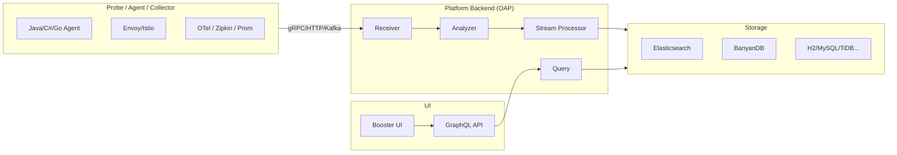

### 1.2 核心实体模型

SkyWalking 用统一层次描述监控对象（`overview.md`）：

- **Layer**：抽象框架层（如 `OS_LINUX`、`K8S`、`MESH`）
- **Service**：一组提供相同行为的工作负载
- **Service Instance**：Service 中的单个实例（K8s Pod、或 Agent 视角的一个 OS 进程）
- **Endpoint**：服务对外入口路径（HTTP URI、gRPC 方法签名等）
- **Process**：操作系统进程（Pod 内可有多个 Process）

拓扑、服务层级（Service Hierarchy）、API 依赖等都在此模型上构建。

### 1.3 设计哲学（Project Goals 延伸）

- **默认不引入 MQ**：数据在 OAP 集群内通过 gRPC 流式转发完成二级聚合，降低运维复杂度（FAQ 有专门说明）。
- **分析逻辑可配置**：OAL/MAL/LAL 脚本 + 运行时热更新（runtime-rule 模块）。
- **存储可插拔**：同一套 `Model`/`StorageDAO` 抽象对接多种后端。
- **多协议统一入口**：Receiver 插件化，分析层尽量归一到 `Source` + `Dispatcher`。

---

## 2. 仓库结构与模块地图

```
skywalking/
├── apm-protocol/          # gRPC/Protobuf 采集协议（子模块 skywalking-data-collect-protocol）
├── oap-server/            # OAP 后端（本文重点）
│   ├── server-starter/    # 入口、application.yml
│   ├── server-core/       # 内核：流处理、Source、Remote、Query Service
│   ├── server-library/    # 模块系统、BatchQueue、gRPC/HTTP Server
│   ├── server-receiver-plugin/  # 各类数据接入
│   ├── server-storage-plugin/   # ES、BanyanDB、JDBC...
│   ├── server-cluster-plugin/   # ZK、K8s、etcd、Nacos、Consul
│   ├── server-query-plugin/     # GraphQL、PromQL
│   ├── server-alarm-plugin/     # 告警
│   ├── analyzer/            # Trace/Log/Zipkin 等分析器
│   ├── oal-grammar/ + oal-rt/   # OAL 语法与字节码生成
│   ├── mqe-grammar/ + mqe-rt/   # 指标查询与告警表达式
│   └── server-configuration/    # 动态配置（Apollo、ZK、etcd...）
├── skywalking-ui/         # Web UI（子模块 booster-ui）
├── apm-webapp/            # UI 打包
├── apm-dist/              # 发行版
├── docs/                  # 文档
└── test/                  # E2E
```

**OAP 内部模块数量**：通过 Java SPI 注册的 `ModuleDefine` 约 40+ 个（receiver、storage、cluster、analyzer、alarm 等），在 `application.yml` 中按 `moduleName.selector: providerName` 启用。

---

## 3. OAP 启动与模块系统

### 3.1 启动入口

主类：`OAPServerStartUp.main` → `OAPServerBootstrap.start()`。

```java
// OAPServerBootstrap.java（简化流程）
RunningMode.setMode(System.getProperty("mode"));  // init / normal
ApplicationConfiguration config = configLoader.load();  // application.yml + default + env
manager.init(applicationConfiguration);
ServerStatusService.bootedNow(...);
if (RunningMode.isInitMode()) System.exit(0);
```

配置加载策略（`ApplicationConfigLoader`）：

1. 读取 `application.yml`
2. 与 `application-default.yml` 合并缺省项
3. 用 `moduleName.providerName.settingKey` 形式的系统属性/环境变量覆盖

### 3.2 ModuleManager 三阶段

`ModuleManager` 是 OAP 的**微内核**，类似 OSGi 的精简版：

| 阶段 | 行为 |
|------|------|
| **prepare** | `ServiceLoader` 加载所有 `ModuleDefine` / `ModuleProvider`；按 yml 选择 provider；注入配置 |
| **start** | `BootstrapFlow` 按 `requiredModules()` 拓扑排序后依次 `provider.start()` |
| **notifyAfterCompleted** | 全部模块启动后的回调 |

拓扑排序实现见 `BootstrapFlow.makeSequence()`：反复将“依赖已满足”的 provider 加入 `startupSequence`，若一轮无进展则抛出 `CycleDependencyException`。

### 3.3 ModuleDefine / ModuleProvider / Service

- **ModuleDefine**：声明模块名、`services()` 接口列表
- **ModuleProvider**：具体实现（如 `storage` 模块下 `elasticsearch` / `banyandb`）
- **Service**：模块对外能力，其它模块通过 `moduleManager.find(X.NAME).provider().getService(Y.class)` 获取

注册方式：`META-INF/services/org.apache.skywalking.oap.server.library.module.ModuleDefine`（及 `ModuleProvider`）。

**设计意义**：Receiver、Storage、Cluster 可独立演进；同一 Service 接口可有多种 Provider；启动顺序由显式依赖保证，避免隐式静态初始化顺序问题。

### 3.4 CoreModuleProvider 职责概览

`CoreModuleProvider` 是默认核心实现，集中初始化：

- gRPC / HTTP Server 与 Handler 注册表
- `SourceReceiverImpl`、`DispatcherManager`
- OAL 引擎加载、`AnnotationScan`（`@Stream` 模型注册）
- `MetricsStreamProcessor` / `RecordStreamProcessor` 等流处理器
- `PersistenceTimer`、`DataTTLKeeperTimer`
- `RemoteClientManager`、`RemoteSenderService`
- 大量 `*QueryService`（供 GraphQL 层调用）
- 缓存（`NetworkAddressAliasCache`、`ProfileTaskCache` 等）

---

## 4. 端到端数据工作流

### 4.1 Trace（SkyWalking 原生 Segment）

```
Agent --gRPC--> TraceSegmentReportServiceHandler
              --> ISegmentParserService.send(segment)
              --> TraceAnalyzer.doAnalysis()
                    --> 多种 AnalysisListener（Entry/Exit/Local/First/Segment）
                    --> listener.build() 产生 ISource
              --> SourceReceiver.receive(source)
              --> DispatcherManager.forward(source)
                    --> OAL 生成的 SourceDispatcher（按 scope 分发）
                    --> 手动 Dispatcher（如 SegmentDispatcher -> Record）
              --> StreamProcessor.in(Metrics|Record|TopN...)
              --> L1 聚合 -> L2 持久化缓冲 -> PersistenceTimer 批量写存储
```

### 4.2 Metrics（OAL 路径）

OAL 脚本编译 → 生成 `Metrics` 子类 + `SourceDispatcher` + `StorageBuilder`  
分析器产出 `Service`/`Endpoint` 等 **Source** → Dispatcher 调用 `MetricsStreamProcessor.in()` → Worker 链 → 存储。

### 4.3 Metrics（MAL / Meter 路径）

外部指标（Prometheus、OTel、SkyWalking Meter API）→ Receiver/Fetcher → `MeterSystem` 执行 MAL → 同样进入 `MetricsStreamProcessor`（`MetricStreamKind.MAL`，缓冲区配置与 OAL 不同）。

### 4.4 Log（LAL 路径）

日志进入 Log Analyzer → LAL 脚本格式化/打标 → 可产出 Meter 或 Record → MAL/OAL 后续链路。

### 4.5 查询路径

UI / API → GraphQL Resolver → `core.query.*QueryService` → `StorageDAO` / `IMetricsDAO` → 后端存储。

---

## 5. 可观测性分析语言体系（OAL / MAL / LAL / MQE）

### 5.1 OAL（Observability Analysis Language）

**用途**：对流式 **Trace** 与 **Service Mesh Access Log** 做指标聚合（Service / Instance / Endpoint 维度）。拓扑/依赖由内核 Listener 自动构建，不必写 OAL。

**语法要点**（`docs/en/concepts-and-designs/oal.md`）：

```
METRICS_NAME = from(SCOPE.field[, field...])
  [.filter(...)]
  .FUNCTION([params...])
```

**编译流水线**（`oap-rt`，`OALEngineV2`）：

```
.oal 文件
  → ANTLR 解析 → MetricDefinition（不可变模型）
  → MetricDefinitionEnricher（反射补全 Source 列、持久化字段）
  → OALClassGeneratorV2（Javassist + FreeMarker）
  → 运行时加载 Metrics / Dispatcher / StorageBuilder 类
```

**运行时集成**（`OALEngineLoaderService`）：

```java
engine.setStreamListener(new StreamAnnotationListener(moduleManager));
engine.setDispatcherListener(sourceReceiver.getDispatcherDetectorListener());
engine.start(classLoader);
engine.notifyAllListeners();  // 注册 @Stream 与 Dispatcher
```

生成类实现 `SourceDispatcher`：在 `dispatch(source)` 内完成过滤、聚合函数调用，最终 `MetricsStreamProcessor.getInstance().in(metrics)`。

**底层技术点**：

- 使用 **Javassist** 动态生成字节码，避免为每条 OAL 规则手写 Java
- `remoteHashCode()` 与集群 **HashCodeSelector** 配合，保证同一实体指标落到同一 OAP 节点做 L2 聚合
- 支持 `disable(METRICS_NAME)`、DSL 调试注入（`GateHolder` / `OALDebug`）

### 5.2 MAL（Meter Analysis Language）

**用途**：处理**已是统计量**的 Meter 数据（Prometheus、OTel、原生 Meter 等）。

核心概念：

- **Sample family**：同名指标的一组带标签样本
- **Scalar**：标量运算中间结果
- 算子：`tagEqual`、`valueGreater`、`avg`、`histogram` 等（见 `mal.md`）

实现入口：`MeterSystem`（`server-core`），与 `MetricsStreamProcessor.create(..., MetricStreamKind.MAL)` 绑定；支持 runtime-rule 热更新与 schema 操作选项（`StorageManipulationOpt`）。

### 5.3 LAL（Log Analysis Language）

**用途**：日志解析、字段提取、标签化，并可向 MAL 输送指标。由 `LogAnalyzerModule` 与 receiver 协同，规则位于 `server-starter/src/main/resources/lal/`。

### 5.4 MQE（Metrics Query Engine）

**用途**：

1. UI / API **指标查询**（替代部分 GraphQL 直连存储的复杂查询）
2. **告警规则表达式**（`AlarmRule.setExpression` 用 MQE 解析校验）

告警执行时 `AlarmMQEVisitor` 访问存储中的指标时间序列，结合 `RunningRule` 状态机（NORMAL / FIRING / SILENCED / RECOVERED）。

---

## 6. 流式处理内核（Worker Pipeline）

### 6.1 Stream 注解与 Processor 类型

带 `@Stream` 的类在启动时由 `StreamAnnotationListener` 注册：

| Processor | 数据类型 | 典型用途 |
|-----------|----------|----------|
| `MetricsStreamProcessor` | `Metrics` | OAL/MAL 指标 |
| `RecordStreamProcessor` | `Record` | Segment、Log、Zipkin Span 等明细 |
| `TopNStreamProcessor` | TopN | 慢 SQL、热点端点等 |
| `ManagementStreamProcessor` | 管理类数据 | UI 模板等 |
| `NoneStreamProcessor` | 无流式计算 | 仅注册模型 |

`DisableRegister` 可按名称禁用某些流，用于裁剪功能或解决冲突。

### 6.2 Metrics 三级流水线（源码核心）

`MetricsStreamProcessor.create()` 为每个 Metrics 类建立：

```
MetricsAggregateWorker (L1)
    ↓ 内存合并相同 entity + timeBucket + 指标类型
MetricsRemoteWorker
    ↓ 集群模式下 gRPC 发往 hash 选中的节点
远程节点: {streamName}_rec → MetricsPersistentMinWorker (L2)
    ↓ 定时 flush 到 IBatchDAO
PersistenceTimer (全局)
    ↓ prepare + execute 批量写入
Storage (ES / BanyanDB / JDBC...)
```

并行存在 **DownSampling** 分支：

- `MetricsTransWorker` 将分钟级聚合到 Hour / Day（受 `DownSamplingConfigService` 控制）
- 各级对应独立的 `MetricsPersistentWorker` 与 TTL

**L1 聚合细节**（`MetricsAggregateWorker`）：

- 共享名为 `METRICS_L1_AGGREGATION` 的 `BatchQueue`
- `PartitionPolicy.adaptive()` + `typeHash()` 分区，保证同类 Metrics 单线程 merge
- `MergableBufferedData` 合并 payload，降低内存与网络开销
- OAL 与 MAL 使用不同的 `l1FlushPeriod` 与队列参数（MAL 流量模型不同）

**持久化定时器**（`PersistenceTimer`）：

- 单线程调度，默认每 `persistentPeriod` 秒触发
- 收集所有 `MetricsPersistentWorker` + `TopNStreamProcessor` 的 worker
- 多线程 `prepare` + `IBatchDAO.flush` 批量写
- 自带 Telemetry  histogram（prepare/execute/all latency）

### 6.3 Record 流

`RecordStreamProcessor.in()`：

- TTL 检查：过期 Record 直接丢弃（测试环境可通过 `TESTING_TTL` 绕过）
- 一对一 `RecordPersistentWorker`
- 可挂 `ExportRecordWorker` 导出 Segment/Log 到外部系统

### 6.4 运行时规则热更新

`server-admin/runtime-rule` 模块支持 MAL/OAL 规则的增删改：

- `MetricsStreamProcessor.removeMetric()` 有严格顺序：先摘 L1 entry → drain L1 → flush L2 → 移除 persistent workers
- `ConcurrentHashMap` entryWorkers + `CopyOnWriteArrayList` persistentWorkers 兼顾热路径读与规则变更安全
- Schema 变更通过 `StorageManipulationOpt` 区分 boot / peer / main-node 行为
- Shape mismatch 时**拒绝注册 worker**，避免写入与查询 schema 不一致（见 `create()` 中 `opt.hasShapeMismatch()` 分支）

---

## 7. Trace 分析链路源码剖析

### 7.1 接收入口

`TraceSegmentReportServiceHandler`（gRPC）：

- `collect`：流式 `StreamObserver<SegmentObject>`
- `collectInSync`：批量 SegmentCollection
- 均委托 `ISegmentParserService.send(segment)`
- 记录 `trace_in_latency`、`trace_analysis_error_count` 指标

### 7.2 SegmentParserService

```java
// SegmentParserServiceImpl.send()
TraceAnalyzer traceAnalyzer = new TraceAnalyzer(moduleManager, listenerManager, config);
traceAnalyzer.doAnalysis(segment);
```

每次 `send` 新建 `TraceAnalyzer`（轻量对象），监听器由 `SegmentParserListenerManager` 管理工厂列表。

### 7.3 TraceAnalyzer 监听器模型

`doAnalysis()` 顺序：

1. `createSpanListeners()` — 从 SPI/配置加载的 `SpanListenerFactory` 创建监听器链
2. `notifySegmentListener` — Segment 级处理
3. 遍历 Span，按 `SpanType` 分发：
   - **Exit**：客户端出站调用
   - **Entry**：服务端入站
   - **Local**：进程内调用
   - **First**（spanId==0）：根 Span
4. `notifyListenerToBuild()` — 所有 `AnalysisListener.build()` 产出数据

该模型将 **拓扑分析、Endpoint 统计、慢追踪、采样** 等解耦为独立 Listener，符合开闭原则；新增分析能力只需新增 Listener 模块而非修改 `TraceAnalyzer` 核心循环。

### 7.4 到 Source 与 OAL

Listener `build()` 后调用 `SourceReceiver.receive(ISource)`：

```java
// SourceReceiverImpl
public void receive(ISource source) {
    dispatcherManager.forward(source);
}
```

`DispatcherManager`：

- 启动时 `scan()`  classpath 扫描 `SourceDispatcher` 实现
- OAL 生成的 Dispatcher 按 `source.scope()` 注册到 `dispatcherMap`
- `forward()` 前调用 `source.prepare()`，再依次 `dispatcher.dispatch(source)`

**Segment 持久化**（不经过 OAL 时）：`SegmentDispatcher` 构造 `SegmentRecord` → `RecordStreamProcessor.in()`。

### 7.5 Zipkin / Mesh 等并行路径

- **Zipkin**：独立 Dispatcher（`ZipkinServiceDispatcher` 等）写入 Record/Metrics
- **Mesh (Envoy ALS)**：转换为与 Trace 类似的 Source，走 OAL Service/Relation 作用域

---

## 8. 集群、远程路由与角色分离

### 8.1 OAP 角色（application.yml `core.default.role`）

| 角色 | 能力 |
|------|------|
| **Mixed** | 接收 + L1 + L2（默认） |
| **Receiver** | 接收 + L1，远程转发 L2 |
| **Aggregator** | 主要做 L2 聚合 |

### 8.2 RemoteSenderService

跨节点发送 `StreamData`（序列化的 Metrics）：

- 从 `RemoteClientManager.getRemoteClient()` 获取客户端列表（每 10s 从 Cluster 模块刷新）
- **Selector**：
  - `HashCode`：按 `streamData.remoteHashCode()` 选节点（保证实体级聚合一致性）
  - `Rolling`：轮询
  - `ForeverFirst`：固定首节点

`GRPCRemoteClient.push()` 将数据放入 BatchQueue，批量经 gRPC `RemoteService` 发送；对端 `RemoteServiceHandler` 反序列化后根据 `nextWorkerName` 找到 `RemoteHandleWorker`，调用 `worker.in(streamData)`。

**对齐要求**：集群内 OAL/MAL 脚本必须一致，否则对端找不到 worker 会丢弃数据（日志明确提示）。

### 8.3 Cluster 插件

支持 standalone、ZooKeeper、Kubernetes、etcd、Consul、Nacos 等。`RemoteClientManager` **不**建议业务代码直接 `find(ClusterModule)`，应通过 `CoreModule` 的 `RemoteClientManager` 服务访问集群视图（项目规范 CLAUDE.md #14）。

---

## 9. 存储插件与数据模型

### 9.1 抽象层次

- **Model**：逻辑表/流定义（scopeId、downsampling、columns）
- **ModelRegistry**：启动或 runtime-rule 时 `add()` 注册模型，触发存储插件建表/建 Measure
- **StorageBuilder**：Metrics/Record 与存储行格式转换
- **StorageDAO / IMetricsDAO / IRecordDAO**：读写 API
- **IBatchDAO**：批量 prepare/execute（PersistenceTimer 使用）

### 9.2 多存储实现

`server-storage-plugin` 下常见实现：

- **Elasticsearch**
- **BanyanDB**（SkyWalking 自研时序/观测数据库，gRPC + schema watcher）
- **JDBC**（H2、MySQL、TiDB 等）

注解驱动列映射：`@Column`、`@ElasticSearch`、`@BanyanDB` 等，OAL 代码生成时会复制到生成的 Metrics 类。

### 9.3 BanyanDB Schema 屏障（重要实现细节）

对 BanyanDB，DDL 后需通过 `SchemaWatcher.awaitRevisionApplied(modRevision, timeout)` 等待数据节点同步，**不应**再使用旧的“轮询直到能读到”方式（见项目规范 #16）。删除时 `mod_revision == 0` 则 `awaitSchemaDeleted`。

### 9.4 TTL

`DataTTLKeeperTimer` 与各 `*PersistentWorker` 的 TTL 配置协同，按模型粒度清理过期数据；Record 在入口即有 TTL 过滤。

---

## 10. 查询层与 UI

### 10.1 GraphQL

`server-query-plugin/query-graphql-plugin`：

- Resolver 注入 `CoreModule` 的 `TraceQueryService`、`MetricsQueryService`、`TopologyQueryService` 等
- 协议定义在 query-protocol 子模块
- `TraceQueryService` 从 `SegmentRecord` 反序列化 `SegmentObject`，组装 Span 树，并关联 `SpanAttachedEvent`

### 10.2 MQE 查询

复杂指标表达式在查询侧由 MQE Runtime 解析执行，与告警共用语法体系，减少 GraphQL 层硬编码。

### 10.3 UI

`skywalking-ui` 为独立子模块（booster-ui），通过 `apm-webapp` 打包进发行版；模板、Dashboard 可由 `UITemplateManagementService` 管理。

### 10.4 PromQL

`promql-plugin` 提供 PromQL 兼容查询，便于与 Prometheus 生态集成。

---

## 11. 告警、导出与其它横切能力

### 11.1 告警内核

- 规则：`alarm-settings.yml` + 动态配置监听（`AlarmRulesWatcher`）
- 表达式：MQE，必须布尔且 SINGLE_VALUE
- 调度：`AlarmCore` 单线程定时，每分钟第 15 秒后执行，避免整分边界误报
- 状态机：FIRING / SILENCED / RECOVERED 等，支持 silence period、recovery observation
- 通知：Webhook、Slack 等通过 `AlarmCallback` 插件

指标数据由 `AlarmNotifyWorker` 挂在 Metrics 持久化链路上游触发检查上下文。

### 11.2 Exporter

`ExportMetricsWorker` / `ExportRecordWorker` 在流处理链末端将数据推到外部（Kafka、gRPC 等），需显式启用 Exporter 模块。

### 11.3 其它 Receiver 一览（SPI 模块）

| 模块 | 数据类型 |
|------|----------|
| skywalking-trace-receiver | Segment |
| skywalking-log-receiver | Log |
| skywalking-meter-receiver | Meter |
| envoy-metrics-receiver | Mesh metrics |
| otel-receiver | OTel metrics |
| zipkin-receiver | Zipkin |
| skywalking-ebpf-receiver | eBPF profiling |
| kafka-fetcher | 从 Kafka 拉取 |
| ... | Event、Browser、CLR、Telegraf、Zabbix 等 |

### 11.4 动态配置

`server-configuration` 支持 Apollo、Nacos、Zookeeper、etcd、Consul 等，通过 `DynamicConfigurationService` 推送变更到 Watchers（日志级别、Endpoint 分组、告警规则等）。

### 11.5 Watermark

`WatermarkGRPCInterceptor` / `WatermarkWatcher` 在过载时背压，保护 OAP 内存与处理线程。

---

## 12. 设计亮点与技术亮点

### 12.1 架构与设计亮点

1. **插件化模块系统 + 显式依赖排序**  
   启动顺序可预测，适合 40+ 模块的大型单体进程，比 Spring 全家桶更轻、边界更清晰。

2. **Source → Dispatcher → Stream 统一抽象**  
   Trace、Mesh、JVM、Browser 等不同数据最终都变为 `ISource`，由 OAL 或手写 Dispatcher 消费，扩展点稳定。

3. **编译型 DSL（OAL）而非解释执行**  
   运行时性能接近手写 Java；规则变更需编译加载，与 “配置即代码” 的安全模型一致。

4. **L1/L2 分层聚合 + 可选角色分离**  
   在无 Kafka 的前提下实现水平扩展；Hash 路由保证聚合正确性。

5. **一套 Metrics 管道兼容 OAL 高吞吐与 MAL 外部指标**  
   `MetricStreamKind` 区分资源配额与 flush 策略。

6. **存储模型与查询解耦**  
   `Model` + 注解列映射使同一套 Metrics 类可对接 ES/BanyanDB/JDBC。

7. **多语言可观测性统一实体模型**  
   Layer / Service Hierarchy 支撑 K8s + Mesh + 进程多层关联。

8. **运行时规则与 Schema 治理**  
   `StorageManipulationOpt`、shape mismatch 熔断、BanyanDB revision fence，避免“写进去了但查不出来”。

### 12.2 底层技术亮点

1. **Javassist 字节码生成 OAL**  
   避免生成大量源文件进仓库；支持 debug 导出 `.class` + `.java` sidecar（`SW_DYNAMIC_CLASS_ENGINE_DEBUG`）。

2. **BatchQueue 自适应分区 + 吞吐加权 Drain**  
   L1 聚合队列在多核下扩展，且按 Metrics 类型 hash 保证 merge 线程安全。

3. **CopyOnWrite + ConcurrentHashMap 支撑热更新**  
   读多写少的 worker 表在规则变更时仍安全。

4. **PersistenceTimer 两阶段批量 IO**  
   prepare 线程池与 execute 分离，Telemetry 可观测存储瓶颈。

5. **gRPC 双向流 + 批量 RemoteMessage**  
   集群间高效转发序列化 Metrics。

6. **ANTLR 多 DSL**  
   OAL、MAL、LAL、MQE 各自 grammar 模块，利于语法演进与测试。

7. **Listener 链式 Trace 分析**  
   类似 Servlet Filter，易扩展且核心循环稳定。

8. **MQE 统一查询与告警**  
   减少两套表达式语义漂移。

---

## 13. 扩展开发指南（源码视角）

### 13.1 新增 Receiver

1. 新建 `server-receiver-plugin/xxx` 模块  
2. 实现 `XxxModule` + `XxxModuleProvider`  
3. 在 `prepare()` 注册 gRPC/HTTP Handler 到 `GRPCHandlerRegister` / `HTTPHandlerRegister`  
4. SPI 注册 ModuleDefine/Provider  
5. `application.yml` 增加模块配置  
6. `requiredModules()` 声明依赖（通常 `core`、`analyzer`、`telemetry` 等）

### 13.2 新增 OAL 指标

1. 在 `server-starter/src/main/resources/oal/*.oal` 增加规则  
2. `mvn compile` 触发 OAL 编译（或完整 install）  
3. 确认 `Scope` 与 Source 字段存在（`scope-definitions.md`）  
4. 集群需同步脚本

### 13.3 新增 MAL 规则

1. 编辑 `otel-rules/` 或 `meter-analyzer-config/`  
2. 通过 `MeterSystem` 注册；注意 `MetricStreamKind.MAL` 的 schema opt

### 13.4 新增 Storage 插件

1. 实现 `StorageModuleProvider` 与各 DAO  
2. 实现 `StorageBuilderFactory`  
3. 处理 `ModelManipulator`、TTL、批量写入  
4. BanyanDB 需实现 schema 屏障逻辑

### 13.5 修改 CoreModule 服务契约

必须同步所有 `CoreModuleProvider` 实现，包括 `server-tools/profile-exporter` 的 `MockCoreModuleProvider`（规范 #11）。

### 13.6 常见陷阱（来自 CLAUDE.md）

- `moduleManager.find(X)` 必须在 provider 的 `requiredModules()` 声明 X  
- 不要用 ThreadLocal 传递路由意图，应扩展接口参数  
- 跨模块改动后建议全量 `mvnw clean install`，避免 stale jar  
- JDK 11 兼容：禁止 switch 表达式、`Stream.toList()`、文本块等

---

## 14. 关键源码索引

| 主题 | 路径 |
|------|------|
| 启动 | `oap-server/server-starter/.../OAPServerBootstrap.java` |
| 模块管理 | `oap-server/server-library/library-module/.../ModuleManager.java` |
| 核心启动 | `oap-server/server-core/.../CoreModuleProvider.java` |
| Trace 接收 | `oap-server/server-receiver-plugin/skywalking-trace-receiver-plugin/.../TraceSegmentReportServiceHandler.java` |
| Trace 分析 | `oap-server/analyzer/agent-analyzer/.../TraceAnalyzer.java` |
| Source 分发 | `oap-server/server-core/.../SourceReceiverImpl.java`, `DispatcherManager.java` |
| OAL 加载 | `oap-server/server-core/.../OALEngineLoaderService.java` |
| OAL 代码生成 | `oap-server/oal-rt/.../OALClassGeneratorV2.java` |
| Metrics 流 | `oap-server/server-core/.../MetricsStreamProcessor.java` |
| L1 聚合 | `oap-server/server-core/.../MetricsAggregateWorker.java` |
| 持久化定时 | `oap-server/server-core/.../PersistenceTimer.java` |
| 远程发送 | `oap-server/server-core/.../RemoteSenderService.java` |
| 远程接收 | `oap-server/server-core/.../RemoteServiceHandler.java` |
| 集群客户端 | `oap-server/server-core/.../RemoteClientManager.java` |
| 告警 | `oap-server/server-alarm-plugin/.../AlarmCore.java`, `RunningRule.java` |
| 配置 | `oap-server/server-starter/src/main/resources/application.yml` |
| 官方概念 | `docs/en/concepts-and-designs/*.md` |
| Runtime Rule | `oap-server/server-admin/runtime-rule/.../RuntimeRuleModuleProvider.java` |
| Log 分析 | `oap-server/analyzer/log-analyzer/.../LogAnalyzer.java` |
| MeterSystem | `oap-server/server-core/.../MeterSystem.java` |
| ID 管理 | `oap-server/server-core/.../IDManager.java` |
| 层级服务 | `oap-server/server-core/.../HierarchyService.java` |
| Kafka | `oap-server/server-fetcher-plugin/kafka-fetcher-plugin/...` |
| BanyanDB | `oap-server/server-storage-plugin/storage-banyandb-plugin/...` |
| 协议 Proto | `apm-protocol/apm-network/src/main/proto/` |
| Zipkin | `zipkin-receiver-plugin/.../SpanForward.java` |
| GraphQL | `query-graphql-plugin/.../GraphQLQueryProvider.java` |
| MQE 查询 | `query-graphql-plugin/.../MetricsExpressionQuery.java` |
| ES 批量写 | `storage-elasticsearch-plugin/.../BatchProcessEsDAO.java` |
| Mesh | `skywalking-mesh-receiver-plugin/.../TelemetryDataDispatcher.java` |
| TTL | `server-core/.../DataTTLKeeperTimer.java` |
| Exporter | `exporter/.../ExporterProvider.java` |
| SessionCache | `server-core/.../MetricsSessionCache.java` |
| JDBC | `storage-jdbc-hikaricp-plugin/.../JDBCStorageProvider.java` |
| OAL V2 | `oal-rt/.../OALEngineV2.java` |
| 告警 | `server-alarm-plugin/.../NotifyHandler.java`, `RunningRule.java` |
| 模型注册 | `server-core/.../StorageModels.java` |
| Event | `analyzer/event-analyzer/.../EventAnalyzer.java` |
| Cilium | `server-fetcher-plugin/cilium-fetcher-plugin/...` |
| 配置发现 | `configuration-discovery-receiver-plugin/.../AgentConfigurationsWatcher.java` |
| TimeBucket | `server-core/.../TimeBucket.java` |
| MAL 编译 | `analyzer/meter-analyzer/.../MetricConvert.java` |
| MQE | `mqe-rt/.../MQEVisitorBase.java` |
| 拓扑 | `server-core/.../TopologyQueryService.java` |
| BatchQueue | `server-library/library-batch-queue/.../BatchQueue.java` |
| JDBC 表 | `storage-jdbc-hikaricp-plugin/.../JDBCTableInstaller.java` |
| PromQL | `server-query-plugin/promql-plugin/.../PromQLApiHandler.java` |
| Remote Proto | `server-core/src/main/proto/RemoteService.proto` |
| StreamData | `server-core/.../remote/data/StreamData.java` |
| Layer 扩展 | `server-core/.../LayerExtensionLoader.java` |
| RuleSetMerger | `server-core/.../rule/ext/RuleSetMerger.java` |
| Management | `skywalking-management-receiver-plugin/.../ManagementServiceHandler.java` |
| ValueColumn | `server-core/.../ValueColumnMetadata.java` |
| SegmentRecord | `server-core/.../manual/segment/SegmentRecord.java` |
| Worker 注册表 | `server-core/.../WorkerInstancesService.java` |
| Browser Receiver | `skywalking-browser-receiver-plugin/.../BrowserModuleProvider.java` |
| Config Discovery | `configuration-discovery-receiver-plugin/.../ConfigurationDiscoveryServiceHandler.java` |
| Command 工厂 | `server-core/.../CommandService.java` |
| NamingControl | `server-core/.../NamingControl.java` |
| Watermark | `server-core/.../WatermarkWatcher.java` |
| Kafka Fetcher | `kafka-fetcher-plugin/.../KafkaFetcherHandlerRegister.java` |
| Exporter | `exporter/.../ExporterProvider.java` |
| Telemetry | `server-telemetry/telemetry-prometheus/.../PrometheusTelemetryProvider.java` |
| AI Pipeline | `ai-pipeline/.../AIPipelineProvider.java` |
| PersistenceTimer | `server-core/.../PersistenceTimer.java` |
| RunningRule | `server-alarm-plugin/.../RunningRule.java` |
| AlarmMQE | `server-alarm-plugin/.../AlarmMQEVisitor.java` |
| Meter Receiver | `skywalking-meter-receiver-plugin/.../MeterReceiverProvider.java` |
| OTel Receiver | `otel-receiver-plugin/.../OpenTelemetryMetricRequestProcessor.java` |
| OAP 启动 | `server-starter/.../OAPServerBootstrap.java` |
| StorageDAO | `server-core/.../StorageDAO.java` |
| NotifyHandler | `server-alarm-plugin/.../NotifyHandler.java` |
| AlarmCore | `server-alarm-plugin/.../AlarmCore.java` |
| LogQL | `logql-plugin/.../LogQLApiHandler.java` |
| RemoteClientManager | `server-core/.../RemoteClientManager.java` |
| Telegraf | `skywalking-telegraf-receiver-plugin/.../TelegrafReceiverProvider.java` |
| Zabbix | `skywalking-zabbix-receiver-plugin/.../ZabbixReceiverProvider.java` |
| Sharing Server | `skywalking-sharing-server-plugin/.../SharingServerModuleProvider.java` |
| Event Analyzer | `analyzer/event-analyzer/.../EventAnalyzer.java` |
| Zipkin | `zipkin-receiver-plugin/.../SpanForward.java` |
| Envoy ALS | `envoy-metrics-receiver-plugin/.../EnvoyMetricReceiverProvider.java` |
| TraceQuery | `server-core/.../TraceQueryService.java` |
| ZipkinSpanRecord | `server-core/.../ZipkinSpanRecord.java` |
| BootstrapFlow | `library-module/.../BootstrapFlow.java` |
| ApplicationConfigLoader | `server-starter/.../ApplicationConfigLoader.java` |
| NetworkAddressAlias | `agent-analyzer/.../NetworkAddressAliasMappingListener.java` |
| JVM Receiver | `skywalking-jvm-receiver-plugin/.../JVMMetricReportServiceHandler.java` |
| JVMSourceDispatcher | `agent-analyzer/.../JVMSourceDispatcher.java` |
| Log Receiver | `skywalking-log-receiver-plugin/.../LogReportServiceGrpcHandler.java` |
| ModuleDefine.prepare | `library-module/.../ModuleDefine.java` |
| CLR Receiver | `skywalking-clr-receiver-plugin/.../CLRMetricReportServiceHandler.java` |
| Profile Receiver | `skywalking-profile-receiver-plugin/.../ProfileTaskServiceHandler.java` |
| GenAI Analyzer | `gen-ai-analyzer/.../GenAISpanListener.java` |
| SpanListenerManager | `server-core/.../SpanListenerManager.java` |
| hierarchy-definition | `server-starter/src/main/resources/hierarchy-definition.yml` |
| Async Profiler | `skywalking-async-profiler-receiver-plugin/.../AsyncProfilerServiceHandler.java` |
| eBPF Profiling | `skywalking-ebpf-receiver-plugin/.../EBPFProfilingServiceHandler.java` |
| Runtime Rule REST | `runtime-rule/.../RuntimeRuleRestHandler.java` |
| Config Discovery | `configuration-discovery-receiver-plugin/.../ConfigurationDiscoveryServiceHandler.java` |
| AgentConfigurationsWatcher | `configuration-discovery-receiver-plugin/.../AgentConfigurationsWatcher.java` |
| Pprof Receiver | `skywalking-pprof-receiver-plugin/.../PprofServiceHandler.java` |
| AWS Firehose | `aws-firehose-receiver/.../FirehoseHTTPHandler.java` |
| DSL Debugging | `dsl-debugging/.../DSLDebuggingRestHandler.java` |
| StorageManipulationOpt | `server-core/.../StorageManipulationOpt.java` |
| SchemaWatcher | `library-banyandb-client/.../SchemaWatcher.java` |

---

## 15. 采集协议与 Agent 数据模型

### 15.1 协议仓库

`apm-protocol/apm-network` 为子模块 **skywalking-data-collect-protocol**，定义 Agent ↔ OAP 的 gRPC 契约。主要 Proto 文件：

| Proto | 用途 |
|-------|------|
| `language-agent/Tracing.proto` | Segment / Span 上报（`TraceSegmentReportService`） |
| `language-agent/Meter.proto` | 原生 Meter 指标 |
| `language-agent/JVMMetric.proto` | JVM 指标 |
| `logging/Logging.proto` | 日志上报 |
| `service-mesh-probe/service-mesh.proto` | Mesh ALS |
| `management/Management.proto` | 实例注册、心跳、属性 |
| `profile/Profile.proto` | 链路剖析任务 |
| `ebpf/*` | eBPF 剖析、访问日志 |
| `event/Event.proto` | 事件 |
| `browser/BrowserPerf.proto` | 前端性能 |
| `common/Command.proto` | OAP 下发给 Agent 的指令（配置、剖析任务等） |

OAP 侧由 `skywalking-trace-receiver-plugin` 等模块实现对应 gRPC Service；Handler 注册到 `CoreModule` 的 `GRPCHandlerRegisterImpl`。

### 15.2 Segment 结构（分析输入）

`SegmentObject`（Protobuf）核心字段：

- `traceSegmentId` / `traceId`：链路标识
- `service` / `serviceInstance`：逻辑服务与实例名（字符串，OAP 侧再编码为 ID）
- `spansList`：Span 列表，每个 Span 含 `spanId`、`parentSpanId`、`spanType`（Entry/Exit/Local）、`spanLayer`（HTTP/gRPC/MQ 等）、时间、Tag、Reference（跨进程/跨线程）

`TraceAnalyzer` 按 Span 类型驱动监听器，**不**在 Receiver 层做业务分析，保证 gRPC 层轻薄、分析逻辑集中在 `agent-analyzer`。

### 15.3 Commands 下行

Agent 上报完成后，OAP 可在响应中附带 `Commands`（如动态配置、Profiling 任务）。`ConfigurationDiscoveryService` 与 `CommandService` 在 Core 模块协调，实现 Agent 与平台的双向交互。

### 15.4 与 Zipkin / OTel 的关系

- **Zipkin**：独立 Receiver，Span 转为内部 Record/Source，不经过 `SegmentObject` 监听器链
- **OTel Metrics**：`otel-receiver-plugin` + `otel-rules/*.yaml`（MAL），与原生 Meter 共用 `MeterSystem` 路径
- **Prometheus**：通常经 OTel Collector 或 Telegraf 进入 MAL/Telegraf catalog

---

## 16. Trace 分析监听器体系

### 16.1 监听器注册

`SegmentParserListenerManager` 持有 `AnalysisListenerFactory` 列表（模块启动时注册）。每个 Segment 分析时：

```java
listenerManager.getSpanListenerFactories().forEach(factory -> analysisListeners.add(factory.create(...)));
```

### 16.2 主要监听器（agent-analyzer）

| 监听器 | 监听点 | 职责 |
|--------|--------|------|
| `SegmentAnalysisListener` | First, Entry, Segment | 构建 `Segment` Source（含采样、可搜索 Tag），供持久化与查询 |
| `RPCAnalysisListener` | Entry, Exit, Local | **核心拓扑**：Service/Instance/Endpoint 流量、服务间关系、逻辑端点 |
| `NetworkAddressAliasMappingListener` | Exit 等 | 未埋点地址 → 逻辑服务别名（MQ、Gateway） |
| `VirtualServiceAnalysisListener` | — | 虚拟服务（如用户自定义映射） |
| `EndpointDepFromCrossThreadAnalysisListener` | — | 跨线程端点依赖 |
| 其它 OAL 相关 | — | 与 Scope 对应的 Source 产出 |

`RPCAnalysisListener` 注释明确：Entry 代表**被观测服务自身**的入站流量；Exit 代表出站；对 MQ / 未埋点 Gateway 用不同关系构建逻辑，因对端往往无 Agent。

### 16.3 采样与 Segment 状态

`SegmentAnalysisListener` 使用 `TraceSegmentSampler` 与 `SegmentStatusAnalyzer`（策略模式）决定是否写入完整 Segment；错误 Segment 可配置强制采样（`forceSampleErrorSegment`）。采样后的 `Segment` Source 经 `SegmentDispatcher` → `RecordStreamProcessor`。

### 16.4 与 OAL 的衔接

Listener `build()` 阶段调用 `SourceReceiver.receive()`，例如 `Service`、`Endpoint`、`ServiceRelation` 等 Source。`DispatcherManager` 按 `scope()` 查找 OAL 生成的 `SourceDispatcher`；若某 Scope 无 OAL 规则，Dispatcher 列表为空则**静默跳过**（Receiver 开、OAL 未声明该 Scope 时属正常情况）。

```java
// DispatcherManager.forward — 无 dispatcher 时不报错
if (dispatchers != null) {
    source.prepare();
    for (SourceDispatcher<ISource> dispatcher : dispatchers) {
        dispatcher.dispatch(source);
    }
}
```

---

## 17. ID 编码与元数据缓存

### 17.1 IDManager

`IDManager` 将可读名称编码为紧凑 **int ID**（存储与关联用），例如：

- `IDManager.ServiceID.buildId(serviceName, isReal)`
- `IDManager.EndpointID.buildId(serviceId, endpointName)`
- `IDManager.ServiceInstanceID.buildId(serviceId, instanceName)`

`prepare()` 阶段在 Source 上调用，保证 Dispatcher 与 Metrics 使用一致的 entityId。查询侧 `analysisId()` 反解名称供 UI 展示。

### 17.2 NetworkAddressAlias

未安装 Agent 的中间件地址（Kafka、Redis、HTTP 网关）通过 `NetworkAddressAlias` 映射到逻辑服务名。`RPCAnalysisListener` 查询 `NetworkAddressAliasCache`；`CacheUpdateTimer` 每 10 秒从存储刷新别名表到内存。

### 17.3 CacheUpdateTimer

除网络别名外，还周期性加载（若对应 OAL/功能未 disable）：

- Profile 任务缓存
- Pprof / AsyncProfiler 任务缓存

使用 Java 21+ `VirtualThreads.createScheduledExecutor` 调度，降低平台线程占用。

### 17.4 NamingControl

`NamingControl` 统一服务名、端点名长度与非法字符处理，与 `EndpointNameGrouping`（OpenAPI/正则分组规则）配合，避免高基数端点打爆存储。

---

## 18. 日志分析（LAL）与 log-mal 管道

### 18.1 模块职责（LogAnalyzerModule）

`LogAnalyzerModule` 暴露两个与 DSL 相关的核心服务：

1. **`LogFilterListener.Factory`** — 拥有 **`lal` catalog**  
   存储按 `Layer` + 规则名编译的 `DSL` 对象，负责**解析日志、提取字段、sink 到 Record/Metric**。

2. **`MalConverterRegistry`** — 拥有 **`log-mal-rules` catalog**  
   存储 `MetricConvert`（由 log-mal YAML 编译），将 LAL `metrics {}` 块产生的样本**聚合为 OAP Metrics**。

OTel 模块另有实现同一 `MalConverterRegistry` SPI 的 registry，对应 **`otel-rules`** catalog——**两套实现、同一 API、不同 catalog**。

### 18.2 单条日志处理流程（LogAnalyzer）

```java
// LogAnalyzer.doAnalysis — 三步
createAnalysisListeners(layer);   // 按 Layer 取 LAL DSL
notifyAnalysisListener(metadata, input);  // parse：绑定元数据与原始日志
notifyAnalysisListenerToBuild();  // build：执行 extractor / sink
```

**Layer 为空时**：先尝试 auto-layer 规则；若无人 claim 则回退 `Layer.GENERAL`。

### 18.3 LAL 编译

- 语法：`log-analyzer` 内 ANTLR `LALParser.g4`
- `LALScriptParser` + 代码生成 → `DSL` / `LalExpression`
- 静态规则：`LogFilterListener.Factory.loadStaticRules()` 在 **`start()`** 而非 `prepare()` 加载（因需 `moduleManager.find()` 构建 `RecordSinkListener`）

Sink 类型包括：写 `LogRecord`、发 Meter 样本、丢弃等（见 `RecordSinkListener`）。

### 18.4 log-mal 与 MAL 的关系

LAL 规则中的 `metrics { ... }` 产出 sample family → `MalConverterRegistry` 中注册的 `MetricConvert` 执行 MAL 表达式 → `MeterSystem` / `MetricsStreamProcessor`。

因此：**日志指标 = LAL 提取 + log-mal MAL 聚合**，与 OTel 指标（otel-rules + OTel receiver）路径对称。

---

## 19. MeterSystem 与 MAL 动态指标生成

### 19.1 为何需要 MeterSystem

OAL 面向 Trace/Mesh **固定 Source 目录**；外部指标名称与标签组合无限，无法在编译期写死所有 Metrics 类。`MeterSystem` 在运行时根据 MAL 规则 **动态生成** `Metrics` 子类并注册到 `MetricsStreamProcessor`。

### 19.2 创建流程（概要）

```java
// MeterSystem.create(metricsName, functionName, scopeType) — synchronized
// 1. 从 @MeterFunction 注解扫描 AcceptableValue 实现（avg、sum、histogram...）
// 2. Javassist 生成 Metrics 子类 + StorageBuilder
// 3. ModelRegistry.add + MetricsStreamProcessor.create(..., MetricStreamKind.MAL, opt)
```

`MeterDefinition` 保存原型类，运行期通过 clone 产生实例，避免重复字节码生成。

### 19.3 MAL 规则加载路径

| 来源 | 路径/机制 |
|------|-----------|
| 静态文件 | `server-starter/.../otel-rules/`、`meter-analyzer-config/`、`log-mal-rules/` |
| Telegraf | `telegraf-rules/` + Telegraf receiver |
| 热更新 | `MalRuleEngine` + `MalFileApplier`（runtime-rule） |

`MetricConvert` 将 Prometheus/OTel 标签映射为 SkyWalking 的 `MeterEntity`（Service/Instance/Endpoint scope）。

### 19.4 与 OAL Metrics 的资源差异

`MetricStreamKind.OAL` 使用更大 L1 buffer、更短 flush 周期（Trace 流量远大于外部 scrape）；`MAL` 相对温和。二者共用 `MetricsAggregateWorker` 基础设施，但 `MetricsStreamProcessor.create()` 内根据 `kind` 分支配置。

---

## 20. Runtime Rule 热更新（集群一致性）

> 官方设计：`docs/en/concepts-and-designs/runtime-rule-hot-update.md`  
> 实现：`oap-server/server-admin/runtime-rule/`

### 20.1 范围：仅 MAL + LAL，不含 OAL

原因（设计文档摘要）：

1. OAL 绑定平台内置 Source，变更频率低，适合随版本发布重启
2. MAL/LAL 面向第三方数据，生产上频繁改规则、加 target、调 filter
3. MAL/LAL 已在扩展边界，热更新为局部能力；OAL 深入分析内核，成本高

### 20.2 一致性契约（一句话）

**持久化即提交；各节点在周期扫描（默认 30s）内收敛到存储中的规则；无选举、无 quorum。**

| 事件 | 收敛上界 |
|------|----------|
| 健康 structural commit | ≤ 30s（全员 scan） |
| Main 中途失败 / 崩溃 | ≤ 60s（peer self-heal） |
| 存储暂时不可用 | 内存保持旧状态，恢复后 ≤ 30s |

### 20.3 三层架构

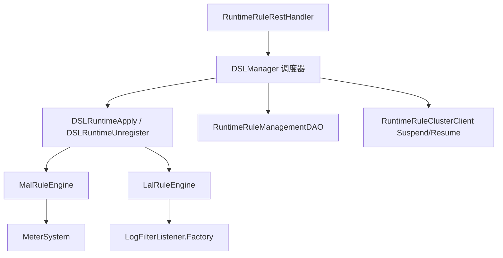

- **Scheduler**（`DSLManager`）：锁、Main 路由、Suspend 广播、持久化、tick 对账
- **Orchestrator**：compile → fireSchemaChanges → verify → commit | rollback
- **Engine**：DSL 专用；`RuleEngineRegistry` 按 catalog 路由

### 20.4 变更分类（DeltaClassifier）

| 分类 | 行为 |
|------|------|
| **NO_CHANGE** | 跳过 |
| **FILTER_ONLY** | 仅改 filter/body，无 Suspend、无 DDL，本地 apply 后 persist |
| **STRUCTURAL** | 增删指标、改 scope/downsampling → Suspend 集群 → DDL → verify → commit |
| **NEW** | 新规则文件 |
| **INACTIVE** | 软暂停：`/inactivate`，保留后端 schema |
| **DELETE** | 硬删除：`/delete`，`withSchemaChange` 删表 |

**存储变更护栏**：MAL 的 scope/ downsampling 变化、LAL 的 outputType 变化需 `allowStorageChange` 显式批准，否则 HTTP 409。

### 20.5 Main / Peer 分工

- **Main**：集群排序后确定的单节点，执行 `POST /addOrUpdate` 的 DDL 与持久化（`StorageManipulationOpt.withSchemaChange()`）
- **Peer**：转发写请求到 Main；本地 tick 用 `withoutSchemaChange()` 只注册 handler，不重复 DDL
- **Suspend/Resume RPC**：structural 变更前暂停各节点对应 metric 的 dispatch，避免半迁移状态写脏数据

### 20.6 MalRuleEngine 关键点

- `MalFileApplier.apply()` 编译 YAML → 注册 `MetricConvert` + `MeterSystem.create`
- Shape-break 指标必须先 `remove` 再 register，否则 `MeterSystem` 抛 `IllegalArgumentException`
- `DSLClassLoaderManager` 管理规则 ClassLoader 的 commit/retire，避免 Metaspace 泄漏
- BanyanDB：`verify` 阶段 `ModelInstaller.isExists()` + describe diff（因 client 对 ALREADY_EXISTS 可能静默）

### 20.7 LalRuleEngine 关键点

- 热更新直接 `LogFilterListener.Factory.addOrReplace` / `remove`
- LAL 一般不触发后端 schema（无 Measure 变更），`fireSchemaChanges` 多为 no-op
- 与 log-mal 联动：同一 catalog 下的 MAL 由 `MalRuleEngine` 处理

---

## 21. BanyanDB 存储实现要点

### 21.1 模块结构

`storage-banyandb-plugin`：

- `BanyanDBStorageClient`：gRPC 客户端
- `MetadataRegistry`：Measure/Stream/Trace 的 schema 缓存
- `BanyanDBIndexInstaller`：实现 `ModelInstaller`，创建/更新 schema
- `BanyanDBBatchDAO`：批量 flush（`maxBulkSize`、`flushInterval`、`concurrentWriteThreads`）
- 分 DAO：`BanyanDBMetricsDAO`、`BanyanDBRecordDAO`、`BanyanDBTraceDAO` 等

### 21.2 数据模型映射

| SkyWalking 概念 | BanyanDB |
|-----------------|----------|
| Metrics（分钟/小时/天） | Measure（带 group、downsampling 时间戳） |
| Record / Segment | Stream 或 Trace（`TraceGroup` 扩展决定） |
| 索引模式 | `BanyanDBModelExtension.indexMode` 控制 ID 列 |

写入路径：`prepareBatchInsert` → `BanyanDBConverter.MeasureToStorage` → `MeasureWrite` → 进入 bulk processor。

### 21.3 批量与异步写

`BanyanDBBatchDAO` 委托 `AbstractBulkWriteProcessor`：

- 累积 `InsertRequest`/`UpdateRequest` 至阈值或 flush 间隔
- 并发写线程池（配置项 `concurrentWriteThreads`）
- 与 `PersistenceTimer` 的 prepare/execute 两阶段对齐

### 21.4 Schema 生命周期

1. `ModelRegistry.add()` → `ModelInstaller.define()` → 返回 etcd `mod_revision`
2. **必须** `SchemaWatcher.awaitRevisionApplied(rev)` 后再放行写入（全集群 DDL 可见）
3. 热更新 verify 依赖 `ModelInstaller` 暴露给 runtime-rule

TTL 配置：`metricsMin/Hour/Day` 均须 ≤ `metadata.ttl`（`BanyanDBStorageProvider.prepare()` 校验）。

### 21.5 与 ES/JDBC 的差异

- ES：索引模板 + Bulk API，协调节点同步 DDL
- JDBC：同步建表，无 revision fence
- BanyanDB：**分布式 schema + 明确 barrier**，是 SkyWalking 存储层最复杂但也为原生观测优化的后端

---

## 22. 服务层级（Service Hierarchy）

### 22.1 问题

同一逻辑服务可能同时出现在 **K8S**、**MESH**、**GENERAL** 等 Layer（例如 Pod 上的应用 + Istio 侧车看到的 mesh 服务）。UI 需要跨层关联，而非孤立拓扑图。

### 22.2 配置与编译

`hierarchy-definition.yml` 定义层间匹配规则；`HierarchyDefinitionService` 将规则编译为 `BiFunction`（`MatchingRule`）。

### 22.3 HierarchyService 两条路径

1. **显式**：Agent/Receiver 上报层级关系 → `toServiceHierarchyRelation` / `toInstanceHierarchyRelation`
2. **自动**：后台任务每 20s 遍历 `MetadataQueryService` 中服务对，按规则 `match()`，命中则生成 `ServiceHierarchyRelation` Source

### 22.4 查询

`HierarchyQueryService.getServiceHierarchy()`：

- 从缓存/DAO 读 `ServiceHierarchyRelationTraffic`
- 递归构建上下层（`maxDepth=10`）
- `filterConjecturableRelations` 去除可推断的冗余边（如已有 A-B-C-D 则去掉直连 A-D）

---

## 23. TopN、Kafka Fetcher 与其它数据通路

### 23.1 TopNStreamProcessor

用于 **慢追踪、慢 SQL** 等“只要 Top K”场景：

- 内存维护固定大小窗口（`topSize`，默认 50）
- `TopNWorker` 按 `topNWorkerReportCycle`（默认 10）才向存储 flush，**远低于** 普通 Metrics 频率
- 同样由 `PersistenceTimer` 收集 persistent workers

设计权衡：避免全量 Record 写存储，仅保留最有价值的 N 条。

### 23.2 Kafka Fetcher

`kafka-fetcher-plugin` 提供与 gRPC **等价的二级入口**：

| Topic（默认名） | Handler | 下游 |
|----------------|---------|------|
| `skywalking-segments` | `TraceSegmentHandler` | `ISegmentParserService` |
| `skywalking-logs` | `LogHandler` | Log Analyzer |
| `skywalking-meters` | `MeterServiceHandler` | `MeterProcessor` |
| `skywalking-metrics` | — | MAL 相关 |
| `skywalking-managements` | — | 注册信息 |

架构：`KafkaFetcherHandlerRegister` 多 consumer 订阅 → 线程池 `handle(record)` → 解析 Protobuf 后与 gRPC 路径汇合。

**seekToEnd 启动**：新 Consumer 从末尾消费，避免重启淹没历史（可配置化行为需结合运维策略）。

### 23.3 Service Mesh（Envoy）

`envoy-metrics-receiver-plugin` 接收 ALS / Metrics，转换为 Mesh 相关 Source，走 OAL 中 Service/ServiceRelation 等 Scope（与 Trace 的 RPC 分析互补）。

### 23.4 Fetcher vs Receiver

- **Receiver**：Agent/Collector **推** 到 OAP（gRPC/HTTP）
- **Fetcher**：OAP **拉** Kafka 等中间缓冲

二者在 Analyzer 层汇合，体现“采集与处理解耦”。

---

## 24. Profiling 与 AI Pipeline

### 24.1 Profiling 子系统（server-core 内）

| 类型 | 模块/包 | 说明 |
|------|---------|------|
| Trace Profiling | `core.profiling.trace` | Java 行级快照，`ProfileAnalyzer` 合并多段 Snapshot |
| eBPF Profiling | `core.profiling.ebpf` | 内核态剖析数据 |
| Async Profiler | `core.profiling.asyncprofiler` | 连续 CPU 采样 |
| Pprof | `core.profiling.pprof` | Go pprof 格式 |

共性：任务由 OAP 下发（Commands）→ Agent 上报 → Record 存储 → `*QueryService` 供 UI 火焰图/调用树分析。

### 24.2 AI Pipeline（`oap-server/ai-pipeline`）

可选模块，提供：

- **`BaselineQueryService`**：基线查询（`baseline.proto`）
- **`HttpUriRecognitionService`**：HTTP URI 聚类/识别（`ai_http_uri_recognition.proto`）
- **`PredictServiceMetrics` / `ServiceMetrics`**：与 AI 后端交互的指标接口

通过 `AIPipelineModule` SPI 挂载；未启用时不影响核心 APM 路径。用于智能 URI 聚合、异常检测基线等增强能力，而非替代 OAL/MAL 主分析链。

---

## 25. 动态配置、Admin 服务与背压

### 25.1 动态配置（Configuration Module）

`server-configuration` 提供统一 `DynamicConfigurationService`，对接 Apollo、Nacos、Zookeeper、etcd、Consul 等。典型 Watcher：

| Watcher | 作用 |
|---------|------|
| `LoggingConfigWatcher` | 动态调整 OAP 日志级别 |
| `EndpointNameGroupingRuleWatcher` | 端点聚合规则热加载 |
| `AlarmRulesWatcher` | 告警规则变更 |
| `SearchableTracesTagsWatcher` | 可搜索 Trace Tag 键 |
| `ApdexThresholdConfig` | Apdex 阈值 |

模式：远程配置变更 → Watcher 回调 → 内存规则表原子替换，**无需重启**（与 runtime-rule 的 MAL/LAL 文件级热更新互补）。

### 25.2 Admin Server

`server-admin` 聚合运维 HTTP 接口（独立 host/port，见 `AdminServerModule`）：

- **runtime-rule**：`/runtime/rule/*`（需显式启用 `SW_RECEIVER_RUNTIME_RULE=default`）
- **status / inspect**：健康与诊断
- **dsl-debugging**：OAL/LAL 调试会话（`GateHolder`、采样输出）
- **ui-management**：Dashboard 模板

与 Core 的 `12800` GraphQL/REST 分离，降低分析面与运维面的耦合。

### 25.3 Watermark（背压）

`WatermarkWatcher` 监控系统资源/队列深度；`WatermarkGRPCInterceptor` 在 gRPC 入口根据水位**拒绝或延迟**新请求，避免 OAP 在流量尖峰时 OOM。属于“最后一道防线”，与 BatchQueue 的 drop 计数、L1 abandon 指标配合可观测。

### 25.4 TelemetryModule（自监控）

OAP 自身通过 `MetricsCreator` 暴露大量内部指标（`trace_in_latency`、`persistence_timer_*`、`remote_*` 等），可接到 Prometheus/OpenTelemetry 监控 OAP 健康，形成**可观测平台的可观测性**。

---

## 26. Zipkin、OTel Trace 与 SpanListener 扩展

### 26.1 Zipkin 接入路径

Zipkin Receiver 支持 HTTP API v1/v2（JSON / Thrift / Protobuf），入口如 `ZipkinSpanHTTPHandler`：

```
HTTP POST /api/v2/spans
  → SpanBytesDecoder 解码 List<zipkin2.Span>
  → SpanForward.send(spanList)
```

**SpanForward**（与原生 Trace 并列的第二分析入口）：

1. **采样**：`sampleRate`（万分比）+ 可选 `RateLimiter`（`maxSpansPerSecond`）
2. 将 `zipkin2.Span` 转为内部 `ZipkinSpan` Source（格式化 service/endpoint 名）
3. 构建 `query` 字段（可搜索的 tag/annotation 子集，超长截断）
4. **`SpanListenerManager.notifyZipkinPhase`** — SPI 监听器可追加 tag、决定是否持久化
5. `SourceReceiver.receive(zipkinSpan)` → Zipkin 专用 OAL Dispatcher
6. 同步产出 `ZipkinService`、`ZipkinServiceSpan`、`ZipkinServiceRelation` Source（拓扑基础数据）
7. `ZipkinSpanRecordDispatcher` 将完整 Span 写入 **Record** 存储（`ZipkinSpanRecord`）

查询时 `ZipkinSpanRecord.buildSpanFromRecord()` 可还原为 `zipkin2.Span` 供 UI 展示。

### 26.2 OTel Trace（可选）

`otel-receiver-plugin` 的 `OpenTelemetryTraceHandler` 将 OTLP Span **先**转为 Zipkin `Span` 格式，再进入 `SpanForward` 或 Forward 服务——实现**复用 Zipkin 存储与查询模型**，降低双栈维护成本。

流程：`OTLP Span` → `convertSpan()`（traceId/spanId 字节序、endpoint 从 attribute 推断）→ `ForwardService.send` → 与 Zipkin 相同下游。

### 26.3 SpanListenerManager（SPI 扩展点）

`SpanListener` 通过 Java `ServiceLoader` 发现，在**首次** `notifyOTLPPhase` / `notifyZipkinPhase` 时懒加载（保证 Module 已 start）。

| 方法 | 调用方 | 时机 |
|------|--------|------|
| `notifyOTLPPhase` | OpenTelemetryTraceHandler | 转 Zipkin **之前** |
| `notifyZipkinPhase` | SpanForward | Zipkin 模型构建**之后** |

返回 `SpanListenerResult`：合并 `additionalTags`、控制是否写入 Zipkin Record 等。**Listener 自行**通过缓存的 `ModuleManager` 发 Source，Manager 只做聚合决策。

扩展新 Trace 后处理（如自定义脱敏、额外指标）：实现 `SpanListener` + `META-INF/services/...SpanListener`，声明 `requiredModules()`。

### 26.4 Zipkin 与原生 Segment 对比

| 维度 | SkyWalking Segment | Zipkin Span |
|------|-------------------|-------------|
| 分析器 | TraceAnalyzer + Listener 链 | SpanForward |
| 拓扑 Source | Service/Endpoint/Relation（RPC Listener） | ZipkinService* Source |
| 明细存储 | SegmentRecord（二进制 SegmentObject） | ZipkinSpanRecord |
| OAL Scope | Service、Endpoint 等 | ZipkinService、ZipkinSpan 等 |
| 查询 API | TraceQueryService（原生树） | 兼容 Zipkin + TraceQL |

---

## 27. GraphQL 与 MQE 查询运行时

### 27.1 模块分层

```
QueryModule (GraphQL / PromQL / TraceQL 等 provider)
    ↓ 依赖
CoreModule (*QueryService — 存储无关的业务查询)
    ↓ 依赖
StorageModule (*QueryDAO — ES/BanyanDB/JDBC 实现)
```

GraphQL **不直接访问存储**，而是注入 `TraceQueryService`、`MetricsQueryService` 等 Core 服务，保持查询逻辑可测、可复用（PromQL 插件同样复用 Core）。

### 27.2 GraphQLQueryProvider

使用 **graphql-java-tools**（`SchemaParser` + `GraphQLQueryResolver`）：

- Schema 来自 query-protocol 子模块（`.graphqls` 文件）
- `prepare()` 注册大量 Resolver 到 `schemaBuilder`
- `start()` 将 GraphQL HTTP 端点挂到 `HTTPHandlerRegister`（与 REST 共存于 `core.default.restPort`，默认 12800）

### 27.3 Resolver 与 Core 服务映射（主要）

| GraphQL Resolver | Core 服务 / 能力 |
|------------------|------------------|
| `TraceQuery` / `TraceQueryV2` | `TraceQueryService` — 链路树、Span 附事件 |
| `TopologyQuery` | `TopologyQueryService` — 服务拓扑图 |
| `MetricsQuery` / `MetricQuery` | `MetricsQueryService` / `MetricsMetadataQueryService` |
| `MetricsExpressionQuery` | **MQE** — `execExpression` |
| `AggregationQuery` | `AggregationQueryService` |
| `LogQuery` / `OndemandLogQuery` | `LogQueryService` |
| `AlarmQuery` | `AlarmQueryService` |
| `HierarchyQuery` | `HierarchyQueryService` |
| `MetadataQuery` / `MetadataQueryV2` | `MetadataQueryService` |
| `ProfileQuery` / `PprofQuery` / `EBPF*` | 各类 Profiling QueryService |
| `EventQuery` | `EventQueryService` |
| `BrowserLogQuery` | `BrowserLogQueryService` |
| `TopNRecordsQuery` | `TopNRecordsQueryService` |
| `Mutation` / `*Mutation` | 剖析任务变更等 |

`AsyncQueryUtils.queryAsync` 将阻塞 IO 包装为 `CompletableFuture`，避免阻塞 Armeria 事件循环。

### 27.4 MQE 查询执行路径

UI 自定义仪表盘常用 **MetricsExpressionQuery.execExpression**：

```java
// 简化流程
MQELexer + MQEParser → ParseTree
TRACE_CONTEXT.set(DebuggingTraceContext(...))
MQEVisitor.visit(tree) → ExpressionResult
```

- `MQEVisitor`（`mqe-rt`）按 AST 拉取存储中的指标序列、做算术/聚合/比较
- 支持 `debug` 与 `dumpStorageRsp`：输出 `DebuggingTrace` 供排障
- 告警侧使用 `AlarmMQEVisitor` / `AlarmMQEVerifyVisitor`，语法树相同、数据源与结果类型约束不同（必须布尔 SINGLE_VALUE）

### 27.5 与 OAL 指标名的关系

OAL/MAL 注册的 `metricsName` 即 MQE 与 GraphQL `readMetricsValues` 中的逻辑名；`MetricsMetadataQueryService` 暴露元数据（类型、labels）供 UI 构建查询表单。

---

## 28. Elasticsearch 存储深度剖析

### 28.1 模块组件

`StorageModuleElasticsearchProvider` 注册：

- `ElasticSearchClient` — REST 客户端、连接池
- `StorageEsInstaller` — 索引模板 / mapping 创建（`ModelInstaller`）
- `BatchProcessEsDAO` — 实现 `IBatchDAO`
- `StorageEsDAO` — 工厂方法创建各 `*EsDAO`
- 专用 Query DAO：`TraceQueryEsDAO`、`MetricsQueryEsDAO`、`TopologyQueryEsDAO` 等

### 28.2 索引与文档 ID

`IndexController` + `TimeSeriesUtils`：

- 时序 Metrics/Record 按 **timeBucket** 路由到物理索引名（如 `sw_metric-2026010112`）
- `generateDocId(model, id.build())` 确定性文档 ID，支持 **update** 语义（分钟级指标合并写）
- Metadata 级指标可用 **alias**，不随时间分片

`MetricsEsDAO.prepareBatchInsert`：

```java
storageBuilder.entity2Storage(metrics, toStorage);
String indexName = TimeSeriesUtils.writeIndexName(model, metrics.getTimeBucket());
String id = IndexController.INSTANCE.generateDocId(model, metrics.id().build());
return new MetricIndexRequestWrapper(client.prepareInsert(indexName, id, builder), callback);
```

### 28.3 BulkProcessor 与 PersistenceTimer 协作

`BatchProcessEsDAO`：

- 懒创建 `BulkProcessor`（`bulkActions`、`flushInterval`、`concurrentRequests`、`batchOfBytes`）
- `insert()` 单条加入 bulk 缓冲
- `flush(prepareRequests)` 将 `PersistenceTimer` 收集的 `InsertRequest`/`UpdateRequest` 批量提交，Insert 完成触发 `SessionCacheCallback.onInsertCompleted()`
- `endOfFlush()` 强制 `bulkProcessor.flush()`

失败时 Update 路径调用 `onUpdateFailure()`，与 Metrics 的 session 缓存重试策略配合。

### 28.4 历史删除与 TTL

`HistoryDeleteEsDAO` 实现 `IHistoryDeleteDAO`：按模型 TTL 删除过期索引或文档。`DataTTLKeeperTimer` 仅在集群**排序后首个节点**执行删除（与 `RemoteClientManager` 排序一致），避免多节点重复删。

### 28.5 Runtime Rule 与 ES

热更新后 `ModelInstaller` 对 ES 做 mapping/settings diff；与 BanyanDB 的 `isExists` 类似，用于 verify 阶段发现“静默 ALREADY_EXISTS 但 mapping 不一致”的问题。

---

## 29. Scope 体系与 OAL 脚本地图

### 29.1 Scope 是什么

每个 **Source** 类带 `@ScopeDeclaration(id = ..., name = ...)`，在启动时由 `DefaultScopeDefine` 扫描注册：

- `NAME_2_ID` / `ID_2_NAME`：OAL `from(Service.latency)` 中的 `Service` 解析为整数 scopeId
- `SCOPE_COLUMNS`：`@ScopeDefaultColumn` 字段 → OAL 生成 Metrics 实体列

**保留区间**：官方 Scope ID ∈ [0, 10000)；自定义扩展建议从 10000 起。

### 29.2 常见 Scope（节选）

| ID | 名称 | 用途 |
|----|------|------|
| 1 | SERVICE | 服务级 RPC 指标 |
| 2 | SERVICE_INSTANCE | 实例级 |
| 3 | ENDPOINT | 端点级 |
| 4–6 | *_RELATION | 拓扑边 |
| 12 | SEGMENT | 链路明细 |
| 22 | ENVOY_INSTANCE_METRIC | Mesh/envoy |
| 23 | ZIPKIN_SPAN | Zipkin 指标 |
| 31 | NETWORK_ADDRESS_ALIAS | 地址别名 |

完整列表见 `docs/en/concepts-and-designs/scope-definitions.md` 与 `DefaultScopeDefine` 源码。

### 29.3 OAL 脚本文件（server-starter/resources/oal/）

| 文件 | 典型内容 |
|------|----------|
| `core.oal` | 核心服务/端点/关系指标（cpm、latency、percentile、apdex） |
| `java-agent.oal` | JVM、Spring 等 Java 探针相关 |
| `dotnet-agent.oal` | .NET 探针 |
| `mesh.oal` | Service Mesh ALS 指标 |
| `browser.oal` | 浏览器监控 |
| `tcp.oal` | TCP 层流量 |
| `ebpf.oal` | eBPF 相关 |
| `cilium.oal` | Cilium 流量 |
| `virtual-gen-ai.oal` | Gen AI 虚拟服务 |
| `disable.oal` | `disable(...)` 关闭不需要的指标/Record |

各 `*ModuleProvider` 在 `start()` 调用 `OALEngineLoaderService.load(new XxxOALDefine())`，`OALDefine` 指定脚本路径集合。

### 29.4 disable.oal 与 DisableRegister

`disable(METRICS_NAME)` 编译进 `DisableRegister`，影响：

- 是否注册 Stream Worker
- `CacheUpdateTimer` 是否加载 Profile 等可选缓存
- UI 是否展示对应功能

用于精简部署（如只要 Trace 不要 JVM 指标）。

### 29.5 Layer 与 layer-extensions.yml

`Layer` 枚举描述技术栈（GENERAL、MESH、K8S、DATABASE 等）；`layer-extensions.yml` 扩展 UI 与层级元数据。Source 上 `@Layer` 影响 Hierarchy 匹配与 UI 筛选。

---

## 30. Service Mesh 遥测内核

### 30.1 接入

`MeshGRPCHandler` 实现 `ServiceMeshMetricService.collect` 流式接收 `ServiceMeshMetrics`（v3 协议），每条调用：

```java
TelemetryDataDispatcher.process(metrics);
```

### 30.2 TelemetryDataDispatcher

静态初始化 `SourceReceiver`、`NamingControl`、自监控指标。按协议分支：

- **HTTP**：解析 `HTTPServiceMeshMetric` → `Service`、`ServiceInstance`、`Endpoint`、`ServiceRelation`、`ServiceInstanceRelation` 等 Source（Layer 多为 **MESH**）
- **TCP**：映射到 `TCPService*` Source 系列（`TCP_COMPONENT = 110`，见 `component-libraries.yml`）

字段含：延迟、响应码、TLS、内部/外部 URI、K8s 元数据（labels 写入 `ServiceInstanceUpdate` 的 JSON properties）等。

### 30.3 与 OAL

`MeshOALDefine` 加载 `mesh.oal`，对 Mesh Source 做 cpm、percentile 等聚合。Mesh **不经过** `TraceAnalyzer`，与 Agent Trace **平行**进入同一 `DispatcherManager`。

### 30.4 Envoy Metrics Receiver

除 SkyWalking 原生 Mesh 协议外，`envoy-metrics-receiver-plugin` 可接收 Envoy 原生指标流，经 MAL/OTel 路径入 MeterSystem（适合 control plane / gateway 指标，与 ALS 互补）。

---

## 31. 集群协调、TTL 与历史删除

### 31.1 ClusterModule 服务 triad

| 服务 | 职责 |
|------|------|
| `ClusterRegister` | 本节点注册、续约 |
| `ClusterNodesQuery` | 返回集群内 OAP 列表（含 gRPC 地址） |
| `ClusterCoordinator` | 协调语义（依实现而定） |

Provider 实现：standalone（单节点）、**kubernetes**、zookeeper、etcd、consul、nacos。

### 31.2 Kubernetes 模式（代表）

`KubernetesCoordinator`：

- 通过 K8s API 列出带 labelSelector 的 Pod
- 读取 `internalComHost` / `internalComPort` 或容器端口组成 gRPC 地址
- `RemoteClientManager.refresh()` 每 10s 拉取列表，**排序**后建立 `GRPCRemoteClient`

**Main 节点判定**（runtime-rule）：与 `ClusterNodesQuery` 排序后的首个地址比较，无独立选举。

### 31.3 DataTTLKeeperTimer

- 周期：`dataKeeperExecutePeriod`（分钟级，配置于 CoreModuleConfig）
- **仅集群首节点**执行 `IHistoryDeleteDAO.deleteHistory`（排序与 Remote 一致）
- 遍历 `IModelManager.allModels()`，按 `model.isRecord()` 选 `recordDataTTL` 或 `metricsDataTTL`

存储实现可覆盖 TTL（如 ES ILM）；Timer 是 OAP 侧统一驱动入口。

### 31.4 与 Persistence 的区别

| 机制 | 作用 |
|------|------|
| `PersistenceTimer` | 将内存中**未过期**的聚合结果批量写入存储 |
| `RecordStreamProcessor` 入口 TTL | 拒绝已过期的**新到** Record |
| `DataTTLKeeperTimer` | 删除存储中**已过期**的历史数据 |

---

## 32. Exporter、TraceQL 与辅助查询插件

### 32.1 Exporter 模块

`ExporterModule` + `ExporterProvider` 实现 Core 定义的导出接口：

| 接口 | 默认实现 | 挂载点 |
|------|----------|--------|
| `TraceExportService` | `KafkaTraceExporter` | `ExportRecordWorker`（Segment/Log Record） |
| `LogExportService` | `KafkaLogExporter` | 同上 |
| `MetricValuesExportService` | `GRPCMetricsExporter` | `ExportMetricsWorker` |

需在 `application.yml` 启用 exporter 模块；Worker 链在持久化前检查 `isEnabled()`，避免无意义的序列化开销。

用途：将 SkyWalking 处理后的数据推到**外部 Kafka/下游 APM**，与 Receiver 的“输入 Kafka”对称。

### 32.2 TraceQL 插件

`traceql-plugin` 提供与 Grafana Tempo 等兼容的 TraceQL 查询 HTTP API：

- 解析 TraceQL 表达式 → 转换为内部 Zipkin/OTLP 查询条件
- `ZipkinOTLPConverter` 等将结果转为 TraceQL 响应格式
- 依赖 Zipkin 存储的 Span 数据模型

适合已投资 TraceQL 生态的用户，无需改 UI 即可对接 Grafana。

### 32.3 PromQL 插件

`promql-plugin` 将 SkyWalking 指标暴露为 PromQL 查询接口，便于 Prometheus/Grafana 侧统一查询（与原生 GraphQL 指标查询并行）。

### 32.4 DSL Debugging（Admin）

`dsl-debugging` 模块配合 OAL 生成的 `GateHolder`：

- 运行时对单条 OAL 规则 **采样** 输入/输出（需编译期 `SW_DSL_DEBUGGING_INJECTION_ENABLED`）
- REST 会话 API 供 UI 或运维工具查看“某指标在某分钟收到了什么 Source”

与 **MQE `debug` 标志**（查询侧）形成“写入路径 / 读出路径”双向排障。

---

## 33. UI、发行版与跨进程链路机制

### 33.1 skywalking-ui 子模块

`skywalking-ui` 为 **booster-ui** 子模块（Vue3 技术栈），独立仓库版本通过 git submodule 锁定。功能：

- Dashboard、拓扑、Trace、Log、Alarm、Profiling 等页面
- 通过 GraphQL 与 OAP 通信（开发时代理到 12800）

OAP 不嵌入 UI 源码；`apm-webapp` 将静态资源打包为可部署 WAR/JAR，与 OAP 进程分离部署或同机反代。

### 33.2 典型部署拓扑

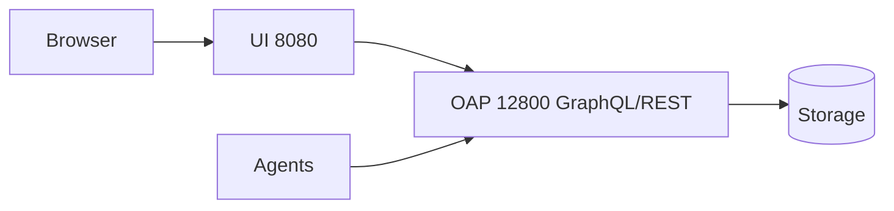

生产常见 Nginx 将 `/graphql` 转发至 OAP，`/` 转发至 UI。

### 33.3 跨进程 Trace（SegmentReference）

Agent 在 Segment 的 Span 上携带 **Reference**（CrossProcess / CrossThread）：

- Entry Span 的 ref 指向上游 Segment
- OAP `RPCAnalysisListener` 根据 ref 与 NetworkAddressAlias 构建 **ServiceInstanceRelation**
- 查询侧 `TraceQueryService` 按 `traceId` 拉取所有 SegmentRecord，组装 Span 树；v2 API 支持更复杂排序与过滤

**SpanAttachedEvent**：附加事件（如 MQ 消息体摘要）独立存储，查询时 `appendAttachedEventsToSpan` 挂回 Span。

### 33.4 Component Library Catalog

`component-libraries.yml` 定义组件 ID → 名称、Layer、是否为 MQ/数据库/缓存等。Agent 上报 `componentId`，OAP 用于：

- UI 拓扑图标与分类
- 分析逻辑分支（如 MQ 消费端无 Agent 时的虚拟服务映射）

Mesh 的 `TCP_COMPONENT = 110` 即在此定义。

### 33.5 构建与代码生成提示

修改 OAL 后需 Maven 编译生成类；跨模块改动建议 `mvnw clean install` 全量构建（见 `CLAUDE.md`）。GraphQL 协议变更需同步 `skywalking-query-protocol` 子模块与 UI。

---

## 34. Metrics Session Cache 与 JDBC 存储

### 34.1 L2 持久化 Worker 的双层缓冲

`MetricsPersistentWorker`（及分钟级的 `MetricsPersistentMinWorker`）在 L1 之后承担 **L2 聚合 + 写前合并**：

```
in(Metrics) → ReadWriteSafeCache (MergableBufferedData)  // 同 worker 内再合并
buildBatchRequests() → loadFromStorage(已有行) → MetricsSessionCache 决策 insert/update
→ prepareBatchInsert/Update → PersistenceTimer → IBatchDAO.flush
```

- `persistentMod`：可跳帧 build（降低读存储频率），热删除时 `drainPendingRequests()` 走无条件 flush
- `supportUpdate`（`@MetricsExtension`）：false 时只做 insert，不 merge（如一次性 ServiceTraffic）

### 34.2 MetricsSessionCache 语义

每个 `MetricsPersistentWorker` 一个 SessionCache（`ConcurrentHashMap`）：

| 事件 | 行为 |
|------|------|
| `loadFromStorage` / multiGet 命中 | 预热缓存 |
| Insert 回调 `onInsertCompleted` | `cacheAfterFlush`（supportUpdate 时 put） |
| Update 回调失败 | `remove` 缓存，下次重新 multiGet |
| 超时 `storageSessionTimeout` | `removeExpired()` 逐出 |

**设计动机**（见 `MetricsSessionCache` Javadoc）：分钟级指标在同一 timeBucket 内多次到达，需与 DB 中已有值 **combine** 再写回；避免每次 `in()` 都 read-modify-write 存储。

`SessionCacheCallback` 在 Bulk flush 完成后触发，与 ES/BanyanDB/JDBC 的异步写结果对齐。

### 34.3 告警与导出触发点

`buildBatchRequests` 在 insert/update 决策后调用 `nextWorker(metrics)`：

- `AlarmNotifyWorker` — 将指标上下文交给告警规则（与 `AlarmCore` 定时 MQE 评估配合）
- `ExportMetricsWorker` — 可选导出到 Kafka/gRPC

### 34.4 JDBC 存储插件（HikariCP）

`storage-jdbc-hikaricp-plugin` 提供 **MySQL / PostgreSQL / H2 / TiDB** 等 Provider，共用 `JDBCStorageProvider` 骨架：

- 同步 DDL（`JDBCTableInstaller`），无 BanyanDB 式 revision fence
- `JDBCBatchDAO` 批量 INSERT/UPDATE，Update 返回行数为 0 时触发 SessionCache 失效（注释中明确 JDBC 场景）
- 适合开发演示、小规模部署；大规模生产更常见 ES 或 BanyanDB

### 34.5 三种存储的 Session 一致性对比

| 后端 | 写后缓存策略 | 典型风险 |
|------|--------------|----------|
| ES | Insert 完成即缓存（supportUpdate 时） | 分片未刷新前读不到 |
| BanyanDB | supportUpdate=false 的指标**不**缓存，依赖 multiGet | 服务端异步写，需 multiGet 保证存在 |
| JDBC | Update 行数 0 → remove cache | 连接池/锁竞争 |

理解 SessionCache 是排查“指标比预期少”“告警不触发”的关键——常与 TTL 过期、`supportUpdate`、flush 失败相关。

---

## 35. OALEngineV2 编译与代码生成详解

### 35.1 引擎入口与加载时机

`OALEngineLoaderService.load(OALDefine)` 通过反射实例化 `org.apache.skywalking.oal.v2.OALEngineV2`（因 Maven 反应堆中 `server-core` 先于 `oal-rt` 编译，避免硬依赖）。

每个 `OALDefine`（如 `CoreOALDefine`、`MeshOALDefine`）对应一组 `.oal` 文件路径，**每个 define 只 load 一次**。

### 35.2 四步流水线（源码级）

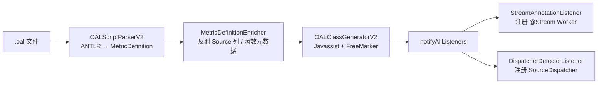

**Step 1 — 解析**：`OALScriptParserV2.parse()` 产出不可变 `MetricDefinition` 列表；`disable(...)` 进入 `disabledSources`；每条 metric 保留源码区间供 DSL 调试。

**Step 2 —  enrich**：`MetricDefinitionEnricher` 根据 `from(Service.latency)` 解析 Source 类字段、聚合函数父类（如 `LongAvgMetrics`）、持久化列映射。

**Step 3 — 生成**（`generateClassAtRuntime`）：

| 生成物 | 作用 |
|--------|------|
| `XxxMetrics` 子类 | 带 `@Stream`、继承 `LongAvgMetrics` 等，实现 `combine`/`calculate` |
| `XxxMetricsBuilder` | `StorageBuilder`，entity ↔ 存储行 |
| `ServiceXxxDispatcher` 等 | 实现 `SourceDispatcher`，`dispatch(ISource)` 内 filter + 调 `MetricsStreamProcessor.in()` |

生成类加载到运行时 ClassLoader；`SW_DYNAMIC_CLASS_ENGINE_DEBUG=Y` 可落盘 `.class` + `.java` sidecar。

**Step 4 — 注册监听器**：

```java
// OALEngineV2.notifyAllListeners()
for (Class metricsClass : metricsClasses) {
    streamAnnotationListener.notify(metricsClass);  // → MetricsStreamProcessor.create
}
for (Class dispatcherClass : dispatcherClasses) {
    dispatcherDetectorListener.addIfAsSourceDispatcher(dispatcherClass);
}
```

### 35.3 生成 Dispatcher 的逻辑形态（概念）

对 `service_resp_time = from(Service.latency).longAvg()`，生成的 `dispatch` 大致等价于：

1. 若 `source` 非 `Service` 类型 → return  
2. 执行 OAL filter 链（`latency > 0` 等）  
3. `new ServiceRespTimeMetrics()`，从 Source 拷贝 entity 字段  
4. 调用 `combine(...)` / `calculate()`  
5. `MetricsStreamProcessor.getInstance().in(metrics)`  

拓扑类 Relation 由**独立 Listener** 产出 Source，OAL 只负责指标；不必每条边写脚本。

### 35.4 与 disable / DSL Debug 的交互

- `disable.oal` 在解析阶段标记 metric 名 → `DisableRegister`，生成类可能仍存在但 Stream 注册被跳过  
- `SW_DSL_DEBUGGING_INJECTION_ENABLED` 时模板注入 `GateHolder` + `OALDebug.capture*`，供 Admin `dsl-debugging` 模块采样

---

## 36. 告警系统全链路源码剖析

### 36.1 两条触发路径

| 路径 | 时机 | 作用 |
|------|------|------|
| **实时 notify** | 每次 L2 `buildBatchRequests` 后 `AlarmNotifyWorker.in()` | 把刚参与持久化的 `Metrics` 推入告警上下文 |
| **定时 check** | `AlarmCore` 每分钟第 15 秒后 | 对所有 `RunningRule` 执行 MQE 表达式求值 |

二者结合：notify 累积时间窗口内的指标值，check 用 MQE 判断是否触发。

### 36.2 写入路径

```
MetricsPersistentWorker.nextWorker(metrics)
  → AlarmNotifyWorker.in(metrics)
  → AlarmEntrance.forward (需 AlarmModule 已加载)
  → NotifyHandler.notify(metrics)
```

`NotifyHandler` 仅处理带 `WithMetadata` 且 scope 属于 **服务目录** 的指标（Service / Instance / Endpoint / 三类 Relation）。其它 scope 直接 return。

根据 scope 构造 `MetaInAlarm`（含可读 name、layers），调用 `RunningRule.in(metaInAlarm, metrics)` 将值填入规则的时间窗口队列。

### 36.3 定时评估（AlarmCore）

```java
// 每分钟 tick，且 second > 15 避免整分边界误报
runningRule.moveTo(checkTime);
alarmMessageList.addAll(runningRule.check());
```

`RunningRule.check()` 遍历每个 `MetaInAlarm` 实体，调用内部 `RunningRuleContext.checkAlarm()`：

1. `AlarmMQEVisitor` 对 MQE 表达式求值（布尔 SINGLE_VALUE）  
2. `isMatch()` → 状态机 `onMatch()` / `onMismatch()`  
3. 若状态为 **FIRING** → 生成 `AlarmMessage`  
4. 若状态为 **RECOVERED** → 生成 `AlarmRecoveryMessage`  

### 36.4 告警状态机（AlarmStateMachine）

状态枚举：`NORMAL` → `FIRING` → `SILENCED_FIRING` / `OBSERVING_RECOVERY` → `RECOVERED` → `NORMAL`

| 事件 | 典型转移 |
|------|----------|
| **onMatch**（表达式为真） | NORMAL→FIRING；恢复期匹配→SILENCED_FIRING 或重新 FIRING |
| **onMismatch** | FIRING→OBSERVING_RECOVERY；观察期满→RECOVERED→NORMAL |
| **silencePeriod** | 触发后计数器抑制重复通知，仍可能处于 SILENCED_FIRING |

参数来自 `alarm-settings.yml`：`period`、`silence-period`、`recovery-observation-period` 等。

### 36.5 规则加载与热更新

- 启动：解析 `alarm-settings.yml` → `AlarmRule.setExpression()` 用 `AlarmMQEVerifyVisitor` **编译期校验**  
- 运行：`AlarmRulesWatcher` 监听动态配置变更，重建 `RunningRule` 集合  
- Runtime-rule 在 MAL 结构变更后可 `alarmResetter` 重置相关 RunningRule 窗口（避免旧窗口脏数据）

### 36.6 通知回调（Hooks）

`AlarmCore` 收集 `AlarmMessage` 后调用已注册 `AlarmCallback`：

- Webhook、Slack、钉钉、企业微信、Feishu、Discord、PagerDuty、gRPC 等（`NotifyHandler` 构造时注册）

告警记录本身通过 Alarm 模块持久化服务写入存储，供 UI `AlarmQuery` 展示。

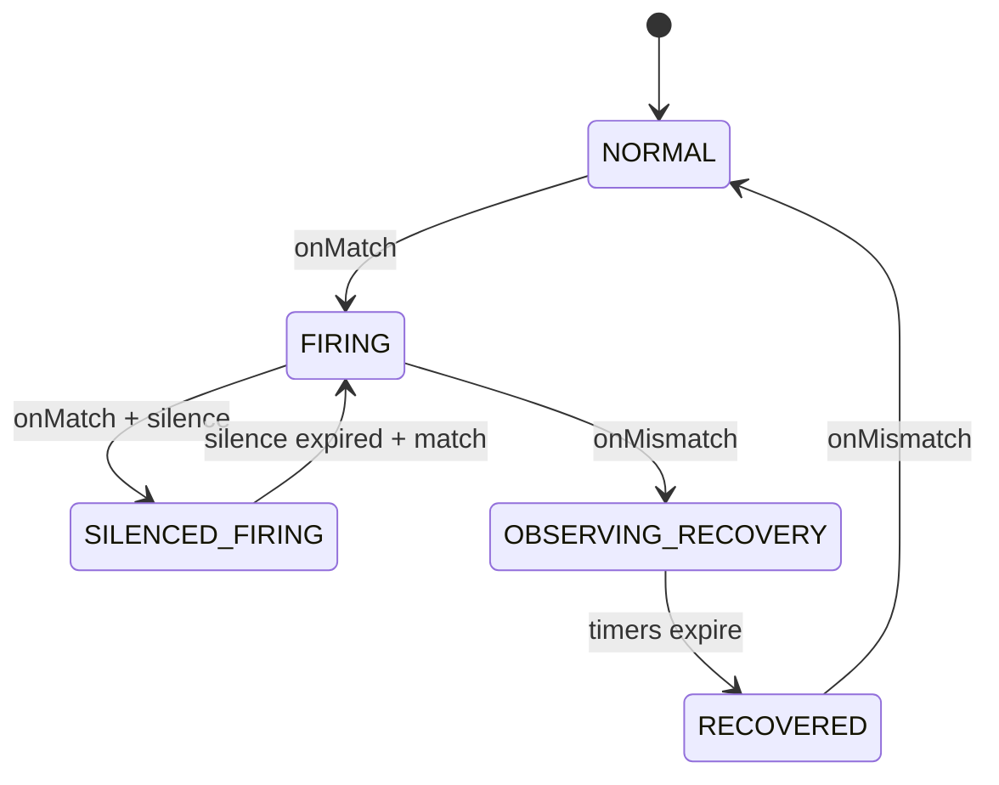

---

## 37. ModelRegistry、StorageModels 与 AnnotationScan

### 37.1 StorageModels 职责

`StorageModels` 同时实现 `IModelManager`、`ModelRegistry`、`ModelManipulator`：

- **add(class, scopeId, storage, opt)**：反射扫描 Metrics/Record 类的 `@Column`、`@ElasticSearch`、`@BanyanDB`、`@SQLDatabase` 等，组装 `Model` + `ModelColumn` 列表  
- 触发 `CreatingListener.whenCreating` → 存储插件建索引/Measure  
- **remove(streamClass, opt)**：热更新删指标时反向 DDL（peer 可 `withoutSchemaChange`）  
- `ReentrantLock` 保护 models 列表；listener 回调在锁外执行避免 DDL 阻塞其它 add

`SeriesIDChecker` / `ShardingKeyChecker` 校验 ID 列合法性，防止存储层无法路由。

### 37.2 与 MetricsStreamProcessor 的衔接

`MetricsStreamProcessor.create()` 内：

```java
Model model = modelSetter.add(metricsClass, stream.getScopeId(), new Storage(...), opt);
if (opt.hasShapeMismatch()) { /* 拒绝注册 worker */ return; }
MetricsPersistentWorker worker = minutePersistentWorker(..., model, ...);
```

Shape mismatch：后端已有不兼容 schema 时 **不注册 worker**，避免写脏数据（需运维通过 runtime-rule 或手工对齐）。

### 37.3 AnnotationScan

启动期 `CoreModuleProvider` 注册 listener 后执行 `annotationScan.scan()`：

- 扫描 classpath 下 `org.apache.skywalking` 包  
- 匹配 `@Stream` → `StreamAnnotationListener` → 创建 Worker 链  
- 其它注解监听器可扩展（历史设计预留）

OAL **动态生成**的类在 `notifyAllListeners` 时单独注册，不走全量 classpath 扫描（避免重复）。

### 37.4 手工 Source / Dispatcher

`SourceReceiverImpl.scan()` 扫描手写 `SourceDispatcher`（如 `SegmentDispatcher`）。与 OAL 生成 Dispatcher 共用 `DispatcherManager.dispatcherMap`（key = `source.scope()`）。

---

## 38. Event、Browser、Management 等 Receiver 纵览

### 38.1 Event（事件）

**模块**：`event-analyzer` + `skywalking-event-receiver-plugin`

```
gRPC/REST Event → EventAnalyzerService → EventAnalyzer
  → EventRecordAnalyzerListener.parse/build
  → RecordStreamProcessor.in(Event)
```

事件字段：`uuid`、`layer`（必填）、`source`（service/instance/endpoint）、`name`、`type`、`message`、`parameters`、时间范围。用于版本发布、扩缩容等**与指标时间线对齐**的标注。

### 38.2 Browser（前端）

`skywalking-browser-receiver-plugin` 接收 `BrowserPerf`（页面性能、资源 timing、首屏等），产出 Browser 相关 Source，OAL 见 `browser.oal`。

### 38.3 Management（注册）

`skywalking-management-receiver-plugin` 处理实例注册、心跳、属性上报（`ManagementService`），维护服务实例存活与属性，供拓扑与 UI 实例列表使用。数据进入 `ServiceInstanceUpdate` 等 Source/Record。

### 38.4 Meter（原生指标）

`skywalking-meter-receiver-plugin`：`MeterService` gRPC 批量上报 → `MeterProcessor` → `MeterSystem`（与 OTel/Prometheus 路径汇合）。

### 38.5 JVM / CLR

- `skywalking-jvm-receiver-plugin`（或 agent 内嵌 JVM metric 走 trace 模块）：JVM 指标 Source → `java-agent.oal`  
- `skywalking-clr-receiver-plugin`：.NET CLR 指标 → `dotnet-agent.oal`

### 38.6 Receiver 模块对照表

| 模块 | 协议/格式 | 分析器 |
|------|-----------|--------|
| trace | Segment gRPC/REST | agent-analyzer |
| zipkin | Zipkin v1/v2 HTTP | SpanForward |
| log | Log gRPC | log-analyzer |
| event | Event gRPC/REST | event-analyzer |
| mesh | ServiceMeshMetrics | TelemetryDataDispatcher |
| otel | OTLP | OTel handler + MAL |
| meter | Meter gRPC | MeterProcessor |
| browser | Browser perf | browser analyzer |
| ebpf | eBPF proto | ebpf analyzer |
| profile/pprof/async-profiler | 各类 profiling | 直写 Record |

---

## 39. eBPF 与 Cilium Fetcher

### 39.1 eBPF Receiver

`skywalking-ebpf-receiver-plugin` 接收 eBPF 探针上报（进程、连续剖析、访问日志等），与 `ebpf.oal`、Profiling 查询服务配合。数据类型包括进程元数据、剖析任务、网络/access log 等（见 `apm-protocol` 下 `ebpf/` proto）。

### 39.2 Cilium Fetcher

`cilium-fetcher-plugin` **主动拉取** Cilium Hubble 流日志（非 push Receiver）：

- `CiliumFetcherProvider.start()` 连接 Cilium 节点 gRPC，`CiliumFlowListener` 消费 flow  
- `FieldsHelper` + `cilium-rules/metadata-service-mapping.yaml` 将 flow 字段映射为 SkyWalking Source  
- 加载 `cilium.oal`（含 `labelCount(dropReason)` 等）  
- 依赖 `ClusterModule` 做节点发现（多 Cilium 节点时）

适合 Kubernetes 集群内**无 Sidecar Agent** 的网络可观测性补充。

---

## 40. Agent 配置发现与下行 Commands

### 40.1 Configuration Discovery

`configuration-discovery-receiver-plugin`：

- `AgentConfigurationsWatcher` 继承 `ConfigChangeWatcher`，监听配置中心 key `agentConfigurations`  
- 解析 YAML 为 `AgentConfigurationsTable`（服务/instance 粒度的 agent 配置）  
- Agent 通过 `ConfigurationDiscoveryService` gRPC **拉取**匹配自身的配置（含 SHA512 校验和）

实现 Agent 采样率、插件开关等**无需重启 Agent** 的动态调整（与 OAP 本地 `application.yml` 无关）。

### 40.2 Commands 下行

`common/Command.proto` 定义 OAP → Agent 指令，常见于：

- Trace/Log 上报响应中的 `Commands`  
- Profile 任务下发  
- 动态配置片段  

`CommandService`（Core）协调序列化；`CommandDeserializer` 在 agent 侧解析。

### 40.3 与动态配置模块关系

| 机制 | 配置来源 | 消费方 |
|------|----------|--------|
| ConfigurationDiscovery | 配置中心 → OAP Watcher → 表 | Agent 拉取 |
| LoggingConfigWatcher 等 | 配置中心 | OAP 自身 |
| runtime-rule | Management 存储 | OAP 集群 |

---

## 41. OAL 指标类型族与 merge 语义

### 41.1 函数 → 基类映射

OAL 聚合函数映射到 `server-core/.../analysis/metrics/` 下抽象类，由生成类继承：

| OAL 函数 | 基类 | 存储特征 |
|----------|------|----------|
| `longAvg` / `doubleAvg` | `LongAvgMetrics` / `DoubleAvgMetrics` | summation + count → value |
| `sum` | `SumMetrics` | 累加 |
| `count` / `cpm` | `CountMetrics` / `CPMMetrics` | 计数 / 每分钟调用 |
| `percent` / `rate` | `PercentMetrics` / `RateMetrics` | 分子分母条件 |
| `histogram` | `HeatmapMetrics` | 桶分布 |
| `apdex` | `ApdexMetrics` | 满意度阈值 |
| `p50`…`p99` / `percentile2` | `PercentileMetrics` / `Percentile2Metrics` | 多分位 |
| `labelCount` | `LabelCountMetrics` | 带标签计数 |

`@MetricsFunction` 注解在基类上声明 `functionName`，OAL enricher 据此选择父类。

### 41.2 combine 与 calculate

- **combine**：L1/L2 合并同 ID 样本时调用（如 `LongAvgMetrics.combine` 累加 summation/count）  
- **calculate**：flush 前推导最终 value（如 `value = summation / count`）  
- **@Entrance / @SourceFrom**：标记生成代码如何从 Source 字段传入 combine 参数

### 41.3 remoteHashCode

`Metrics.remoteHashCode()` 参与集群路由，使同一服务/实例的分钟指标稳定落到同一 OAP 节点做 L2 合并。生成类基于 entityId 字段组合 hash。

### 41.4 Meter 侧对称概念

MAL → `MeterSystem` 使用 `@MeterFunction` + `AcceptableValue` 实现类，语义与 OAL 函数平行，但输入是 **Sample family** 而非 Source。

---

## 42. 灵活 Trace 查询、SpanAttachedEvent 与 Booster UI

### 42.1 标准 Trace 查询

`TraceQueryService.invokeQueryTrace(traceId)`：

1. `ITraceQueryDAO.queryByTraceId` 拉取所有 `SegmentRecord`  
2. `SegmentObject.parseFrom(dataBinary)` 还原 Span  
3. 排序、组装父子关系  
4. 拉取 `SpanAttachedEvent` 附加上下文  

### 42.2 Flexible Trace Query

当 **无 SegmentRecord**（仅 Zipkin/部分 OTLP 场景）时：

```java
if (segmentRecords.isEmpty()) {
    trace.getSpans().addAll(getTraceQueryDAO().doFlexibleTraceQuery(traceId));
}
```

存储插件从 Zipkin Span 记录推导 Span 树（`TraceQueryEsDAO` / `BanyanDBTraceQueryDAO` / `JDBCTraceQueryDAO` 各自实现）。保证 UI **单一 traceId 入口** 可兼容多协议写入。

### 42.3 SpanAttachedEvent

`SpanAttachedEventReportServiceHandler` 接收与 Segment **并行** 的上报：

- `SKYWALKING` 类型 → `SWSpanAttachedEventRecord` → `RecordStreamProcessor`  
- `ZIPKIN` 类型 → Zipkin 附事件存储  

查询阶段合并到对应 Span，用于 MQ 消息体、额外诊断信息等。

### 42.4 Booster UI（子模块）

`skywalking-ui` 为 **git submodule**（Apache SkyWalking Booster UI）：

- 技术栈：Vue 3 + TypeScript，Vite 构建  
- 数据层：GraphQL 查询 OAP（`query-protocol` 子模块定义 schema）  
- 功能模块：Dashboard 模板、拓扑、Trace、Log、Alert、EBPF Profile 等  

`apm-webapp` 将 UI 静态资源 + 可选 OAP 地址配置打为 Web 包；生产环境常与 OAP 分离，由网关统一路由。

开发注意：需 `git submodule update --init` 拉取 UI 源码；GraphQL schema 变更需同步生成前端类型。

---

## 43. server-tools、发行版与性能调优要点

### 43.1 apm-dist 发行版

`apm-dist` Maven 模块组装：

- `oap-libs/` — OAP 运行所需 jar  
- `config/` — `application.yml`、oal、lal、alarm 等  
- `bin/` — 启动脚本  
- 可选 UI webapp 包  

Docker 镜像在 `docker/` 中基于 dist 构建；**修改源码后需重新 package** 才能使镜像内 jar 更新（见项目 `package` skill）。

### 43.2 server-tools

| 工具 | 用途 |
|------|------|
| `profile-exporter` | 剖析快照导出，使用 `MockCoreModuleProvider` 启动精简 OAP |
| `data-generator` | 测试数据生成 |

工具类启动需注意 `CoreModule` 契约变更时同步 Mock Provider（规范 #11）。

### 43.3 CoreModuleConfig 高频调优项

| 配置项 | 影响 |
|--------|------|
| `role` | Mixed / Receiver / Aggregator |
| `persistentPeriod` | 写入存储周期 |
| `prepareThreads` | PersistenceTimer prepare 并行度 |
| `metricsDataTTL` / `recordDataTTL` | 数据保留 |
| `l1FlushPeriod` | L1 聚合刷新间隔 |
| `maxHeapSizeOfAlarm` 等 | 告警内存保护 |

存储侧：`bulkActions`、`flushInterval`（ES）、`maxBulkSize`（BanyanDB）决定批量写吞吐。

### 43.4 背压与丢弃可观测

关注 Telemetry 指标：

- `trace_in_latency`、`mesh_analysis_latency`  
- `metrics_aggregation`、`metrics_persistent_cache`（new vs cached）  
- BatchQueue drop / `unroutableSampleCount`（热更新窗口）  
- `watermark` 相关拒绝计数  

### 43.5 init 模式

`RunningMode.setMode("init")`：OAP 启动完成 schema 初始化后 **exit 0**，用于 K8s Job 预建存储结构，不长期运行分析。

---

## 44. TimeBucket、DownSampling 与多精度指标

### 44.1 TimeBucket 编码

`TimeBucket` 将毫秒时间戳编码为 **long 型桶 ID**，位数区间决定精度（`TimeBucket.java`）：

| 精度 | 格式示例 | 判断条件（约） |
|------|----------|----------------|
| **Second** | `yyyyMMddHHmmss` | 14 位 |
| **Minute** | `yyyyMMddHHmm` | 12 位 |
| **Hour** | `yyyyMMddHH` | 10 位 |
| **Day** | `yyyyMMdd` | 8 位 |

API 示例：

- `getMinuteTimeBucket(ts)` — OAL 分钟指标主键  
- `getRecordTimeBucket(ts)` — Segment/Log/Event 等 Record  
- `getTimestamp(timeBucket, DownSampling.Minute)` — 查询反解为毫秒  

所有 Metrics/Record 的 `timeBucket` 字段是存储分片、TTL 删除、查询时间范围的**统一键**。

### 44.2 DownSampling 配置

`application.yml` 中 `core.default.downsampling` 列表（如 `- hour`、`- day`）由 `DownSamplingConfigService` 解析：

- `shouldToHour()` / `shouldToDay()` 控制是否为每个 Metrics 类额外注册 Hour/Day 级 `MetricsPersistentWorker`
- 分钟级 worker 始终存在；小时/天 worker 通过 `MetricsTransWorker` 从分钟向下采样传递

关闭 hour/day 可减少存储体积与写入 CPU，但 UI 长周期查询依赖降采样表。

### 44.3 三级 Metrics Worker 关系

```
分钟 MetricsPersistentMinWorker  ← 主写入路径（Alarm/Export 挂在此）
        ↓ MetricsTransWorker（可选）
小时 MetricsPersistentWorker
        ↓
天 MetricsPersistentWorker
```

`MetricsTransWorker` 在分钟 flush 时将聚合结果推送到上级精度 worker 的 `in()`，实现**服务端降采样**，无需 Agent 重复上报。

### 44.4 Record 与 Metrics 的时间精度差异

- **Metrics**：通常 Minute（部分 Metadata 类用其它策略）  
- **Record**（Segment、Log、Event）：`getRecordTimeBucket` 常为 **秒** 级，支撑更细粒度查询  
- **TopN**：使用独立 report cycle，与 Metrics 持久化周期解耦  

---

## 45. MAL 编译运行时与 MetricConvert

### 45.1 编译流水线（meter-analyzer）

与 OAL 对称，MAL 使用 **ANTLR + Javassist**，产出 `MalExpression`：

```
MAL 表达式字符串
  → MALScriptParser → MALExpressionModel（AST）
  → MALClassGenerator.compileFromModel
  → MalExpression.run(Map<String, SampleFamily>)  // 纯计算
  → Analyzer.register → MeterSystem.create
```

**扩展函数** `namespace::method()` 通过 `MalFunctionExtension` SPI 注册，编译期为**静态方法调用**（无反射），见 `meter-analyzer/CLAUDE.md`。

### 45.2 MetricConvert 两阶段 apply

`MetricConvert` 对每个 YAML 规则文件：

1. **Phase 1 prepare**：为每条 `metricsRules` 编译 `Analyzer`（含 DSL parse），**不**调用 `MeterSystem.create`  
2. **Phase 2 register**：全部 prepare 成功后统一 `register()`，触发 DDL  

任一条规则编译失败则**整文件 abort**，避免部分 DDL 已创建（与 runtime-rule 的 MalFileApplier 一致）。

表达式拼接：

```java
// formatExp: injectExpPrefix + exp + expSuffix
// 例: (node_cpu_seconds_total * 100).sum(['host']).rate('PT1M').service(['host'], Layer.OS_LINUX)
```

### 45.3 运行时 toMeter

一次 Prometheus/OTel scrape 产生 `ImmutableMap<String, SampleFamily>`（key = 原始 metric 名）：

```java
metricConvert.toMeter(sampleFamilies);
// 广播到文件内每个 Analyzer；各 Analyzer 按 metadata 只取自己需要的 key
```

`PrometheusMetricConverter` 将 `Metric` 流合并为 SampleFamily（同名 metric 多样本合并数组）。

### 45.4 与 OTel / Telegraf / Zabbix 的 catalog

| catalog 目录 | 典型来源 |
|--------------|----------|
| `otel-rules/` | OTel receiver Prometheus 格式 |
| `meter-analyzer-config/` | 原生 Meter、gRPC meter |
| `telegraf-rules/` | Telegraf receiver |
| `log-mal-rules/` | LAL metrics 块 |
| `zabbix-rules/` | Zabbix receiver（YAML 键可能为 `metrics` 而非 `metricsRules`） |

---

## 46. MQE 算子体系与查询调试

### 46.1 架构

```
GraphQL execExpression / AlarmMQEVisitor
  → MQELexer + MQEParser（mqe-grammar）
  → MQEVisitorBase（mqe-rt）extends MQEParserBaseVisitor
  → ExpressionResult（SINGLE_VALUE / TIME_SERIES / SORTED_LIST / RECORD_LIST）
```

`MQEVisitor`（查询）与 `AlarmMQEVisitor`（告警）继承同一基类，共享算子实现，**数据源与结果校验不同**。

### 46.2 主要算子包（mqe-rt/operation）

| 算子类 | 能力 |
|--------|------|
| `AggregationOp` | sum、avg、max、min 等对时间序列聚合 |
| `BinaryOp` | 四则运算 |
| `CompareOp` / `BoolOp` | 比较与布尔逻辑（告警核心） |
| `TrendOp` | 趋势比较（同比/环比类） |
| `TopNOfOp` | TopN 选取 |
| `AggregateLabelsOp` | 按 label 聚合 |
| `SortValuesOp` / `SortLabelValuesOp` | 排序 |
| `MathematicalFunctionOp` | 数学函数 |
| `LogicalFunctionOp` | and/or 等 |

基类还集成 **AI Pipeline**：`visitBaselineOP` 调用 `BaselineQueryService`；预测类算子使用 `PredictServiceMetrics`（需启用 `ai-pipeline` 模块）。

### 46.3 指标读取

Visitor 通过 `ModuleManager` 获取 `IMetricsQueryDAO`，按 `Entity`（scope + service/instance/endpoint id）与 `Duration` 拉取存储中的 Metrics 行，再参与表达式计算。

`ValueColumnMetadata` 将逻辑指标名映射到存储列名（支持 labeled 指标）。

### 46.4 调试

- GraphQL：`debug=true` 设置 `DebuggingTraceContext`，返回 `DebuggingTrace`（span 树 + 每步 MQE 结果）  
- `dumpStorageRsp`：附带存储原始响应  
- 告警：`AlarmMQEVerifyVisitor` 在规则保存时校验表达式合法性  

---

## 47. 拓扑查询、Metadata 与 Aggregation

### 47.1 拓扑数据来源

拓扑**不是**单独存储的一张“拓扑表”，而是由 **ServiceRelation** 指标/Record 在查询期组装：

- `ITopologyQueryDAO.loadServiceRelationDetectedAtClientSide` — 客户端探测的调用边  
- `ITopologyQueryDAO.loadServiceRelationsDetectedAtServerSide` — 服务端探测的调用边  

`ServiceTopologyBuilder` 合并 client/server 两路 `Call.CallDetail`：

- 构建 `Node`（服务 ID、名称、Layer、组件类型）  
- 构建 `Call`（source、target、detectPoint、component）  
- 同一 relation ID 可能同时有 CLIENT 与 SERVER 探测点，合并为一条边  

`TopologyQueryService.getServiceTopology` / `getGlobalTopology` 对 UI 暴露；支持按 `layer` 过滤服务列表。

### 47.2 实例级与进程级拓扑

- **ServiceInstanceTopologyBuilder** — 实例间调用图  
- **ProcessTopologyBuilder** — 结合 `ProcessTraffic` metrics 多取，补充进程节点属性  

### 47.3 MetadataQueryService

UI 服务/实例/端点下拉框的数据源：

- 委托 `IMetadataQueryDAO` 读 `ServiceTraffic`、`InstanceTraffic` 等 Record/Metrics  
- **Guava LoadingCache** 缓存 `mapAllServices()`（刷新间隔 `serviceCacheRefreshInterval`）  
- 支持按 Layer、Duration 过滤  

告警 `NotifyHandler.layersOf()` 也调用此服务解析服务所属 Layer。

### 47.4 AggregationQueryService（TopN 排序）

`sortMetrics(TopNCondition, duration)`：

- 根据 `TopNCondition` 的 scope（Service/Instance/Endpoint）与指标名  
- `ValueColumnMetadata` 解析排序列  
- `IAggregationQueryDAO.sortMetrics` 在存储侧做 TopN 查询（ES/BanyanDB/JDBC 各自实现）  

用于 UI “慢端点排行”“慢服务排行”等，与 `TopNStreamProcessor` 写入的 TopN Record 是不同路径（查询型 TopN vs 流式 TopN 缓存）。

---

## 48. JDBC 表建模与分表策略

### 48.1 表名生成（TableHelper）

```java
// 逻辑表名：优先用 Stream 上 FunctionCategory 唯一名，否则 model.getName()
getTableName(model) → e.g. service_cpm

// 时序表：按天分表
getLatestTableForWrite(model) → service_cpm_20260531
getTable(model, timeBucket)   → 按查询时间桶定位历史分表
```

非时序模型（如部分 metadata）使用**单表**无日期后缀。

### 48.2 JDBCTableInstaller

继承 `ModelInstaller`：

1. `isExists` — 检查表是否存在、列是否齐全（热更新 verify）  
2. `createTable` — 根据 `ModelColumn` 生成标准 SQL（类型映射 MySQL/PostgreSQL/H2）  
3. 主键列 `id`（`StorageData.ID`）  
4. 支持 `additionalTables`、索引、TTL 相关视图（依数据库方言）  

与 ES 的 index template、BanyanDB 的 Measure 不同，JDBC **同步 DDL**，无 revision fence。

### 48.3 JDBCBatchDAO

独立 `BatchQueue`（`JDBC_BATCH_PERSISTENCE`）：

- 线程数 = `asyncBatchPersistentPoolSize`（默认 4）  
- 每线程一分区，BLOCKING 策略  
- Consumer 内批量执行 JDBC insert/update  

与 `PersistenceTimer` 的 prepare/execute 协同：OAP 侧先 prepare SQL，再交给 JDBC 队列异步刷盘。

### 48.4 适用场景

- 本地开发、CI、小规模演示  
- 需注意分表数量与 `DataTTLKeeperTimer` 清理策略（按表 drop 或 delete）  

---

## 49. BatchQueue 队列基础设施

### 49.1 定位

`library-batch-queue` 取代旧版 `DataCarrier`，为 L1/L2 聚合、gRPC Remote、Exporter、JDBC 等提供**统一分区自排水队列**。

核心抽象：

- **多分区** `ArrayBlockingQueue`，`typeHash` 选择器保证同类 Metrics 进同一分区（避免 merge 竞态）  
- **Drain 线程** 自适应空闲退避（1ms～maxIdleMs 指数增加）  
- **Handler 模式**：`addHandler(Class, HandlerConsumer)` 按类型分发  
- **Consumer 模式**：单类型队列使用单一 `consumer` 回调  

### 49.2 OAP 中的队列实例（摘自 CLAUDE.md）

| 队列名 | 用途 | 线程 | 缓冲策略 |
|--------|------|------|----------|
| `METRICS_L1_AGGREGATION` | OAL/MAL 分钟合并 | cpuCores(1.0) | IF_POSSIBLE |
| `METRICS_L2_PERSISTENCE` | 分钟持久化缓冲 | cpuCoresWithBase(1,0.25) | BLOCKING |
| `TOPN_PERSISTENCE` | TopN flush | fixed(1) | BLOCKING |
| gRPC Remote 每客户端 | 跨节点发送 | fixed(1) | BLOCKING |
| `JDBC_BATCH_PERSISTENCE` | JDBC 刷盘 | fixed(N) | BLOCKING |

L1 对 MAL handler 使用 **weight 0.05** 降低分区膨胀（MAL 每 scrape 样本量大）；L2 默认 weight 1.0。

### 49.3 DrainBalancer

可选 `throughputWeighted()` 重平衡：每 5～10 分钟按分区吞吐将分区重新分配给 drain 线程，缓解热点 metric 类型导致线程负载不均（benchmark 约 +21% 吞吐）。

### 49.4 生命周期

`BatchQueueManager.getOrCreate` / `create` → `produce` → shutdown on OAP stop；`IF_POSSIBLE` 满时丢弃并计数，与 `unroutableSampleCount`、Watermark 共同构成背压层次。

---

## 50. gRPC/HTTP Server 与多端口模型

### 50.1 GRPCServer 线程模型（library-server）

基于 Netty 的三层模型（见 `GRPCServer.java` Javadoc）：

1. **Boss event loop** — accept 连接  
2. **Worker event loop** — HTTP/2 帧读写（不可阻塞）  
3. **Application executor** — 实际执行 `onNext` 等回调（SkyWalking 可配置有界线程池 + VirtualThreads 选项）  

流式 RPC（如 `collect(SegmentObject)`）每次 `onNext` 占用应用线程片刻，**不**长期占满线程。

### 50.2 多 gRPC Server 实例

OAP 可为不同用途绑定不同端口（`application.yml`）：

- **core/gRPC** — Agent 主上报（Trace、Log、JVM、Management…）  
- **receiver-sharing** — 部分 receiver 共享  
- **remote** — 集群节点互连 `RemoteService`  
- **ebpf** / **als** — 专用协议  

`GRPCHandlerRegister` 在各 ModuleProvider `start()` 向对应 Server 注册 `BindableService`。

### 50.3 HTTP（Armeria）

`HTTPHandlerRegister` 注册 GraphQL、REST API（Trace、Log、Zipkin、Event、Runtime Rule Admin 等）。GraphQL 查询使用 `AsyncQueryUtils` 避免阻塞事件循环。

### 50.4 拦截器

- `WatermarkGRPCInterceptor` — 过载保护  
- TLS：`DynamicSslContext` 支持证书热更新  

---

## 51. 测试体系（server-testing / dsl-scripts-test）

### 51.1 server-testing

`oap-server/server-testing` 提供 DSL 测试工具类：

- `DslClassOutput` — 控制生成类输出目录（单测 / checker）  
- `MalRuleLoader` — 加载 MAL YAML + 伴生 `.data.yaml` mock 数据  
- `MalMockDataBuilder` — 构造 SampleFamily 输入  

用于 **MAL v1/v2 对比测试**、规则编译回归。

### 51.2 dsl-scripts-test 模块

`oap-server/analyzer/dsl-scripts-test`（及 `scripts/mal/` 资源）：

- 每个 MAL 规则可有 `.data.yaml`：`input`（mock 样本）+ `expected`（期望实体/样本）  
- `MalComparisonTest` — v2 引擎输出与 expected 对比  
- 原则：**v1 Groovy 引擎输出为 ground truth**（迁移期），输入必须覆盖 filter 所需 label 变体  

### 51.3 OAL 测试

`oal-rt` 的 `ProductionOALScriptsTest`、`server-starter` 的 `DSLClassGeneratorTest` 验证生产 `.oal` 可编译。

### 51.4 E2E

仓库 `test/` 目录为 **infra-e2e** 驱动的一键环境测试（需 package Docker 镜像），与单元测试互补。

---

## 52. PromQL 查询插件深度剖析

### 52.1 模块与独立 HTTP 端口

`promql-plugin` 通过 SPI 注册 `PromQLModule` / `PromQLProvider`。与 GraphQL 共用 Core 查询服务不同，PromQL 在 `start()` 中可启动**独立** `HTTPServer`（`PromQLConfig` 控制端口、TLS），对外暴露 Prometheus 兼容 REST。

核心 Handler：`PromQLApiHandler`（Armeria 注解路由）。

### 52.2 API 端点（与 Prometheus v1 对齐）

| 路径 | 作用 |
|------|------|
| `GET/POST /api/v1/query` | 瞬时向量查询 |
| `GET/POST /api/v1/query_range` | 区间查询 |
| `GET/POST /api/v1/series` | 序列发现（matcher） |
| `GET/POST /api/v1/labels` | 标签名列表 |
| `GET /api/v1/label/{name}/values` | 某标签取值 |
| `GET/POST /api/v1/format_query` | 表达式格式化 |
| `GET /api/v1/metadata` | 指标元数据 |
| `GET /api/v1/status/buildinfo` | 构建信息 |

请求体/参数中的 `query` 经 ANTLR 解析为 PromQL AST，由 `PromQLExprQueryVisitor` 求值；`PromQLMatchVisitor` + `MatcherSetResult` 处理 `{label=~"..."}` 类选择器。

### 52.3 与 OAP 内部的桥接

`PromQLApiHandler` 注入 `AggregationQueryService`、`MetadataQueryV2`、`DurationUtils` 等，将 PromQL 指标名映射到 SkyWalking **Metrics 模型**（含 `DataLabel`、Layer、Service/Instance/Endpoint Traffic）。部分路径还调用 `ZipkinQueryService`，用于与 Zipkin 侧标签对齐的混合场景。

**设计要点**：PromQL 是**读路径适配层**，不新增存储模型；写入仍走 OAL/MAL → `MetricsStreamProcessor`。Grafana 可用 Prometheus 数据源指向 OAP PromQL 端口，与 Booster UI 的 GraphQL/MQE 并行。

### 52.4 错误与调试

解析失败走 `ParseErrorListener` / `IllegalExpressionException`，HTTP 响应封装为 `QueryResponse` + `ResultStatus`（`errorType` 区分 bad_data、timeout 等）。`format_query` 便于 UI 侧展示规范化表达式。

---

## 53. Remote 集群协议与 StreamData 序列化

### 53.1 gRPC 契约

`RemoteService.proto` 定义节点间双向流：

```protobuf
service RemoteService {
    rpc call (stream RemoteMessage) returns (Empty);
    rpc syncStatus (StatusRequest) returns (StatusResponse);
}
message RemoteMessage {
    string nextWorkerName = 1;
    RemoteData remoteData = 3;
}
```

`RemoteData` 用五个 repeated 数组承载序列化后的标量与嵌套对象字符串，避免为每种 Metrics 单独定义 Proto。

### 53.2 服务端处理链

`RemoteServiceHandler.call()` 对每个 `RemoteMessage`：

1. `nextWorkerName` → `IWorkerInstanceGetter.get(name)` 得到 `RemoteHandleWorker`
2. `handleWorker.newStreamDataInstance()` 创建空 `StreamData` 子类
3. `streamData.deserialize(remoteData)` 填充字段
4. `nextWorker.in(streamData)` 进入 L2 聚合或持久化链

找不到 worker 时递增 `remote_in_target_not_found_count`（常见于 **OAL 脚本版本不一致** 导致 `_rec` worker 未注册）。

### 53.3 StreamData 与 remoteHashCode

```28:30:oap-server/server-core/src/main/java/org/apache/skywalking/oap/server/core/remote/data/StreamData.java
public abstract class StreamData implements Serializable, Deserializable {
    public abstract int remoteHashCode();
}
```

`Metrics.remoteHashCode()` 与实体 ID 字段一致，保证同一逻辑实体在集群中落到同一 L2 分区。发送侧 `MetricsRemoteWorker` + `GRPCRemoteClient` 经 BatchQueue 批量推送。

### 53.4 Worker 命名：`{streamName}_rec`

`MetricsStreamProcessor` 为每个 Metrics 模型注册远程接收 worker：

```297:297:oap-server/server-core/src/main/java/org/apache/skywalking/oap/server/core/analysis/worker/MetricsStreamProcessor.java
        String remoteReceiverWorkerName = stream.getName() + "_rec";
```

Runtime Rule 卸载指标时需同步 `remove(modelName + "_rec")`，否则对端仍可能向已删除的 worker 投递数据。

### 53.5 syncStatus 与告警协作

`syncStatus` 携带 `AlarmRequest`（按 ruleId / entityName 查询告警规则上下文），供集群内 `AlarmStatusWatcherService` 同步状态，与 §36 告警双路径配合。

---

## 54. Record / NoneStream / TopN 数据模型全集

### 54.1 四类 @Stream 处理器

| Processor | 典型基类 | 语义 |
|-----------|----------|------|
| `MetricsStreamProcessor` | `Metrics` | 时间桶聚合、L1/L2、降采样 |
| `RecordStreamProcessor` | `Record` | 原样持久化（Trace/Log/告警记录等） |
| `TopNStreamProcessor` | `TopN` | 窗口内排序截断 |
| `NoneStreamProcessor` | `NoneStream` | 无时间序列语义的配置/任务行 |

`StreamAnnotationListener` 在启动扫描 `@Stream`，按 `processor()` 注册到对应 Processor 单例。

### 54.2 RecordStreamProcessor 实体（server-core 硬编码）

| 实体 | INDEX / 用途 |
|------|----------------|
| `SegmentRecord` | 原生 Trace Segment 二进制 |
| `LogRecord` | LAL 落盘日志 |
| `ZipkinSpanRecord` | Zipkin 格式 Span |
| `Event` | 系统事件 |
| `AlarmRecord` / `AlarmRecoveryRecord` | 告警与恢复 |
| `SampledSlowTraceRecord` 等 | 慢调用/4xx/5xx 采样 Trace |
| `SpanAttachedEventRecord` / `SWSpanAttachedEventRecord` | Span 附加事件 |
| `BrowserErrorLogRecord` | 浏览器错误日志 |
| Profiling 系列 | `ProfileTaskLogRecord`、`ProfileThreadSnapshotRecord`、eBPF/Pprof/JFR 数据记录等 |

均带 `timeBucket`，经 `PersistenceTimer` 或 Record 专用 flush 路径写入存储。

### 54.3 SuperDataset 子集

`@SuperDataset` 标记超大数据集实体，存储插件可做索引/分片优化。当前四类：

- `SegmentRecord`、`LogRecord`、`ZipkinSpanRecord`、`BrowserErrorLogRecord`

### 54.4 TopN 与 NoneStream

**TopN**（`TopNStreamProcessor`）：如 `TopNServiceDatabaseStatement`、`TopNDatabaseStatement`、`TopNCacheRead/WriteCommand`——由 OAL `topN()` 或分析监听器产出，在内存窗口排序后刷盘。

**NoneStream**（`NoneStreamProcessor`）：Profiling 任务表（`ProfileTaskRecord`、`EBPFProfilingTaskRecord`、`PprofTaskRecord`、`AsyncProfilerTaskRecord` 等），表示**当前任务状态**而非按分钟聚合的指标；变更通过 `NoneStreamProcessor.getInstance().in(task)` 直接 upsert。

### 54.5 Traffic 类 Metrics（对比）

`ServiceTraffic`、`InstanceTraffic`、`EndpointTraffic` 使用 `MetricsStreamProcessor`，参与远程聚合与 TTL；与 Management 上报的 `ServiceMeta` / `ServiceInstanceUpdate` **Source** 经 Dispatcher 写入这些 Metrics。

---

## 55. StorageBuilder、ValueColumnMetadata 与 SuperDataset

### 55.1 StorageBuilder 契约

每个 `@Stream` 的 `builder = Xxx.Builder.class` 通常实现 `StorageBuilder<T>`：

- `storage2Entity(Convert2Entity)` — 读库 → OAP 实体
- `entity2Storage(T, Convert2Storage)` — 实体 → 存储后端结构

OAL 生成的 Metrics 类、MAL 的 `*Function`、手工 `Record` 均遵循此模式，使 **ES/BanyanDB/JDBC 插件只依赖 Converter 接口**，不引用业务字段。

`StorageBuilderFactory`（Storage 模块服务）在部分场景为动态模型提供 Builder 查找。

### 55.2 ValueColumnMetadata

OAL 编译期为每个 Metrics 模型注册**值列元数据**（`@Column` 标注的 value 字段）：

- `getValueCName(metricsName)` — MQE/PromQL 查询时解析默认 value 列
- `putIfAbsent` / `remove` — Runtime Rule 热更新时支持 scope 变更后重新注册
- `overrideColumnName` — 列名重写规则

与 `Metrics` 实体上的 `@Column(name = "count", ...)` 及 OAL 的 `value` 子句一一对应；查询层通过 metricsName 反查，避免硬编码列名。

### 55.3 SuperDataset 与存储行为

`SuperDataset` 仅作类型标记；`StorageModels` 扫描后传给各 `StorageProvider`：

- ES：可能使用独立 index 模板、rollover 策略
- BanyanDB：`TraceGroup` + `TimestampColumn` + 复合 `Trace.IndexRule`
- JDBC：大表分表（见 §48）

---

## 56. BanyanDB TraceGroup 与索引注解体系

### 56.1 TraceGroup 枚举

```348:359:oap-server/server-core/src/main/java/org/apache/skywalking/oap/server/core/storage/annotation/BanyanDB.java
    enum TraceGroup {
        TRACE("trace"),
        ZIPKIN_TRACE("zipkinTrace"),
        NONE("none");
```

- `TRACE` — `SegmentRecord` 等原生 Trace Stream
- `ZIPKIN_TRACE` — `ZipkinSpanRecord`
- `NONE` — 普通 Stream（Log 等）

`@BanyanDB.Group(traceGroup = ...)` 决定 BanyanDB 侧 Stream 分组与 schema 模板。

### 56.2 字段级 IndexRule

`@BanyanDB.IndexRule` 支持 `INVERTED`（默认）、`SKIPPING`（如 `trace_id` 高基数字段）、`TREE`（层级 Span）。`@BanyanDB.Trace.IndexRule` 定义**复合索引**及 `orderByColumn`（列顺序影响查询效率）。

`SegmentRecord` 示例：按 `service_id + is_error` 复合索引，分别以 `start_time` 或 `latency` 排序——支撑 UI 按服务/错误/耗时查 Trace。

### 56.3 StorageModels 装配

`StorageModels.createModel()` 解析类上的 BanyanDB 注解，填充 `BanyanDBModelExtension`（含 `List<TraceIndexRule>`）。BanyanDB 插件 `MetadataRegistry` 据此 DDL；热更新后须 `awaitRevisionApplied`（见 CLAUDE.md schema fence）。

### 56.4 Measure 与 Property

非 Trace 的 Metrics 使用 `@BanyanDB.MeasureField`、`MeasureGroup`；配置类属性流使用 `PropertyGroup`。与 Stream/Trace 三分法共同构成 BanyanDB 原生建模。

---

## 57. Layer 扩展注册与 RuleSetMerger

### 57.1 Layer 注册时机

`CoreModuleProvider.prepare()` 调用 `LayerExtensionLoader.load()`：

1. **classpath `layer-extensions.yml`** — 运维自定义 Layer（`ordinal >= 1000`，`normal` 表示是否 Agent 安装）
2. **SPI `LayerExtension`** — 外置 JAR 插件注册

二者均调用 `Layer.register(name, ordinal, normal)`；冲突（保留区间、重名、ordinal 重复）在注册时失败。

MAL/LAL 规则文件内的 `layerDefinitions:` **不经过** `LayerExtensionLoader`，而在 meter-receiver / log-analyzer 的 `prepare()` 中注册；最终在 `Core.notifyAfterCompleted()` 前密封注册表。

### 57.2 Management 与 Layer

`ManagementServiceHandler.identifyInstanceLayer()` 将 Agent 上报的 layer 字符串转为 `Layer` 枚举，写入 `ServiceMeta` / `ServiceInstanceUpdate`，影响拓扑分组与 UI 筛选。

### 57.3 RuleSetMerger 启动期合并

```30:45:oap-server/server-core/src/main/java/org/apache/skywalking/oap/server/core/rule/ext/RuleSetMerger.java
 * Folds a disk-loaded baseline + every {@link RuntimeRuleOverrideResolver} discovered on the
 * classpath into a single {@code (name -> bytes)} map per catalog.
 * ...
 * The disk map is the initial baseline (priority −∞).
```

- `CoreModuleProvider` 在 start 时 `RuleSetMerger.installManager(getManager())`
- MAL/LAL 静态加载：`RuleSetMerger.merge("mal"|"lal", diskBytes)` 合并 SPI `RuntimeRuleOverrideResolver`（按 `priority()` 升序，高优先级覆盖）
- 合并前对每个磁盘文件调用 `StaticRuleRegistry.record`，供 Runtime Rule REST **增量对比**原始字节

这与 §20 Runtime Rule 热更新正交：Merger 解决**启动时**多源规则叠加；Runtime Rule 解决**运行期**集群一致变更。

---

## 58. Management Receiver 与元数据 Source 链路

### 58.1 模块位置

插件目录：`skywalking-management-receiver-plugin`（Maven 模块名 `register` 包路径）。实现 `RegisterModule` / `RegisterModuleProvider`，注册 gRPC：

- `ManagementServiceGRPCHandler` → `Management.proto` 的 `reportInstanceProperties` / `keepAlive`

### 58.2 reportInstanceProperties

将 `InstanceProperties` 转为 `ServiceInstanceUpdate` Source：

- `IDManager.ServiceID.buildId(serviceName, true)` 生成 serviceId
- 属性 JSON：除 `ipv4` 外键值写入 properties；多个 IPv4 合并为 `ipv4s` 字段
- `sourceReceiver.receive(serviceInstanceUpdate)` → `DispatcherManager` → OAL **Instance 相关指标** 与 `InstanceTraffic` 更新

返回空 `Commands`（配置下发走 configuration-discovery 等其它 RPC）。

### 58.3 keepAlive

每分钟桶 `TimeBucket` + `ServiceInstanceUpdate`（心跳）+ `ServiceMeta`（服务层元数据，含 Layer）。保证**无 Trace 流量时**实例仍在线、服务仍出现在拓扑。

### 58.4 与 §17 ID / §47 Metadata 的关系

Management 不直接写存储；它只产生 **ISource**。持久化由 OAL 派生的 `service_instance_*` 指标及 `ServiceTraffic`/`InstanceTraffic` 完成。GraphQL `MetadataQuery` 读的是这些 Traffic 与 Metrics 聚合结果。

---

## 59. WorkerInstancesService 与远程 Worker 注册

### 59.1 双接口合一

`CoreModuleProvider` 注册同一个 `WorkerInstancesService` 实例，同时实现：

- `IWorkerInstanceSetter` — Metrics 流创建时 `put` 远程接收 worker
- `IWorkerInstanceGetter` — `RemoteServiceHandler` 按名称查找

内部为 `Map<String, RemoteHandleWorker>`，**全局唯一 worker 名**；重复 `put` 抛 `UnexpectedException`。

### 59.2 注册时机（与 §53 衔接）

`MetricsStreamProcessor.create()` 在模型安装成功且 **无 shape mismatch** 后执行：

```297:306:oap-server/server-core/src/main/java/org/apache/skywalking/oap/server/core/analysis/worker/MetricsStreamProcessor.java
        String remoteReceiverWorkerName = stream.getName() + "_rec";
        IWorkerInstanceSetter workerInstanceSetter = moduleDefineHolder.find(CoreModule.NAME)
                                                                       .provider()
                                                                       .getService(IWorkerInstanceSetter.class);
        workerInstanceSetter.put(remoteReceiverWorkerName, minutePersistentWorker, kind, metricsClass);

        MetricsRemoteWorker remoteWorker = new MetricsRemoteWorker(moduleDefineHolder, remoteReceiverWorkerName);
        MetricsAggregateWorker aggregateWorker = new MetricsAggregateWorker(
            moduleDefineHolder, remoteWorker, stream.getName(), l1FlushPeriod, metricsClass);
```

要点：

- **L1** 入口：`entryWorkers` → `MetricsAggregateWorker`
- **发送**：`MetricsRemoteWorker` 目标名为 `{indexName}_rec`（对端节点）
- **接收**：对端 `RemoteHandleWorker` 包装的是 **`MetricsPersistentMinWorker`（L2）**，不是 L1

Runtime Rule 卸载指标时必须 `remove(modelName + "_rec")`，与 §53.4 一致。

### 59.3 RemoteHandleWorker 与 MAL

`RemoteHandleWorker` 保存 `MetricStreamKind`（OAL / MAL）与 `streamDataClass`。MAL 流在构造时尝试 `streamDataClass.newInstance()` 得到 `AcceptableValue` 原型，供反序列化后类型校验；OAL 直接使用 Metrics 子类。

`newStreamDataInstance()` 为每个 `RemoteMessage` 分配新对象，再 `deserialize(RemoteData)`。

### 59.4 运维含义

| 现象 | 可能原因 |
|------|----------|
| `remote_in_target_not_found_count` 上升 | 集群 OAL/MAL 版本不一致，缺少 `_rec` 注册 |
| 某指标集群聚合为 0 | L2 worker 未注册或 shape mismatch 跳过注册 |
| 升级后短暂报错 | 滚动升级期间新旧节点 worker 表不一致 |

---

## 60. Browser Receiver：OAL 与 Listener 双管道

### 60.1 模块职责

`skywalking-browser-receiver-plugin`（`BrowserModule` / `BrowserModuleProvider`）处理前端 RUM 数据，与 Java Agent Trace **独立协议**（`BrowserPerf.proto`）。

`start()` 阶段：

1. `OALEngineLoaderService.load(BrowserOALDefine.INSTANCE)` — 加载 `oal/browser.oal`，Source 包 `org.apache.skywalking.oap.server.core.browser.source`
2. 注册 gRPC `BrowserPerfServiceHandler`（及 compat）与 REST `BrowserPerfServiceHTTPHandler`（常挂 `SharingServerModule`）

### 60.2 性能数据管道（Perf）

采用与 Trace **同构的 Listener 模式**：

| 组件 | 作用 |
|------|------|
| `PerfDataParserListenerManager` | 管理多类 Perf Listener |
| `BrowserPerfDataDecorator` 等 | 将 Protobuf 装饰为统一 Source 构建块 |
| `BrowserPerfDataAnalysisListener` | 页面级性能 → OAL Source |
| `BrowserWebVitalsPerfDataAnalysisListener` | Web Vitals |
| `BrowserWebInteractionPerfDataAnalysisListener` | 用户交互 |
| `BrowserWebResourcePerfDataAnalysisListener` | 静态资源 |

Listener 最终 `sourceReceiver.receive(...)`，由 `browser.oal` 中定义的 Dispatcher 生成 Browser 层指标（页面 PV、资源耗时等）。

### 60.3 错误日志管道（Error Log）

| 组件 | 作用 |
|------|------|
| `ErrorLogParserListenerManager` | 错误日志监听链 |
| `MultiScopesErrorLogAnalysisListener` | 多 scope 指标 + Record |
| `ErrorLogRecordListener` | 写入 `BrowserErrorLogRecord`（`@SuperDataset`） |
| `ErrorLogRecordSampler` | 采样控制，抑制海量前端错误 |

错误日志同时走 **指标聚合** 与 **Record 原样存储**，便于 UI 按 TraceId 关联与全文检索。

### 60.4 与 §38 的差异

§38 为 Receiver 纵览；本章强调 Browser **独立 OAL 脚本** + **双解析器（Perf/ErrorLog）** 结构，扩展前端监控时不应混入 `agent-analyzer` 的 Trace Listener。

---

## 61. Configuration Discovery 与动态配置同步

### 61.1 配置来源

`AgentConfigurationsWatcher` 监听配置模块 key **`agentConfigurations`**（非 `application.yml` 本地项）。`notify()` 解析 YAML 为 `AgentConfigurationsTable`（按 **service 名** 索引）。

删除配置时重置为空表；`getAgentConfigurations(service)` 对未知服务返回带固定 SHA512 的 **empty** 对象，避免 Agent 误以为服务端删配置而清空本地缓存。

### 61.2 Agent 拉取 RPC

`ConfigurationDiscoveryServiceHandler.fetchConfigurations()`：

1. 按 `request.getService()` 查表  
2. 若 `disableMessageDigest` 为 true，或 `request.getUuid()` 与服务端 `agentConfigurations.getUuid()` **不一致**，则下发 `ConfigurationDiscoveryCommand`  
3. 否则返回空 `Commands`（Agent 配置已最新）

UUID 由配置内容哈希生成（`AgentConfigurationsReader` 读取时计算），实现 **增量同步**，减少每次 Trace 上报携带大配置块。

### 61.3 与 Trace 上报的关系

动态配置**不**嵌入 `TraceSegmentReportService` 响应；Agent 需周期性调用 `ConfigurationDiscoveryService`（或在 SDK 内建轮询）。这与 Profile/Command 下发路径分离，降低热路径开销。

### 61.4 运维配置示例形态

配置中心 YAML 通常按服务列出 key-value（采样率、忽略路径、插件开关等），经 OAP 转为 `KeyStringValuePair` 列表序列化进 `ConfigurationDiscoveryCommand`（见 `apm-network` 的 `BaseCommand` 子类）。

---

## 62. CommandService 与下行 Command 类型

### 62.1 设计原则

`CommandService`（Core 模块服务）是 OAP 侧 **创建下行指令的唯一工厂**；各 Handler/Profiling 服务构造任务后，将 `Command.serialize()` 填入 `Commands` Protobuf 返回 Agent。

Agent 侧通过 `CommandDeserializer.deserialize(Command)` 还原具体 `BaseCommand` 子类。

### 62.2 Command 类型一览

| Command 类 | 创建入口 | 用途 |
|------------|----------|------|
| `ProfileTaskCommand` | `newProfileTaskCommand` | Java 链路剖析任务 |
| `AsyncProfilerTaskCommand` | `newAsyncProfileTaskCommand` | Async Profiler 事件采集 |
| `PprofTaskCommand` | `newPprofTaskCommand` | Go pprof 任务 |
| `EBPFProfilingTaskCommand` | `newEBPFProfilingTaskCommand` | eBPF 剖析任务与 trigger |
| `ContinuousProfilingPolicyCommand` | `newContinuousProfilingServicePolicyCommand` | 持续剖析策略 |
| `ContinuousProfilingReportCommand` | `newContinuousProfilingReportCommand` | 持续剖析结果回收 |
| `ConfigurationDiscoveryCommand` | Configuration Discovery Handler | Agent 动态配置 |
| `TraceIgnoreCommand` | 动态配置/规则（非 CommandService） | 忽略 Trace 片段 |

各 Command 含 `serialNumber`（UUID）供 Agent 去重与任务关联。

### 62.3 与 gRPC 响应的组合

典型模式：`responseObserver.onNext(Commands.newBuilder().addCommands(...).build())`。一次响应可含 **多条** Command（例如同时下发配置与 Profile）。Management `keepAlive` 常返回空 Commands；Profiling 查询接口则满载任务 Command。

---

## 63. NamingControl、IDManager 与 Source 分发扫描

### 63.1 NamingControl

`NamingControl` 在 Core 启动时按 `application.yml` 注入长度上限与 `EndpointNameGrouping`：

- `formatServiceName` / `formatInstanceName` / `formatEndpointName` — 超长截断  
- `formatEndpointName(serviceName, endpoint)` — 可应用端点分组规则（合并相似 URL）

**所有** Receiver 在构造 Source 前应调用 NamingControl，保证与存储、查询侧 ID 一致（Management、Trace、Browser 均已遵循）。

### 63.2 IDManager 编码模型

`IDManager` 将可读名称编码为存储 ID，避免 ES/BanyanDB 键过长或非法字符：

| 内部类 | 编码内容 |
|--------|----------|
| `ServiceID` | `encode(name) + '_' + isNormal` |
| `ServiceInstanceID` | serviceId + instanceName 组合 |
| `EndpointID` | serviceId + endpointName |
| `ServiceRelation` / `EndpointRelation` | 源/目的 ID 用 `RELATION_ID_CONNECTOR` 连接 |

`analysisId()` 解码用于 GraphQL 展示服务名。`isNormal=false` 表示 **推测服务**（无 Agent 安装，如 Mesh 推断）。

### 63.3 SourceReceiverImpl 与 Dispatcher 扫描

启动时 `SourceReceiverImpl.scan()` 用 Guava `ClassPath` 扫描 `org.apache.skywalking` 下：

- 实现 `SourceDispatcher` 的类 → 按 `scope()` 注册到 `DispatcherManager`
- `SourceDecorator` → `SourceDecoratorManager`

`receive(ISource)` → `dispatcherManager.forward(source)`：同一 scope 可挂 **多个** Dispatcher（OAL 生成 + 手工 Dispatcher，如 `ServiceMetaDispatcher`）。

若无 Dispatcher 注册，Source **静默丢弃**（Receiver 开但 OAL 未引用该 scope 时的正常情况）。

---

## 64. RecordStreamProcessor 持久化链

### 64.1 与 Metrics 的差异

`RecordStreamProcessor` **无 L1/L2 远程聚合**；`in(Record)` 直接路由到按类索引的 `RecordPersistentWorker`。

### 64.2 TTL 过滤

```66:77:oap-server/server-core/src/main/java/org/apache/skywalking/oap/server/core/analysis/worker/RecordStreamProcessor.java
    public void in(Record record) {
        final var now = System.currentTimeMillis();
        final var recordTimestamp = TimeBucket.getTimestamp(record.getTimeBucket(), DownSampling.Minute);
        final var isExpired = now - recordTimestamp > TimeUnit.DAYS.toMicros(recordDataTTL);
        if (isExpired && !isTestingTTL) {
            log.debug("Receiving expired record: {}, time: {}, ignored", record.id(), record.getTimeBucket());
            return;
        }
        RecordPersistentWorker worker = workers.get(record.getClass());
        if (worker != null) {
            worker.in(record);
        }
    }
```

迟到的 Segment/Log 在超过 `recordDataTTL` 后被丢弃，保护存储不被历史补报撑爆。

### 64.3 RecordPersistentWorker

`in()` → `recordDAO.prepareBatchInsert(model, record)` → `batchDAO.insert()`，与 Metrics 共用 `IBatchDAO` 批量刷盘；可选链式 `nextExportWorker`（如 Trace 导出）。

`create()` 阶段通过 `ModelRegistry` + `StorageBuilderFactory` 解析 `@Stream` 的 Builder，与 §55 一致。

---

## 65. Watermark 背压与 gRPC 熔断

### 65.1 WatermarkWatcher

`WatermarkWatcher` 周期性采集 JVM 指标（堆/直接内存使用率），超过 `maxHeapMemoryUsagePercentThreshold` 等阈值时：

- 设置 `isLimiting = true`  
- 向注册的 `WatermarkListener` 广播 `WatermarkEvent`

Telemetry 模块提供 `so11y` 自监控计数（break/recover counters）。

### 65.2 gRPC 拦截

`WatermarkGRPCInterceptor` 在 `interceptCall` 入口检查 `isWatermarkExceeded()`：

- 超限则 `Status.RESOURCE_EXHAUSTED` 立即关闭调用，**不进入** Handler  
- 否则正常委托，并在 `onMessage` 中可再次检查（流式 RPC 中途熔断）

与 §49 `BatchQueue` 的 `IF_POSSIBLE` 丢弃、MAL 采样共同构成 **多层背压**：内存水位 → 拒绝新连接；队列满 → 丢弃单条样本。

### 65.3 调优提示

- 集群所有 OAP 节点阈值宜一致，避免流量倾斜到未熔断节点  
- 熔断期间 Agent 会重试，需结合 Agent 缓冲与 `receiver-buffer` 配置评估  
- 根因多为堆内存不足或 L1 分区过多，应结合 GC 日志与 `DrainBalancer` 吞吐重平衡排查

---

## 66. 文档阅读路径索引

### 66.1 新人入门（建立全景）

1. [§1 项目定位](#1-项目定位与总体架构) → [§3 OAP 启动](#3-oap-启动与模块系统) → [§4 数据流](#4-端到端数据工作流)  
2. [§7 Trace 链路](#7-trace-分析链路源码剖析) + [附录 A Trace 时序](#附录-atrace-全链路时序图)  
3. [§10 查询与 UI](#10-查询层与-ui)

### 66.2 后端开发（扩展 OAP）

| 目标 | 建议章节 |
|------|----------|
| 新增指标（APM） | §5 OAL、§29 Scope、§35 OALEngineV2、§41 指标类型 |
| 新增 Prometheus/OTel 指标 | §19 Meter、§45 MAL、附录 K |
| 新增日志处理 | §18 LAL、附录 E |
| 新增 Receiver | §13 扩展、§38 Receiver 纵览、§63 Source 扫描 |
| 存储插件 | §9、§21 BanyanDB、§28 ES、§48 JDBC |
| 集群 | §8、§53 Remote、§59 Worker 注册、附录 M |
| 理解 OAP 启动顺序 | §3、§95、§96、§100、附录 T |
| JVM 指标 / 日志管道 | §98、§99、§18、§15 |
| 跨进程服务发现 | §97、§7 |
| .NET / 剖析 / GenAI | §101、§102、§103、§106 |
| 服务层级 UI | §22、§104 |
| 模块依赖排查 | §95、§105 |
| 热更新规则 | §20、§57、§109、附录 D、附录 V |
| MAL/LAL 线上变更 | §109、§20、§116、附录 V、附录 W |
| BanyanDB schema 变更 | §21、§116、§117、附录 W |
| GraphQL 查 UI 接口 | §27、§118、附录 H |
| DSL 规则调试 | §115 |
| AWS 指标接入 | §114、§77 |
| Agent 动态配置 | §61、§110 |
| eBPF / Async Profiler | §108、§107、§102 |
| 查全模块开关 | §96、§112 |
| 告警 MQE | §74、§75、§36 |
| 外部指标接入 | §76、§77、§45 |
| 存储/查询分层 | §78、§79、§80 |

### 66.3 运维/SRE

| 主题 | 章节 |
|------|------|
| 配置与 Agent 下发 | §25、§40、§61、§62 |
| 背压与性能 | §25、§49 BatchQueue、§65 Watermark、§43 调优 |
| TTL 与磁盘 | §31、§64 Record TTL |
| 告警 | §11、§36、§74–§75、§81–§82、附录 J/Q |
| LogQL/Grafana 日志 | §83 |
| 集群与 Remote | §8、§72、§84 |
| 外部指标 Telegraf/Zabbix | §85、§86 |
| Event / Zipkin / Mesh | §88、§89、§90、§94 |
| GenAI / 层级 / 剖析 | §103、§104、§102、附录 U |
| Runtime Rule / Admin API | §109、§111、附录 V |
| eBPF / JFR / Pprof 剖析 | §107、§108、§102、§113 |
| Firehose / OTel 云指标 | §114 |
| 模块清单对照 | §112 |
| Trace 查询 | §91、§7 |
| 告警配置 | §92 |
| OAP 启动与配置 | §3、§95、§96、§100、附录 T |
| JVM / 日志接入 | §98、§99、§18 |
| 跨进程拓扑寻址 | §97、§7、§47 |
| 测试与发布 | §51、§43 server-tools |

### 66.4 查询与生态集成

- GraphQL/MQE：§27、§46、附录 H  
- PromQL/Grafana：§52、§32.3  
- Zipkin/TraceQL：§26、§32  
- Kafka/导出/自监控：§67、§68、§69  

---

## 67. Kafka Fetcher 消费模型与 Topic 约定

### 67.1 模块依赖

`KafkaFetcherProvider.requiredModules()` 包含 `CoreModule`、`AnalyzerModule`、`LogAnalyzerModule`、`TelemetryModule`——Trace 走 `ISegmentParserService`，Log 走 LAL，与 gRPC Receiver **共享分析内核**。

### 67.2 Handler 注册表

`start()` 注册 Handler 并 `handlerRegister.start()`：

| Handler | plain topic | 下游 |
|---------|-------------|------|
| `TraceSegmentHandler` | `skywalking-segments` | `SegmentObject` → `ISegmentParserService.send` |
| `ServiceManagementHandler` | `skywalking-managements` | Management 同等逻辑 |
| `JVMMetricsHandler` | `skywalking-jvm` | JVM Source |
| `ProfileTaskHandler` | `skywalking-profilings` | Profiling 数据 |
| `MeterServiceHandler` | `skywalking-meters` | Meter 协议 |
| `LogHandler` / `JsonLogHandler` | `skywalking-logs` | 原生 Proto / JSON 日志（可开关） |

### 67.3 Topic 名拼装

`AbstractKafkaHandler.getTopic()` 支持：

- `namespace` 前缀：`{namespace}-skywalking-segments`  
- MirrorMaker2：`{mm2SourceAlias}{separator}{topic}`  

便于多环境共用一个 Kafka 集群。

### 67.4 KafkaFetcherHandlerRegister 运行时

- 可配置 **多个** `KafkaConsumer`（`consumers` 数量）  
- 订阅全部 Handler topic；启动时 `seekToEnd` — **只消费启动后的新数据**（避免 OAP 重启回放历史压垮集群）  
- `poll(500ms)` → 线程池异步 `handler.handle(record)`；`enable.auto.commit=false` 时批量 `commitAsync`  
- 缺失 topic 时 `AdminClient.createTopics`（分区数/副本因子来自配置）

线程池默认 `CPU*2` 线程、`ArrayBlockingQueue` 10000、`CallerRunsPolicy` 反压。

### 67.5 与 gRPC 路径对比

Kafka Handler 解析 Protobuf 后进入与 gRPC **相同**的 Analyzer/Core 服务；Telemetry 对 Kafka Trace 打 `protocol=kafka` 标签（`trace_in_latency`）。架构意义：**采集网关与 OAP 分析解耦**，适合 Agent → Kafka → 多 OAP 扇出。

---

## 68. Exporter 指标/Trace/Log 导出全链路

### 68.1 模块服务

`ExporterProvider` 注册三类导出服务：

| 服务接口 | 实现 | 开关 |
|----------|------|------|
| `MetricValuesExportService` | `GRPCMetricsExporter` | `enableGRPCMetrics` |
| `TraceExportService` | `KafkaTraceExporter` | `enableKafkaTrace` |
| `LogExportService` | `KafkaLogExporter` | `enableKafkaLog` |

未启用 Exporter 模块时，Core 侧 Worker 懒加载检测到 `has(ExporterModule.NAME)==false` 即 no-op。

### 68.2 Metrics 导出（L2 之后）

`MetricsStreamProcessor` 为每个 Metrics 模型创建 `ExportMetricsWorker` 链在 `MetricsPersistentMinWorker` 之后：

- 刷盘轮次结束发出 `ExportEvent`（`INCREMENT` / `TOTAL` 类型）  
- `ExportMetricsWorker.in()` → `MetricValuesExportService.export()`  
- `GRPCMetricsExporter` 使用 **订阅模型**：外部系统 `SubscriptionReq` 声明关心的 metric 名，OAP 仅推送订阅项；内部经 `BatchQueue` 异步 gRPC 流发送

用于将 SkyWalking 聚合指标 **镜像** 到外部 TSDB/自研平台，不替代 OAP 存储。

### 68.3 Record 导出（Trace/Log）

`RecordStreamProcessor.create()` 可为 `SegmentRecord` / `LogRecord` 挂 `ExportRecordWorker`：

- `SegmentRecord` → `TraceExportService.export` → Kafka topic  
- `LogRecord` → `LogExportService.export`  

在 `RecordPersistentWorker` 写入存储 **之后**（或链式 next worker）触发，实现“存一份、再转发一份”。

### 68.4 与 §32 的关系

§32 为插件概览；本章强调 **Worker 链挂载点** 与三种 ExportService 分工。启用导出会增加 L2 与 Record 路径 CPU/网络开销，需单独容量规划。

---

## 69. Telemetry 自监控（OAP So11y）

### 69.1 模块结构

`server-telemetry` 子工程：

- `telemetry-api` — `MetricsCreator`、`CounterMetrics`、`HistogramMetrics`、`GaugeMetrics`、`MetricsCollector`  
- `telemetry-prometheus` — Prometheus 实现 + 独立 HTTP 抓取端口  
- `telemetry-api/none` — `NoneTelemetryProvider` 空实现（测试/极简部署）

通过 SPI 选择 provider；生产常用 **prometheus**。

### 69.2 MetricsCreator 使用模式

各模块在 `start()` 向 `TelemetryModule` 注册指标，例如：

- `RemoteServiceHandler` — `remote_in_count`、`remote_in_latency`  
- `PersistenceTimer` — `persistence_timer_bulk_*`  
- `TraceSegmentHandler`（Kafka）— `trace_in_latency{protocol=kafka}`  
- `WatermarkWatcher` — break/recover 计数  

标签使用 `MetricsTag.Keys/Values` 约束维度，避免高基数 label。

### 69.3 PrometheusTelemetryProvider

- `PrometheusMetricsCreator` 注册到 Core 的 `MetricsCreator` 服务  
- `HttpServer` 暴露 `/metrics`（端口见 `PrometheusConfig`）  
- `DefaultExports` 注册 JVM hotspot 指标 → 供 `WatermarkWatcher` 读取堆/直接内存  
- `PrometheusMetricsCollector` 实现 `MetricsCollector`，供 **so11y** 面板聚合 OAP 内部 counter/histogram

### 69.4 与外部 PromQL 插件区别

| 维度 | Telemetry（§69） | PromQL 插件（§52） |
|------|------------------|-------------------|
| 数据 | OAP **进程自身** 健康指标 | **业务** APM 指标查询 |
| 消费者 | Prometheus 抓 OAP | Grafana 查 OAP |
| 端口 | telemetry 独立端口 | promql 独立端口 |

---

## 70. AI Pipeline 与外部 AI 服务集成

### 70.1 模块定位

`ai-pipeline` 为 **可选** SPI 模块（`AIPipelineModule`），不参与 Trace/Metrics 主写入链；通过 gRPC 连接外部 AI/ML 服务增强告警与端点治理。

### 70.2 BaselineQueryService

`BaselineQueryServiceImpl` 在 `prepare()` 注册：

- 连接 `baselineServerAddr:baselineServerPort`（`AlarmBaselineServiceGrpc`）  
- `queryBaseline(serviceName, timeBucket)` 拉取预测上下界，结果缓存 Guava Cache（1 小时 access 过期）  
- 告警规则（`RunningRule`）可对比当前指标与基线偏差

未配置地址时 stub 为空，查询降级为无基线。

### 70.3 HttpUriRecognitionService

`start()` 中注入 `EndpointNameGroupService.startHttpUriRecognitionSvr()`：

- 对外部 **URI 识别服务** gRPC 同步原始 URI 列表  
- 返回 `HttpUriPattern` 供 `EndpointNameGrouping` 合并 `/users/1` → `/users/{id}`  
- `version` 字段支持增量同步

降低高基数 endpoint 对存储与 UI 的压力，与 §25 `EndpointNameGroupingRuleWatcher` 规则互补（AI 自动 vs 人工规则）。

### 70.4 配置项（AIPipelineConfig）

典型字段：`baselineServerAddr/Port`、`uriRecognitionServerAddr/Port`。未启用模块时 Core 仍可用 OpenAPI/手工分组规则。

---

## 71. PersistenceTimer 两阶段批量刷盘

### 71.1 触发周期

`PersistenceTimer.INSTANCE.start()` 使用 **单线程** `ScheduledExecutor`，默认每 `core.default.persistentPeriod` 秒（通常 25s）执行 `extractDataAndSave()`。

### 71.2 参与的 Worker

每轮收集：

- `MetricsStreamProcessor.getPersistentWorkers()` — 全部 `MetricsPersistentWorker`（分钟/小时/天）  
- `TopNStreamProcessor.getPersistentWorkers()` — TopN 周期 flush  

**不包含** `RecordStreamProcessor`（Record 在 `RecordPersistentWorker.in()` 即时 `batchDAO.insert`）。

### 71.3 Prepare → Execute 两阶段

对每个 `PersistenceWorker` 并行（`prepareThreads` 线程池）：

1. **Prepare**：`worker.buildBatchRequests()` — 从内存窗口/`MetricsSessionCache` 生成 `PrepareRequest` 列表，然后 `worker.endOfRound()` 清空本轮缓存  
2. **Execute**：`batchDAO.flush(prepareRequests)` — 存储插件批量写（ES Bulk、BanyanDB batch、JDBC batch）

Histogram 分别记录 prepare/execute/all 延迟；失败递增 `persistence_timer_bulk_error_count`。

### 71.4 与 L1 flush 的关系

- L1 `MetricsAggregateWorker` 按 **秒级** `l1FlushPeriod` 合并并可能触发 Remote  
- PersistenceTimer 按 **persistentPeriod** 将 L2 内存态落库  

二者独立定时，避免每条 Metrics `in()` 都打存储。

### 71.5 调优

- `prepareThreads` 过小会导致 prepare 阶段排队，all_latency 尾部拉长  
- 存储侧 `bulkActions`/`flushInterval` 需与 persistentPeriod 匹配，防止单次 flush 过大超时  

---

## 72. OAP Role 与集群节点注册

### 72.1 三种 Role

`CoreModuleConfig.Role`（`core.role` 配置）：

| Role | 职责 |
|------|------|
| **Mixed**（默认） | 接收 Agent 数据 + L1 聚合 + 可选 Remote L2 + 写存储 |
| **Receiver** | 仅接收与分析，Metrics **转发** 到 Mixed/Aggregator；**Record 直接写存储**（无二次分布式聚合） |
| **Aggregator** | 接收 Remote 数据做 L2 聚合后写存储；通常不面向 Agent |

### 72.2 集群注册差异

`CoreModuleProvider.notifyAfterCompleted()`：

```452:460:oap-server/server-core/src/main/java/org/apache/skywalking/oap/server/core/CoreModuleProvider.java
        if (CoreModuleConfig.Role.Mixed.name()
                                       .equalsIgnoreCase(
                                           moduleConfig.getRole())
            || CoreModuleConfig.Role.Aggregator.name()
                                               .equalsIgnoreCase(
                                                   moduleConfig.getRole())) {
            RemoteInstance gRPCServerInstance = new RemoteInstance(gRPCServerInstanceAddress);
            coordinator.registerRemote(gRPCServerInstance);
        }
```

**Receiver** 角色 **不** 向集群注册 Remote 地址（不作为 L2 目标），但仍可通过 `RemoteClientManager` 向外发送 L1 结果。

### 72.3 OAPNodeChecker 健康检查

`OAPNodeChecker.setROLE()` 后，健康检查对非 Receiver 节点要求集群列表中包含 **self** 实例；多节点集群禁止 `127.0.0.1`/`localhost` 作为对外地址。

### 72.4 部署模式建议

- 小规模：单节点 **Mixed**  
- 大规模接入：多 **Receiver** + 少量 **Aggregator** + 共享存储  
- Record（Trace/Log）可在 Receiver 直写，减轻 Aggregator 磁盘与 CPU（见 Role 枚举 Javadoc）

---

## 73. Configuration API 与 ConfigChangeWatcher

### 73.1 模块分层

`server-configuration`：

- `configuration-api` — `DynamicConfigurationService`、`ConfigChangeWatcher`、Register（Listening/Fetching）  
- 各实现插件 — `configuration-apollo`、`configuration-nacos`、`configuration-zookeeper`、`configuration-etcd`、`configuration-consul` 等  
- `NoneConfigurationProvider` — 无远程配置（仅本地 yml）

### 73.2 Watcher 契约

`ConfigChangeWatcher` 子类在模块 `start()` 注册到 `DynamicConfigurationService`：

- 绑定 `module` + `itemName`（配置中心 key）  
- `notify(ConfigChangeEvent)` — `PUT`/`DELETE` 时更新内存结构  
- `value()` — 返回当前快照供诊断  

`CoreModuleProvider` 默认注册：`ApdexThresholdConfig`、`EndpointNameGroupingRuleWatcher`、`LoggingConfigWatcher`、`SearchableTracesTagsWatcher` 等（见 §25 表）。

### 73.3 与 Agent 配置 Discovery 的区别

| 机制 | 配置键 | 消费方 |
|------|--------|--------|
| `ConfigChangeWatcher` | OAP 运维项（告警、日志级别、端点规则） | **OAP 进程** |
| `AgentConfigurationsWatcher`（§61） | `agentConfigurations` | **Agent** 经 gRPC 拉取 |

二者都可用同一配置中心，但 key 与 Watcher 类分离。

### 73.4 Listening vs Fetching

- **ListeningConfigWatcherRegister** — 长轮询/推送（Nacos、Apollo）  
- **FetchingConfigWatcherRegister** — 定时拉取（部分 etcd/Consul 模式）  

由具体 Configuration Provider 在 `start()` 选择 Register 实现。

---

## 74. RunningRule、AlarmMQE 与实时告警窗口

### 74.1 触发路径（实时，非查库）

告警评估在 **Metrics 持久化链** 上同步进行，不等待存储落盘后再查询：

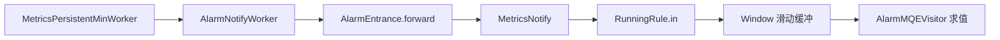

`AlarmEntrance` 在 `AlarmModule` 未加载时直接返回，避免 profile-exporter 等裁剪模块场景 NPE。

### 74.2 RunningRule 结构

每条 `alarm-settings.yml` 规则编译为 `RunningRule`：

- **expression** — MQE 表达式（ANTLR 解析为 `exprTree`）  
- **includeMetrics** — `AlarmMQEVerifyVisitor` 在加载期从 AST 提取的指标名集合，用于 `in()` 快速过滤  
- **period / silencePeriod / recoveryObservationPeriod** — 触发周期、静默期、恢复观察期  
- **windows** — `ConcurrentHashMap<AlarmEntity, Window>`，按实体（服务/实例/端点等）隔离状态机  

`in(MetaInAlarm, Metrics)` 将本轮 L2 输出的 `Metrics` 样本写入对应 `Window`；定时任务 `moveTo()` 推进时间轴并调用 `checkAlarm()`。

### 74.3 AlarmMQEVisitor

继承 `MQEVisitorBase`，在 **内存窗口** 上求值（非 `IMetricsQueryDAO`）：

- 从 `LinkedList<Map<String, Metrics>>` 读取最近 N 个 timeBucket 的指标值  
- 支持趋势算子（`maxTrendRange` / `additionalPeriod`）  
- **Baseline 算子**：识别 `MQEParser.BaselineOPContext`，调用 `queryBaseline` / `queryLabeledBaseline` → 对接 §70 `BaselineQueryService`（外部 AI 基线服务）

求值结果为 `ExpressionResult`；为 true 且通过静默/恢复状态机则生成 `AlarmMessage` 或 `AlarmRecoveryMessage`。

### 74.4 与 §36 / 附录 J 的关系

§36 描述告警插件全貌；本章强调 **L2 旁路实时评估** 与 **MQE+Window** 机制。GraphQL 告警历史查询走 `IAlarmQueryDAO`，与实时触发路径分离。

---

## 75. AlarmKernel 与指标语义变更时的状态重置

### 75.1 问题背景

Runtime Rule 或 OAL reshape 可能改变某 `metricsName` 的 **聚合语义**（如从 SERVICE 改为 SERVICE_INSTANCE）。已积累的 `Window` 内历史样本与新语义不兼容，若不清空会导致误报/漏报。

### 75.2 AlarmKernelService

`AlarmKernel.reset(affectedMetricNames)` 遍历 `AlarmRulesWatcher` 中所有 `RunningRule`：

- 若 `affectedMetricNames` 与 `rule.getIncludeMetrics()` 有交集 → `rule.resetWindows()`  
- `resetWindows()` 对每个 `Window` 加锁重置后 `windows.clear()`  

与 `RunningRule` Javadoc 一致：重置后下一条样本通过 `computeIfAbsent` 创建 **全新** Window，状态机回到 NORMAL。

### 75.3 调用时机

Runtime Rule apply 路径在指标模型变更后调用 `AlarmKernelService`（需 `AlarmModule` 在 `requiredModules()` 中声明）。这是 **告警状态** 与 **Worker 注册**（§59 `remove(_rec)`）并列的第二条一致性保障。

---

## 76. Meter Receiver 与原生 Meter 协议

### 76.1 协议与模块

SkyWalking Agent **原生 Meter**（`Meter.proto`，非 OTel）由 `skywalking-meter-receiver-plugin` 接收：

- gRPC `MeterService` 注册到 `SharingServerModule`  
- `MeterServiceHandler` / `MeterServiceHandlerCompat` 将 Protobuf 转为内部 Meter 样本

### 76.2 IMeterProcessService

Analyzer 模块提供 `IMeterProcessService.createProcessor()` → `MeterProcessor`：

- 按 Agent 上报的 meter 名与 label 匹配 **meter-analyzer** 配置（若存在静态规则）  
- 或进入通用处理逻辑后交给 `MeterSystem` 注册动态指标（与 §19 一致）

Kafka 路径的 `MeterServiceHandler`（fetcher）与 gRPC 路径 **共用** `IMeterProcessService`，保证行为一致。

### 76.3 与 MAL / OTel 的边界

| 入口 | 协议 | 分析方式 |
|------|------|----------|
| Meter Receiver | SW Meter.proto | MeterProcessor / 可选 meter 规则 |
| OTel Receiver（§77） | OTLP metrics | `otel-rules` MAL |
| Prom/OTel Fetcher | 抓取 + `meter-analyzer-config` | MAL `MetricConvert`（§45） |
| Telegraf / Zabbix Receiver | 各自格式 | 专用 receiver + MAL 配置 |

原生 Meter 适合 Agent 内置 gauge/counter；集群外部指标更常用 OTel 或 Prometheus 抓取。

---

## 77. OTel Metric Receiver 与 MAL 转换注册表

### 77.1 模块职责

`otel-receiver-plugin` 的 `OtelMetricReceiverProvider`：

- 构造 `OpenTelemetryMetricRequestProcessor` 处理 OTLP `ExportMetricsServiceRequest`  
- 同时注册为 `MalConverterRegistry` 服务，供 **Runtime Rule** 动态增删 `otel-rules` 转换器

### 77.2 处理流程

`OpenTelemetryMetricRequestProcessor` 将 OTLP Sum/Gauge/Histogram/Summary 等转为内部 `Metric`（Prometheus 模型兼容层），再：

1. 按 `otel-rules/*.yaml` 中 `metricPrefix` / label 映射为 `SampleFamily`  
2. `MetricConvert.toMeter()` → `MeterSystem`  
3. 进入 `MetricsStreamProcessor`（MAL 流，kind=MAL）

支持 **DELTA** 与 **CUMULATIVE** temporality 区分（影响 rate 类 MAL 函数）。

### 77.3 SPI Handler 扩展

`config.getEnabledHandlers()` 过滤 `ServiceLoader.load(Handler.class)`，允许外置 JAR 增加 OTLP 预处理（如自定义 label 规范化）。

### 77.4 依赖

`requiredModules` 含 `StorageModule`（schema 相关）、`SharingServerModule`（gRPC 挂载）。与 §45 MAL 编译、§20 Runtime Rule 热更新联动。

---

## 78. init / no-init 启动模式与 Schema 生命周期

### 78.1 模式设置

`OAPServerBootstrap.start()` 读取 JVM 属性 `-Dmode=`，写入 `RunningMode`：

| mode | 行为 |
|------|------|
| **init** | 完成 `ModuleManager.init()` 与存储 schema 安装后 **立即 `System.exit(0)`** |
| **no-init** | 正常启动，但存储安装器 **不创建** 缺失表/索引；轮询等待资源出现 |
| （默认） | 正常启动 + 启动期创建/校验 schema |

典型运维：Helm Job 跑 `init` OAP 建库 → 业务 Deployment 跑普通 OAP；或 `no-init` OAP 等待 init Job 完成。

### 78.2 init 模式侧效应

- 仅执行 DDL / index template / BanyanDB measure 注册  
- 多数 Receiver **不** 绑定端口（检查 `!RunningMode.isInitMode()`），避免 init Pod 对外服务  
- Admin、LogQL、Zipkin HTTP 等同样跳过

### 78.3 no-init 与 ModelInstaller

`ModelInstaller.install()` 在 `isNoInitMode()` 时进入 **3 秒轮询** 等待 `isExists(model)`，直到 init OAP 或 Runtime Rule 创建好资源。

`StorageManipulationOpt.Mode.VERIFY_SCHEMA_ONLY`（local-cache 等）在 no-init 下 **严格校验** schema 存在，缺失则拒绝启动而非静默建表。

### 78.4 ES / BanyanDB 差异

- ES：`StorageEsInstaller` 在 no-init 跳过 index settings 校验  
- BanyanDB：`BanyanDBIndexInstaller` 结合 `opt.isFailOnAbsence()` 决定 shape 检查强度；DDL 后仍需 `awaitRevisionApplied`（§21）

---

## 79. Storage 写 DAO 与 Query DAO 分层

### 79.1 设计原则

Storage 插件同时实现 **写路径 DAO** 与 **读路径 Query DAO**，Core 层通过 `StorageModule` 服务接口解耦，便于 ES/BanyanDB/JDBC 互换。

### 79.2 写路径（ingest）

| 接口 | 工厂 | 用途 |
|------|------|------|
| `StorageDAO` | 插件 provider 注册 | DAO 工厂 |
| `IMetricsDAO` | `newMetricsDao(StorageBuilder)` | Metrics `prepareInsert` / upsert |
| `IRecordDAO` | `newRecordDao` | Record 批量 insert |
| `INoneStreamDAO` | `newNoneStreamDao` | Profiling 任务等配置行 |
| `IManagementDAO` | `newManagementDao` | UI 模板、Runtime Rule 等管理数据 |
| `IBatchDAO` | 单例 | `flush(PrepareRequest)` 统一批量提交 |

`MetricsStreamProcessor` / `RecordStreamProcessor` 在 `create()` 时向 `StorageDAO` 索取对应 DAO，**不** 直接依赖 ES/BanyanDB 类。

### 79.3 读路径（query）

`StorageModule.services()` 声明大量 `I*QueryDAO`，由各存储插件实现，例如：

- `IMetricsQueryDAO` — 指标时序读  
- `ITraceQueryDAO` / `IZipkinQueryDAO` — Trace  
- `ILogQueryDAO` / `IBrowserLogQueryDAO` — 日志  
- `ITopologyQueryDAO` / `IMetadataQueryDAO` / `IAggregationQueryDAO`  
- Profiling / Event / Hierarchy / Alarm 等专用 DAO  

Query DAO **不参与** Worker 链，仅被 Core `*QueryService` 与 GraphQL Resolver 调用。

### 79.4 ModelInstaller

`ModelInstaller`（Storage 模块服务）根据 `Model` + `StorageManipulationOpt` 在启动期创建/校验物理 schema，与 `StreamAnnotationListener` 扫描顺序配合（先注册模型再安装表）。

---

## 80. Core QueryService 族与存储查询接口映射

### 80.1 分层模式

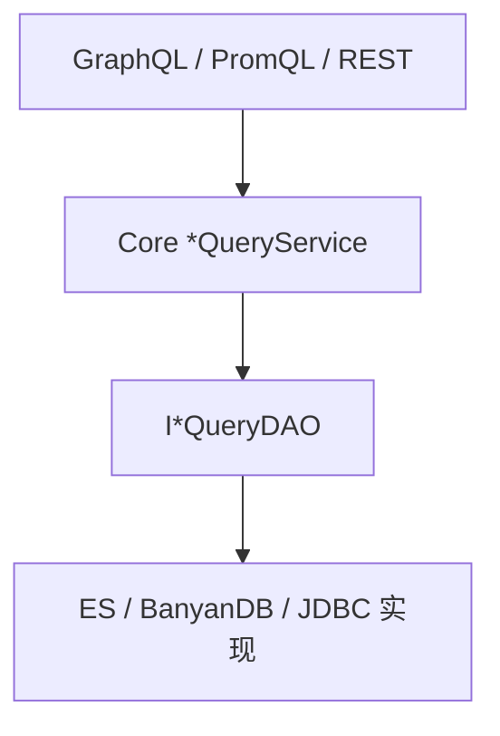

Query 插件 **禁止** 直接访问 ES client；统一注入 Core 服务（§27、§52）。

### 80.2 典型 Core 服务

| Core 服务 | 主要 DAO | 能力 |
|-----------|----------|------|
| `MetricsQueryService` | `IMetricsQueryDAO` | `readMetricsValues`、热力图、标量聚合 |
| `TraceQueryService` | `ITraceQueryDAO` | Segment 列表、详情 |
| `TopologyQueryService` | `ITopologyQueryDAO` | 服务/实例/端点拓扑 |
| `LogQueryService` | `ILogQueryDAO` | 日志检索 |
| `AlarmQueryService` | `IAlarmQueryDAO` | 告警历史 |
| `MetadataQueryService` | `IMetadataQueryDAO` | 服务/实例列表 |
| `AggregationQueryService` | `IAggregationQueryDAO` | 按 scope 聚合排序（PromQL 也用） |

`MetricsQueryService` 使用 `ValueColumnMetadata` 解析默认 value 列与 scope 合法性（`condition.senseScope()`）。

### 80.3 MQE 查询 vs 告警 MQE

| 场景 | 运行时 | 数据来源 |
|------|--------|----------|
| UI/MQE 查询 | `MetricsExpressionQuery` + `MQEVisitorBase` | **存储** `IMetricsQueryDAO` |
| 告警 `RunningRule` | `AlarmMQEVisitor` | **内存 Window** 中 L2 样本 |

二者共用 MQE 语法与 ANTLR 语法树，但 Visitor 实现与数据源不同；告警中的 `baseline()` 算子则调用 `BaselineQueryService`（§70）。

### 80.4 调试

`DebuggingTraceContext` 可在 MQE/告警求值时挂载 span，配合 §32 `dsl-debugging` 与 MQE `debug` 标志做链路级排障。

---

## 81. NotifyHandler 与 MetaInAlarm 实体构造

### 81.1 职责边界

`NotifyHandler` 实现 `MetricsNotify`，是 L2 指标进入告警规则的 **唯一入口**（§74）。它不直接发 Webhook，只做两件事：

1. 将 `WithMetadata` 中的 `MetricsMetaInfo` 转为可读的 `MetaInAlarm`  
2. 按 `metricsName` 查找 `RunningRule` 列表并调用 `rule.in(metaInAlarm, metrics)`

### 81.2 Scope 过滤

仅处理服务目录相关 scope（`DefaultScopeDefine` 中 service / instance / endpoint 及其 relation 变体）。Process、Serviceless 等非目录 scope 的指标 **不进入告警**，避免基础设施指标误触发业务规则。

### 81.3 MetaInAlarm 子类型

| Scope 类型 | 实现类 | `name` 展示格式 |
|------------|--------|-----------------|
| Service | `ServiceMetaInAlarm` | 服务名 |
| Instance | `ServiceInstanceMetaInAlarm` | `实例 of 服务` |
| Endpoint | `EndpointMetaInAlarm` | `端点 in 服务` |
| ServiceRelation | `ServiceRelationMetaInAlarm` | `源服务 to 目标服务` |
| InstanceRelation | `ServiceInstanceRelationMetaInAlarm` | 双实例 + 双服务 |
| EndpointRelation | `EndpointRelationMetaInAlarm` | 双端点 + 双服务 |

ID 字段通过 `IDManager.*.analysisId()` 解码；`layers` 经 `MetadataQueryService.getService()` 查询（失败则空列表，**不阻塞**告警）。

### 81.4 与 AlarmCore 的分工

- **NotifyHandler**：每条 Metrics `in()` 时 **增量** 写入 Window  
- **AlarmCore** 定时器：每分钟 `moveTo` + `check()` **批量** 评估（§82）

---

## 82. AlarmCore 定时评估与 Webhook 回调

### 82.1 定时器

`NotifyHandler.init()` 注册全部 `AlarmCallback` 后调用 `AlarmCore.start(allCallbacks)`：

- 单线程 `ScheduledExecutor`（线程名 `AlarmCore`）  
- 每分钟检查 `Minutes.between(lastExecuteTime, now)`  
- 仅在当前秒 **> 15** 时执行 `runningRule.check()`，避免整分钟边界误触发  

### 82.2 告警与恢复消息

`check()` 返回的 `AlarmMessage` 列表分为：

- **Firing** — 新告警或持续告警  
- **Recovery** — `AlarmRecoveryMessage`（恢复观察期通过后）

`AlarmCore` 拆分后依次调用每个 `AlarmCallback.doAlarm` / 恢复回调。

### 82.3 AlarmCallback 链（notifyAfterCompleted 注册）

`AlarmModuleProvider.notifyAfterCompleted()` 加载 `alarm-settings.yml` 后：

```java
notifyHandler.init(new AlarmStandardPersistence(getManager()));
```

`init()` 追加的内置回调：

| 回调类 | 机制 |
|--------|------|
| `AlarmStandardPersistence` | 写 `AlarmRecord` + Tag 自动补全（§54） |
| `WebhookCallback` | 通用 HTTP Webhook |
| `GRPCCallback` | gRPC 告警推送 |
| `SlackhookCallback` / `WechatHookCallback` / `DingtalkHookCallback` | 各厂商模板 |
| `FeishuHookCallback` / `WeLinkHookCallback` / `DiscordHookCallback` | 同上 |
| `PagerDutyHookCallback` | PagerDuty Events API |
| `EventHookCallback` | 将告警转为系统 **Event** Source |

规则级 `hooks: [settingName]` 映射到 `Rules` 中的 `webhookSettingsMap`、`slackSettingsMap` 等（`alarm-settings.yml` 多段配置）。

### 82.4 动态规则

`AlarmRulesWatcher` 同时是 `ConfigChangeWatcher`，监听配置中心 `alarm.default.alarm-settings`（key 以模块为准），热更新 `RunningRule` 集合，无需重启 OAP。

---

## 83. LogQL 插件（Loki 兼容日志查询）

### 83.1 模块与端口

`logql-plugin` / `LogQLProvider` 模式与 PromQL（§52）相同：独立 `HTTPServer`（`LogQLConfig`），**Loki API 路径前缀**。

### 83.2 HTTP 端点

| 路径 | 作用 |
|------|------|
| `GET /loki/api/v1/labels` | 日志标签名（服务、实例等） |
| `GET /loki/api/v1/label/{name}/values` | 标签取值 |
| `GET /loki/api/v1/query_range` | LogQL 区间查询 |

`query` 参数经 `LogQLLexer`/`LogQLParser` 解析，`LogQLExprVisitor` 求值。

### 83.3 与 Core 桥接

`LogQLApiHandler` 注入：

- `LogQueryService` — 按条件查询 `Log` 列表  
- `TagAutoCompleteQueryService` — 标签自动完成  

查询结果封装为 Loki 风格的 `StreamLog` / `TimeValuePair` JSON，便于 Grafana **Loki 数据源** 直连 OAP。

### 83.4 与 GraphQL 日志查询对比

| 维度 | GraphQL | LogQL 插件 |
|------|---------|------------|
| 协议 | Booster UI 原生 | Loki/ Grafana 生态 |
| 表达式 | 结构化参数 | LogQL 文本 |
| 底层 | 同一 `LogQueryService` + `ILogQueryDAO` | 同上 |

启动时检查 `!RunningMode.isInitMode()`，init 模式不绑定 LogQL 端口。

---

## 84. ClusterCoordinator 与 RemoteClientManager

### 84.1 Cluster 模块抽象

`ClusterModule` 暴露：

- `ClusterRegister` — 本节点注册（`registerRemote`）  
- `ClusterNodesQuery` — 查询成员列表  
- `ClusterCoordinator` — 上述二者 + `registerWatcher` + `start()`

实现插件（SPI）：`standalone`、`zookeeper`、`kubernetes`、`nacos`、`etcd`、`consul` 等。

### 84.2 Coordinator 通知链

```text
ZK/K8s/Nacos ... → Coordinator.notifyWatchers(remoteInstances)
                 → RemoteClientManager.onClusterNodesChanged()
                 → refresh() → 重建 GRPCRemoteClient 列表
```

`ClusterCoordinator` 维护 `List<ClusterWatcher>`；**业务代码不应**直接 `moduleManager.find(ClusterModule)` 查节点，应使用 `CoreModule` 的 `RemoteClientManager`（CLAUDE.md 约定）。

### 84.3 RemoteClientManager

- 实现 `ClusterWatcher`，在 `CoreModuleProvider` 中 `coordinator.registerWatcher(remoteClientManager)`  
- 每 **10 秒** `refresh()`：`clusterNodesQuery.queryRemoteNodes()` → 去重、排序、与上次列表比较  
- 成员变化时 `reBuildRemoteClients()` 并 `ServerStatusService.rebalancedCluster()`  
- Telemetry：`cluster_size` gauge  

`distinct()` 处理 ZK 中因进程短暂失联导致的 **重复注册**（同 UUID 多条目）。

### 84.4 ZooKeeper 实现要点

`ClusterModuleZookeeperProvider` 使用 Curator `ServiceDiscovery`，根路径 `/skywalking`，将 `RemoteInstance`（gRPC 地址 + `isSelf`）注册到集群。K8s 插件通过 API Server 发现 Pod；Standalone 仅本机一条记录。

---

## 85. Telegraf Receiver 与 MAL 规则加载

### 85.1 接入方式

`skywalking-telegraf-receiver-plugin` 在 **Sharing Server HTTP** 上暴露 Telegraf 写入端点（`TelegrafServiceHandler`），接收 Influx Line Protocol 或 JSON 格式（以 handler 实现为准）。

### 85.2 MAL 规则

`start()` 阶段（非 `prepare()`，以便 Storage 已就绪、Runtime Rule 可介入）：

```java
configs = Rules.loadRules(TelegrafModuleConfig.CONFIG_PATH, activeFiles);
```

规则目录默认 `telegraf-rules/`，与 `meter-analyzer-config`、`otel-rules` 并列。`MetricConvert` 将样本转为 `MeterSystem` 指标。

### 85.3 依赖模块

`CoreModule`、`StorageModule`、`SharingServerModule`、`MeterSystem`（经 Core）。`activeFiles` 配置逗号分隔文件名，空则加载目录下全部规则。

---

## 86. Zabbix Receiver 与 TRAP 协议

### 86.1 协议服务

`ZabbixReceiverProvider` 在 `prepare()` 加载 `zabbix-rules/` 下 YAML（`ZabbixConfigs.loadConfigs`），`start()` 启动 **`ZabbixServer`** 监听 Zabbix Trapper 协议端口（配置于 `ZabbixModuleConfig`）。

### 86.2 指标映射

`ZabbixMetrics` 结合 `MeterSystem` 与规则配置，将 Zabbix item/key 映射为 SkyWalking 原生 Meter 指标，再进入 MAL 管道（与 Telegraf 类似，**无** Agent Segment）。

### 86.3 使用场景

适合传统监控项批量接入；与 Prometheus scrape（§45）相比，由 Zabbix Server **主动推送** 到 OAP。

---

## 87. Sharing Server 共享 gRPC/HTTP 端口

### 87.1 设计动机

多个 Receiver（Meter、Browser、OTel、Telegraf、Zipkin compat 等）若各占独立端口，运维与防火墙规则复杂。**Sharing Server** 提供统一的 `receiver-sharing` gRPC/REST 端口，各插件向同一 `GRPCServer`/`HTTPServer` **注册 Handler**。

### 87.2 模块服务

`SharingServerModuleProvider` 注册：

- `GRPCHandlerRegister` → `ReceiverGRPCHandlerRegister`（包装 `GRPCHandlerRegisterImpl`）  
- `HTTPHandlerRegister` → `ReceiverHTTPHandlerRegister`  

并启动独立 `GRPCServer` / `HTTPServer`（`SharingServerConfig` 的 host/port）。

### 87.3 横切能力

Sharing gRPC Server 挂载：

- `WatermarkGRPCInterceptor` — 与 Core gRPC 一致（§65）  
- `AuthenticationInterceptor` — 可选 token 校验  
- `HealthCheckServiceHandler` — 健康检查  

`RunningMode.isInitMode()` 时跳过 Server 绑定。

### 87.4 与 Core gRPC 端口对比

| 端口配置 | 典型 Handler |
|----------|----------------|
| `core.gRPC`（默认 11800） | Trace、Log、JVM、Management |
| `receiver-sharing` | Meter、OTel、Browser Perf、Telegraf HTTP 等 |
| `remote` | `RemoteService` 集群流 |

Agent 需配置对应上报地址；Mesh/OTel Collector 常指向 sharing 端口。

---

## 88. Event Receiver 与 Event Analyzer

### 88.1 接收路径

`skywalking-event-receiver-plugin` 实现 `Event.proto` 的 `EventService` gRPC（`EventGrpcServiceHandler`），注册在 Core gRPC 端口。Handler 将 `Event` Protobuf 交给 `EventAnalyzerService.analyze()`。

### 88.2 分析器（event-analyzer 模块）

`EventAnalyzer` 与 Trace 的 `TraceAnalyzer` 同构：

1. `IEventAnalyzerListenerManager` 加载 SPI `EventAnalyzerListener` 工厂  
2. `parse(event)` — 各 Listener 填充内部状态  
3. `build()` — 提交持久化  

默认 Listener：`EventRecordAnalyzerListener` 将事件写入 `core.analysis.record.Event`（`RecordStreamProcessor`），字段含 `uuid`、`layer`、`service`/`instance`/`endpoint`、`type`、`message`、`parameters` JSON、`startTime`/`endTime`。

### 88.3 与告警 Event 的关系

`EventHookCallback`（§82）在告警触发时可额外产生 **Event** 类型数据，供 UI「事件」页与指标/Trace 关联分析；与 Agent 主动上报的 Event **共用** `Event` Record 模型。

### 88.4 Layer 校验

`EventGrpcServiceHandler` 校验 `layer` 字符串可映射为 `Layer` 枚举，非法 layer 返回 gRPC `INVALID_ARGUMENT`。

---

## 89. Zipkin Receiver 与 SpanForward 管道

### 89.1 接入方式

`ZipkinReceiverProvider` 支持：

| 通道 | 实现 | 配置 |
|------|------|------|
| HTTP | `ZipkinSpanHTTPHandler`（Thrift/JSON） | `enableHttpCollector`、`restPort` |
| Kafka | `KafkaHandler` | `enableKafkaCollector` |

`SpanForward` 注册为 `SpanForwardService`，供 HTTP/Kafka 共用。

### 89.2 采样策略（两层）

1. **比例采样** — `sampleRate` 0–10000（万分之一精度），按 `traceId` 哈希与 `samplerBoundary` 比较；`debug=true` 的 Span **始终保留**  
2. **速率限制** — `maxSpansPerSecond` 启用 Guava `RateLimiter`，超限丢弃  

二者可叠加：先过速率限制，再过比例采样。

### 89.3 数据分叉

对每个采样后的 `zipkin2.Span`：

1. 转为 `ZipkinSpan` **Source**（`NamingControl` 格式化服务/端点名）  
2. `SpanListenerManager.notifyZipkinPhase` — 扩展 Tag、触发 Zipkin 专用 OAL/MAL Listener（§16 扩展）  
3. `sourceReceiver.receive(zipkinSpan)` → `ZipkinSpanRecordDispatcher` 等 Dispatcher  
4. 派生 `ZipkinService`、`ZipkinServiceSpan`、`ZipkinServiceRelation` Source（分钟桶）→ Zipkin 拓扑 OAL  
5. 可搜索 Tag 写入 `TagAutocomplete`（`TagType.ZIPKIN`）

存储侧：`ZipkinSpanRecord`（§94）+ Zipkin 指标；**不**经过原生 `SegmentRecord` 路径（除非 Listener 额外桥接）。

### 89.4 与 §26 的关系

§26 概述 Zipkin/OTel Trace；本章强调 **SpanForward 源码级管道** 与采样、Source 分叉。

---

## 90. Envoy ALS、Metric Service 与 Service Mesh

### 90.1 双 gRPC 服务

`EnvoyMetricReceiverProvider` 可启动 **独立 ALS 端口**（`config.grpcPort`），并向 Sharing Server 注册：

| Handler | 协议 | 数据 |
|---------|------|------|
| `AccessLogServiceGRPCHandler` / V3 | Envoy ALS v2/v3 | HTTP/TCP 访问日志流 |
| `MetricServiceGRPCHandler` / V3 | Envoy Metrics Service | 集群/监听器指标 |
| `SatelliteAccessLogServiceGRPCHandlerV3` | Satellite 兼容 | ALS 变体 |

`metadata-service-mapping.yaml` 经 `FieldsHelper` 映射 K8s/Istio 元数据字段。

### 90.2 ALS HTTP 分析实现

`ALSHTTPAnalysis` 实现类（按配置 `alsHTTPAnalysis` 选择）：

- **`K8sALSServiceMeshHTTPAnalysis`** — K8s 服务发现 + Ingress/Mesh 场景，产出 `HTTPServiceMeshMetric`  
- **`MetaExchangeALSHTTPAnalyzer`** — MX 元数据交换  
- 基类 `AbstractALSAnalyzer` 解析 `HTTPAccessLogEntry`，识别 `Role`（client/server）、TLS、状态码、延迟  

指标经 `skywalking-mesh-receiver-plugin` 的 `TelemetryDataDispatcher` 转为 Mesh **Source**，走 Mesh OAL（§30）。

### 90.3 TCP ALS

`alsTCPAnalysis` 非空时加载 `TCPOALDefine`，`TCPAccessLogAnalyzer` / `K8sALSServiceMeshTCPAnalysis` 处理 TCP 日志，可配合 `TCPLogsPersistence` 落 LAL 或指标。

### 90.4 Envoy Metric → MAL

`acceptMetricsService=true` 时，`MetricServiceGRPCHandler` 将 Envoy 上报的 `Metric` 转为内部样本，经 **Envoy metrics MAL 规则** 进入 `MeterSystem`（规则目录与 `otel-rules` 类似，支持 Runtime Rule 覆盖）。

### 90.5 访问日志持久化（可选）

`LogsPersistence` / `EnvoyAccessLogBuilder` 可将 ALS 转为 LAL 处理的日志结构（依赖 log-analyzer 与 `EnvoyHTTPLALSourceTypeProvider`），实现 Mesh 访问日志与 Trace 关联查询。

---

## 91. TraceQueryService 与 Trace 存储查询

### 91.1 职责

`TraceQueryService`（Core 模块）封装原生 SkyWalking **Segment** 查询，供 GraphQL、REST、TraceQL 转换层调用。

### 91.2 DAO 依赖

- `ITraceQueryDAO` — 按 `TraceQueryCondition` 查询 `SegmentRecord` 列表/详情  
- 若实现类同时实现 `ITraceQueryV2DAO`，则 `supportTraceV2=true`，支持 **Trace v2** 灵活查询 API（`queryTracesV2` 等）  
- `ISpanAttachedEventQueryDAO` — 关联 `SpanAttachedEvent` / `SWSpanAttachedEventRecord`

懒加载：`moduleManager.find(StorageModule).getService(ITraceQueryDAO)`。

### 91.3 主要能力

| 方法族 | 说明 |
|--------|------|
| `queryBasicTraces` | 服务/实例/端点/状态/时间窗下的 Trace 摘要列表 |
| `queryTrace` | 按 `traceId` 拉取完整 Segment 并组装 `Trace`/`Span` 树 |
| `queryTracesV2` | 条件组合 + 排序 + 分页（新 UI 链路） |
| Segment 解析 | `SegmentObject` Protobuf 反序列化 + `IComponentLibraryCatalogService` 组件名 |

查询从 **已落库的 `SegmentRecord.data_binary`** 读取，与 §7 写入路径对称。

### 91.4 与 Zipkin 查询分离

Zipkin 格式 Trace 使用 `IZipkinQueryDAO` / `ZipkinQueryService`（§32 TraceQL），读 `ZipkinSpanRecord`（§94），**不** 走 `TraceQueryService`。

---

## 92. alarm-settings.yml 规则字段说明

### 92.1 规则段（`rules`）

每条规则映射 `AlarmRule` / `RunningRule`：

| YAML 字段 | Java 字段 | 含义 |
|-----------|-----------|------|
| `rules.{name}` | `alarmRuleName` | 规则唯一名 |
| `expression` | `expression` | **MQE** 表达式；加载时用 `AlarmMQEVerifyVisitor` 校验并提取 `includeMetrics` |
| `period` | `period` | 评估周期（分钟） |
| `silencePeriod` | `silencePeriod` | 触发后静默期（分钟） |
| `recoveryObservationPeriod` | `recoveryObservationPeriod` | 恢复观察期 |
| `message` | （formatter） | 告警正文模板 |
| `tags` | `tags` | 写入 `AlarmRecord` 的标签 |
| `hooks` | `hooks` | 引用的 Webhook/Slack 等配置名列表 |
| `includeNames` / `excludeNames` | 列表 | 实体名白/黑名单 |
| `includeNamesRegex` / `excludeNamesRegex` | 正则 | 实体名正则过滤 |
| `maxTrendRange` | `maxTrendRange` | MQE 趋势算子最大回溯窗口 |

表达式支持 MQE 全算子（含 `baseline()`、`compare()` 等），见 §46、§74。

### 92.2 钩子配置段

`Rules` 对象还解析多段 map（与 `hooks` 中的 key 对应）：

- `webhooks` → `WebhookSettings`  
- `slack` → `SlackSettings`  
- `wechat` / `dingtalk` / `feishu` / `welink` / `discord` / `pagerduty`  
- `grpc` → `GRPCAlarmSetting`  

配置中心热更新时，`AlarmRulesWatcher` 整体替换 `RunningContext`。

### 92.3 示例语义

```yaml
rules:
  service_resp_time_rule:
    expression: sum(service_resp_time > 1000) >= 1
    period: 10
    silencePeriod: 5
    hooks:
      - slack-dev
```

表示：每 10 分钟窗口内若存在分钟级 `service_resp_time > 1000` 的样本且聚合条件满足则触发，触发后 5 分钟内不重复通知，并调用 `slack-dev` 段中的 Webhook 配置。

---

## 93. MetricsTransWorker 与多精度降采样

### 93.1 位置

`MetricsStreamProcessor` 为支持降采样的 Metrics 模型创建：

- `MetricsPersistentMinWorker`（分钟，L2）  
- `MetricsTransWorker` — 挂在分钟 Worker 之后  
- `hourPersistenceWorker` / `dayPersistenceWorker` — 小时/天精度 L2  

是否创建 Trans 链由 OAL 指标 `DownSampling` 配置与 `CoreModuleConfig.downsampling` 列表决定（§44）。

### 93.2 工作机制

```48:55:oap-server/server-core/src/main/java/org/apache/skywalking/oap/server/core/analysis/worker/MetricsTransWorker.java
    public void in(Metrics metrics) {
        if (Objects.nonNull(hourPersistenceWorker)) {
            hourPersistenceWorker.in(metrics.toHour());
        }
        if (Objects.nonNull(dayPersistenceWorker)) {
            dayPersistenceWorker.in(metrics.toDay());
        }
```

`toHour()` / `toDay()` 克隆 Metrics 并改写 `timeBucket` 到对应精度，再在小时/天 Worker 中 **二次聚合**（merge 语义与分钟类相同）。

### 93.3 查询影响

UI 选择 Day/Hour 精度时，`IMetricsQueryDAO` 查询对应物理表/索引；分钟精度数据仍保留用于细粒度告警（§74 窗口以分钟为主）。

### 93.4 与 PersistenceTimer

分钟/小时/天 **PersistentWorker** 均注册到 `PersistenceTimer`（§71），每轮 `buildBatchRequests` 分别刷盘。

---

## 94. ZipkinSpanRecord 与 Zipkin 查询模型

### 94.1 写入路径

`ZipkinSpanRecordDispatcher.dispatch(ZipkinSpan)` 将 `ZipkinSpan` Source 拷贝为 `ZipkinSpanRecord`，调用 `RecordStreamProcessor.getInstance().in(record)` **即时批量写**（不经 Metrics 聚合）。

### 94.2 存储注解

- `@SuperDataset` — 大数据集优化（§55）  
- `@BanyanDB.Group(traceGroup = ZIPKIN_TRACE)` — 与原生 Segment 的 `TRACE` 分组分离（§56）  
- 复合索引：`local_endpoint_service_name` + `timestamp_millis`  
- JDBC：`ADDITIONAL_QUERY_TABLE` 存可搜索 tag/query 字段  

### 94.3 查询路径

- `IZipkinQueryDAO` — 按 traceId、服务名、时间、标签查询 Span 列表  
- `ZipkinSpanRecord.buildSpanFromRecord` — 还原为 zipkin2 `Span` 供 API 响应  
- TraceQL 插件（§32）在此 DAO 之上封装 TraceQL 语法  

### 94.4 与 SegmentRecord 对比

| 维度 | SegmentRecord | ZipkinSpanRecord |
|------|---------------|------------------|
| 协议 | SW Segment | Zipkin v2 |
| 二进制字段 | `data_binary`（SegmentObject） | tags/annotations JSON |
| UI 主链路 | 原生 Trace 页 | Zipkin/TraceQL 生态 |
| TraceGroup | TRACE | ZIPKIN_TRACE |

同一 `traceId` 可能仅存在于其一存储中，取决于接入协议。

---

## 95. BootstrapFlow 与 ModuleManager 启动编排

§3 已概述三阶段启动；本节对照 `ModuleManager.init()` 与 `BootstrapFlow` 源码，说明**为何 prepare 与 start 分离**、**拓扑排序如何工作**。

### 95.1 ModuleManager.init 完整时序

```45:77:oap-server/server-library/library-module/src/main/java/org/apache/skywalking/oap/server/library/module/ModuleManager.java
    public void init(ApplicationConfiguration applicationConfiguration)
        throws ModuleNotFoundException, ProviderNotFoundException, ServiceNotProvidedException,
        CycleDependencyException, ModuleConfigException, ModuleStartException {

        String[] moduleNames = applicationConfiguration.moduleList();
        ServiceLoader<ModuleDefine> moduleServiceLoader = ServiceLoader.load(ModuleDefine.class);
        ServiceLoader<ModuleProvider> moduleProviderLoader = ServiceLoader.load(ModuleProvider.class);

        HashSet<String> moduleSet = new HashSet<>(Arrays.asList(moduleNames));
        for (ModuleDefine module : moduleServiceLoader) {
            if (moduleSet.contains(module.name())) {
                module.prepare(
                    this,
                    applicationConfiguration.getModuleConfiguration(module.name()),
                    moduleProviderLoader,
                    bootingParameters
                );
                loadedModules.put(module.name(), module);
                moduleSet.remove(module.name());
            }
        }
        // Finish prepare stage
        isInPrepareStage = false;

        if (moduleSet.size() > 0) {
            throw new ModuleNotFoundException(moduleSet.toString() + " missing.");
        }

        BootstrapFlow bootstrapFlow = new BootstrapFlow(loadedModules);

        bootstrapFlow.start(this);
        bootstrapFlow.notifyAfterCompleted();
    }
```

要点：

1. **仅 yml 中出现的模块名**会进入 `moduleSet`；SPI 中存在但未配置的 `ModuleDefine` 被忽略。
2. **全部 prepare 完成后**才设 `isInPrepareStage = false`；此后 `find()` 才合法，否则 `AssertionError("Still in preparing stage.")`。
3. yml 配置了但 SPI 无对应 `ModuleDefine` → `ModuleNotFoundException`（缺失列表即 `moduleSet` 残留项）。

### 95.2 BootstrapFlow：依赖校验 + 拓扑 start

**构造阶段** `makeSequence()` 做两件事：

- 对每个已加载模块，检查 `provider.requiredModules()` 中的模块名是否都在 `loadedModules` 中（否则 `ModuleNotFoundException`）。
- 用**反复剥离**算法排序：每轮把「所有 required 模块已在 `startupSequence` 中」的 provider 移入序列；若一轮无人可移且队列非空 → `CycleDependencyException`。

**start 阶段**对每个 provider 依次：

```40:54:oap-server/server-library/library-module/src/main/java/org/apache/skywalking/oap/server/library/module/BootstrapFlow.java
    void start(
        ModuleManager moduleManager) throws ModuleNotFoundException, ServiceNotProvidedException, ModuleStartException {
        for (ModuleProvider provider : startupSequence) {
            log.info("start the provider {} in {} module.", provider.name(), provider.getModuleName());
            provider.requiredCheck(provider.getModule().services());

            provider.start();
        }
    }

    void notifyAfterCompleted() throws ServiceNotProvidedException, ModuleStartException {
        for (ModuleProvider provider : startupSequence) {
            provider.notifyAfterCompleted();
        }
    }
```

`requiredCheck` 强制：**实现的 Service 集合必须与 `ModuleDefine.services()` 完全一致**——不能少注册，也不能多注册（见 `ModuleProvider.requiredCheck`）。这是模块契约的编译期式运行时校验。

### 95.3 三阶段职责划分（实现视角）

| 阶段 | 调用点 | 典型工作 | 能否 `find()` 其它模块 |
|------|--------|----------|------------------------|
| prepare | `ModuleDefine.prepare` → `provider.prepare()` | 读配置、创建单模块内对象、注册 Service 实现 | 否（仍在 prepare 阶段） |
| start | `BootstrapFlow.start` → `provider.start()` | 注册 gRPC Handler、启动 Timer、连接存储 | 是 |
| notifyAfterCompleted | 全部 start 之后 | 依赖「所有模块已 start」的收尾（如二次注册、订阅） | 是 |

**设计意义**：prepare 阶段禁止跨模块 `find()`，避免「A.prepare 里找 B，但 B 尚未 prepare」的半成品依赖；start 顺序由 `requiredModules()` 显式保证 B 先于 A。

### 95.4 与 OAPServerBootstrap 的衔接

`OAPServerBootstrap.start()` 在 `manager.init()` 成功后调用 `ServerStatusService.bootedNow()`；`mode=init` 时直接 `System.exit(0)`（§78）。启动参数表 `TerminalFriendlyTable` 在 `finally` 中打印，包含 `ApplicationConfigLoader` 解析出的各 `module.provider` 行。

---

## 96. application.yml 模块拓扑与 selector 机制

`application.yml` 顶层 key **即模块名**（与 `ModuleDefine.name()` 一致），每个模块下除 `selector` 外，其余 key 为 **provider 名**。

### 96.1 selector 解析与模块裁剪

`ApplicationConfigLoader.selectConfig()` 逻辑：

1. 读取 `selector`（支持 `${ENV:default}` 占位符）。
2. **删除**该模块下所有 key ≠ 选中 provider 的配置块（含其它 provider 的整段 YAML）。
3. 若选中 provider 不存在且 selector ≠ `-` → `ProviderNotFoundException`。
4. 若 selector = `-` → **从配置中移除整个模块**（该模块不参与 `moduleList()`）。

因此 `query-zipkin: selector: ${SW_QUERY_ZIPKIN:-}` 默认 `-` 表示**不加载 Zipkin 查询模块**；需要时设 `SW_QUERY_ZIPKIN=default`。

### 96.2 核心模块配置簇（运维常改）

| 模块 | selector 环境变量 | 作用 |
|------|---------------------|------|
| `cluster` | `SW_CLUSTER` | standalone / zookeeper / kubernetes / etcd / nacos / consul |
| `core` | `SW_CORE` | 角色 Mixed/Receiver/Aggregator、gRPC 11800、REST 12800、TTL、downsampling |
| `storage` | `SW_STORAGE` | banyandb / elasticsearch / mysql / h2 / … |
| `agent-analyzer` | `SW_AGENT_ANALYZER` | 采样策略、慢 DB/Cache 阈值、meterAnalyzerActiveFiles |
| `log-analyzer` | `SW_LOG_ANALYZER` | `lalFiles`、`malFiles` |
| `query` | `SW_QUERY` | graphql（默认） |
| `receiver-*` | `SW_RECEIVER_*` | 各协议接入；`default` 通常为空配置即用默认行为 |
| `alarm` | `SW_ALARM` | 告警内核 |
| `telemetry` | `SW_TELEMETRY` | OAP 自监控 Prometheus 端口 |

`core.default` 中与流处理强相关的项（节选）：

- `role`：Mixed / Receiver / Aggregator（§8、§72）
- `l1FlushPeriod`、`persistentPeriod`、`storageSessionTimeout`：L1→L2→刷盘节奏（§6、§71）
- `metricsDataTTL` / `recordDataTTL`：指标与 Record 保留天数（§31）
- `downsampling`：Hour/Day 等多精度（§44、§93）
- `searchableTracesTags` / `searchableLogsTags`：可检索 Tag 白名单

### 96.3 Receiver 与 Analyzer 模块名对照

| application.yml 模块 | 典型 Provider 职责 |
|----------------------|-------------------|
| `receiver-trace` | Segment gRPC |
| `receiver-jvm` | JVM 指标 gRPC（§98） |
| `receiver-log` | 日志 gRPC 流式（§99） |
| `receiver-meter` / `receiver-otel` | 原生 Meter / OTel |
| `receiver-zipkin` | Zipkin HTTP/Kafka（§89） |
| `receiver-browser` / `receiver-event` | 前端 / 事件 |
| `agent-analyzer` | Trace 监听器、采样、MAL 文件列表 |
| `log-analyzer` | LAL/MAL 脚本加载 |
| `event-analyzer` / `gen-ai-analyzer` | 事件 / GenAI 分析 |

模块是否生效**仅由 yml 顶层是否存在该 key 决定**；注释掉整段即不加载对应 `ModuleDefine`。

### 96.4 配置覆盖优先级

1. `application.yml`（经 selector 裁剪后的 provider 块）
2. `application-default.yml` 补缺（`ApplicationConfigLoader` 合并逻辑，见 §3.1）
3. 系统属性 `moduleName.providerName.settingKey`（`overrideConfigBySystemEnv`）

启动日志 `bootingParameters` 会记录每个生效的 `module.*.provider`，便于对照实际选型。

---

## 97. NetworkAddressAlias 跨进程寻址

SkyWalking **跨进程 Header 传播**会在下游 Segment 的 Reference 中携带 `networkAddressUsedAtPeer`（对端看到的网络地址）。OAP 用 **NetworkAddressAlias** 把该地址映射到**真实服务/实例**，从而在 Exit Span 分析时画出正确的拓扑边。

### 97.1 写入：NetworkAddressAliasMappingListener

监听 **Entry** Span，处理 `RefType.CrossProcess` 引用：

```51:81:oap-server/analyzer/agent-analyzer/src/main/java/org/apache/skywalking/oap/server/analyzer/provider/trace/parser/listener/NetworkAddressAliasMappingListener.java
    public void parseEntry(SpanObject span, SegmentObject segmentObject) {
        if (span.getSkipAnalysis()) {
            return;
        }
        // ...
        if (!span.getSpanLayer().equals(SpanLayer.MQ)) {
            span.getRefsList().forEach(segmentReference -> {
                if (RefType.CrossProcess.equals(segmentReference.getRefType())) {
                    final String networkAddressUsedAtPeer = namingControl.formatServiceName(
                        segmentReference.getNetworkAddressUsedAtPeer());
                    if (config.getUninstrumentedGatewaysConfig().isAddressConfiguredAsGateway(
                        networkAddressUsedAtPeer)) {
                        return;
                    }
                    // ...
                    final NetworkAddressAliasSetup networkAddressAliasSetup = new NetworkAddressAliasSetup();
                    networkAddressAliasSetup.setAddress(networkAddressUsedAtPeer);
                    networkAddressAliasSetup.setRepresentService(serviceName);
                    networkAddressAliasSetup.setRepresentServiceInstance(instanceName);
                    networkAddressAliasSetup.setTimeBucket(TimeBucket.getMinuteTimeBucket(span.getStartTime()));

                    sourceReceiver.receive(networkAddressAliasSetup);
                }
            });
        }
    }
```

规则摘要：

- **MQ 层** Entry 不建别名（MQ 寻址语义不同）。
- 地址若配置为 **uninstrumented gateway**（`noUpstreamRealAddressAgents` 相关网关列表）则跳过，避免错误映射。
- 语义：「对端 Agent 用地址 X 访问我；则 X 代表**当前 Entry 所在** service/instance」。

### 97.2 聚合：NetworkAddressAliasSetupDispatcher

`NetworkAddressAliasSetup` Source → `NetworkAddressAlias` Metrics 实体 → `MetricsStreamProcessor.in()`：

```25:35:oap-server/server-core/src/main/java/org/apache/skywalking/oap/server/core/analysis/manual/networkalias/NetworkAddressAliasSetupDispatcher.java
public class NetworkAddressAliasSetupDispatcher implements SourceDispatcher<NetworkAddressAliasSetup> {
    @Override
    public void dispatch(final NetworkAddressAliasSetup source) {
        final NetworkAddressAlias networkAddressAlias = new NetworkAddressAlias();
        networkAddressAlias.setTimeBucket(source.getTimeBucket());
        networkAddressAlias.setAddress(source.getAddress());
        networkAddressAlias.setRepresentServiceId(source.getRepresentServiceId());
        // ...
        MetricsStreamProcessor.getInstance().in(networkAddressAlias);
    }
}
```

分钟桶聚合后写入存储；`INetworkAddressAliasDAO` 供查询与缓存加载。

### 97.3 读取：NetworkAddressAliasCache + RPCAnalysisListener

`CoreModuleProvider` 注册 `NetworkAddressAliasCache`（Guava Cache，`maxSizeOfNetworkAddressAlias` 来自 core 配置）。`RPCAnalysisListener` 在解析 **Exit** Span 时用 `networkAddressAliasCache.get(address)` 解析目标服务，生成 `ServiceInstanceRelation` / `EndpointRelation` 等 Source。

缓存注释说明：数据**源于 Trace 引用分析**，内存表是热路径加速；未命中则拓扑边可能退化为「未知地址」或仅网络地址节点。

### 97.4 与官方「跨进程传播」文档的关系

该机制实现 `docs/en/concepts-and-designs/cross-process-tracing.md` 中的 **address alias** 思想：无 Agent 的中间件（如 Nginx）在拓扑上显示为地址节点，有 Agent 的对端通过 Reference 反向注册别名，使**有 Agent 一侧**的 Exit 能指向真实下游服务。

---

## 98. JVM Receiver 与 JVMSourceDispatcher

### 98.1 协议与 Handler

Proto：`language-agent/JVMMetric.proto`，服务 `JVMMetricReportService.collect`。

`JVMMetricReportServiceHandler`：

- 实现 `GRPCHandler`，由 JVM Receiver 模块注册到 Core 的 gRPC Server（与 Trace 共用 `core.default` 的 11800 端口，除非使用 Sharing Server）。
- `NamingControl` 规范化 `service` / `serviceInstance` 字符串。
- 对 `metricsList` 中每条 `JVMMetric` 调用 `JVMSourceDispatcher.sendMetric`。
- 响应空 `Commands`（无下行指令）。

### 98.2 JVMSourceDispatcher：Proto → Source

`JVMSourceDispatcher` 从 `CoreModule` 取 `SourceReceiver`，将一条 `JVMMetric` 拆为多条 **ServiceInstanceJVM\*** Source：

| Proto 字段 | Source 类型 | OAL 侧典型指标 |
|------------|-------------|----------------|
| `cpu` | `ServiceInstanceJVMCPU` | 实例 CPU 使用率 |
| `memory` | `ServiceInstanceJVMMemory` | 堆/非堆内存 |
| `memoryPool` | `ServiceInstanceJVMMemoryPool` | 各内存池 |
| `gc` | `ServiceInstanceJVMGC` | GC 次数/耗时（分 phase） |
| `thread` | `ServiceInstanceJVMThread` | 线程数 |
| `clazz` | `ServiceInstanceJVMClass` | 已加载类数 |

时间桶统一为 `TimeBucket.getMinuteTimeBucket(metrics.getTime())`；`serviceId` / `serviceInstanceId` 经 `IDManager` 编码（§17）。

CPU 有特殊逻辑：`usagePercent < 1` 时强制设为 `1.0`，避免极低采样值在存储/图表中被舍入为 0。

### 98.3 与 Kafka 路径

`KafkaFetcher` 的 `JVMMetricsHandler` 消费 `skywalking-jvm` topic，解析为相同 Protobuf 后进入同一 `JVMSourceDispatcher`（§67）。**gRPC 与 Kafka 在分析层汇合**，仅入口不同。

### 98.4 与 CLR Receiver

`receiver-clr` 为 .NET 运行时指标独立模块，模式类似 JVM（独立 Receiver + Analyzer Source），可与 §98 对照阅读。

---

## 99. Log Receiver 与 ILogAnalyzerService

### 99.1 gRPC 流式接入

`LogReportServiceGrpc.LogReportService.collect` 为 **客户端流**：`StreamObserver<LogData>` 逐条 `onNext`。

`LogReportServiceGrpcHandler` 构造时：

- `LogAnalyzerModule` → `ILogAnalyzerService`（LAL 运行时入口，§18）
- `TelemetryModule` → `log_in_latency` 直方图、`log_analysis_error_count` 计数器

### 99.2 单条日志处理

```87:102:oap-server/server-receiver-plugin/skywalking-log-receiver-plugin/src/main/java/org/apache/skywalking/oap/server/receiver/log/provider/handler/grpc/LogReportServiceGrpcHandler.java
            public void onNext(final LogData logData) {
                // ...
                HistogramMetrics.Timer timer = histogram.createTimer();
                try {
                    LogData.Builder builder = logData.toBuilder();
                    setServiceName(builder);
                    logAnalyzerService.doAnalysis(LogMetadataUtils.fromLogData(builder), builder);
                } catch (Exception e) {
                    errorCounter.inc();
                    log.error(e.getMessage(), e);
                } finally {
                    timer.finish();
                }
            }
```

`setServiceName`：流式上报时**首条带 service 的 LogData 会缓存 serviceName**，后续空 service 字段自动补齐——适配 Agent 仅在第一条携带服务名的批量流。

`LogMetadataUtils.fromLogData` 提取 LAL 所需的 metadata（服务、实例、时间戳、Trace 上下文 ID 等）。

### 99.3 分析下游

`ILogAnalyzerService.doAnalysis` 执行已加载的 LAL 规则（`log-analyzer.default.lalFiles`），可能：

- 写入 `LogRecord`（Record 流，§64）
- 经 LAL 内嵌 MAL 产生 Meter 指标（§18、附录 E）
- 关联 Trace（`traceId` / `segmentId` / `spanId` 字段）

HTTP 日志接入、Kafka `LogHandler` / `JsonLogHandler` 最终也汇入同一 `ILogAnalyzerService` 或等价路径（§67）。

### 99.4 模块依赖

Log Receiver Provider 必须在 `requiredModules()` 中声明 `LogAnalyzerModule`（及通常的 `CoreModule`、`TelemetryModule`），否则 `moduleManager.find(LogAnalyzerModule.NAME)` 在 Handler 构造时失败。

---

## 100. ModuleDefine.prepare 与 Provider SPI 选型

### 100.1 SPI 发现与 Provider 绑定

`ModuleDefine.prepare()` 遍历 `ServiceLoader.load(ModuleProvider.class)`：

1. `configuration.has(provider.name())` — 仅 yml **显式列出**的 provider 名参与竞争。
2. `provider.module().equals(getClass())` — Provider 必须声明归属本 `ModuleDefine` 子类。
3. 同一模块**只能有一个** provider；第二个匹配 → `DuplicateProviderException`。
4. 无匹配 → `ProviderNotFoundException`。

选中后：`setManager` / `setModuleDefine` / `setBootingParameters`，再通过 `ConfigCreator` 将 YAML Properties 拷贝到 `ModuleConfig` Bean（`YamlConfigLoaderUtils.copyProperties`），最后 `loadedProvider.prepare()`。

### 100.2 ModuleProvider 生命周期方法

| 方法 | 契约 |
|------|------|
| `newConfigCreator()` | 声明配置类；`onInitialized` 可做校验 |
| `prepare()` | 本模块内初始化；`registerServiceImplementation` |
| `start()` | 跨模块 `find()`、注册网络服务、启动后台线程 |
| `notifyAfterCompleted()` | 全集群模块 start 后的协作逻辑 |
| `requiredModules()` | 启动顺序依赖（§95） |

`registerServiceImplementation` 要求实例类型实现目标 `Service` 接口；`getService()` 仅返回已注册项。

### 100.3 新增 Provider 的检查清单

1. 子类 `module()` 返回对应 `ModuleDefine`。
2. `META-INF/services/...ModuleProvider` 注册。
3. `application.yml` 增加 `moduleName: selector: yourProvider` 及配置块。
4. `requiredModules()` 包含所有 `find()` 用到的模块名。
5. `ModuleDefine.services()` 列出的接口在 prepare/start 中**全部且仅**注册实现。

### 100.4 与 §13 扩展指南的关系

Receiver/Storage/Cluster 扩展均复用此 SPI 模型；差异仅在 `prepare/start` 内注册的服务类型（`GRPCHandlerRegister`、`StorageDAO` 等）。§95 的拓扑排序保证 Storage 先于依赖它的 Query/Receiver 完成 `start()`（由各自 `requiredModules()` 声明）。

---

## 101. CLR Receiver 与 .NET 运行时指标

### 101.1 协议与模块

- Proto：`language-agent/CLRMetric.proto`（与 JVM 指标并列，同属 Agent 语言探针族）
- 模块：`receiver-clr` → `CLRMetricReportServiceHandler`
- gRPC 服务：`CLRMetricReportService.collect(CLRMetricCollection)`

### 101.2 Handler 流程

与 §98 `JVMMetricReportServiceHandler` 对称：

1. `NamingControl` 规范化 service / serviceInstance
2. 遍历 `metricsList`，按每条 `CLRMetric` 的 `time` 计算分钟桶
3. `CLRSourceDispatcher.sendMetric(service, instance, minuteTimeBucket, metrics)`
4. 返回空 `Commands`

注意：Handler 在 `forEach` 中使用 **原始** `request.getService()` / `getServiceInstance()` 传参，而 builder 已规范化——与 JVM Handler 一致，依赖 Agent 上报与 `NamingControl` 结果通常一致；若需严格使用规范化名，应对齐 builder 字段（实现细节以当前源码为准）。

### 101.3 CLRSourceDispatcher → Source

| Proto 字段 | Source | 说明 |
|------------|--------|------|
| `cpu` | `ServiceInstanceCLRCPU` | `usagePercent` |
| `gc` | `ServiceInstanceCLRGC` | Gen0/1/2 次数、`heapMemory` |
| `thread` | `ServiceInstanceCLRThread` | 工作线程 / IOCP 线程池指标 |

每条 Source 带 `serviceId`、`serviceInstanceId`（`IDManager`）、`timeBucket`，经 `SourceReceiver.receive` 进入 OAL 定义的 CLR 指标（与 JVM 指标分表聚合）。

### 101.4 与 JVM 对比

| 维度 | JVM（§98） | CLR |
|------|------------|-----|
| 内存池 / 多段 Memory | 有 | 无（GC 合并为 ClrGC） |
| 线程模型 | JVM Thread | CLR 线程池 + IOCP |
| Kafka Topic | `skywalking-jvm` | 无独立 Topic 名时走 gRPC；集群若启用 Kafka 需查 fetcher 配置 |

---

## 102. Profile Receiver 与链路剖析数据

### 102.1 模块职责

`skywalking-profile-receiver-plugin` 实现 `ProfileTaskGrpc`（`language-agent/profile` Proto），与 UI「链路剖析」任务联动：**OAP 下发任务 Command → Agent 采样 → OAP 接收栈快照或 Go pprof**。

核心依赖（Handler 构造）：

- `ProfileTaskCache` — 按 serviceId 缓存待执行任务列表
- `CommandService` — 序列化 `ProfileTaskCommand` 写入 `Commands`

### 102.2 getProfileTaskCommands：下行任务

```67:96:oap-server/server-receiver-plugin/skywalking-profile-receiver-plugin/src/main/java/org/apache/skywalking/oap/server/receiver/profile/provider/handler/ProfileTaskServiceHandler.java
    public void getProfileTaskCommands(ProfileTaskCommandQuery request, StreamObserver<Commands> responseObserver) {
        final String serviceId = IDManager.ServiceID.buildId(request.getService(), true);
        final List<ProfileTask> profileTaskList = profileTaskCache.getProfileTaskList(serviceId);
        // ...
        for (ProfileTask profileTask : profileTaskList) {
            if (profileTask.getCreateTime() <= lastCommandTime) {
                continue;
            }
            recordProfileTaskLog(profileTask, serviceInstanceId, ProfileTaskLogOperationType.NOTIFIED);
            commandsBuilder.addCommands(commandService.newProfileTaskCommand(profileTask).serialize().build());
        }
        responseObserver.onNext(commandsBuilder.build());
```

Agent 轮询时带上 `lastCommandTime`，避免重复下发已领取任务；领取时写 `ProfileTaskLogRecord`（Record 流）。

### 102.3 collectSnapshot：Java 线程栈

客户端流式上报 `ThreadSnapshot`：

- 字段：`taskId`、`traceSegmentId`、`time`、`sequence`、`stack`（二进制栈）
- 转为 `ProfileThreadSnapshotRecord`，`language=JAVA`
- `RecordStreamProcessor.getInstance().in(record)` **异步批量写**（§64）

UI 剖析页按 taskId + segmentId 拉取栈帧还原火焰图/调用树。

### 102.4 goProfileReport：Go pprof

Go Agent 分块上报 `GoProfileData`（`payload` + `isLast`）：

1. 缓冲至 `isLast=true`
2. `PprofParser.parseProfile` → `PprofSegmentParser.parseSegments`
3. 每个 `SegmentInfo` 写入 `ProfileThreadSnapshotRecord`（含从 pprof label 解析的 segment/trace 信息）

与 Java 栈快照共用存储模型，查询层按 `ProfileLanguageType` 区分。

### 102.5 与 Async Profiler / eBPF 的关系

| 能力 | 模块 | 数据形态 |
|------|------|----------|
| 链路剖析（线程栈） | `receiver-profile` | `ProfileThreadSnapshotRecord` |
| Async Profiler（JFR） | `receiver-async-profiler` | JFR 流式解析 → Async Profiler 专用 Record |
| eBPF Profiling | `receiver-ebpf` / fetcher | 独立 Proto（§39） |

附录 U 给出 Profile 任务闭环时序。

---

## 103. GenAI Analyzer 与 SpanListener 扩展

### 103.1 模块结构

`gen-ai-analyzer` 模块（`application.yml` → `gen-ai-analyzer`）：

| 组件 | 职责 |
|------|------|
| `GenAIConfigLoader` | 加载 `genai-config.yml`（模型单价、提供商前缀等） |
| `GenAIProviderPrefixMatcher` | 从 span tag 推断 LLM 提供商 |
| `GenAIMeterAnalyzer` | 实现 `IGenAIMeterAnalyzerService`：从 SW Span 或 Zipkin Span 提取 `GenAIMetrics` |
| `GenAIOALDefine` | 启动时 `OALEngineLoaderService.load` 注册 GenAI 相关 OAL 指标 |
| `GenAISpanListener` | `SpanListener` SPI，对接 Zipkin 阶段 |

`requiredModules()` 仅 `CoreModule`；`gen-ai-analyzer` 须在 yml 中启用，`GenAISpanListener` 还要求 `GenAIAnalyzerModule` 已加载（见 §106）。

### 103.2 指标提取

`GenAIMeterAnalyzer.extractMetricsFromSWSpan` / `extractMetricsFromZipkinSpan`：

- 关键 Tag：`gen_ai.response.model` 等（`GenAITagKeys`）
- 无 model 名则跳过
- 产出 `GenAIMetrics`（token 数、预估成本等），`transferToSources()` 转为 `GenAIProviderAccess`、`GenAIModelAccess`、`ServiceMeta` 等 **Source** 列表

### 103.3 GenAISpanListener（Zipkin 阶段）

```68:92:oap-server/analyzer/gen-ai-analyzer/src/main/java/org/apache/skywalking/oap/analyzer/genai/listener/GenAISpanListener.java
    public SpanListenerResult onZipkinSpan(final ZipkinSpan span) {
        final GenAIMetrics metrics = analyzerService.extractMetricsFromZipkinSpan(span);
        if (metrics == null) {
            return SpanListenerResult.CONTINUE;
        }
        for (final Source source : analyzerService.transferToSources(metrics)) {
            sourceReceiver.receive(source);
        }
        // additionalTags: estimated cost
        return SpanListenerResult.builder()
                                .shouldPersist(true)
                                .additionalTags(additionalTags)
                                .build();
    }
```

设计要点（见 `SpanListener` Javadoc）：

- **指标 Source 由 Listener 直接 `receive`**，不经过 `SpanListenerResult` 承载
- `shouldPersist(true)` + `additionalTags` 供 `SpanForward` 合并到 Zipkin 存储（如 estimated cost tag）
- 覆盖 **OTLP、Zipkin HTTP、Kafka** 等所有汇入 Zipkin 模型的 Trace（§26、§89）

注册：`META-INF/services/org.apache.skywalking.oap.server.core.trace.SpanListener` → `GenAISpanListener`。

### 103.4 与 AI Pipeline 的区别

§70 **AI Pipeline** 侧重 OAP 与外部 AI 服务（HTTP）的集成；**GenAI Analyzer** 侧重从 Trace Tag **派生可聚合的 GenAI 指标**（OAL/MQE/UI Dashboard），二者互补。

---

## 104. HierarchyService 实现深化

§22 已介绍概念；本节对齐 `HierarchyService` 源码与 `hierarchy-definition.yml`。

### 104.1 配置编译

`server-starter/src/main/resources/hierarchy-definition.yml` 定义 **上层 Layer → 下层 Layer** 的匹配表达式；`HierarchyDefinitionService` 编译为 `Map<upperLayer, Map<lowerLayer, MatchingRule>>`，`MatchingRule.match(serviceA, serviceB)` 执行编译后的 `BiFunction`。

`core.default.enableHierarchy: false` 时，`HierarchyService` 所有入口直接 return（§96）。

### 104.2 显式路径（Receiver / Agent）

- `toServiceHierarchyRelation(upperName, upperLayer, lowerName, lowerLayer)` — 校验 yml 中是否存在该层对，再 `autoMatchingServiceRelation` 写 `ServiceHierarchyRelation` Source
- `toInstanceHierarchyRelation(...)` — 写 `InstanceHierarchyRelation` Source（实例级上下级）

Mesh/K8s Receiver 在解析遥测时调用上述 API（§30、§58），将「已知的上下级服务名」写入流处理管道。

### 104.3 自动匹配（后台任务）

`startAutoMatchingServiceHierarchy()`（`CoreModuleProvider.start` 中触发）：

- 单线程调度：`initialDelay=30s`，`period=20s`
- 从 `MetadataQueryService.listAllServices()` 取全量服务
- 双重循环 O(n²) 比较服务对，查 `hierarchyDefinition` 是否有对应层间规则
- 调用 `MatchingRule.match()`；命中则 `SourceReceiver.receive(ServiceHierarchyRelation)`

```209:234:oap-server/server-core/src/main/java/org/apache/skywalking/oap/server/core/hierarchy/HierarchyService.java
    private void autoMatchingServiceRelation() {
        List<Service> allServices = getMetadataQueryService().listAllServices()
                                                             .values()
                                                             .stream()
                                                             .flatMap(List::stream)
                                                             .collect(Collectors.toList());
        if (allServices.size() > 1) {
            for (int i = 0; i < allServices.size(); i++) {
                for (int j = i + 1; j < allServices.size(); j++) {
                    // ... match(service, comparedService) → autoMatchingServiceRelation(...)
```

**注意**：自动匹配依赖服务元数据已入库；服务量大时 CPU 开销与规则数量相关，规则表达式异常会单对 catch 打 error 不中断整轮。

### 104.4 持久化与查询

- Source → Dispatcher → `ServiceHierarchyRelationTraffic` / `InstanceHierarchyRelationTraffic`（Metrics 或 Record，以实现为准）
- `HierarchyQueryService.getServiceHierarchy()`：递归 `maxDepth=10`，`filterConjecturableRelations` 剪枝冗余边（§22.4）

### 104.5 排障清单

| 现象 | 检查项 |
|------|--------|
| UI 层级为空 | `enableHierarchy`、yml 层对是否定义 |
| 有服务无关系 | 自动规则是否 match；是否仅有显式上报 |
| 日志 `not defined in hierarchy-definition.yml` | 上报的 Layer 组合未在 yml 注册 |

---

## 105. OAP 典型模块依赖图

`requiredModules()` 构成 **有向依赖边**（A 依赖 B → B 须先于 A 进入 `BootstrapFlow.startupSequence`）。下列为默认 `application.yml` 加载时的**主干**，非全部 40+ 模块。

### 105.1 基础设施层

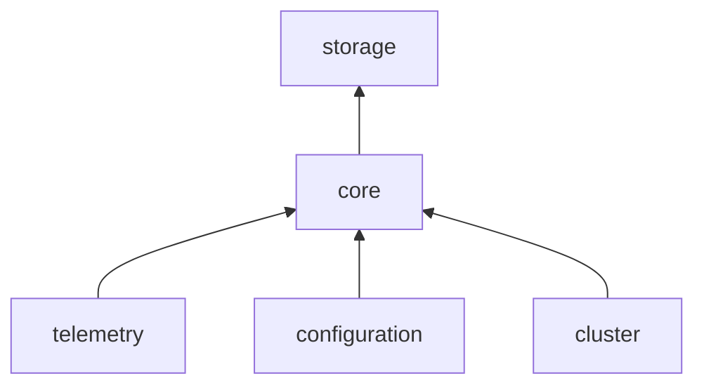

- `CoreModuleProvider` → `TelemetryModule`、`ConfigurationModule`
- `BanyanDBStorageProvider` / ES / JDBC → `CoreModule`（注册 `StorageDAO`、实现 `IBatchDAO` 等）

### 105.2 分析与接入层

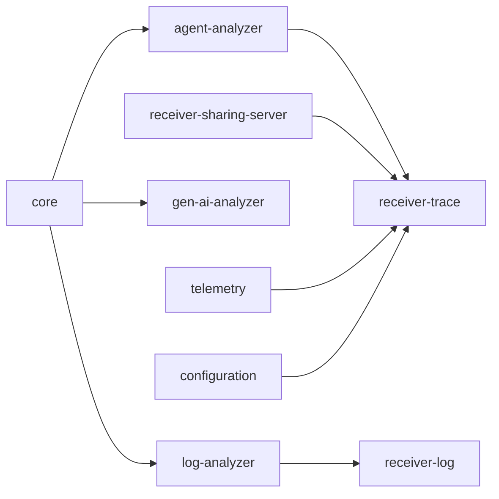

典型声明（源码）：

| Provider | requiredModules |
|----------|-----------------|
| `TraceModuleProvider` | telemetry, **core**, **agent-analyzer**, sharing-server, configuration |
| `AnalyzerModuleProvider` | telemetry, **core**, configuration |
| `GenAIAnalyzerModuleProvider` | **core** |
| `GraphQLQueryProvider` | `[]`（空，但运行期 `find(Core)`、`find(Storage)`） |

Query 模块常声明 **空 requiredModules**，却在 `start()` 中 `find(CoreModule)` / `find(StorageModule)`——**必须在 yml 中启用对应模块**，否则运行期 `ModuleNotFoundRuntimeException`（CLAUDE.md 第 13 条陷阱）。

### 105.3 读路径依赖

GraphQL / PromQL / LogQL / TraceQL 插件 → 依赖 `CoreModule` 各 `*QueryService` → 依赖 `StorageModule` 各 `I*QueryDAO`。

告警：`AlarmModuleProvider` → `CoreModule`（`RunningRule` 读指标缓存）。

### 105.4 依赖声明原则（实践）

1. **凡 `moduleManager.find(X.NAME)`，X 必须出现在本 Provider 的 `requiredModules()`**（含间接调用链上的模块）。
2. **不要**为「可能不存在」的模块写 find 而不声明——用 `moduleManager.has()` 或拆分可选模块。
3. **ClusterModule**：业务代码应优先 `RemoteClientManager`（§84），除非确实需要协调原语。

---

## 106. SpanListenerManager 与 Trace 扩展点

### 106.1 定位

`SpanListenerManager` 由 `CoreModuleProvider` 注册，通过 **Java SPI** 加载 `SpanListener` 实现，供 **OTLP / Zipkin 统一 Trace 管道** 扩展，无需修改 `zipkin-receiver` 或 `otel-receiver` 核心代码。

### 106.2 两阶段模型

| 阶段 | 方法 | 调用方 | 覆盖数据源 |
|------|------|--------|------------|
| Phase 1 | `onOTLPSpan` | `OpenTelemetryTraceHandler` | 仅 OTLP |
| Phase 2 | `onZipkinSpan` | `SpanForward` | OTLP 转换后 + Zipkin HTTP/Kafka |

`SpanListenerResult`：

- `CONTINUE` — 默认，不改变持久化
- `shouldPersist(false)` — Phase 1 可否决写入 Zipkin/Segment
- `additionalTags` — 合并到持久化 Span

Listener **自行** `SourceReceiver.receive` / `ILogAnalyzerService`，结果对象只控制持久化与 Tag（§103）。

### 106.3 懒加载与模块门控

```70:80:oap-server/server-core/src/main/java/org/apache/skywalking/oap/server/core/trace/SpanListenerManager.java
    private void ensureInitialized() {
        // ...
            for (final SpanListener listener : ServiceLoader.load(SpanListener.class)) {
                final String[] required = listener.requiredModules();
```

- **首次** `notifyOTLPPhase` / `notifyZipkinPhase` 时初始化（保证全部模块已 `start`）
- `requiredModules()` 中任一模块未在 yml 启用 → **跳过**该 Listener（info 日志）
- `init(moduleManager)` 后 Listener 可缓存 Service 引用

### 106.4 实现新 Listener 的步骤

1. 实现 `SpanListener`，在 `META-INF/services/...SpanListener` 注册
2. `requiredModules()` 列出 `find()` 用到的模块名
3. 选择 Phase 1 和/或 Phase 2
4. 确保对应 Analyzer/Receiver 模块已在 `application.yml` 启用
5. GenAI 示例见 §103；其它场景可挂 MAL Meter、LAL 日志等

### 106.5 与 Segment AnalysisListener 的区别

| 机制 | 包路径 | 输入 | 用途 |
|------|--------|------|------|
| `AnalysisListener` | `agent-analyzer` … `trace/parser/listener` | **SW SegmentObject** | OAL 拓扑、RPC、Segment 持久化 |
| `SpanListener` | `server-core` … `core/trace` | **OTLP / ZipkinSpan** | 多协议统一扩展（GenAI、第三方 Tag 处理） |

SW 原生 Segment 仍走 `TraceAnalyzer` + `SegmentParserListenerManager`（§7、§16），与 `SpanListener` **并行存在**。

---

## 107. Async Profiler Receiver 与 JFR 解析

§102 覆盖 Java **线程栈** Profile；本节对应 **Async Profiler（JFR 事件）** 模块 `receiver-async-profiler`。

### 107.1 配置项（application.yml）

| 配置 | 含义 |
|------|------|
| `jfrMaxSize` | 单份 JFR 最大字节（默认 30MB） |
| `memoryParserEnabled` | `true`：内存解析；`false`：落盘临时文件再解析（大文件更省堆） |

### 107.2 任务下发

`getAsyncProfilerTaskCommands`：

- 按 `serviceId` 从 `AsyncProfilerTaskCache` 取**单任务**（与 Profile 的列表模式不同）
- 校验 `lastCommandTime`、可选 `serviceInstanceIds` 白名单
- `commandService.newAsyncProfileTaskCommand(task)` → `AsyncProfilerTaskCommand`（含 events、execArgs、duration）
- 写 `AsyncProfilerTaskLogRecord`（`NOTIFIED`）

### 107.3 JFR 数据接收

`collect` 返回 `StreamObserver<AsyncProfilerData>`，按 `memoryParserEnabled` 选择：

- `AsyncProfilerByteBufCollectionObserver` — `ByteBuffer` 累积 → `JFRParser` → `FrameTree`
- `AsyncProfilerFileCollectionObserver` — 写临时文件后解析

解析成功后构造 `JFRProfilingData` Source（含 task、service/instance、事件类型等），`sourceReceiver.receive`；失败打 `AsyncProfilerTaskLogRecord`。

依赖：`StorageModule` 的 `IAsyncProfilerTaskQueryDAO` 校验 taskId；`library-jfr` 模块负责 JFR 二进制格式。

### 107.4 与 Profile / Pprof 对比

| 能力 | 模块 | 数据格式 | Command 类型 |
|------|------|----------|----------------|
| 链路线程栈 | `receiver-profile` | `ThreadSnapshot` | `ProfileTaskCommand` |
| Async Profiler | `receiver-async-profiler` | JFR | `AsyncProfilerTaskCommand` |
| Go pprof | `receiver-profile` / `receiver-pprof` | pprof | `PprofTaskCommand` |

---

## 108. eBPF Receiver 四通道与剖析下发

§39 概述 eBPF 与 Cilium Fetcher；本节聚焦 **`skywalking-ebpf-receiver-plugin`** 的 gRPC Handler 分工（`receiver-ebpf` 须在 yml 启用）。

### 108.1 Handler 矩阵

| Handler | Proto 服务 | 主要职责 |
|---------|------------|----------|
| `EBPFProcessServiceHandler` | Process 注册/心跳 | K8s/Host 进程元数据 → `Process` Source、`ServiceMeta`、`ServiceInstanceUpdate`、`ServiceLabel` |
| `EBPFProfilingServiceHandler` | 剖析任务与数据 | `queryTasks` 下发 `EBPFProfilingTaskCommand`；`collectProfilingData` 流式栈数据 → `EBPFProfilingData` / Schedule Source |
| `ContinuousProfilingServiceHandler` | 持续剖析策略 | 策略同步、`ContinuousProfilingPolicyCommand` / `ContinuousProfilingReportCommand` |
| `AccessLogServiceHandler` | 访问日志 | eBPF 采集的网络访问日志 → LAL/Record 管道 |

进程注册是剖析的前提：`IMetadataQueryDAO` 按最近 5 分钟进程匹配任务目标（`QUERY_TASK_PROCESSES_RANGE_MINUTES`）。

### 108.2 剖析任务查询与 Command

`EBPFProfilingServiceHandler.queryTasks`：

1. 根据请求服务列表解析 `serviceIdList`
2. `taskDAO.queryTasksByServices(..., FIXED_TIME, ...)`
3. 查 metadata 得各服务关联 **processId** 列表
4. `commandService.newEBPFProfilingTaskCommand(task, processId)` — 含 `triggerType`（如 `FIXED_TIME`）、`targetType`（On/Off CPU）、扩展配置 JSON

Agent 侧按 Command 启动 eBPF 程序；采集结果经 `collectProfilingData` 回传，OAP 合并 USER_SPACE / KERNEL_SPACE 栈序（`COMMON_STACK_TYPE_ORDER`）。

### 108.3 Source 与 OAL

eBPF 进程、剖析数据、访问日志对应 `core.source` 包下 Source 与 `ebpf.oal` 等脚本（§29）；存储层有 `EBPFProfilingTaskRecord`、`IEBPFProfilingTaskDAO` 等专用 DAO。

### 108.4 与 Cilium Fetcher 边界

- **eBPF Receiver**：Agent **push** 到 OAP gRPC（11800）
- **Cilium Fetcher**：OAP **pull** Hubble gRPC，映射为 Mesh/网络 Source（§39）

二者可并存，服务网格场景下 Cilium 补 L3/L4，eBPF Agent 补进程级剖析。

---

## 109. Runtime Rule REST 与 Admin 集群收敛

§20 描述 MAL/LAL 热更新原理；本节对齐 **`receiver-runtime-rule`** 模块实现与运维入口（需同时启用 `admin-server`，见 §111）。

### 109.1 启用条件

`application.yml`：

```yaml
admin-server:
  selector: ${SW_ADMIN_SERVER:default}   # 须非 '-'
receiver-runtime-rule:
  selector: ${SW_RECEIVER_RUNTIME_RULE:default}
```

`RuntimeRuleModuleProvider` 的 `requiredModules()` 包含：`AdminServerModule`、`CoreModule`、`StorageModule`、`LogAnalyzerModule`、`AlarmModule`、`TelemetryModule` 等——缺一则启动失败（快速暴露配置错误）。

### 109.2 REST 路由（挂载 Admin HTTP）

默认与 `admin-server` 共用端口（如 **17128**），主要路径（`RuntimeRuleRestHandler`）：

| 方法 | 路径 | 作用 |
|------|------|------|
| POST | `/runtime/rule/addOrUpdate` | 提交/更新规则文件（`catalog`=`MAL`/`LAL`） |
| POST | `/runtime/rule/inactivate` | 停用规则 |
| POST | `/runtime/rule/delete` | 删除 |
| GET | `/runtime/rule/list` | 列出已持久化规则 |
| GET | `/runtime/rule/dump` | 导出 |
| GET | 单规则 fetch | 按 catalog+name 读取 |

参数 `allowStorageChange`、`force` 控制 STRUCTURAL 变更是否允许改存储 schema。官方 API 说明：`docs/en/setup/backend/backend-runtime-rule-api.md`。

### 109.3 集群 Admin gRPC（非 11800）

`RuntimeRuleClusterServiceImpl` 注册在 **Admin 内网 gRPC**（默认 **17129**），与 Agent 公网总线隔离：

- **Suspend / Resume** — STRUCTURAL 变更前暂停各节点旧规则消费
- **Forward** — 非 Main 节点 HTTP 写请求转发到持有锁的 Main

`RuntimeRuleClusterClient` 通过 `AdminClusterChannelManager` 向 peer 发 RPC，deadline 可配置。

### 109.4 DSLManager 定时收敛

`notifyAfterCompleted` 启动单线程调度器：

- 默认 **30s** tick：从 `RuntimeRuleManagementDAO` 对账 → `DSLRuntimeApply` / `DSLRuntimeUnregister`
- 启动时 `StaticRuleLoader.loadAll()` 种子化静态 MAL/LAL，避免重复 apply
- STRUCTURAL：`compile → fireSchemaChanges → verify → commit | rollback`（BanyanDB 需 `awaitRevisionApplied` fence，§21、CLAUDE.md）

附录 V 为 STRUCTURAL 变更时集群协作时序。

---

## 110. Configuration Discovery 实现细节

§61 描述行为；本节补充 **Watcher → Handler** 源码链（模块 `configuration-discovery`）。

### 110.1 配置中心 Key

`AgentConfigurationsWatcher` 继承 `ConfigChangeWatcher`，监听 **`agentConfigurations`**（属于 `ConfigurationDiscoveryModule`，非 `core` 本地配置）：

```36:57:oap-server/server-receiver-plugin/configuration-discovery-receiver-plugin/src/main/java/org/apache/skywalking/oap/server/receiver/configuration/discovery/AgentConfigurationsWatcher.java
    public AgentConfigurationsWatcher(ModuleProvider provider) {
        super(ConfigurationDiscoveryModule.NAME, provider, "agentConfigurations");
        // ...
    }

    @Override
    public void notify(ConfigChangeEvent value) {
        if (value.getEventType().equals(EventType.DELETE)) {
            settingsString = null;
            this.agentConfigurationsTable = new AgentConfigurationsTable();
        } else {
            settingsString = value.getNewValue();
            AgentConfigurationsReader agentConfigurationsReader =
                new AgentConfigurationsReader(new StringReader(value.getNewValue()));
            this.agentConfigurationsTable = agentConfigurationsReader.readAgentConfigurationsTable();
        }
    }
```

`configuration` 模块 selector 为 `grpc`/`apollo`/`etcd` 等时，远程变更触发 `notify`，OAP 内存表即时更新，**无需重启 OAP**。

### 110.2 空配置语义

未知 `service` 返回 `emptyAgentConfigurations`：内容为空 Map，但 **uuid 固定为 EMPTY 的 SHA512**：

```41:44:oap-server/server-receiver-plugin/configuration-discovery-receiver-plugin/src/main/java/org/apache/skywalking/oap/server/receiver/configuration/discovery/AgentConfigurationsWatcher.java
        this.emptyAgentConfigurations = new AgentConfigurations(
            null, new HashMap<>(),
            Hashing.sha512().hashString("EMPTY", StandardCharsets.UTF_8).toString()
        );
```

避免 Agent 将「服务端无配置」误判为「配置被删光」而清空本地缓存。

### 110.3 fetchConfigurations RPC

```62:76:oap-server/server-receiver-plugin/configuration-discovery-receiver-plugin/src/main/java/org/apache/skywalking/oap/server/receiver/configuration/discovery/handler/grpc/ConfigurationDiscoveryServiceHandler.java
    public void fetchConfigurations(final ConfigurationSyncRequest request,
                                    final StreamObserver<Commands> responseObserver) {
        AgentConfigurations agentConfigurations = agentConfigurationsWatcher.getAgentConfigurations(
            request.getService());
        if (null != agentConfigurations) {
            if (disableMessageDigest || !Objects.equals(agentConfigurations.getUuid(), request.getUuid())) {
                ConfigurationDiscoveryCommand configurationDiscoveryCommand =
                    newAgentDynamicConfigCommand(agentConfigurations);
                commandsBuilder.addCommands(configurationDiscoveryCommand.serialize().build());
            }
        }
        responseObserver.onNext(commandsBuilder.build());
```

- `disableMessageDigest=true`（模块配置）时**每次**全量下发（调试用途）
- 正常模式：仅 `request.uuid != 服务端 uuid` 时下发 `ConfigurationDiscoveryCommand`（含 `KeyStringValuePair` 列表 + 新 uuid）

`ConfigurationDiscoveryCommand` **不由** `CommandService` 工厂创建（§62），Handler 内 `newAgentDynamicConfigCommand` 直接构造。

### 110.4 与 Trace 热路径隔离

动态配置通过独立 `ConfigurationDiscoveryService` 拉取；Trace/JVM 响应中的 `Commands` 可携带 Profile/eBPF 等任务，**不混用**配置块，降低 Segment 上报包体与耦合。

---

## 111. Admin Server 与运维侧模块

OAP 除 **Core REST 12800 / gRPC 11800** 外，还有面向运维与管控的独立模块（均在 `application.yml` 顶层声明）。

### 111.1 admin-server

- 提供 **Admin HTTP**（默认 17128）与 **Admin 内网 gRPC**（默认 17129）
- `HTTPHandlerRegister` / `GRPCHandlerRegister` 供 `receiver-runtime-rule`、`dsl-debugging` 等挂载
- `AdminClusterChannelManager`：Runtime Rule 集群 RPC 通道（§109）
- 与 Agent 采集端口分离，降低暴露面

### 111.2 其它运维模块速览

| 模块 | 典型用途 |
|------|----------|
| `status` | OAP 节点状态查询 |
| `inspect` | 存储/模型巡检 |
| `ui-management` | UI 模板、Dashboard CRUD（`UITemplateManagementService`） |
| `dsl-debugging` | LAL/MAL 调试 API（生产慎用） |
| `health-checker` | 健康检查端点 |
| `configuration` | 动态配置拉取（Apollo/etcd/Nacos…），驱动 §110 Watcher |
| `exporter` | 指标/Trace/Log 导出（§68） |
| `ai-pipeline` | 外部 AI HTTP 集成（§70） |
| `aws-firehose` | AWS Firehose 接入 |

### 111.3 启用关系示例

```
admin-server (ON)  ←── receiver-runtime-rule (ON)
configuration (grpc/apollo/…)  ←── configuration-discovery (ON)
core (ON)  ←── 几乎所有 receiver / analyzer / query
storage (ON)  ←── query / runtime-rule / ebpf profiling DAO
```

运维排障时先确认 **selector 非 `-'`** 且依赖模块已在 §105 依赖图中存在。

---

## 112. application.yml 全模块功能索引

§96 说明 selector 机制；下表为当前 `server-starter/.../application.yml` 中**全部顶层模块**的功能索引（便于对照环境变量与裁剪部署）。

### 112.1 内核与基础设施

| 模块 | 环境变量示例 | 功能 |
|------|--------------|------|
| `cluster` | `SW_CLUSTER` | 集群协调（standalone/ZK/K8s/etcd/Nacos/Consul） |
| `core` | `SW_CORE` | OAP 内核：流处理、Remote、gRPC/REST、TTL、Hierarchy 开关 |
| `storage` | `SW_STORAGE` | 存储插件（banyandb/elasticsearch/mysql/h2/…） |
| `telemetry` | `SW_TELEMETRY` | OAP 自监控 Prometheus |
| `configuration` | `SW_CONFIGURATION` | 动态配置中心接入 |
| `health-checker` | — | 健康检查 |

### 112.2 分析与 DSL

| 模块 | 环境变量 | 功能 |
|------|----------|------|
| `agent-analyzer` | `SW_AGENT_ANALYZER` | Trace 监听、采样、Segment 分析 |
| `log-analyzer` | `SW_LOG_ANALYZER` | LAL/MAL 日志规则 |
| `event-analyzer` | `SW_EVENT_ANALYZER` | 事件分析 |
| `gen-ai-analyzer` | `SW_GENAI_ANALYZER` | GenAI 指标与 SpanListener |

### 112.3 数据接入（Receiver / Fetcher）

| 模块 | 功能 |
|------|------|
| `receiver-sharing-server` | 独立 gRPC/HTTP 端口（§87） |
| `receiver-register` / `receiver-trace` / `receiver-jvm` / `receiver-clr` | 注册、Trace、JVM、CLR |
| `receiver-profile` / `receiver-async-profiler` / `receiver-pprof` | 剖析三件套（§102、§107） |
| `receiver-log` / `receiver-browser` / `receiver-event` | 日志、前端、事件 |
| `receiver-meter` / `receiver-otel` / `receiver-zipkin` | 原生 Meter、OTel、Zipkin |
| `receiver-ebpf` | eBPF 四 Handler（§108） |
| `receiver-telegraf` / `receiver-zabbix` | Telegraf、Zabbix |
| `service-mesh` / `envoy-metric` | Mesh ALS、Envoy 指标 |
| `kafka-fetcher` / `cilium-fetcher` | Kafka 消费、Cilium 拉取 |
| `configuration-discovery` | Agent 动态配置 gRPC（§110） |
| `aws-firehose` | AWS Firehose |

### 112.4 查询与告警

| 模块 | 功能 |
|------|------|
| `query` | GraphQL 主查询 |
| `query-zipkin` | Zipkin API / zipkin-lens |
| `promql` / `logql` / `traceQL` | PromQL、LogQL、TraceQL |
| `alarm` | 告警内核 |

### 112.5 管控与扩展

| 模块 | 功能 |
|------|------|
| `exporter` | 向外导出 telemetry |
| `admin-server` | Admin HTTP/gRPC 宿主（§111） |
| `receiver-runtime-rule` | MAL/LAL 热更新 REST（§109） |
| `dsl-debugging` | DSL 在线调试 |
| `ui-management` | UI 模板管理 |
| `status` / `inspect` | 状态与巡检 |
| `ai-pipeline` | AI 服务管道 |

### 112.6 最小化部署参考

| 场景 | 可省略（selector=`-`）示例 |
|------|---------------------------|
| 仅 Trace+指标 | zipkin、ebpf、browser、kafka-fetcher、runtime-rule |
| 无 UI 模板 API | ui-management |
| 无在线改规则 | admin-server + receiver-runtime-rule |

**注意**：省略模块后，任何 `moduleManager.find(被省略模块)` 的代码路径会在运行期失败；裁剪前用 §105 核对 `requiredModules()` 与调用链。

---

## 113. Pprof Receiver 与 Go 剖析任务

§102 在 `ProfileTaskServiceHandler.goProfileReport` 中已支持 Go pprof；**独立模块** `receiver-pprof` 提供专用 Proto 与 UI GraphQL（`pprof.graphqls`），与 Java Profile / Async Profiler 并列。

### 113.1 模块与配置

- Proto：`apm-network` 下 `pprof/v10`（`PprofTaskGrpc`）
- yml：`receiver-pprof`，配置项与 Async Profiler 对称：`pprofMaxSize`、`memoryParserEnabled`
- 依赖：`CoreModule`（`PprofTaskCache`、`CommandService`、`SourceReceiver`）、`StorageModule`（`IPprofTaskQueryDAO`）

### 113.2 任务下发

`getPprofTaskCommands`：

- 从 `PprofTaskCache.getPprofTaskList(serviceId)` 取候选任务
- 过滤 `lastCommandTime` 与 `serviceInstanceIds` 白名单
- 在**未过期**任务中选 `createTime` 最小者（最早待执行）
- `commandService.newPprofTaskCommand(task)` → `PprofTaskCommand`（events、duration、dumpPeriod）
- `PprofTaskLogRecord` 记录 `NOTIFIED`

### 113.3 数据接收

`collect` 流式 `PprofData`：

- `PprofByteBufCollectionObserver` / `PprofFileCollectionObserver`（与 §107 JFR 相同内存/文件策略）
- `PprofParser` + `PprofSegmentParser` 解析
- 写入 `PprofProfilingData` 或相关 Record/Source（与 Profile 栈记录模型对齐，查询走 `PprofQuery` GraphQL）

### 113.4 三剖析通路对照

| 通路 | 模块 | Command | 典型语言 |
|------|------|---------|----------|
| 线程栈 | `receiver-profile` | `ProfileTaskCommand` | Java |
| JFR 事件 | `receiver-async-profiler` | `AsyncProfilerTaskCommand` | Java |
| pprof | `receiver-pprof`（+ Profile 内嵌） | `PprofTaskCommand` | Go |

---

## 114. AWS Firehose Receiver 与 OTel 指标汇入

`aws-firehose` 模块为 **HTTP 推送** 入口，将 AWS Kinesis Data Firehose 转发的 OTel 指标批次接入 OAP，**复用** `receiver-otel` 的 MAL 处理链。

### 114.1 架构位置

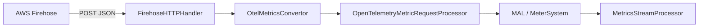

`AWSFirehoseReceiverModuleProvider.requiredModules()` 仅 **`OtelMetricReceiverModule`** — Firehose 本身不实现 OTel 解析，必须同时启用 `receiver-otel`。

### 114.2 HTTP 接口

- 路径：`POST /aws/firehose/metrics`（挂在 Firehose **独立** `HTTPServer`，非 Core 12800）
- 请求体：`FirehoseReq` JSON，`records[].data` 为 Base64 编码的 **delimited** `ExportMetricsServiceRequest`（OTel Collector 兼容格式）
- 鉴权：可选请求头 `X-Amz-Firehose-Access-Key`，与配置 `firehoseAccessKey` 比对；不匹配返回 401

```60:67:oap-server/server-receiver-plugin/aws-firehose-receiver/src/main/java/org/apache/skywalking/oap/server/receiver/aws/firehose/FirehoseHTTPHandler.java
            for (RequestData record : firehoseReq.getRecords()) {
                final ByteArrayInputStream byteArrayInputStream = new ByteArrayInputStream(
                    Base64.getDecoder().decode(record.getData()));
                ExportMetricsServiceRequest request;
                while ((request = ExportMetricsServiceRequest.parseDelimitedFrom(byteArrayInputStream)) != null) {
                    openTelemetryMetricRequestProcessor.processMetricsRequest(
                        OtelMetricsConvertor.convertExportMetricsRequest(request));
```

### 114.3 与 Prometheus scrape 的区别

| 维度 | Prometheus/OTel gRPC Receiver | Firehose |
|------|------------------------------|----------|
| 方向 | Agent/Collector **推** 到 OAP gRPC | AWS **推** 到 OAP HTTP |
| 配置 | `receiver-otel` | `aws-firehose` + `receiver-otel` |
| 规则 | `otel-rules/*.yaml` MAL | 同上（转换后走同一 Processor） |

官方安装说明：`docs/en/setup/backend/aws-firehose-receiver.md`。

---

## 115. dsl-debugging 在线调试会话

`dsl-debugging` 模块在 **Admin HTTP**（§111）上提供 OAL/MAL/LAL 规则的**采样调试**，与 Runtime Rule 的「持久化上线」分离——调试会话不写存储 catalog，仅内存采样。

### 115.1 启用与依赖

- yml：`dsl-debugging` + **`admin-server`**（`DSLDebuggingModuleProvider.requiredModules`: AdminServerModule、CoreModule）
- OAL 生成代码在 `SW_DSL_DEBUGGING_INJECTION_ENABLED` 时注入 `GateHolder` / `OALDebug.capture*`（§35），供运行时挂接 Recorder

### 115.2 会话模型

核心类型：

| 类 | 职责 |
|----|------|
| `DebugSessionRegistry` | 会话 ID → `DebugSession`，上限由 `SessionLimits` 控制 |
| `DebugSession` | 绑定 `RuleKey`（catalog + 规则名）、多节点 `ExecutionRecord` |
| `*DebugRecorderFactory` | OAL / MAL / LAL 各注册 Recorder 实现 |
| `Sample` | 单步 DSL 片段输入/输出、`sourceLine`、`continueOn` |

集群模式：`DSLDebuggingClusterClient` + `DSLDebuggingClusterServiceImpl` 向 peer 安装/采集/停止会话（Admin gRPC，与 Runtime Rule 共用 Admin 总线思想）。

### 115.3 REST 形态（节选）

挂载 `admin-server` 下 `/dsl-debugging/*`（`DSLDebuggingRestHandler`）：

- 安装会话、按 clientId 停止、拉取 `GET /dsl-debugging/session/{id}` 聚合结果
- 响应 JSON 含 `rule`（原文）、`nodes[]`（每 OAP 节点 `records[]` → `samples[]`）

**安全**：调试 API 可观测规则执行中间态，生产环境默认关闭或严格网络隔离；GraphQL `enableLogTestTool` 同类风险（§96 `query.graphql`）。

### 115.4 与 Runtime Rule 边界

| 能力 | dsl-debugging | receiver-runtime-rule |
|------|---------------|------------------------|
| 目的 | 排障、验证 DSL 语义 | 集群持久化 MAL/LAL |
| 存储 | 内存样本 | `RuntimeRuleManagementDAO` |
| Schema | 不触发 DDL | STRUCTURAL 触发 `StorageManipulationOpt.withSchemaChange()` |

---

## 116. StorageManipulationOpt 四种模式详解

§20、§109 已引用该类型；本节基于 `StorageManipulationOpt.java` 类 Javadoc 梳理 **ModelRegistry → ModelInstaller** 链上的策略对象。

### 116.1 传递链

```
调用方（Boot / Runtime Rule / MeterSystem.create）
  → ModelRegistry.add(model, opt)
  → CreatingListener.whenCreating / whenRemoving
  → BanyanDBIndexInstaller / ESInstaller / JDBCInstaller（opt 分支）
  → opt.recordOutcome(...) / opt.recordModRevision(rev)
```

单个 `opt` 实例在一次 manipulate 过程中累积 **ResourceOutcome** 列表与 **maxModRevision**（BanyanDB DDL 用）。

### 116.2 四种 Mode 对照

| 工厂方法 | Mode | 典型调用方 | DDL | shape 不一致时 |
|----------|------|------------|-----|----------------|
| `withSchemaChange()` | WITH_SCHEMA_CHANGE | Runtime Rule Main、`/addOrUpdate` | 创建/更新/删除 | 在线 reshape（BanyanDB update、ES mapping append） |
| `schemaCreateIfAbsent()` | SCHEMA_CREATE_IF_ABSENT | OAP 启动静态 MAL/LAL、流处理器注册模型 | 仅补缺 | `SKIPPED_SHAPE_MISMATCH`，不静默改表 |
| `verifySchemaOnly()` | VERIFY_SCHEMA_ONLY | `init=false` 非 init OAP 启动 | 无 | **抛异常**，进程退出 |
| `withoutSchemaChange()` | WITHOUT_SCHEMA_CHANGE | Runtime Rule Peer tick、`/inactivate` | 零 RPC | 本地 MetadataRegistry 填充，不报错 |

`/inactivate` 使用 `withoutSchemaChange()`：**保留**后端 schema 与数据，仅卸载 OAP 内编译产物与分发，便于下次 `addOrUpdate` 快速恢复。

### 116.3 Outcome 枚举（运维可读）

| Outcome | 含义 |
|---------|------|
| `CREATED` / `UPDATED` / `DROPPED` | DDL 已执行 |
| `EXISTING_MATCHED` | 无需变更 |
| `SKIPPED_SHAPE_MISMATCH` | 启动期发现不一致，须走 Runtime Rule 修复 |
| `SKIPPED_NOT_ALLOWED` | 策略禁止（Peer 节点删表等） |
| `MISSING` / `EXISTING_MISMATCH` | 需人工介入 |

`hasShapeMismatch()` / `firstShapeMismatch()` 供 `/runtime/rule/list` 与 REST 错误体展示 diff。

### 116.4 与 MeterSystem 联动

`MeterSystem.create` 在 `whenCreating` 后检查 `opt.hasShapeMismatch()` — 若 true 则**回滚**本地注册，避免「规则文件声明的字段」与「存储实际 shape」不一致的指标继续聚合（防止写成功但查询异常）。

---

## 117. BanyanDB SchemaWatcher 与 DDL Fence

§21 提到 fence；本节对齐 `library-banyandb-client` 的 `SchemaWatcher` 与 `BanyanDBIndexInstaller.fenceOnRevision`。

### 117.1 为何需要 Fence

BanyanDB 的 schema 变更经 etcd 提交后，**数据节点**异步刷新本地缓存。若在 DDL 完成前立即写入新 shape 的 measure/stream，可能出现：

- 协调节点已 accept 写入，某 data node 仍用旧 schema → 查询空洞或写入失败

旧做法「轮询 `findMeasure` 直到可读」已被 **SchemaBarrierService** RPC 取代。

### 117.2 三种 RPC（SchemaWatcher）

| 方法 | 场景 |
|------|------|
| `awaitRevisionApplied(minRevision, timeout)` | Create/Update 返回非零 `mod_revision` 后，等待**全局**修订号被所有 data node 观测 |
| `awaitSchemaApplied(keys, minRevisions, timeout)` | 需确认具体 key 列表（如某 measure 的 index rule + binding） |
| `awaitSchemaDeleted(keys, timeout)` | Delete 返回 `mod_revision==0` 时，按 key 等待删除可见 |

`minRevision <= 0` 时 `awaitRevisionApplied` 立即返回（无 fence）。

### 117.3 OAP 侧集成

`StorageManipulationOpt.recordModRevision(rev)` 在每次 registry 写操作后取 max revision；`BanyanDBIndexInstaller` 在 `createTable(model, opt)` 末尾：

```241:253:oap-server/server-storage-plugin/storage-banyandb-plugin/src/main/java/org/apache/skywalking/oap/server/storage/plugin/banyandb/BanyanDBIndexInstaller.java
    private void fenceOnRevision(final BanyanDBClient client, final StorageManipulationOpt opt,
                                 final String context) throws BanyanDBException {
        final long rev = opt.getMaxModRevision();
        if (rev <= 0L) {
            return;
        }
        final SchemaWatcher.Result result = client.getSchemaWatcher().awaitRevisionApplied(rev, FENCE_TIMEOUT);
        if (!result.isApplied()) {
            log.warn("BanyanDB schema-watch fence did NOT confirm revision {} within {} ms for {}; "
                + "proceeding anyway. Laggards: {}", rev, FENCE_TIMEOUT.toMillis(), context, result.getLaggards());
```

- 默认 **2s** 超时（`FENCE_TIMEOUT`）；未确认时 **WARN 继续**（不阻塞 apply 完成），由后续写入暴露 lagging 节点
- Peer 节点 `withoutSchemaChange()` 通常 `rev==0`，fence 为 no-op

附录 W 为 DDL → fence → 数据写入时序。

### 117.4 禁止复活的反模式

不要在 DDL 后自行 `while (!findMeasure(...)) sleep` — 与当前实现及项目规范冲突；统一走 `getSchemaWatcher().awaitRevisionApplied` 或 `awaitSchemaDeleted`。

---

## 118. GraphQL Resolver 与 query-protocol 映射

§27、附录 H 描述读路径；本节按 `GraphQLQueryProvider.prepare()` 列出 **`.graphqls` 文件 ↔ Resolver ↔ Core QueryService** 映射，便于 UI 开发者定位后端实现。

### 118.1 注册方式

`GraphQLQueryProvider` 使用 `graphql-java-tools` 的 `SchemaParserBuilder`：

- 从 classpath `query-protocol/*.graphqls`（子模块 **skywalking-query-protocol**）加载 schema
- 每个 `.file(...).resolvers(new XxxQuery(getManager()))` 绑定 Resolver 类
- `start()` 将 `GraphQLQueryHandler` 注册到 **Core** 的 `HTTPHandlerRegister`（默认挂 REST 12800，`POST` GraphQL）

`requiredModules()` 为空，但 Resolver 构造器内普遍 `find(CoreModule)` / `find(StorageModule)` — 须启用 core + storage（§105）。

### 118.2 Schema 与 Resolver 对照表

| graphqls 文件 | Resolver 类 | 主要能力 |
|---------------|-------------|----------|
| `common.graphqls` | `Query`, `Mutation`, `HealthQuery` | 健康检查、通用变更 |
| `metadata.graphqls` | `MetadataQuery` | 服务/实例/端点元数据 |
| `metadata-v2.graphqls` | `MetadataQueryV2` | 元数据 v2、按需日志依赖 |
| `topology.graphqls` | `TopologyQuery` | 服务拓扑 |
| `metrics-v3.graphqls` | `MetricsExpressionQuery` | **MQE** 指标查询（推荐） |
| `metric.graphqls` | `MetricQuery` | 旧版单指标（deprecated 路径仍保留） |
| `metrics-v2.graphqls` | `MetricsQuery` | 多指标 v2（deprecated since 9.5） |
| `aggregation.graphqls` | `AggregationQuery` | 聚合查询 |
| `top-n-records.graphqls` | `TopNRecordsQuery` | TopN 记录 |
| `trace.graphqls` | `TraceQuery` | Trace 查询 v1 |
| `trace-v2.graphqls` | `TraceQueryV2` | Trace 查询 v2（灵活查询） |
| `alarm.graphqls` | `AlarmQuery` | 告警 |
| `log.graphqls` | `LogQuery`, `LogTestQuery` | 日志查询 / LAL 测试工具 |
| `profile.graphqls` | `ProfileQuery`, `ProfileMutation` | Java 链路剖析 |
| `async-profiler.graphqls` | `AsyncProfilerQuery/Mutation` | Async Profiler |
| `pprof.graphqls` | `PprofQuery`, `PprofMutation` | Go pprof |
| `ebpf-profiling.graphqls` | `EBPFProcessProfilingQuery/Mutation` | eBPF 剖析 |
| `continuous-profiling.graphqls` | `ContinuousProfilingQuery/Mutation` | 持续剖析 |
| `browser-log.graphqls` | `BrowserLogQuery` | 前端日志 |
| `event.graphqls` | `EventQuery` | 事件 |
| `record.graphqls` | `RecordsQuery` | 通用 Record |
| `hierarchy.graphqls` | `HierarchyQuery` | 服务层级（§104） |
| `ondemand-pod-log.graphqls` | `OndemandLogQuery` | K8s 按需 Pod 日志（需 `enableOnDemandPodLog`） |

### 118.3 Resolver 典型调用链

以 `TraceQueryV2` 为例：

```
GraphQL 请求
  → TraceQueryV2.getTrace(...)
    → CoreModule.TraceQueryService / 相关 DAO
      → StorageModule.ITraceQueryDAO
        → BanyanDB / ES / JDBC 实现
```

`MetricsExpressionQuery` 则进入 `MQE` 运行时（§46），而非直接 DAO。

### 118.4 与 PromQL / LogQL / Zipkin API 的关系

| 入口 | 模块 | 协议 |
|------|------|------|
| GraphQL | `query` | UI 主通道（§118） |
| PromQL | `promql` | Grafana 指标 |
| LogQL | `logql` | Grafana 日志 |
| Zipkin API | `query-zipkin` | Zipkin lens |
| TraceQL | `traceQL` | 统一 Trace 查询 DSL |

Booster UI（`skywalking-ui` 子模块）主要消费 GraphQL；第三方集成可选 PromQL/LogQL。

---

## 附录 W：BanyanDB DDL 与 Schema Fence

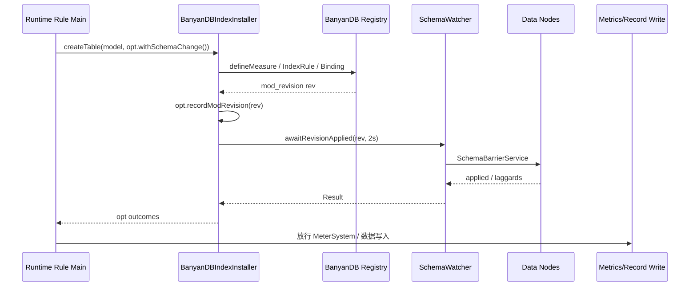

---

## 附录 V：Runtime Rule STRUCTURAL 变更与集群 Suspend

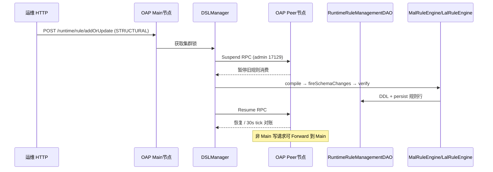

---

## 附录 U：Profile 剖析任务闭环

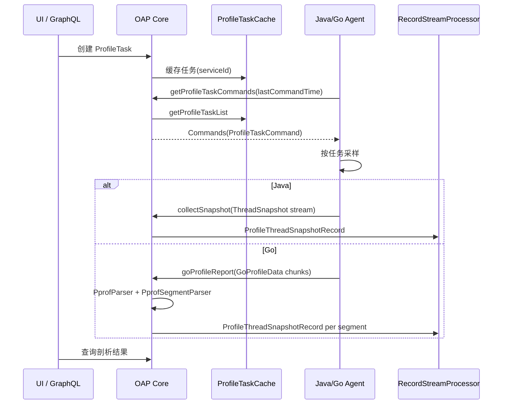

---

## 附录 T：OAP 启动时序（ModuleManager）

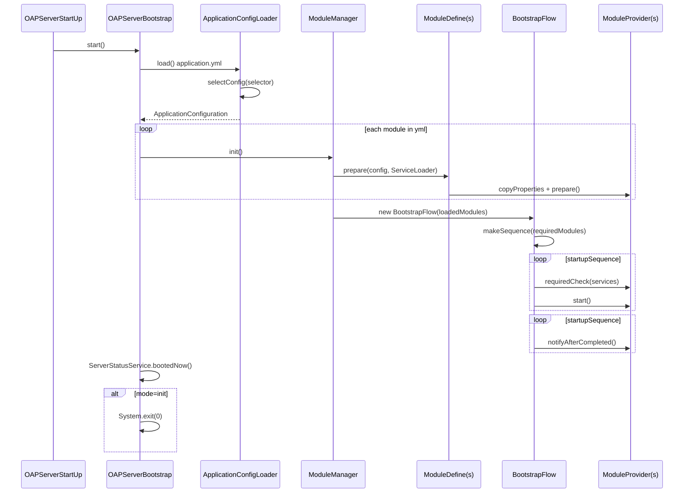

---

## 附录 K：MAL 从 Scrape 到存储

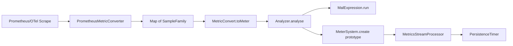

---

## 附录 L：TimeBucket 与查询时间窗

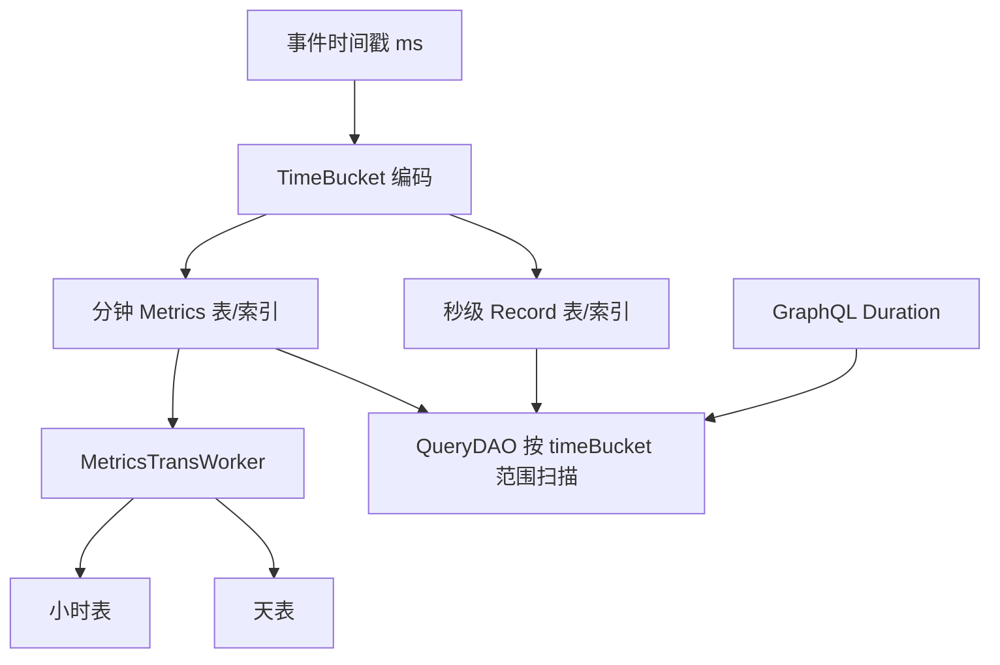

---

## 附录 M：Remote L1 → 对端 L2 消息流

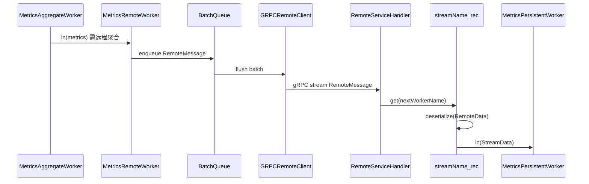

---

## 附录 N：Stream 处理器与实体对照

| 处理器 | 基类 | 代表实体 | 是否远程 L2 |
|--------|------|----------|-------------|
| MetricsStreamProcessor | Metrics | ServiceTraffic、OAL 生成类、MAL Function | 是（`_rec`） |
| RecordStreamProcessor | Record | SegmentRecord、LogRecord、AlarmRecord | 一般否 |
| TopNStreamProcessor | TopN | TopNServiceDatabaseStatement | 视 OAL 配置 |
| NoneStreamProcessor | NoneStream | ProfileTaskRecord、EBPFProfilingTaskRecord | 否 |

---

## 附录 O：ISource 分发到 Metrics 路径

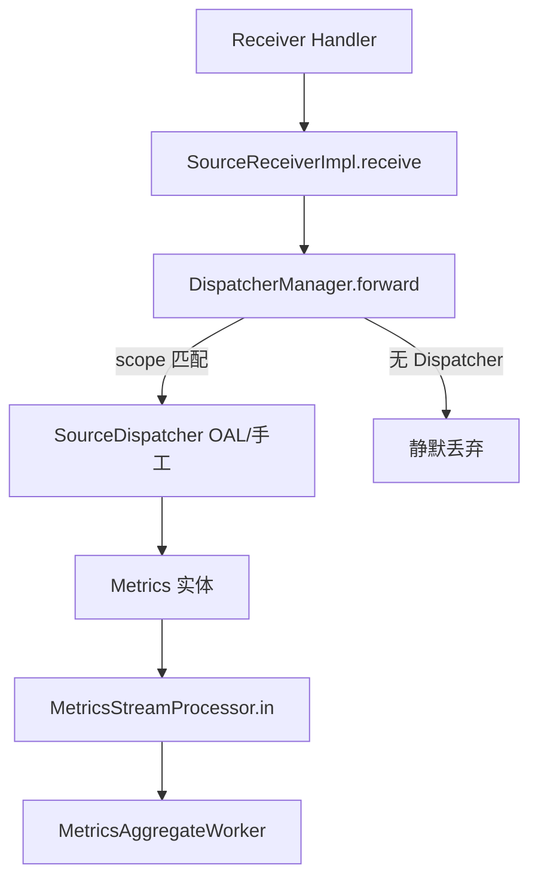

手工 Dispatcher（如 `ServiceTrafficDispatcher`）与 OAL 生成 Dispatcher **并存**；`source.prepare()` 在 dispatch 前统一执行。

---

## 附录 P：Kafka Fetcher 与 gRPC Receiver 汇合

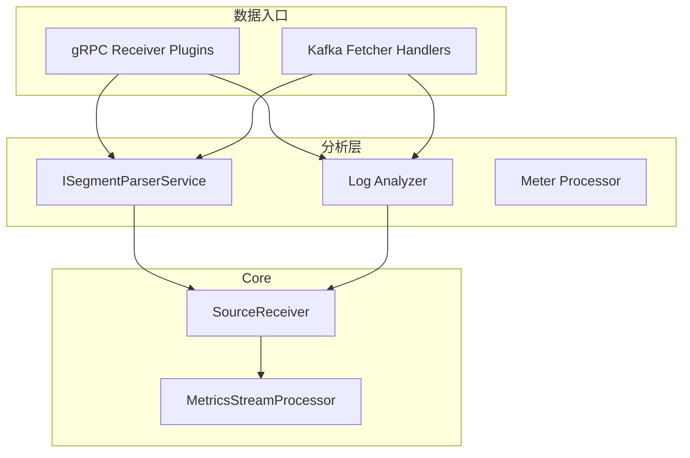

---

## 附录 Q：告警实时评估时序

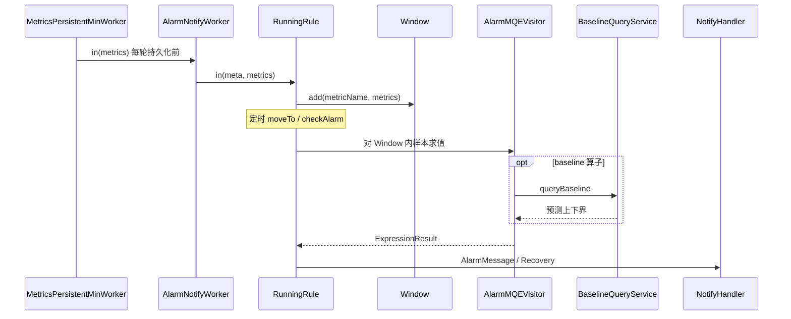

---

## 附录 R：告警 Firing → 存储与 Webhook

```mermaid
sequenceDiagram
    participant AC as AlarmCore 定时器
    participant RR as RunningRule
    participant CB as AlarmCallback 链
    participant ASP as AlarmStandardPersistence
    participant WH as WebhookCallback
    participant UI as AlarmRecord 存储

    AC->>RR: check()
    RR-->>AC: AlarmMessage 列表
    AC->>CB: doAlarm(firing)
    CB->>ASP: AlarmRecord + TagAutocomplete
    ASP->>UI: RecordStreamProcessor
    AC->>CB: 按 rule.hooks 分发
    CB->>WH: HTTP POST
```

---

## 附录 S：Zipkin Span 汇入 OAP

```mermaid
flowchart TB
    ZK[Zipkin HTTP/Kafka] --> SF[SpanForward.send]
    SF --> SAMP[采样]
    SAMP --> ZS[ZipkinSpan Source]
    ZS --> DISP[ZipkinSpanRecordDispatcher]
    DISP --> REC[ZipkinSpanRecord]
    ZS --> OAL[ZipkinService/Relation Source]
    OAL --> MSP[MetricsStreamProcessor]
    ZS --> SL[SpanListenerManager.notifyZipkinPhase]
```

---

## 附录 I：OAL 编译与运行时注册时序

```mermaid
sequenceDiagram
    participant MP as ModuleProvider.start
    participant OAL as OALEngineLoaderService
    participant ENG as OALEngineV2
    participant GEN as OALClassGeneratorV2
    participant SP as MetricsStreamProcessor
    participant DM as DispatcherManager

    MP->>OAL: load(CoreOALDefine)
    OAL->>ENG: start(classLoader)
    ENG->>GEN: generateClassAtRuntime
    OAL->>ENG: notifyAllListeners
    ENG->>SP: streamAnnotationListener.notify(metricsClass)
    SP->>SP: create() workers + schema
    ENG->>DM: addIfAsSourceDispatcher(dispatcherClass)
```

---

## 附录 J：告警双路径协作

```mermaid
flowchart TB
    subgraph Write["写入路径（实时）"]
        PW[MetricsPersistentWorker]
        ANW[AlarmNotifyWorker]
        NH[NotifyHandler.notify]
        RR[RunningRule.in 填窗口]
    end
    subgraph Tick["定时路径（每分钟）"]
        AC[AlarmCore scheduled]
        CHK[RunningRule.check MQE]
        CB[AlarmCallback Webhook等]
    end
    PW --> ANW --> NH --> RR
    AC --> CHK --> CB
    RR -.-> CHK
```

---

## 附录 G：多协议 Trace 汇入总览

```mermaid
flowchart TB
    subgraph In["Trace 入口"]
        SW[SkyWalking gRPC Segment]
        ZK[Zipkin HTTP]
        OT[OTLP Trace]
        KF[Kafka segments topic]
    end
    subgraph Proc["处理"]
        TA[TraceAnalyzer]
        SF[SpanForward]
        SLM[SpanListenerManager]
    end
    subgraph Out["输出"]
        SR[SourceReceiver / OAL]
        REC[SegmentRecord / ZipkinSpanRecord]
    end
    SW --> TA --> SR
    SW --> TA --> REC
    ZK --> SF --> SLM --> SR
    ZK --> SF --> REC
    OT --> SF
    KF --> TA
```

---

## 附录 H：GraphQL 读路径分层

```mermaid
flowchart TB
    UI[Booster UI] --> GQL[GraphQL HTTP]
    GQL --> R[Resolvers]
    R --> CORE[Core QueryServices]
    CORE --> DAO[Storage Query DAOs]
    DAO --> ES[(ES / BanyanDB / JDBC)]
    R --> MQE[MetricsExpressionQuery → MQEVisitor]
    MQE --> DAO
```

---

## 附录 D：Runtime Rule Structural 变更时序

```mermaid
sequenceDiagram
    participant Op as Operator
    participant Main as OAP Main
    participant Peers as OAP Peers
    participant Store as Management DAO
    participant DB as Metrics Backend

    Op->>Main: POST /runtime/rule/addOrUpdate
    Main->>Peers: Suspend RPC
    Main->>Main: classify → compile → apply
    Main->>DB: schema change (withSchemaChange)
    Main->>Main: verify (e.g. BanyanDB isExists)
    Main->>Store: persist rule row
    Main->>Peers: Resume RPC
    Peers->>Peers: tick: read row, apply withoutSchemaChange
```

---

## 附录 E：日志 + 指标双 DSL 数据流

```mermaid
flowchart LR
    LOG[Log gRPC/Kafka] --> LA[LogAnalyzer]
    LA --> LAL[LAL DSL parse/build]
    LAL --> REC[LogRecord sink]
    LAL --> SAMP[Meter samples]
    SAMP --> MAL[log-mal MetricConvert]
    MAL --> MS[MeterSystem]
    MS --> MSP[MetricsStreamProcessor]
    REC --> RSP[RecordStreamProcessor]
```

---

## 附录 F：存储插件对比简表

| 维度 | Elasticsearch | BanyanDB | JDBC |
|------|---------------|----------|------|
| 典型场景 | 成熟、生态广 | SkyWalking 原生、观测优化 | 小规模/演示 |
| Schema | Index template | Measure/Stream + revision fence | 同步 DDL |
| 批量写 | Bulk API | BanyanDBBatchDAO | Batch INSERT |
| Trace 优化 | 索引分离 | TraceGroup 原生 | 通用表 |
| 热更新 verify | 索引存在性检查 | describe + diff | 表存在性 |

---

## 附录 A：Trace 全链路时序图

```mermaid
sequenceDiagram
    participant Agent
    participant Handler as TraceSegmentReportServiceHandler
    participant Parser as SegmentParserService
    participant Analyzer as TraceAnalyzer
    participant Listener as AnalysisListener
    participant Receiver as SourceReceiver
    participant DM as DispatcherManager
    participant OAL as OAL SourceDispatcher
    participant MSP as MetricsStreamProcessor
    participant Store as Storage

    Agent->>Handler: gRPC collect(SegmentObject)
    Handler->>Parser: send(segment)
    Parser->>Analyzer: doAnalysis()
    Analyzer->>Listener: parse Entry/Exit/Local...
    Listener->>Receiver: receive(ISource)
    Receiver->>DM: forward(source)
    DM->>OAL: dispatch(source)
    OAL->>MSP: in(Metrics)
    Note over MSP: L1 merge → Remote/L2 → PersistenceTimer
    MSP->>Store: IBatchDAO.flush
```

---

## 附录 B：Metrics Worker 链（单节点 Mixed 模式）

```mermaid
flowchart TB
    IN[in Metrics] --> L1[MetricsAggregateWorker L1]
    L1 --> RW[MetricsRemoteWorker]
    RW -->|gRPC 集群| REC[远程 streamName_rec]
    REC --> L2[MetricsPersistentMinWorker L2]
    L2 --> PT[PersistenceTimer]
    PT --> DAO[IBatchDAO / Storage]
    L2 --> ALM[AlarmNotifyWorker]
    L2 --> EXP[ExportMetricsWorker]
    L2 --> TR[MetricsTransWorker]
    TR --> H[Hour Worker]
    TR --> D[Day Worker]
```

---

## 附录 C：与官方文档的关系

- 概念与设计：`docs/en/concepts-and-designs/`
- 安装配置：`docs/en/setup/`
- 贡献与构建：`docs/en/guides/`
- AI 辅助开发说明：仓库根目录 `CLAUDE.md`

本文档侧重 **OAP 源码实现路径**；Agent、UI、BanyanDB 独立仓库的细节可结合各子项目文档继续深入。

---

*文档生成说明：内容来源于仓库 Java 源码、oal-rt/CLAUDE.md、log-analyzer/CLAUDE.md 及 docs/en 设计文档的交叉阅读，力求与实现一致；若版本升级导致类路径变更，请以实际源码为准。*

*修订：第二版扩展第 15–25 章及附录 D–F；第三版扩展第 26–34 章及附录 G–H；第四版扩展第 35–43 章及附录 I–J；第五版扩展第 44–51 章及附录 K–L；第六版扩展第 52–58 章及附录 M–N；第七版扩展第 59–66 章及附录 O；第八版扩展第 67–73 章及附录 P；第九版扩展第 74–80 章及附录 Q；第十版扩展第 81–87 章及附录 R；第十一版扩展第 88–94 章及附录 S；第十二版扩展第 95–100 章及附录 T；第十三版扩展第 101–106 章及附录 U；第十四版扩展第 107–112 章及附录 V；第十五版扩展第 113–118 章及附录 W（Pprof、AWS Firehose、dsl-debugging、StorageManipulationOpt、BanyanDB Fence、GraphQL Resolver 映射）。*
